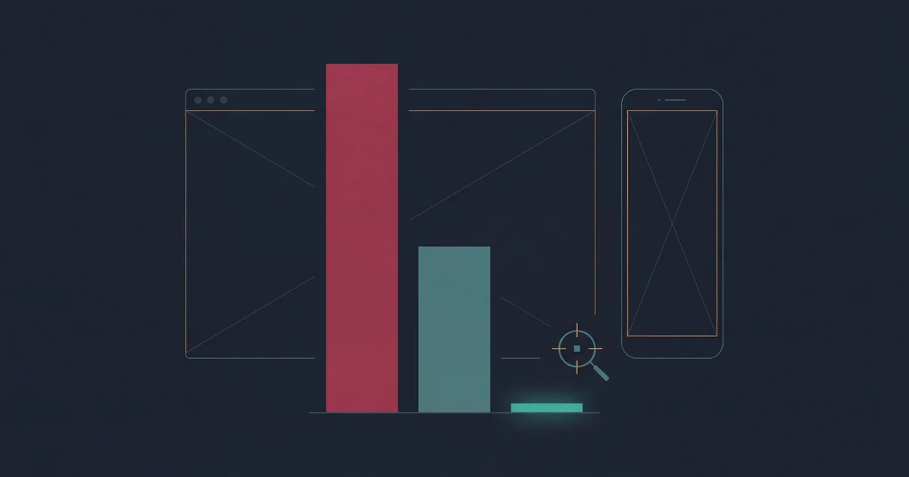
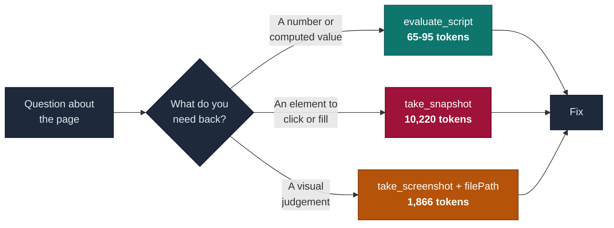
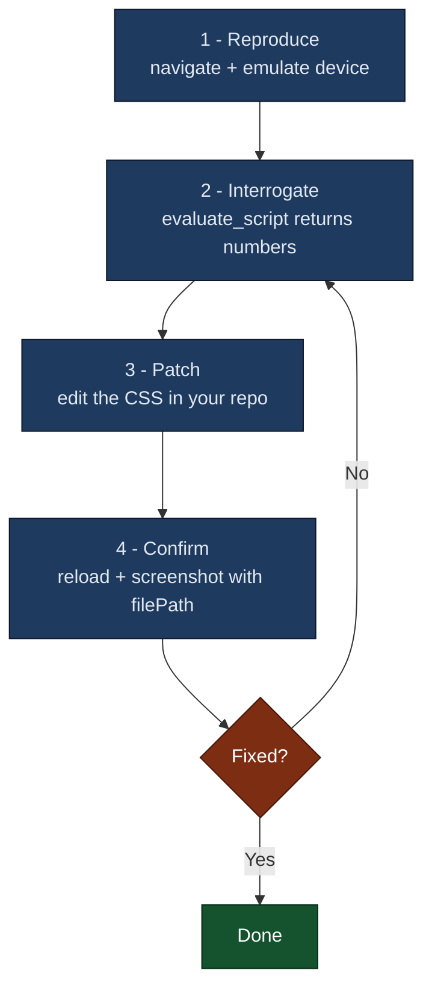

+++
date = '2026-07-21T10:00:00+08:00'
draft = false
title = 'Claude Code Screenshot MCP Setup: Browser Automation 2026'
description = 'Set up screenshot MCP in Claude Code in one command. Chrome DevTools vs Playwright MCP for browser testing and frontend debugging, with measured token costs.'
toc = true
tags = ['Claude Code', 'MCP', 'Browser Automation', 'Frontend', 'Developer Tools']
keywords = ['claude code screenshot mcp setup', 'claude code browser automation', 'claude code browser automation screenshot mcp setup', 'claude code playwright mcp', 'playwright mcp browser testing', 'playwright mcp claude code setup', 'claude code screenshot mcp', 'claude code frontend debugging', 'chrome devtools mcp screenshot', 'claude code screenshot tokens', 'mcp screenshot too large']

[[params.faqItems]]
question = "How do I set up screenshots in Claude Code with MCP?"
answer = "Run `claude mcp add chrome-devtools --scope user npx chrome-devtools-mcp@latest` for Chrome DevTools MCP, or `claude mcp add playwright npx @playwright/mcp@latest` for Playwright MCP. Then verify with `/mcp`. Always pass a `filePath` to `take_screenshot` so the image is written to disk instead of base64-encoded into your context — and add `--screenshot-max-width=2000 --screenshot-max-height=2000` to avoid the oversized-image error that permanently breaks a session."

[[params.faqItems]]
question = "Why does a screenshot break my Claude Code session?"
answer = "Anthropic's vision API rejects images whose dimensions exceed 8000 pixels, and that ceiling drops to 2000 pixels once a request carries more than 20 images. Because the oversized image is already in your conversation history, every subsequent request fails with the same 400 error — the session cannot recover and you must start a new one. This has been open as claude-code issue #2939 since July 2025."

[[params.faqItems]]
question = "Should I use take_snapshot or take_screenshot for frontend debugging?"
answer = "Neither, as your default. Measured on the same article page in July 2026, the accessibility snapshot cost 10,220 tokens and the viewport screenshot 1,866 — and neither can tell you a computed CSS value. A targeted `evaluate_script` that returns just the numbers you asked for cost 65 tokens. Use snapshots when you need to click or fill something, screenshots when you need to judge how it looks, and scripts for everything else."

[[params.faqItems]]
question = "Is a fullPage screenshot better than a viewport screenshot?"
answer = "Usually it is worse. A full-page capture of a long article measured 2544x27358 pixels, and Claude downscales any image whose long edge exceeds 1568 pixels. The page arrived as a 145-pixel-wide sliver — cheap in tokens but completely illegible. For long pages, take several viewport screenshots at known scroll positions, or capture a single element by its uid."

[[params.faqItems]]
question = "Chrome DevTools MCP or Playwright MCP for Claude Code?"
answer = "Chrome DevTools MCP (v1.6.0, 52 tools) wins for inspection: Lighthouse audits, performance traces with LCP and INP insights, heap snapshots, and extension debugging. Playwright MCP (v0.0.78, 24 tools by default) wins for driving: cross-browser support for Firefox and WebKit, form filling, storage and cookie control, and test assertions. For pure CSS and layout debugging, either works — because the tool doing the real work is `evaluate_script`."
+++



My blog gets 8% of its traffic from mobile. For a site about developer tooling that number is low but not absurd, so it sat in a dashboard for months without me looking at it.

When I finally looked, it took one script and 79 tokens to find a table rendering 427 pixels wide inside a 390-pixel viewport, plus 35 tap targets smaller than the 44-pixel minimum.

That is the good ending. The actual session started badly: I did what the official tool description tells you to do, called `take_snapshot`, spent **10,220 tokens**, and learned nothing about the bug — because an accessibility tree cannot tell you that an element is 427 pixels wide.

This is the writeup of that detour. It covers setting up **Claude Code screenshot MCP** access properly — via the two browser automation servers, Chrome DevTools MCP and Playwright MCP — what four different ways of handing a page to the model actually cost, the trap hiding inside `fullPage`, and the four-step loop I use now.

> **Version anchor.** Measured on 2026-07-21 against chrome-devtools-mcp **1.6.0** (released 2026-07-14) and Claude Code with a 1M-token context. Both MCP servers ship breaking changes often — Playwright MCP is still pre-1.0 after 16 months — so treat the token figures as a shape, not a constant.

## What Four Ways of Reading a Page Actually Cost

I pointed all four at the same URL — one of my own long-form articles — at a 1280x800 viewport, and wrote each result to disk so I could measure it without polluting the context I was measuring.

| Method | Tokens | What it can answer |
|---|---:|---|
| `take_snapshot` (a11y tree) | **10,220** | Structure and clickable elements. No styles. |
| `take_screenshot` (viewport) | 1,866 | How it looks. No exact values. |
| `take_screenshot` (fullPage) | 303 | Nothing — see the next section. |
| `evaluate_script` (targeted) | **65** | Exactly the values you asked for. |

The snapshot costs **5.5x more than a screenshot** and **157x more than a targeted script**. That ordering surprised me, because both vendors tell you to prefer the snapshot.

Chrome DevTools MCP says it in the tool description itself: *"Prefer taking a snapshot over taking a screenshot."* Playwright MCP's README makes it a design goal — structured accessibility snapshots, *"bypassing the need for screenshots or visually-tuned models."*

They are not wrong. They are answering a different question.

### The advice is about acting, not looking

A snapshot assigns every element a `uid`. That is what makes `click(uid)` and `fill(uid, text)` possible. A screenshot gives you pixels you cannot address, which is why Playwright MCP's own screenshot tool warns: *"You can't perform actions based on the screenshot, use browser_snapshot for actions."*

So the rule "prefer snapshot" is correct — for driving a page.

Frontend debugging is not driving a page. When I ask *why is this table overflowing on mobile*, I need a number: the element's width, its container's width, the computed `max-width`. A snapshot has none of those. Neither does a screenshot. You can see that something is too wide; you cannot read `427px` off a picture.

Both defaults dump the whole page. The winning move is to ask one question:

```javascript
() => {
  const de = document.documentElement;
  const wide = [];
  document.querySelectorAll('pre,table,img,iframe').forEach(el => {
    const r = el.getBoundingClientRect();
    if (r.width > de.clientWidth + 1) wide.push({ tag: el.tagName, w: Math.round(r.width) });
  });
  return { viewport: de.clientWidth, overflow: de.scrollWidth > de.clientWidth, wide };
}
```

That returned `{"viewport":390,"scrollWidth":390,"horizontalOverflow":false,"wideElements":1,"wideSample":[{"tag":"TABLE","w":427}]}` — 79 tokens, and it names the offending element.

Google's own design principles for the server say the same thing in the abstract: *"Return semantic summaries. 'LCP was 3.2s' is better than 50k lines of JSON."* Targeted scripting is that principle applied to CSS.



## The fullPage Trap

Look again at that table. The full-page screenshot was the cheapest image at 303 tokens. That number is a lie, and the mechanism is worth understanding because it fails silently.

The capture measured **2544 x 27358 pixels**. Claude downscales any image whose long edge exceeds 1568 pixels, preserving aspect ratio. Do the arithmetic: 1568 / 27358 = 0.057, so the image arrives as **145 x 1568** — a strip of paper 145 pixels wide.

It is cheap because it has been destroyed. The model receives something it cannot read, does not error, and confidently tells you the page looks fine.

| Capture | Native | After the 1568px clamp | Readable? |
|---|---|---|---|
| Viewport | 2560 x 1458 | 1568 x 893 | Yes |
| Mobile viewport | 1170 x 2532 | 724 x 1568 | Yes |
| **fullPage** | 2544 x 27358 | **145 x 1568** | **No** |

For long pages, take several viewport screenshots at known scroll positions, or pass a `uid` to capture one element. Never reach for `fullPage` on an article-length page and assume you have seen it.

## Setting It Up

Two servers are worth installing. They are not competitors so much as different instruments.

**Chrome DevTools MCP** — Google's, currently **1.6.0**, 52 tools, 47k stars. Reach for it when you need Lighthouse audits, performance traces with LCP/INP/CLS insights, heap snapshots, or extension debugging.

```bash
claude mcp add chrome-devtools --scope user npx chrome-devtools-mcp@latest
```

**Playwright MCP** — Microsoft's, currently **0.0.78**, 24 tools by default and 69 with every capability enabled. Reach for it when you need Firefox or WebKit, form filling, cookie and storage control, or test assertions.

```bash
claude mcp add playwright npx @playwright/mcp@latest
```

Verify both with `/mcp`. Node 20.19+ is required by Chrome DevTools MCP; if Playwright MCP reports missing browsers, run `npx playwright install chromium`.

If you also maintain [my earlier comparison of five browser automation tools](/posts/ai/2026-01-28-claude-code-browser-automation/) in your bookmarks, note that its install snippets name two npm packages that do not exist. The commands above are the correct ones, and I have since fixed that page.

### Three things that cost me time

**`filePath` only writes inside your workspace.** Passing an absolute path to `/tmp` returns `Access denied: path ... is not within any of the configured workspace roots`. Write into the repo and clean up after, or the call simply fails.

**`resize_page` does not give you a mobile viewport.** I resized to 390x844, then had the page report its own width: it came back **1504**. A headed Chrome window has a minimum size, and `resize_page` resizes the window. For real device dimensions you need emulation:

```
emulate(viewport: "390x844x3,mobile,touch")
```

After that the page reported `390` and the overflow bug appeared. Everything I found on mobile depended on this one distinction.

**Headed Chrome steals focus on macOS.** Every CDP command — including read-only ones like `take_screenshot` and `list_pages` — pulls the browser in front of your editor. It is [issue #1254](https://github.com/ChromeDevTools/chrome-devtools-mcp/issues/1254), 25 upvotes, and the documented workarounds are worse than the problem. Run headless unless you specifically need to watch.

For connecting to your already-logged-in Chrome instead of a fresh profile, I wrote that up separately in [the Chrome DevTools MCP connection guide](/posts/ai/2026-03-17-chrome-devtools-mcp-guide/#method-1-autoconnect-recommended-for-daily-use) — that piece covers the port 9222 and `--user-data-dir` mechanics this one deliberately skips.

## The Loop I Use Now

Four steps. The ordering is the whole point: the cheap, precise call comes first, and pixels come last.



**1. Reproduce.** Navigate, then `emulate` the device. Skipping emulation is how you spend an hour failing to reproduce a bug that only exists below 400 pixels.

**2. Interrogate.** Write a script that returns the specific numbers in question. Overflowing elements, tap targets under 44px, computed styles on one selector. This is the step that replaces both the snapshot and the screenshot, and it is where the 100x saving lives.

**3. Patch.** Fix the CSS in your repo, not in the browser. Changes made through the browser evaporate on reload and tempt you into declaring victory.

**4. Confirm.** Reload, then take one viewport screenshot **with `filePath` set**. This is the single moment where pixels earn their cost — a script can tell you the width is now 390, but only your eyes can tell you the fix did not wreck the spacing.

## Keep a Screenshot From Bricking Your Session

This is the failure mode most worth guarding against, because it does not degrade — it ends the session.

Anthropic's vision API rejects any image with a dimension over **8000 pixels**. That ceiling drops to **2000 pixels** once a request carries more than 20 images. Cross it and you get:

```
API Error: 400 messages.7.content.2.image.source.base64.data:
At least one of the image dimensions exceed max allowed size: 8000 pixels
```

The cruel part is that the oversized image is now in your conversation history, so every subsequent request fails the same way. [claude-code issue #2939](https://github.com/anthropics/claude-code/issues/2939) has been open since **July 2025** — a year — with 62 upvotes. One reporter puts it plainly: *"it corrupts the Claude Code session."*

Chrome DevTools MCP maintainer @OrKoN explains why writing to a file is not a guaranteed escape:

> "because it polluted its request history with an image that is too large and does not recover from that. I think even file path might not work if it tried to load the image from file into its context window."

And the reason no server-side annotation saves you is written into [Anthropic's own MCP docs](https://code.claude.com/docs/en/mcp), twice: the `maxResultSizeChars` annotation *"has no effect on tools that return image content; for those, raising `MAX_MCP_OUTPUT_TOKENS` is the only option."* Every text-heavy MCP server has an escape hatch. Screenshots do not.

Since **v1.3.0** you can cap the image at the source, which is the fix I now run by default:

```json
{
  "mcpServers": {
    "chrome-devtools": {
      "command": "npx",
      "args": [
        "-y", "chrome-devtools-mcp@latest",
        "--screenshot-format=jpeg",
        "--screenshot-max-width=2000",
        "--screenshot-max-height=2000"
      ]
    }
  }
}
```

One caveat from the pull request that shipped it: the cap is **per call**. It prevents the next disaster; it cannot un-poison a session that already has an oversized image in it. When you hit the error, start a new session — there is no other recovery.

## Where This Advice Stops

Targeted scripting requires you to know what to ask. On a page you have never seen, you have no selectors and no hypothesis, and one snapshot or screenshot to build a mental model is money well spent. The rule is to stop dumping the page *after* you have oriented, not before.

Some questions are irreducibly visual. Does the font render correctly, is anything overlapping, does the hierarchy read at a glance — no script answers those. If your question contains the word "looks," take the screenshot.

And there is a bigger objection I should represent honestly, because I made it myself in an [earlier piece arguing MCP is the wrong default](/posts/ai/2026-04-18-playwright-cli-skill-zero-token-automation/#why-mcp-is-the-wrong-default-in-2026): a resident MCP server costs tool-schema tokens on every request whether you use it or not. Microsoft's own README now concedes the point, recommending CLI-based skills over MCP for coding agents because they *"avoid loading large tool schemas and verbose accessibility trees into the model context."*

That is a real argument, and it is why I run the browser MCP only during debugging sessions rather than leaving it on. For repeatable automation that runs on a schedule, the [three-stage compression pattern](/posts/ai/2026-04-18-playwright-cli-skill-zero-token-automation/#the-3-stage-pattern-explore--skill--script) beats anything in this article. This one is about the exploratory phase — the part where you genuinely do not yet know what is broken.

## Bottom Line

Stop asking the browser to describe the whole page.

The snapshot-versus-screenshot debate hides the fact that both are page dumps, and for CSS and layout work both are the wrong default. Ask a specific question, get specific numbers back, and spend a screenshot only to confirm the fix with your own eyes.

For me that was the difference between 10,220 tokens and no answer, and 79 tokens and a named element. The bug, incidentally, is now fixed — the table scrolls inside its own container, which is where an overflowing table should have lived from the start.

## Related Reading

- [Browser Automation in Claude Code: 5 Tools Compared](/posts/ai/2026-01-28-claude-code-browser-automation/) — the selection matrix, if you are still choosing
- [Chrome DevTools MCP Setup: Fix "Opens New Window" + Port 9222](/posts/ai/2026-03-17-chrome-devtools-mcp-guide/) — connecting to your logged-in Chrome
- [Playwright CLI + Skills: 0-Token Browser Automation](/posts/ai/2026-04-18-playwright-cli-skill-zero-token-automation/) — the counterargument to using MCP at all
- [CLI + Skills vs MCP: Converging the Toolchain](/posts/ai/2026-07-04-cli-skills-vs-mcp/) — when to reach for which layer
