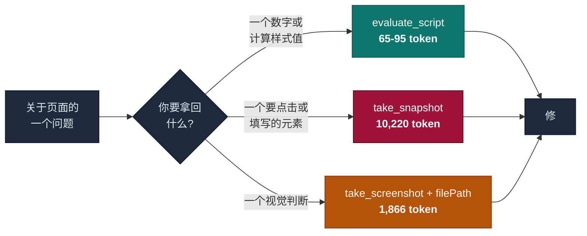
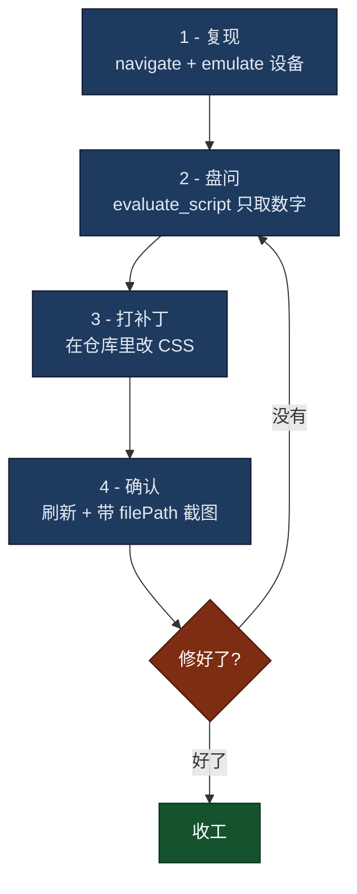

+++
date = '2026-07-21T10:00:00+08:00'
draft = false
title = 'Claude Code 截图 MCP 配置:浏览器自动化调试省 100 倍 token'
description = '一条命令配好 Claude Code 截图 MCP,再告诉你 Chrome DevTools MCP 和 Playwright MCP 怎么选:实测 snapshot 10,220 token,定向脚本只要 65。含 fullPage 陷阱和防炸会话配置。'
toc = true
tags = ['Claude Code', 'MCP', 'Browser Automation', 'Frontend', 'Developer Tools']
keywords = ['claude code 截图 mcp 配置', 'claude code 浏览器自动化', 'claude code playwright mcp', 'playwright mcp 浏览器测试', 'playwright mcp 安装', 'chrome devtools mcp 配置', 'chrome devtools mcp 和 playwright mcp 选哪个', 'claude code 截图', 'claude code mcp 截图', 'claude code 前端调试', 'mcp 截图 token', 'mcp 图片过大报错']

[[params.faqItems]]
question = "Claude Code 怎么配置截图 MCP?"
answer = "Chrome DevTools MCP 用 `claude mcp add chrome-devtools --scope user npx chrome-devtools-mcp@latest`,Playwright MCP 用 `claude mcp add playwright npx @playwright/mcp@latest`,装完用 `/mcp` 验证。关键是调 take_screenshot 时一定要传 filePath,让图片落盘而不是 base64 塞进上下文;再加上 `--screenshot-max-width=2000 --screenshot-max-height=2000`,否则一张超限图片会永久废掉整个会话。"

[[params.faqItems]]
question = "为什么一张截图会把 Claude Code 会话搞崩?"
answer = "Anthropic 的视觉接口拒收任何一边超过 8000 像素的图片,而当一次请求里图片超过 20 张时,这个上限会降到 2000 像素。麻烦在于超限图片已经躺在对话历史里了,之后每一次请求都会撞同一个 400 错误,会话无法自愈,只能重开。这个问题是 claude-code issue #2939,2025 年 7 月提出,至今未修。"

[[params.faqItems]]
question = "前端调试该用 take_snapshot 还是 take_screenshot?"
answer = "默认哪个都别用。2026 年 7 月实测同一个页面:a11y snapshot 花 10,220 token,视口截图 1,866 token,而且两者都读不出任何计算样式值。一段只取你要的数字的 evaluate_script 只花 65 token。需要点击或填表时用 snapshot,需要判断“好不好看”时用截图,其余情况用脚本。"

[[params.faqItems]]
question = "fullPage 整页截图是不是比视口截图更好?"
answer = "通常更糟。一篇长文的整页截图实测是 2544x27358 像素,而 Claude 会把长边超过 1568 像素的图片等比缩小,结果这一页变成 145 像素宽的细条——token 很便宜,但完全看不清。长页面应该在几个已知滚动位置各截一张视口图,或者按 uid 只截某个元素。"

[[params.faqItems]]
question = "Chrome DevTools MCP 和 Playwright MCP 选哪个?"
answer = "Chrome DevTools MCP(v1.6.0,52 个工具)强在“看”:Lighthouse 跑分、带 LCP/INP 洞察的性能追踪、堆快照、扩展调试。Playwright MCP(v0.0.78,默认 24 个工具)强在“开”:跨浏览器支持 Firefox 和 WebKit、填表单、Cookie 和存储控制、测试断言。纯 CSS 布局调试用哪个都行,因为真正干活的是 evaluate_script。"
+++


我博客的移动端流量占比是 8%。一个讲开发者工具的站点,这个数字偏低但不算离谱,所以它在仪表盘里躺了好几个月没人管。

真去查的时候,一段脚本、79 个 token,就揪出了 390px 视口里一个 427px 宽的表格,外加 35 个小于 44px 的点击目标。

这是好结局。实际过程开头很难看:我老老实实照着官方工具说明,先调了 `take_snapshot`,烧掉 **10,220 个 token**,关于这个 bug 什么也没学到——因为无障碍树根本不会告诉你某个元素有 427 像素宽。

这篇就是那趟弯路的记录:**Claude Code 截图 MCP** 怎么装才对——两个浏览器自动化服务 Chrome DevTools MCP 和 Playwright MCP 各配一条命令——四种把页面交给模型的方式各自要花多少钱、`fullPage` 里藏着什么坑,以及我现在用的四步循环。

> **版本锚点**:2026-07-21 实测,chrome-devtools-mcp **1.6.0**(2026-07-14 发布),Claude Code 百万上下文。两个 MCP 都在频繁改动——Playwright MCP 做了 16 个月还停在 0.0.78——所以下面的 token 数字看的是量级关系,不是常量。

## 四种读页面的方式,分别要花多少钱

我拿同一个 URL(我自己的一篇长文)在 1280x800 视口下跑了四遍,每次都把结果写到磁盘上再量——不然测量本身就污染了被测量的上下文。

| 方式 | Token | 能回答什么 |
|---|---:|---|
| `take_snapshot`(a11y 树) | **10,220** | 结构和可点元素。样式一概不知。 |
| `take_screenshot`(视口) | 1,866 | 长什么样。读不出精确值。 |
| `take_screenshot`(fullPage) | 303 | 什么也答不了——下一节讲 |
| `evaluate_script`(定向) | **65** | 你问的那几个值,一个不多 |

snapshot 比截图**贵 5.5 倍**,比定向脚本**贵 157 倍**。这个排序让我意外,因为两家官方都叫你优先用 snapshot。

Chrome DevTools MCP 直接写在工具说明里:*"Prefer taking a snapshot over taking a screenshot."* Playwright MCP 的 README 更把它当设计目标——用结构化无障碍快照,*"绕开对截图和视觉模型的依赖"*。

他们没说错。他们回答的是另一个问题。

### 那条建议说的是"操作",不是"看"

snapshot 会给每个元素分配一个 `uid`,这才使 `click(uid)`、`fill(uid, text)` 成为可能。截图给你的是一堆无法寻址的像素,所以 Playwright MCP 自家的截图工具会警告:*"你不能基于截图执行操作,要操作请用 browser_snapshot。"*

所以"优先 snapshot"这条规则是对的——**前提是你要驱动页面**。

前端调试不是驱动页面。当我问"这个表格在移动端为什么撑破了",我要的是一个数字:元素宽度、容器宽度、计算出来的 `max-width`。snapshot 一个都没有,截图也没有。你能看见"有东西太宽了",但你没法从一张图片里读出 `427px`。

两个默认选项都在倾倒整页。真正该做的是只问一个问题:

```javascript
() => {
  const de = document.documentElement;
  const wide = [];
  document.querySelectorAll('pre,table,img,iframe').forEach(el => {
    const r = el.getBoundingClientRect();
    if (r.width > de.clientWidth + 1) wide.push({ tag: el.tagName, w: Math.round(r.width) });
  });
  return { viewport: de.clientWidth, overflow: de.scrollWidth > de.clientWidth, wide };
}
```

返回 `{"viewport":390,"scrollWidth":390,"horizontalOverflow":false,"wideElements":1,"wideSample":[{"tag":"TABLE","w":427}]}`——79 个 token,而且直接点名了肇事元素。

Google 自己给这个服务写的设计原则,抽象地说了同一件事:*"返回语义摘要。'LCP 是 3.2 秒' 好过五万行 JSON。"* 定向脚本就是把这条原则用到了 CSS 上。



## fullPage 陷阱

再看一眼上面那张表。整页截图是最便宜的图片,303 个 token。这个数字是假的,而且它的失败方式很安静,值得讲清楚。

那张截图实际是 **2544 x 27358 像素**。Claude 会把长边超过 1568 像素的图片等比缩小。算一下:1568 ÷ 27358 = 0.057,于是图片到达模型时变成 **145 x 1568**——一条 145 像素宽的纸带。

它便宜是因为它已经被毁掉了。模型收到一个看不清的东西,不会报错,然后自信地告诉你页面没问题。

| 截图方式 | 原始尺寸 | 过 1568px 限制后 | 还能看清吗 |
|---|---|---|---|
| 视口 | 2560 x 1458 | 1568 x 893 | 能 |
| 移动端视口 | 1170 x 2532 | 724 x 1568 | 能 |
| **fullPage** | 2544 x 27358 | **145 x 1568** | **不能** |

长页面的正确做法:在几个已知滚动位置各截一张视口图,或者传 `uid` 只截某个元素。别在文章级长页面上用 `fullPage` 还以为自己看过了。

## 装起来

两个服务都值得装。与其说它们是竞品,不如说是两种不同的仪器。

**Chrome DevTools MCP** —— Google 出品,当前 **1.6.0**,52 个工具,47k star。需要 Lighthouse 跑分、带 LCP/INP/CLS 洞察的性能追踪、堆快照、扩展调试时用它。

```bash
claude mcp add chrome-devtools --scope user npx chrome-devtools-mcp@latest
```

**Playwright MCP** —— 微软出品,当前 **0.0.78**,默认 24 个工具、全能力开启 69 个。需要 Firefox 或 WebKit、填表单、Cookie 和存储控制、测试断言时用它。

```bash
claude mcp add playwright npx @playwright/mcp@latest
```

两个都用 `/mcp` 验证。Chrome DevTools MCP 要求 Node 20.19+;Playwright MCP 如果报浏览器缺失,跑 `npx playwright install chromium`。

如果你收藏夹里还留着[我之前那篇五个浏览器自动化工具的对比](/posts/ai/2026-01-28-claude-code-browser-automation/),注意它里面的安装片段写了两个**根本不存在的 npm 包**。上面这两条才是对的,那篇我已经改过来了。

### 三个花了我时间的坑

**`filePath` 只能写进你的工作区。** 传一个 `/tmp` 的绝对路径会直接被拒:`Access denied: path ... is not within any of the configured workspace roots`。写到仓库里再清掉,否则这一步压根不执行。

**`resize_page` 给不了你移动端视口。** 我把窗口缩到 390x844,然后让页面自报宽度,回来的是 **1504**。有头 Chrome 的窗口有最小尺寸,而 `resize_page` 缩的是窗口。要真机尺寸得走设备模拟:

```
emulate(viewport: "390x844x3,mobile,touch")
```

之后页面才报 `390`,溢出 bug 也才浮出来。我在移动端查到的一切都取决于这一个区别。

**有头 Chrome 在 macOS 上抢焦点。** 每一条 CDP 命令——包括 `take_screenshot`、`list_pages` 这种只读操作——都会把浏览器拽到你编辑器前面。这是 [issue #1254](https://github.com/ChromeDevTools/chrome-devtools-mcp/issues/1254),25 个赞,而记录在案的几个绕行方案都比问题本身更烦人。除非你确实要盯着看,否则跑 headless。

至于怎么连到你那个已经登录好的 Chrome 而不是开一个干净 profile,我单独写过[Chrome DevTools MCP 连接指南](/posts/ai/2026-03-17-chrome-devtools-mcp-guide/#method-1-autoconnect-recommended-for-daily-use)——端口 9222 和 `--user-data-dir` 那套机制在那篇里,这篇故意不重复。

## 我现在用的循环

四步。顺序本身就是重点:又便宜又精确的调用排最前,像素排最后。



**1. 复现。** 先导航,再 `emulate` 设备。跳过模拟,就是你花一小时复现不出一个只在 400 像素以下才存在的 bug 的原因。

**2. 盘问。** 写一段只返回你要的那几个数字的脚本:溢出元素、小于 44px 的点击目标、某个选择器的计算样式。这一步同时替掉了 snapshot 和截图,100 倍的差价就省在这里。

**3. 打补丁。** 在仓库里改 CSS,不要在浏览器里改。浏览器里的改动一刷新就没,还会骗你以为已经赢了。

**4. 确认。** 刷新,然后**带 `filePath`** 截一张视口图。这是像素唯一值回自己成本的时刻——脚本能告诉你宽度已经变成 390,但只有你的眼睛能告诉你这个修法有没有把间距搞乱。

## 别让一张截图废掉整个会话

这是最值得防的失败模式,因为它不是"变慢",是"直接终结"。

Anthropic 的视觉接口拒收任何一边超过 **8000 像素**的图片。而当一次请求里图片超过 20 张时,这个上限降到 **2000 像素**。踩过去就是:

```
API Error: 400 messages.7.content.2.image.source.base64.data:
At least one of the image dimensions exceed max allowed size: 8000 pixels
```

残忍的地方在于,那张超限图片已经进了对话历史,所以之后每一次请求都会以同样的方式失败。[claude-code issue #2939](https://github.com/anthropics/claude-code/issues/2939) 从 **2025 年 7 月**开到现在——整整一年——62 个赞。有人说得很直白:*"它会腐蚀掉整个 Claude Code 会话。"*

Chrome DevTools MCP 维护者 @OrKoN 解释了为什么写文件也不是保险:

> "因为它的请求历史已经被一张过大的图片污染了,而且它无法从中恢复。我觉得就算用文件路径可能也没用,如果它试图把图片从文件加载进上下文窗口的话。"

而没有任何服务端注解能救你的原因,写在 [Anthropic 的 MCP 文档](https://code.claude.com/docs/en/mcp)里,还写了两遍:`maxResultSizeChars` 注解*"对返回图片内容的工具无效;对那些工具来说,调大 `MAX_MCP_OUTPUT_TOKENS` 是唯一选项。"* 每个文本类 MCP 服务都有逃生舱,截图没有。

从 **v1.3.0** 起可以在源头把图片压住,这也是我现在的默认配置:

```json
{
  "mcpServers": {
    "chrome-devtools": {
      "command": "npx",
      "args": [
        "-y", "chrome-devtools-mcp@latest",
        "--screenshot-format=jpeg",
        "--screenshot-max-width=2000",
        "--screenshot-max-height=2000"
      ]
    }
  }
}
```

合入这个功能的 PR 里有一句提醒:这个上限是**每次调用**级别的。它能防住下一次事故,但没法把已经进了历史的超限图片洗掉。撞上这个错误就重开会话,没有别的解法。

## 这套建议的边界在哪

定向脚本要求你已经知道该问什么。面对一个从没见过的页面,你没有选择器也没有假设,先花一次 snapshot 或截图建立心智模型是值得的。规矩是:建立坐标系**之后**停止倾倒整页,不是一开始就停。

有些问题天生是视觉的。字体渲染对不对、有没有互相压盖、层级一眼扫下来清不清楚——没有脚本能回答。如果你的问题里带着"看起来"三个字,就去截图。

还有一个更大的反对意见,我得诚实地摆出来,因为这话是我自己在[另一篇论证 MCP 不该作为默认选项](/posts/ai/2026-04-18-playwright-cli-skill-zero-token-automation/#why-mcp-is-the-wrong-default-in-2026)的文章里说的:一个常驻的 MCP 服务,不管你用不用,每次请求都在吃工具 schema 的 token。微软自己的 README 现在也认了这一点,建议编码 agent 用 CLI 形态的 skill 而非 MCP,因为那样能*"避免把庞大的工具 schema 和啰嗦的无障碍树塞进模型上下文"*。

这是个成立的论点,也是我只在调试时开浏览器 MCP、不常驻的原因。对于定时跑的可重复自动化,[三阶段压缩模式](/posts/ai/2026-04-18-playwright-cli-skill-zero-token-automation/#the-3-stage-pattern-explore--skill--script)比这篇文章里的任何东西都强。这篇讲的是探索阶段——你还真不知道哪里坏了的那个阶段。

## 结论

别再让浏览器描述整个页面。

snapshot 和截图之争掩盖了一个事实:两者都是整页倾倒,而对 CSS 和布局这类活,两者都是错的默认选项。问一个具体问题,拿回具体数字,只在最后用一张截图让自己的眼睛确认一遍。

对我来说,这就是"10,220 个 token 换来没有答案"和"79 个 token 换来一个被点名的元素"之间的差别。顺带一提,那个 bug 现在已经修好了——表格改成在自己的容器里横向滚动,它本来就该待在那儿。

## 延伸阅读

- [Claude Code 浏览器自动化:5 个工具横评](/zh/posts/ai/2026-01-28-claude-code-browser-automation/) —— 还在选型的话看这篇
- [Chrome DevTools MCP 配置:修"另开新窗口"和 9222 端口](/zh/posts/ai/2026-03-17-chrome-devtools-mcp-guide/) —— 连到你已登录的 Chrome
- [Playwright CLI + Skill:0 Token 浏览器自动化](/zh/posts/ai/2026-04-18-playwright-cli-skill-zero-token-automation/) —— 反对用 MCP 的那一面
- [CLI + Skill vs MCP:工具链分层收敛](/zh/posts/ai/2026-07-04-cli-skills-vs-mcp/) —— 什么时候该用哪一层

## 系列文章导航

这是「AI Agent 浏览器自动化」系列的第 5 篇。这条线的演进：headless 驱动 → 接管真实浏览器 → 把 token 砍到底 → 共享你的登录态：

1. [Vercel Agent Browser](/zh/posts/ai/2026-01-13-vercel-agent-browser/) — 为 Agent 而不是测试套件设计的 snapshot 式 CLI
2. [Claude Code 浏览器自动化：5 套方案实测对比](/zh/posts/ai/2026-01-28-claude-code-browser-automation/) — 这条线的地图：token 成本、速度、稳定性
3. [Chrome DevTools MCP 2026 配置教程](/zh/posts/ai/2026-03-17-chrome-devtools-mcp-guide/) — 接管真实浏览器，以及 9222 端口的坑
4. [Playwright CLI + Skill 三段式：0 Token 自动化](/zh/posts/ai/2026-04-18-playwright-cli-skill-zero-token-automation/) — 去掉 MCP token 税的三段式写法
5. **本文**：Claude Code 截图 MCP 配置 — 前端调试闭环，10,220 对 65 token
6. [ubrowser 实测](/zh/posts/ai/2026-07-27-ubrowser-review/) — 设计对了，仓库死了
7. [ego lite 实测](/zh/posts/ai/2026-09-10-ego-lite-browser-review/) — 用 Spaces 把登录态交给 Agent
