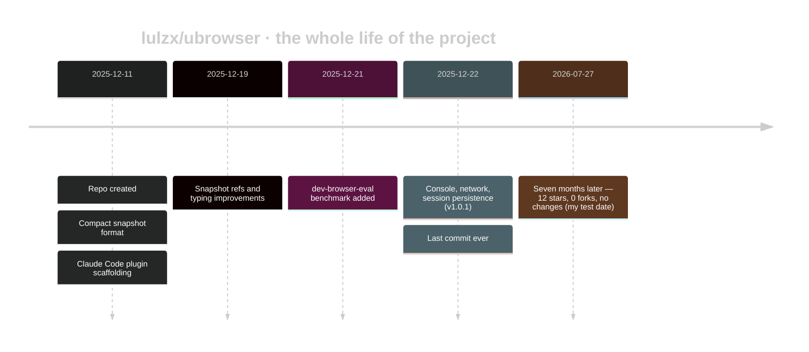
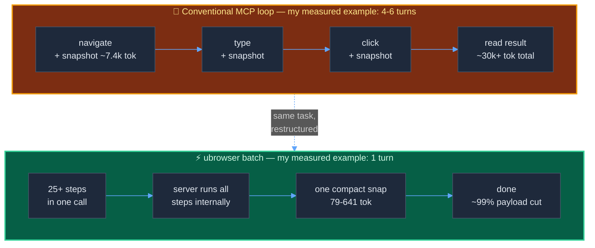

+++
date = '2026-07-27T10:00:00+08:00'
draft = false
title = 'ubrowser Review: Fastest Cheapest Browser Automation? Tested'
description = 'I installed lulzx/ubrowser and measured it against Playwright MCP: 761 vs 7,400 tokens on the same page. The design wins. The project is the problem.'
toc = true
tags = ['ubrowser', 'Claude Code', 'MCP', 'Browser Automation', 'Token Efficiency']
keywords = ['ubrowser', 'lulzx ubrowser', 'ubrowser claude code', 'browser automation claude code', 'fastest cheapest browser automation', 'ubrowser vs playwright mcp', 'ubrowser review', 'ubrowser mcp install']

[[params.faqItems]]
question = "What is ubrowser for Claude Code?"
answer = "ubrowser (lulzx/ubrowser) is an open-source MCP server that gives Claude Code browser automation with three token-saving tricks: batching many actions into one call, an ultra-compact snapshot format, and minimal JSON responses. In my July 2026 test it returned a 5-step login flow in one call for 79 tokens."

[[params.faqItems]]
question = "Is ubrowser really the fastest, cheapest browser automation for Claude Code?"
answer = "The token claims mostly hold: on the same page, ubrowser's snapshot cost 761 tokens where Playwright MCP's cost about 7,400 and Chrome DevTools MCP's cost 10,220. But the repo's own benchmark numbers are simulations with estimated tokens, not real LLM runs, and the project has been unmaintained since December 2025."

[[params.faqItems]]
question = "Should I use ubrowser instead of Playwright MCP?"
answer = "Not as a dependency. ubrowser has no screenshot tool, no JavaScript evaluate, its recommended plugin install is broken, and it has had zero commits in seven months. Use Playwright MCP or Chrome DevTools MCP for real work, and steal ubrowser's batching and compact-snapshot patterns via scripted Playwright instead."

[[params.faqItems]]
question = "Why does ubrowser use fewer tokens than Playwright MCP or Chrome DevTools MCP?"
answer = "Browser automation token cost is dominated by snapshot payloads multiplied by turn count, not by the actions themselves. ubrowser cuts both: one batched call replaces 4-6 round trips, and its compact format (btn#e1\"Submit\") encodes an element in roughly 8 tokens instead of 80 of accessibility-tree YAML."

[[params.faqItems]]
question = "Is ubrowser still maintained in 2026?"
answer = "No. As of July 2026 the last commit to lulzx/ubrowser was December 22, 2025 — an 11-day development sprint followed by seven months of silence. It has 12 stars, one issue (the author's own PR), and pins Playwright ^1.49.1. Treat it as a design reference, not infrastructure."
+++


A 12-star GitHub repo claims to be "the fastest, cheapest browser automation for Claude Code" — 5x faster and 8x cheaper than the tools Microsoft and Google ship. Google Search Console has been showing me people searching that exact tagline for weeks, and as far as I can tell, nobody has actually installed the thing and checked. So I did: cloned [lulzx/ubrowser](https://github.com/lulzx/ubrowser), fought its install for the better part of an hour, and pointed it at the same page where I'd already measured [Chrome DevTools MCP's token costs](/posts/ai/2026-07-21-claude-code-screenshot-mcp-frontend-debugging/) two weeks ago.

Cards on the table: the numbers mostly check out, and that surprised me. On the same article page, measured with the same BPE tokenizer, ubrowser's snapshot cost **761 tokens** where Playwright MCP's cost **7,400** and Chrome DevTools MCP's a11y snapshot cost **10,220**. A five-step login flow came back in one call, in 3.2 seconds, for **79 tokens**.

And I still won't put it in my toolchain. This is a review of a project where the ideas are right and the artifact is wrong, and the gap between those two things is the most useful part of the story.

## What ubrowser actually is

ubrowser (styled μBrowser) is an MCP server written in TypeScript on top of Playwright, built by a solo developer, [Lulzx](https://github.com/lulzx). The entire commit history runs from December 11 to December 22, 2025 — an 11-day sprint — and then stops. As of July 27, 2026: 12 stars, 0 forks, one issue (the author's own PR), and a pinned Playwright `^1.49.1` that npm now silently resolves to 1.57.0.



Its pitch rests on three mechanisms, and all three attack the same enemy — response payload size multiplied by conversation turns:

1. **Batch execution.** One `browser_batch` call runs up to 25+ actions (navigate, type, click, scroll) sequentially inside the server, and Claude sees only the final result. Four separate tool calls become one turn.
2. **Ultra-compact snapshots.** Instead of an accessibility-tree YAML dump, you get lines like `btn#e1"Submit"` and `inp#e2@e~"Email"!r` — a term-frequency-optimized DSL where an element costs ~8 tokens instead of ~80.
3. **Minimal responses.** Actions return `{"ok":true}` and nothing else unless you ask. The DOM only travels when explicitly requested.

None of this is exotic engineering. It's mostly discipline about what *not* to send back — which, as I found when I measured it, is exactly where every mainstream browser MCP is undisciplined.

## The claim audit: four sets of numbers, none of them measured

Before installing anything I read the repo the way I'd read a term sheet, and here's the first thing that should calibrate your trust. The project publishes **four different headline numbers** depending on which file you open:

| Where | The claim |
|---|---|
| README benchmark table | 51s / $0.18 vs Playwright MCP's 4m 31s / $1.45 — "8x cheaper" |
| README format section | "70% smaller snapshots" |
| COMPARISON.md | "77% reduction", then "projected savings: 75-90%" |
| package.json / marketplace | "98% token reduction" / "2.2x faster, 70% fewer tokens" |

The fine print matters more. The impressive-sounding local benchmark (`6.87s, $0.0052`) comes from `bench-game-tracker.cjs`, which I ran myself. It completes fine — and it is a **simulation**: no LLM is ever called, tokens are estimated as `string length / 3.5`, and "cost" is that estimate multiplied by Claude Opus 4.5 pricing. The comparison against Dev Browser's 3m 53s is comparing a local no-LLM loop against [SawyerHood's dev-browser-eval](https://github.com/SawyerHood/dev-browser-eval), a real end-to-end agent run. That's not a benchmark; that's two different experiments sharing a table. COMPARISON.md is at least honest about it — the word "projected" appears right next to the savings figures.

So here's misconception one, worth stating plainly: **the README numbers are not measurements, and you shouldn't repeat them.** What's frustrating is that the author didn't need to inflate anything. The real, measurable numbers — which I'll get to — are strong enough on their own.

## Installing it: 55 minutes, three hangs, and one 1.9-second fix

The README offers two install paths. The recommended one is a Claude Code plugin:

```bash
/plugin marketplace add lulzx/claude-code
/plugin install ubrowser@claude-code
```

Don't bother. I traced the marketplace config instead of running it blind, and the path arithmetic doesn't survive contact: `marketplace.json` points at `./plugins/ubrowser/plugins/ubrowser`, a directory that exists in neither repo (the submodule checks out to `plugins/ubrowser`, which contains no nested `plugins/` folder). And even if the path resolved, the plugin's MCP entry launches `node build/index.js` directly — I verified that without a `npm install` step this dies instantly with `ERR_MODULE_NOT_FOUND: Cannot find package '@modelcontextprotocol/sdk'`. The plugin flow never runs `npm install`. A recommended install path that cannot work is what "11-day sprint, then silence" looks like in practice.

The manual path works, with war stories. My timeline on an Apple M5, Node 24, macOS 26.5:

| Step | Time | Notes |
|---|---|---|
| `git clone --depth 1` | 32s | 34MB — `build/` output and a benchmark suite are committed to git |
| `npm install` | 21s | Playwright `^1.49.1` resolves to 1.57.0 |
| `npm run build` | 1.1s | Unnecessary — `build/` ships in the repo |
| `npx playwright install chromium` | 40+ min, failed 3x | The real boss fight |
| Manual `unzip` of the same archive | **1.9s** | The fix |

The Chromium step deserves its own paragraph, because it will eat someone else's afternoon too. The 167MB download itself completed in about two minutes every attempt (from mainland China I needed `PLAYWRIGHT_DOWNLOAD_HOST=https://cdn.npmmirror.com/binaries/playwright`, a standard mirror trick). Then Playwright's built-in extractor hung — three attempts, and each time it stalled at exactly 40 extracted files and sat there for 10+ minutes, silently. I can't fully attribute the hang; it may be specific to my machine. But the workaround was almost insulting: I ran the system `unzip` on the very archive Playwright had downloaded, and it finished in 1.9 seconds. Then came the sequel: Playwright ≥1.49 runs headless mode through a separate `chromium_headless_shell` build, so the server crashed asking for another 94MB download the README never mentions.

Total time from clone to first successful automation: about 55 minutes, of which roughly 50 were browser plumbing. Keep that in mind whenever a tool's pitch is measured in milliseconds.

## The measurements: the compact format genuinely wins

Once running, I tested it against the exact baseline from my [screenshot-MCP debugging post](/posts/ai/2026-07-21-claude-code-screenshot-mcp-frontend-debugging/) — same article page, and token counts from the same GPT-class BPE tokenizer (Claude's tokenizer differs by a few percent; the ratios are what matter). As of July 2026, one snapshot of one page costs:

| Tool | Method | Response size | Tokens |
|---|---|---|---|
| **ubrowser** | `browser_snapshot` (compact) | 2,228 chars | **761** |
| [Playwright MCP](https://github.com/microsoft/playwright-mcp) 1.62-alpha | `browser_snapshot` (a11y YAML) | 28,874 chars | **7,434** |
| [Chrome DevTools MCP](https://github.com/ChromeDevTools/chrome-devtools-mcp) | `take_snapshot` (a11y tree, July 21 test) | — | **10,220** |
| Chrome DevTools MCP | `take_screenshot` (viewport, July 21 test) | — | 1,866 |
| Chrome DevTools MCP | targeted `evaluate_script` (July 21 test) | — | 65 |

That's a **9.8x** reduction against Playwright MCP measured the same day with the same client, and **13.4x** against Chrome DevTools MCP's figure from two weeks earlier. The compact format claim ("70% smaller") is, if anything, undersold — though note the fair-comparison caveat: a11y snapshots carry structural context that the compact format throws away, which is precisely the point.

The batch claim holds too. My five-step login flow — navigate, type email, type password, tick a checkbox, submit — as one `browser_batch` call:

```json
{"ok":true,"snap":"[Demo Login](...)\nbtn#e1\"Log out\"\na#e2/settings\"Settings\""}
```

One call, 3.2 seconds, **79 tokens** round trip, and the returned snapshot proves the flow worked (the page now shows "Log out"). The same flow through conventional MCP tooling is four to six turns, each dragging a snapshot behind it. On Hacker News, a navigate-scroll-scroll-snapshot batch came back in 1.2 seconds for 641 tokens; a full 100-element snapshot of the HN front page cost 1,720 tokens — still a sixth of what Playwright MCP charged for my far simpler article page.

There's a quieter number I care about just as much. The MCP tool schemas themselves — the fixed tax every server levies on your context window before you do anything — cost ~2,356 tokens for ubrowser's 11 tools versus ~4,016 for Playwright MCP's 24. I measured both with the same `tools/list` call. If you've read my piece on [why the browser-automation tool you pick decides your token bill](/posts/ai/2026-01-28-claude-code-browser-automation/), this is that argument in one row of numbers.



This confirms the second misconception worth killing: **browser automation cost does not come from the actions.** Clicking is free. The bill comes from snapshot payloads multiplied by turns, which is why the [65-token `evaluate_script` pattern](/posts/ai/2026-07-21-claude-code-screenshot-mcp-frontend-debugging/) beat everything in my July test, and why batching plus compact snapshots is the correct attack. ubrowser's author understood the cost model better than the teams shipping the mainstream tools.

## Where it falls apart

So why won't I use it? Because a benchmark is not a tool, and the moment I stepped off the happy path, the edges showed.

**No screenshot, no evaluate.** ubrowser has 11 tools and the two most important ones aren't among them. There is no screenshot capability of any kind — my entire [mobile-layout debugging workflow](/posts/ai/2026-07-21-claude-code-screenshot-mcp-frontend-debugging/), where the viewport screenshot was the only artifact that revealed a 427px table in a 390px viewport, is simply impossible here. And there's no JavaScript evaluate, so the cheapest pattern I know (65 tokens for exact computed styles) can't be expressed at all. ubrowser optimizes the middle of the funnel and amputates both ends.

**Resource blocking pollutes the console.** ubrowser blocks images, fonts, and media at the network layer for speed. Reasonable — until you call `browser_console` while debugging a real page and get a wall of `Failed to load resource: net::ERR_FAILED` errors that *ubrowser itself caused*. On Hacker News, the console log was fake errors before I did anything. Debugging a frontend with a tool that injects phantom errors into the very signal you're reading is a trap that will burn 20 minutes of an unsuspecting agent session.

**Error messages are an afterthought.** A click on a nonexistent selector blocks for a full five seconds, then returns `{"ok":false,"error":"Timeout:"}` — colon, nothing after it. Compare that with Playwright's famously verbose actionability errors, which tell the model *what to try next*. In agent loops, error text is prompt engineering; this one is a dead end.

**Hardcoded assumptions.** Headless is hardcoded, the viewport is fixed at 1280x720, and the user agent is spoofed to Chrome 120 (a browser from 2023). Any site with moderate bot detection will see a headless shell wearing a three-year-old trench coat. There's no way to attach to your real logged-in Chrome the way [Chrome DevTools MCP does](/posts/ai/2026-03-17-chrome-devtools-mcp-guide/).

**And it's abandoned.** Seven months without a commit, on a foundation (MCP spec, Claude Code plugin schema, Playwright majors) that has shifted under it repeatedly this year. The broken marketplace path isn't an isolated bug; it's what entropy does to unmaintained glue code. Meanwhile the mainstream is absorbing the good ideas: the Playwright MCP 1.62 alpha I tested now writes full snapshots to disk and returns a file reference on navigation — the "don't ship the DOM through the context window" instinct, arriving upstream a few months late.

## Verdict: steal the design, skip the dependency

My one-line judgment: **ubrowser is the right idea shipped as the wrong artifact — its batch-plus-compact-snapshot design is the correct cost model for agent browser automation, confirmed by my measurements, but a 12-star repo with zero commits since December 2025, no screenshot, no evaluate, and a broken recommended install belongs in your reading list, not your toolchain.**

Here's the decision table I'd actually use, based on everything I've measured across this series:

| Your task | Use | Why |
|---|---|---|
| Debug frontend visuals / CSS | Chrome DevTools MCP screenshot + `evaluate_script` | 65-1,866 tokens, sees real styles |
| General-purpose agent browsing | Playwright MCP | Maintained, best error messages, evaluate + screenshot |
| High-volume scripted flows (forms, CI checks) | [Playwright CLI in a skill](/posts/ai/2026-04-18-playwright-cli-skill-zero-token-automation/) | Near-zero tokens: code runs outside the context window |
| Logged-in sessions, bot-sensitive sites | Chrome DevTools MCP on your real browser | Real fingerprint, real cookies |
| Learning how cheap browser automation can be | Read ubrowser's source | The format and batch executor are a masterclass in ~1,400 lines |

If you want ubrowser's economics today without adopting abandonware, you can have most of them: batch your actions inside a script (the Playwright CLI skill pattern does exactly this — the "batch" just lives in code instead of JSON), and when you only need facts from a page, ask for facts, not snapshots. Those two habits get you within shouting distance of ubrowser's numbers on tools that will still exist next year.

The uncomfortable takeaway is about the ecosystem, not this repo. A solo developer, in 11 days, built browser automation an order of magnitude cheaper than what Microsoft and Google ship as defaults — by doing nothing more clever than respecting the context window. The mainstream tools are only now, in mid-2026, starting to follow. Until they finish, the token bill for "just add the browser MCP" remains the biggest silent cost in agent engineering, and it's worth measuring yours: point your favorite tool at a page you know, count the response tokens, and ask whether you needed them.

## FAQ

**What is ubrowser for Claude Code?**

An open-source MCP server (lulzx/ubrowser) that gives Claude Code browser automation through three token-saving mechanisms: batched multi-step execution, an ultra-compact element snapshot format, and minimal-by-default responses. In my test, a 5-step login flow completed in one call for 79 tokens.

**Is ubrowser really the fastest, cheapest browser automation for Claude Code?**

Its measurable claims mostly hold — I measured 761 tokens per snapshot versus about 7,400 for Playwright MCP on the same page — but its published benchmarks are simulations with estimated tokens, and the project has been unmaintained since December 22, 2025.

**Should I use ubrowser instead of Playwright MCP?**

No. It lacks screenshots and JavaScript evaluation, its recommended plugin install path is broken (I verified both the bad path and the missing-dependencies crash), and it hasn't been touched in seven months. Use maintained tools and adopt its batching pattern via scripted Playwright instead.

**Why does ubrowser use so many fewer tokens?**

Because browser automation cost is snapshot size times turn count. One batched call replaces 4-6 round trips, and the compact format encodes an element in roughly 8 tokens instead of the ~80 an accessibility-tree YAML line costs.

**Is ubrowser still maintained?**

As of July 2026, no — the entire commit history spans December 11-22, 2025. Treat it as a well-written design document with a working prototype attached.

## Related Reading

- [Claude Code Screenshot MCP Setup: Browser Automation 2026](/posts/ai/2026-07-21-claude-code-screenshot-mcp-frontend-debugging/) — the 10,220 vs 1,866 vs 65 token measurements this review builds on
- [Browser Automation in Claude Code: 5 Tools Compared](/posts/ai/2026-01-28-claude-code-browser-automation/) — the wider field: Browser-use, Agent Browser, Playwright CLI, Playwright MCP, DevTools MCP
- [Playwright CLI + Skills: 0-Token Browser Automation](/posts/ai/2026-04-18-playwright-cli-skill-zero-token-automation/) — how to get ubrowser-class economics from maintained tools
- [Chrome DevTools MCP Setup Guide](/posts/ai/2026-03-17-chrome-devtools-mcp-guide/) — attaching to your real logged-in browser instead of a headless shell
