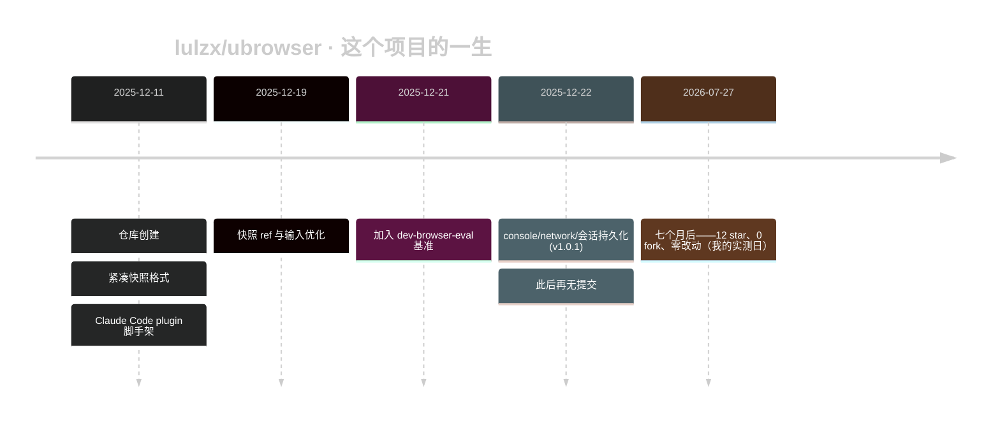
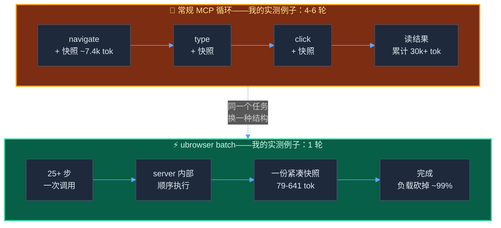

+++
date = '2026-07-27T10:00:00+08:00'
draft = false
title = 'ubrowser 实测：号称最快最便宜的 Claude Code 浏览器自动化，靠谱吗'
description = '我把 lulzx/ubrowser 装起来跑了一遍：同一页面快照 761 token，Playwright MCP 要 7400。设计思想是对的，但这个项目本身有大问题，实测数据全在文里。'
toc = true
tags = ['ubrowser', 'Claude Code', 'MCP', 'Browser Automation', 'Token Efficiency']
keywords = ['ubrowser 实测', 'ubrowser 怎么用', 'claude code 浏览器自动化', 'ubrowser 安装教程', 'ubrowser playwright mcp 对比', '浏览器自动化 token 优化', 'mcp 浏览器自动化']

[[params.faqItems]]
question = "ubrowser 是什么？"
answer = "ubrowser（lulzx/ubrowser）是一个开源 MCP server，给 Claude Code 提供浏览器自动化，靠三招省 token：把多步操作合并成一次调用、超紧凑的页面快照格式、默认极简的返回。我在 2026 年 7 月实测，一个 5 步登录流程一次调用跑完，只花 79 token。"

[[params.faqItems]]
question = "ubrowser 真的是最快最便宜的浏览器自动化吗？"
answer = "token 层面的宣称基本成立：同一页面，ubrowser 快照 761 token，Playwright MCP 约 7400，Chrome DevTools MCP 10220。但仓库自带的 benchmark 是本地模拟出来的（token 按字符数除 3.5 估算，没有真实调用 LLM），且项目自 2025 年 12 月起已停止维护。"

[[params.faqItems]]
question = "该用 ubrowser 替代 Playwright MCP 吗？"
answer = "不建议当依赖用。ubrowser 没有截图工具、没有 JavaScript evaluate，官方推荐的 plugin 安装路径是坏的（我验证过），而且七个月零提交。日常工作用维护中的 Playwright MCP 或 Chrome DevTools MCP，它的批量执行思路可以用脚本化 Playwright 实现。"

[[params.faqItems]]
question = "为什么 ubrowser 比 Playwright MCP 省这么多 token？"
answer = "浏览器自动化的 token 成本大头不是操作本身，而是快照体积乘以对话轮数。ubrowser 两头砍：一次 batch 调用替代 4-6 轮往返；紧凑格式（btn#e1\"Submit\"）一个元素约 8 token，而 a11y 树 YAML 一行要 80 左右。"

[[params.faqItems]]
question = "ubrowser 2026 年还在维护吗？"
answer = "没有。截至 2026 年 7 月，lulzx/ubrowser 的最后一次提交停在 2025 年 12 月 22 日——11 天开发冲刺后七个月无声。12 个 star，唯一的 issue 是作者自己的 PR。把它当设计参考读，别当基础设施用。"
+++


一个只有 12 个 star 的 GitHub 仓库，自称是"Claude Code 最快、最便宜的浏览器自动化"——比微软和谷歌官方出品快 5 倍、便宜 8 倍。这个 tagline 最近不断有人在搜，但据我观察，还没有人真把它装起来验证过。所以我上手了：克隆 [lulzx/ubrowser](https://github.com/lulzx/ubrowser)，跟安装过程搏斗了快一个小时，然后把它对准两周前我测 [Chrome DevTools MCP token 成本](/zh/posts/ai/2026-07-21-claude-code-screenshot-mcp-frontend-debugging/)时用的同一个页面。

先把结论摆出来：数字大部分是真的，这点我确实没想到。同一篇文章页、同一个 BPE tokenizer 计数，ubrowser 的快照只要 **761 token**，Playwright MCP 要 **7,400**，Chrome DevTools MCP 的 a11y 快照要 **10,220**。一个五步登录流程，一次调用、3.2 秒、**79 token** 搞定。

但我还是不会把它放进自己的工具链。这是一篇"思想是对的、成品是错的"的评测——而这两者之间的落差，恰恰是全文最有价值的部分。

## ubrowser 到底是个什么东西

ubrowser（写作 μBrowser）是一个 TypeScript 写的 MCP server，底层是 Playwright，作者是独立开发者 [Lulzx](https://github.com/lulzx)。整个提交历史从 2025 年 12 月 11 日到 12 月 22 日——11 天冲刺——然后戛然而止。截至 2026 年 7 月 27 日：12 star、0 fork、唯一一个 issue 是作者自己的 PR，Playwright 锁的 `^1.49.1` 现在 npm 会静默解析到 1.57.0。



它的卖点是三个机制，全都在打同一个敌人——**返回体积 × 对话轮数**：

1. **批量执行**。一次 `browser_batch` 调用在 server 内部顺序跑完 25+ 个动作（导航、输入、点击、滚动），Claude 只看到最终结果。四次工具调用变一轮。
2. **超紧凑快照**。不返回 a11y 树的 YAML 大字报，而是 `btn#e1"Submit"`、`inp#e2@e~"Email"!r` 这样的自创 DSL——一个元素约 8 token，而不是 80。
3. **极简返回**。动作只回 `{"ok":true}`，除非你明确要，DOM 一个字节都不进上下文。

这里没有任何黑科技，本质上是对"什么不该发回去"的克制。而我实测下来发现，主流浏览器 MCP 恰恰在这件事上毫无克制。

## 宣传数字审计：四套口径，没有一套是实测

装之前我先把仓库当尽调材料读了一遍，第一个应该校准你信任度的发现是：这个项目在不同文件里发布了**四套互相对不上的头条数字**：

| 出处 | 宣称 |
|---|---|
| README 基准表 | 51 秒 / $0.18，对比 Playwright MCP 4 分 31 秒 / $1.45——"便宜 8 倍" |
| README 格式章节 | "快照缩小 70%" |
| COMPARISON.md | "减少 77%"，随后又写"预估节省 75-90%" |
| package.json / marketplace | "98% token 减少" / "快 2.2 倍、少 70% token" |

魔鬼在注脚里。那个看着很猛的本地基准（`6.87s，$0.0052`）来自 `bench-game-tracker.cjs`，我自己跑了一遍，能跑通——但它是**模拟**：全程没有调用任何 LLM，token 按`字符数 ÷ 3.5`估算，"成本"是拿这个估算乘 Claude Opus 4.5 单价算出来的。而它对比的 Dev Browser 那个 3 分 53 秒，出自 [SawyerHood 的 dev-browser-eval](https://github.com/SawyerHood/dev-browser-eval)——一次真实的端到端 agent 运行。这不叫 benchmark，这叫两个不同实验硬挤在一张表里。COMPARISON.md 至少还算诚实，"projected"（预估）这个词就写在节省数字旁边。

所以第一个要拆的误区直说了：**README 上的数字不是测量结果，别引用它**。讽刺的是，作者根本不需要注水——真正可测的数字（马上讲）本身就足够能打。

## 安装实录：55 分钟、三次卡死、一个 1.9 秒的解法

README 给了两条安装路径，推荐的是 Claude Code plugin：

```bash
/plugin marketplace add lulzx/claude-code
/plugin install ubrowser@claude-code
```

省省吧。我没有盲跑，而是先追了一遍 marketplace 配置，路径算术当场崩盘：`marketplace.json` 指向 `./plugins/ubrowser/plugins/ubrowser`——这个目录在两个仓库里都不存在（submodule 检出到 `plugins/ubrowser`，里面并没有再套一层 `plugins/`）。而且就算路径能解析，plugin 的 MCP 入口是直接 `node build/index.js` 启动——我验证过，不先 `npm install` 就会当场死于 `ERR_MODULE_NOT_FOUND: Cannot find package '@modelcontextprotocol/sdk'`，而 plugin 安装流程从来不会帮你跑 `npm install`。推荐安装路径根本跑不通——"11 天冲刺然后消失"落到实际使用上就长这样。

手动路径能走通，但全是战损。我的时间线（Apple M5、Node 24、macOS 26.5）：

| 步骤 | 耗时 | 备注 |
|---|---|---|
| `git clone --depth 1` | 32 秒 | 34MB——`build/` 产物和整套基准脚本都提交进了 git |
| `npm install` | 21 秒 | Playwright `^1.49.1` 实际解析到 1.57.0 |
| `npm run build` | 1.1 秒 | 纯多余——`build/` 本来就在仓库里 |
| `npx playwright install chromium` | 40+ 分钟，失败 3 次 | 真正的 Boss 战 |
| 对同一个压缩包手动 `unzip` | **1.9 秒** | 解法 |

Chromium 这一步值得单独说，因为它还会吃掉别人的一下午。167MB 的下载本身每次两分钟左右就完成（国内网络需要 `PLAYWRIGHT_DOWNLOAD_HOST=https://cdn.npmmirror.com/binaries/playwright` 切 npmmirror 镜像，常规操作）。然后 Playwright 自带的解压器挂了——三次尝试，每次都精确卡死在解压到第 40 个文件的位置，一声不吭挂 10 分钟以上。我没法完全定位原因，可能跟我的机器环境有关。但绕过方式近乎羞辱：对 Playwright 自己下载好的那个 zip 直接跑系统 `unzip`，1.9 秒完事。接着还有续集：Playwright 1.49 之后 headless 模式走独立的 `chromium_headless_shell`，server 一启动就崩，要求再下 94MB——README 一个字没提。

从克隆到第一次自动化成功，总共约 55 分钟，其中约 50 分钟在跟浏览器管道搏斗。下次再看到以毫秒为单位的宣传语，请记住这个数。

## 实测数据：紧凑格式是真的能打

跑起来之后，我用[截图 MCP 调试那篇](/zh/posts/ai/2026-07-21-claude-code-screenshot-mcp-frontend-debugging/)的同一基准页做测试，token 用同一个 GPT 系 BPE tokenizer 计数（Claude 的 tokenizer 有几个百分点差异，但比值才是重点）。截至 2026 年 7 月，同一个页面拍一次快照的价格：

| 工具 | 方式 | 返回体积 | Token |
|---|---|---|---|
| **ubrowser** | `browser_snapshot`（紧凑格式） | 2,228 字符 | **761** |
| [Playwright MCP](https://github.com/microsoft/playwright-mcp) 1.62-alpha | `browser_snapshot`（a11y YAML） | 28,874 字符 | **7,434** |
| [Chrome DevTools MCP](https://github.com/ChromeDevTools/chrome-devtools-mcp) | `take_snapshot`（a11y 树，7 月 21 日实测） | — | **10,220** |
| Chrome DevTools MCP | `take_screenshot`（视口截图，7 月 21 日实测） | — | 1,866 |
| Chrome DevTools MCP | 定向 `evaluate_script`（7 月 21 日实测） | — | 65 |

对比同一天同一客户端实测的 Playwright MCP，缩小 **9.8 倍**；对比两周前 Chrome DevTools MCP 的数字，缩小 **13.4 倍**。"快照缩小 70%"这个宣称非但不虚，甚至说保守了——当然要讲公平：a11y 快照携带的结构上下文被紧凑格式整个扔掉了，而这正是它的设计意图。

batch 的宣称也成立。我的五步登录流程——导航、输邮箱、输密码、勾选记住我、提交——一次 `browser_batch` 调用：

```json
{"ok":true,"snap":"[Demo Login](...)\nbtn#e1\"Log out\"\na#e2/settings\"Settings\""}
```

一次调用、3.2 秒、往返共 **79 token**，返回的快照还顺带证明了流程成功（页面上已经是"Log out"按钮）。同样的流程走常规 MCP 是 4-6 轮，每轮都拖着一份快照。在 Hacker News 上，导航+滚动两次+快照的 batch 1.2 秒返回、641 token；HN 首页整页 100 元素的快照 1,720 token——仍然只有 Playwright MCP 拍我那个简单得多的文章页的几分之一。

还有个更安静但我同样在意的数字：MCP 工具 schema 本身——每个 server 在你干活之前就固定征收的上下文税——ubrowser 11 个工具约 2,356 token，Playwright MCP 24 个工具约 4,016 token，两边都是同一个 `tools/list` 调用量出来的。如果你读过我写的 [Claude Code 浏览器自动化五方案对比](/zh/posts/ai/2026-01-28-claude-code-browser-automation/)，这一行数字就是那篇文章论点的浓缩版。



这也坐实了第二个该杀掉的误区：**浏览器自动化的成本根本不在操作上**。点击是免费的，账单来自快照体积乘以轮数。这就是为什么 7 月实测中 [65 token 的 `evaluate_script` 打法](/zh/posts/ai/2026-07-21-claude-code-screenshot-mcp-frontend-debugging/)能吊打一切，也是为什么"batch + 紧凑快照"是正确的攻击方向。ubrowser 的作者对成本模型的理解，比出品主流工具的团队更透彻。

## 但它在哪里散架

那我为什么不用？因为 benchmark 不等于工具。一旦离开 happy path，毛边全露出来了。

**没有截图，没有 evaluate**。ubrowser 有 11 个工具，但最重要的两个恰恰不在其中。它没有任何截图能力——我那套[移动端布局调试流程](/zh/posts/ai/2026-07-21-claude-code-screenshot-mcp-frontend-debugging/)（靠视口截图才发现 390px 视口里塞了个 427px 的表格）在这里完全无法复现。它也没有 JavaScript evaluate，我知道的最便宜的打法（65 token 拿到精确 computed style）根本无法表达。ubrowser 把漏斗的中段优化到极致，然后把两头都剁了。

**资源拦截污染 console**。ubrowser 为了提速在网络层拦截图片、字体、媒体。听着合理——直到你调试真实页面时调用 `browser_console`，收到一整墙 `Failed to load resource: net::ERR_FAILED`，而这些错误是 *ubrowser 自己制造的*。我在 Hacker News 上还什么都没干，console 里已经全是假错误。用一个会往你正在读的信号里注入幻影错误的工具去调试前端，是能烧掉 agent 会话 20 分钟的那种坑。

**报错是个摆设**。点击一个不存在的 selector，阻塞整整 5 秒，然后返回 `{"ok":false,"error":"Timeout:"}`——冒号后面什么都没有。对比 Playwright 出了名啰嗦的 actionability 报错（会告诉模型*接下来该试什么*）：在 agent 循环里，错误文本就是 prompt 工程，而这一条是死胡同。

**写死的假设一箩筐**。headless 写死、视口写死 1280x720、User-Agent 伪装成 Chrome 120——一个 2023 年的浏览器版本。任何有点风控的站点看到的都是一个披着三年前风衣的 headless shell。它也没法像 [Chrome DevTools MCP](/zh/posts/ai/2026-03-17-chrome-devtools-mcp-guide/) 那样直接接管你真实的已登录浏览器。

**以及，它被弃更了**。七个月零提交，而它脚下的地基（MCP 规范、Claude Code plugin schema、Playwright 大版本）今年已经挪了好几次。marketplace 路径坏掉不是孤立 bug，是无人维护的胶水代码被熵收割的样子。与此同时，主流工具正在吸收它的好想法：我测的 Playwright MCP 1.62 alpha 已经开始把完整快照写到磁盘、导航时只返回文件引用——"别让 DOM 从上下文窗口里过"这个直觉，晚了几个月，终于到了上游。

## 结论：偷它的设计，跳过这个依赖

一句话判断：**ubrowser 是"正确的思想装进了错误的容器"——batch + 紧凑快照是 agent 浏览器自动化的正确成本模型，我的实测背书；但一个 12 star、2025 年 12 月后零提交、没截图、没 evaluate、推荐安装路径都是坏的仓库，属于你的阅读清单，不属于你的工具链。**

这是我自己会用的选型表，汇总了这个系列所有实测：

| 你的任务 | 用什么 | 为什么 |
|---|---|---|
| 调试前端视觉 / CSS | Chrome DevTools MCP 截图 + `evaluate_script` | 65-1,866 token，能看到真实样式 |
| 通用 agent 浏览 | Playwright MCP | 有维护、报错最好、evaluate 和截图齐全 |
| 高频脚本化流程（表单、CI 检查） | [Playwright CLI 装进 skill](/zh/posts/ai/2026-04-18-playwright-cli-skill-zero-token-automation/) | 近零 token：代码在上下文窗口之外跑 |
| 已登录会话、有风控的站点 | Chrome DevTools MCP 接管真实浏览器 | 真实指纹、真实 cookie |
| 想学浏览器自动化能便宜到什么程度 | 读 ubrowser 源码 | 格式器和批量执行器约 1,400 行，教科书级 |

想在今天就拿到 ubrowser 的经济性、又不想抱一个弃更项目？大部分收益你现在就能白嫖：把动作合并进脚本里跑（Playwright CLI skill 那套干的就是这件事——"batch"只是活在代码里而不是 JSON 里），以及：只需要页面上的某个事实时，就只要那个事实，别要快照。这两个习惯能让你在有人维护的工具上，摸到 ubrowser 数字的边。

真正让人不舒服的结论跟这个仓库无关，跟生态有关。一个独立开发者，11 天，做出了比微软谷歌默认出品便宜一个数量级的浏览器自动化——用的全部手段不过是尊重上下文窗口。主流工具到 2026 年年中才开始跟进。在它们跟完之前，"随手加个浏览器 MCP"仍然是 agent 工程里最大的一笔隐形账单。值得花五分钟测测你自己的：把你在用的工具对准一个你熟悉的页面，数一数返回的 token，然后问一句——这些我真的需要吗？

## 常见问题

**ubrowser 是什么？**

一个开源 MCP server（lulzx/ubrowser），通过三个省 token 机制给 Claude Code 提供浏览器自动化：批量多步执行、超紧凑元素快照格式、默认极简返回。我实测一个 5 步登录流程一次调用完成，79 token。

**ubrowser 真是最快最便宜的浏览器自动化吗？**

可测的宣称基本成立——同一页面我测出 761 token 对 Playwright MCP 约 7,400——但它公开的 benchmark 是估算 token 的模拟，且项目 2025 年 12 月 22 日之后再无维护。

**该用 ubrowser 替代 Playwright MCP 吗？**

不该。它没有截图和 JavaScript evaluate，推荐的 plugin 安装路径是坏的（坏路径和缺依赖崩溃我都验证过），七个月没人碰。用有维护的工具，然后用脚本化 Playwright 实现它的批量思路。

**为什么 ubrowser 能省这么多 token？**

因为浏览器自动化的成本 = 快照体积 × 轮数。一次 batch 调用替代 4-6 轮往返，紧凑格式一个元素约 8 token，a11y 树 YAML 一行要 80 左右。

**ubrowser 还在维护吗？**

截至 2026 年 7 月没有——整个提交历史只有 2025 年 12 月 11 日到 22 日。把它当一份附带可运行原型的优秀设计文档看待。

## 相关阅读

- [Claude Code 截图 MCP 配置：浏览器自动化调试省 100 倍 token](/zh/posts/ai/2026-07-21-claude-code-screenshot-mcp-frontend-debugging/) — 本文对比基线 10,220 / 1,866 / 65 token 的出处
- [Claude Code 浏览器自动化怎么选？5 套方案实测对比](/zh/posts/ai/2026-01-28-claude-code-browser-automation/) — 更大的战场：Browser-use、Agent Browser、Playwright CLI、Playwright MCP、DevTools MCP
- [Playwright CLI + Skill 三段式：把 AI 浏览器自动化做到 0 Token](/zh/posts/ai/2026-04-18-playwright-cli-skill-zero-token-automation/) — 在有维护的工具上拿到 ubrowser 级经济性
- [Chrome DevTools MCP 2026 配置教程](/zh/posts/ai/2026-03-17-chrome-devtools-mcp-guide/) — 接管真实已登录浏览器，而不是 headless shell
