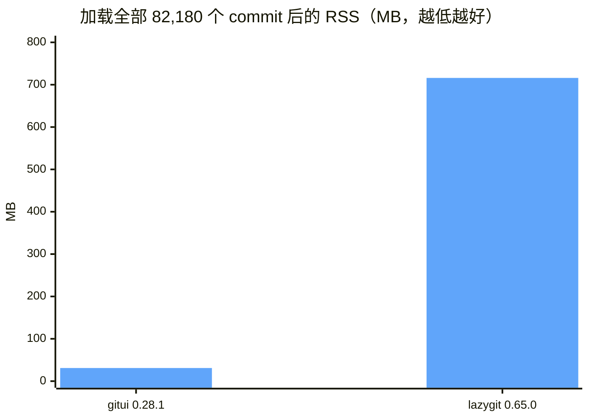
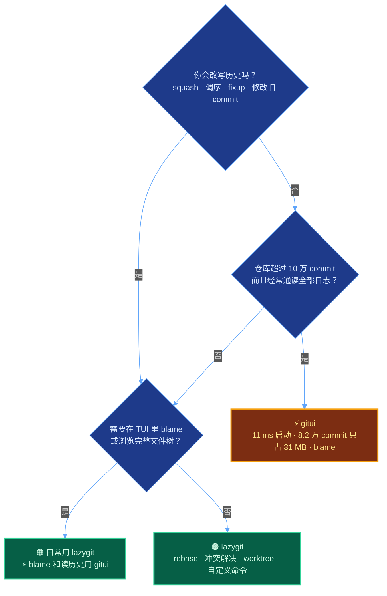

+++
date = '2026-09-02T10:00:00+08:00'
aliases = ['/posts/ai/2026-09-11-gitui-vs-lazygit/', '/posts/ai/2026-09-12-gitui-vs-lazygit/']
draft = false
title = 'lazygit 还是 gitui：终端 Git 工具选型（2026 实测）'
description = '8.2 万 commit 仓库实测：gitui 11 ms 出画面、全量历史只占 31 MB；lazygit 要 416 ms，却独占交互式 rebase、冲突解决、worktree 和自定义命令。附 Windows/WSL2 安装坑、中文路径显示和 AI 编程工作流选型。'
toc = true
tags = ['Developer Tools', 'Git', 'Terminal', 'Productivity']
keywords = ['lazygit gitui 对比', '终端 git 工具', 'lazygit 教程', 'gitui 安装', 'git tui 推荐', 'gitui lazygit 哪个好', 'lazygit windows 安装', 'lazygit 中文乱码']

[[params.faqItems]]
question = "gitui 比 lazygit 快多少？"
answer = "快很多：在 82,180 个 commit 的仓库上，gitui 11 ms 出可用画面、全量历史只占 31 MB；lazygit v0.65.0 要 416 ms，加载完全部 commit 后占 716 MB。但 10 万 commit 以下，两者差距不到半秒，速度基本不该左右选型。"

[[params.faqItems]]
question = "gitui 支持交互式 rebase 吗？"
answer = "不支持。截至 v0.28.1（2026 年 3 月），gitui 没有交互式 rebase，issue #32 从 2020 年 4 月开到现在，仍挂在 1.0 路线图上。lazygit 在 commit 面板里直接 squash、fixup、调序、drop、edit。"

[[params.faqItems]]
question = "超大仓库选 gitui 还是 lazygit？"
answer = "只读历史、blame、浏览完整文件树，选 gitui：它异步加载全部 commit，内存平稳在 31 MB。要改历史，lazygit 在 8.2 万 commit 上照样能用（416 ms 启动，每次分页加载 300 条），还有 rebase、冲突解决和 worktree。"

[[params.faqItems]]
question = "和 Claude Code、Codex 搭配，哪个更合适？"
answer = "lazygit。逐 hunk 审 AI 生成的 diff、按 agent 开 worktree、一键自定义命令（复制 diff 给 agent、在 worktree 里起会话）都是内置能力。gitui 没有自定义命令，也没有 worktree 视图。"

[[params.faqItems]]
question = "lazygit 和 gitui 需要 Nerd Font 吗？"
answer = "都不需要，两者用普通制表符渲染。lazygit 把 gui.nerdFontsVersion 设为 '3' 可以显示文件图标，但这是可选项；gitui 压根没有图标模式。"
+++


11 毫秒。这是 gitui 在我 M5 MacBook 上打开 git/git 仓库（82,180 个 commit）到出可用画面的时间，换成 630 个 commit 的博客仓库，数字纹丝不动。同一个仓库，lazygit 用了 416 ms。如果你搜「lazygit gitui 对比」只想知道谁快，看到这里可以关页面了：gitui，快将近 40 倍。

但这也是整篇对比里最不重要的一个事实。快 40 倍的那个，不能做交互式 rebase，冲突文件的 diff 是空白的，没有自定义命令，没有 worktree 视图，最近 20 个月只发了 3 个版本。慢的那个，最近 12 个月发了 17 个。

所以真正的问题不是快慢，而是 gitui 独有的东西（blame、完整文件树、超大历史下的平稳内存）对你重不重要，重过 lazygit 独有的那一堆吗。我两个工具都用了一周，专门写了一个 pty 测试脚本给它们计时，先上收据，再给结论。

## lazygit vs gitui 启动实测：三个仓库，一套脚本

先说方法。TUI 没法像测 `ls` 那样直接用 `hyperfine` 掐表：两个工具没有终端都拒绝启动，而且「启动时间」得定义成「画面上出现能操作的东西」才有意义。

所以我写了个 Python 脚本，把工具 fork 在伪终端里，输出灌进 `pyte` 终端模拟器，等屏幕满足「就绪条件」时停表。lazygit 的就绪条件是「Commits 面板画出来并且有 commit 哈希」；gitui 的是「标签栏画出来，所有 `Loading ...` 占位符消失」。内存取整棵进程树的 RSS，因为 lazygit 启动时会拉起 `git` 子进程自动 fetch，那部分也得算。

环境如下，方便你复现或者反驳：

| 项目 | 数值 |
|---|---|
| 机器 | MacBook Pro，Apple M5，macOS 26.5.2 |
| lazygit | v0.65.0（Homebrew，2026-09-05 发布），二进制 18.4 MB |
| gitui | v0.28.1（Homebrew，2026-03-24 发布），二进制 9.5 MB |
| 小仓库 | 本博客，630 commit |
| 中仓库 | neovim/neovim，38,077 commit，`.git` 331 MB |
| 大仓库 | git/git，82,180 commit，`.git` 334 MB |
| 缓存 | 热缓存（各跑 10 次取中位数）；没有 sudo 清不了页缓存，所以没有冷启动数据 |
| 终端 | 200×50 的 pty，`TERM=xterm-256color`，关闭启动弹窗 |

**到可用画面的时间**（10 次中位数）：

| 仓库 | lazygit | gitui | 倍数 |
|---|---|---|---|
| 630 commit | 88 ms | 11 ms | 8× |
| 38,077 commit | 232 ms | 11 ms | 21× |
| 82,180 commit | 416 ms | 11 ms | 38× |

**出画面时的内存（进程树 RSS）**：

| 仓库 | lazygit | gitui |
|---|---|---|
| 630 commit | 43 MB | 16 MB |
| 38,077 commit | 34 MB | 18 MB |
| 82,180 commit | 40 MB | 31 MB |

这组数字说的是两种策略，不是同一种策略的两种速度。gitui 先把框架画出来再异步填内容：11 ms 时状态页已经能用，日志页还在角落里跳数字（`300/3000`，然后 `82180/82180`）。lazygit 则是先跑 `git log` 拿前 300 个 commit、画好分支图，才给你看第一帧。所以它的启动时间随历史长度涨，gitui 的不涨。

## 那 11 毫秒到底换来了什么

说句公道话：gitui 的速度优势是真的，但 10 万 commit 以下你感觉不到。416 ms 比按一次键慢，比 VS Code 切一个标签页快。两种策略真正拉开差距，是在你要看**全部**历史的时候，那才是数字变得夸张的地方。

| 加载全量历史 | lazygit | gitui |
|---|---|---|
| 38,077 commit：耗时 | 0.5 秒内（Commits 面板按两次 `>`） | 启动起算 150 ms |
| 38,077 commit：RSS | 129 MB | 25 MB |
| 82,180 commit：耗时 | 1.92 秒 | 启动起算 484 ms |
| 82,180 commit：RSS | **716 MB**（峰值 788 MB） | **31 MB** |
| 跳到第一个 commit | 先等上面的加载 | 瞬间，24 MB |



lazygit 的 716 MB 不是内存泄漏，是分支图。它给每一个加载进来的 commit 都渲染分支线，git/git 这种 merge 密集的历史，图有几十列宽。gitui 压根不画图（分支可视化还是[路线图 #81](https://github.com/gitui-org/gitui/issues/81)），一张平铺列表，内存也平铺。

你用一张历史图换来了 23 倍的内存差。16 GB 的笔记本上这笔交易你根本不会注意；在跑着 200 万 commit 单体仓库的共享开发机上，这就是「能用的工具」和「被 kill 的工具」的区别。

这也让 gitui 自家 README 里的跑分有了参照系。它引用的是 Linux 内核仓库（90 万+ commit）：gitui 24 秒、0.17 GB，lazygit 57 秒、2.6 GB，还标注 lazygit「会卡死」「偶尔崩溃」。

那组数据来自 2020 年 RustBerlin 聚会的一次分享，测的是好几年前的 lazygit；我在 8.2 万 commit 上跑 v0.65.0，没见到任何卡死或崩溃。不过按我的内存曲线外推，90 万 commit 吃到 2.6 GB 完全说得通。README 没撒谎，它只是描述了一个我们大多数人不会碰到的仓库规模。

**性能结论，2026-09-02 版**：仓库不到 10 万 commit，启动速度根本不该进入你的选型考虑。经常要通读 Linux 内核级别仓库的全部历史，两者里只有 gitui 能舒服地做到。

## 功能矩阵：一周真实使用的对照表

下面每一行都是我在 v0.65.0 和 v0.28.1 上亲手操作过的，不是抄 README。缺失的功能我都附了 issue 链接，方便你盯进度。

| 能力 | lazygit v0.65.0 | gitui v0.28.1 |
|---|---|---|
| 交互式 rebase（squash、fixup、调序、drop、edit） | 有，直接在 commit 面板里操作 | **没有**；[#32](https://github.com/gitui-org/gitui/issues/32) 从 2020-04-23 开到现在，91 个 👍 |
| 按行 / 按 hunk 暂存 | `space` 单行、`v` 范围选 | `s` 暂存行、回车暂存 hunk；不分伯仲 |
| 冲突解决 | 专用视图：选 hunk、两边都要、下一个冲突、撤销 | 文件标 `!`，diff 面板只显示 `size: 0 B -> 62 B`（[#2865](https://github.com/gitui-org/gitui/issues/2865)）；得去外部编辑器解决 |
| 自定义命令 | YAML `customCommands`，支持 Go 模板、输入框和菜单 | 没有 |
| worktree | 文件面板自带 Worktrees 标签页，`w` 从分支新建 | 没有 worktree 视图 |
| blame | **没有**（键位手册里根本没这个词） | Files 标签页按 `B`，带语法高亮、可跳行 |
| 浏览任意 commit 的完整文件树 | 不行（只列变更文件） | Files 标签页，任意版本 |
| 分支图 | 有 | 没有 |
| 修改旧 commit / 自定义补丁 / bisect / 撤销 | 都有；`ctrl+z` 靠 reflog 几乎什么都能撤 | 只能 amend HEAD；没有 bisect；`U` 撤销最近一次提交，仅此而已 |
| 键位可发现性 | 底部上下文提示栏 + `?` 可过滤菜单 | 底部上下文提示栏 + `h` 帮助弹窗 |
| 配置格式 | YAML（`config.yml`） | RON（`theme.ron`、`key_bindings.ron`） |
| Nerd Font | 可选图标（`gui.nerdFontsVersion: "3"`） | 不用 |
| 界面语言 | 自动识别 zh-CN、zh-TW、ja、ko、ru、pl、nl、pt | 只有英文 |
| Windows 安装 | winget、scoop、choco | winget、scoop、choco |
| 最近 12 个月发版 | 17 个（2025-09-17 的 v0.55.1 到 2026-09-05 的 v0.65.0） | 2 个（2025-12-14 的 v0.28.0、2026-03-24 的 v0.28.1） |
| GitHub star（2026-09-02） | 82,214 | 22,477 |

这张表里有三行，直接决定了这篇文章的结论。

**交互式 rebase。** 我专门写过一篇讲 [lazygit 的 rebase 为什么像开挂](/zh/posts/ai/2026-04-10-lazygit-guide/)，gitui 里没有任何东西能替代它。gitui 的日志页有 reword、revert、reset 和「rebase 分支」（就是普通的 `git rebase` 到另一个分支上）。

它不能把两个 commit 合并，不能把一个 commit 挪到另一个上面，不能丢掉某一个。issue #32 上 91 个赞说明想要的人不止我，开了六年说明短期内不会来。如果你每周都要 rebase，光这一行就能结束对比。

**冲突。** 我建了个两个分支改同一行的仓库，两个工具都打开看。lazygit 把文件面板切成「(only conflicting)」，右侧显示 `<<<<<<<` / `=======` / `>>>>>>>` 块，底栏写着 `Pick hunk: <space> | Pick both hunks: b | Previous conflict: <left> | Next conflict: <right> | Undo: z`。

gitui 给 `app.py` 标了个 `!`，diff 面板一行 `size: 0 B -> 62 B (+62 B)`，其余全空。唯一跟冲突有关的键是「Abort merge」。这是个未关闭的 bug（[#2865](https://github.com/gitui-org/gitui/issues/2865)），绕法是按 `e` 打开编辑器，而这恰恰是 TUI 本来应该帮你省掉的那一趟。

**blame 和文件树。** 这是 gitui 真正赢的地方，我不想让 rebase 那一段把它埋掉。lazygit 的 Files 面板只列**有改动**的文件，没有任何办法在仓库树里翻文件、问「这一行谁写的」。

gitui 的 Files 标签页显示任意 commit 的完整目录树，`B` 是带语法高亮、可跳行的 blame，`H` 是单文件历史。读一个陌生代码库的时候，这才是我真正想从 Git TUI 里得到的东西，而 lazygit 就是没有。

## Windows Terminal / WSL2 下的安装与坑

这一节是给从[Windows 终端推荐](/zh/posts/ai/2026-06-22-best-windows-terminal-2026/)那篇过来的读者写的。先坦白：这次实测是在 Mac 上做的，Windows 和 WSL2 我没在这轮里跑，下面的坑来自两个项目的 issue 和文档，不是我的一手翻车记录，请按这个可信度看。

**安装本身两家都没问题。** Windows 原生装 lazygit：`winget install -e --id=JesseDuffield.lazygit`，或者 `scoop bucket add extras && scoop install lazygit`；装 gitui：`winget install gitui` 或 `scoop install gitui`，choco 也都有包。

WSL2 里的 Ubuntu 走各自的 Linux 安装方式即可，gitui 的 Linux 包是 musl 静态链接，扔进任何发行版都能跑。

**WSL2 里 gitui 的网络操作有一个开了两年多的坑。** [issue #1974](https://github.com/gitui-org/gitui/issues/1974)（2023-12 开，仍未关闭）报告在 WSL2 Ubuntu 里 fetch/pull 卡在 0% 然后超时，同一台机器上命令行 git 和 lazygit 都正常。

issue 里没有定论，我的猜测是 gitui 走 libgit2 自带的网络栈、不调用系统 git，所以吃不到 WSL 那套代理和凭据环境。另一条是明写在 README「已知限制」里的：HTTPS 远程必须显式配置 `credential.helper`，否则推拉直接失败。如果你的仓库在 WSL2 里且走 HTTPS，先用命令行确认凭据缓存能用，再开 gitui。

**lazygit 在 WSL 里的坑集中在「打开浏览器」这类跨系统动作。** [issue #5222](https://github.com/jesseduffield/lazygit/issues/5222) 指出 lazygit 的 WSL 检测默认你没关 `appendWindowsPath`，关了就找不到 `powershell.exe`，打开 PR 链接会失败。日常 Git 操作不受影响。

另外 WSL2 下跨到 `/mnt/c` 的仓库操作慢是文件系统的锅，两个工具都救不了，仓库放在 Linux 文件系统里是唯一解。

## 两个 README 都没写的细节

**lazygit 的 diff 头会把中文路径显示成转义字节。** 我建了个仓库，文件叫 `中文文件名.md`。lazygit 的文件树把名字显示得好好的，但 diff 头是 `diff --git "a/\344\270\255\346\226\207..."`，因为 lazygit 是调 `git diff` 拿输出，而 Git 默认会给非 ASCII 路径加引号转义。

一行配置全局修好，只要你碰过中文、带重音或者 emoji 的文件名，都应该设上：

```bash
git config --global core.quotepath false
```

gitui 开箱就是干净的，因为它通过 libgit2 读 diff，不解析 porcelain 输出。小事一桩，但正是这种小事让一个工具在第一天就显得「坏了」。搜「lazygit 中文乱码」的读者，八成就是这一行。

**lazygit 会按系统 locale 自动切界面语言。** 我这台机器是 zh_CN，lazygit v0.65.0 没碰配置就直接启动成全中文界面（`gui.language: auto` 是默认值）。

对这个博客中文版的读者来说是好事，但你跟着英文教程操作、屏幕上的键位提示全是中文，会有一瞬间对不上号。想让文档和屏幕一致就设 `gui.language: en`。gitui 完全没有本地化。

## 和 AI 编程 agent 搭配：gitui vs lazygit 怎么选

2025 年之后我用 Git 的方式变了：机器上大部分 diff 是 Claude Code 或者 Codex 写的，我的活儿是审，不是写。这改变了我对 Git TUI 的需求，也把天平狠狠推向了 lazygit，具体是三件事。

**逐 hunk 审 agent 的产出。** 两家都能按行暂存。但 agent 生成的 diff 恰恰是你想「留下好的一半、丢掉幻觉的一半、按 agent 没想到的逻辑单元分开提交」的场景。lazygit 的 `v` 范围选，加上「自定义补丁」流程（从 agent 已经提交的 commit 里把某几行抽出来），把这一套全覆盖了；gitui 到暂存为止。

**一个 agent 一个 worktree。** 并行跑两三个 agent 意味着[一个任务一个 worktree](/zh/posts/ai/2026-02-28-claude-code-worktree-guide/)，烦的从来不是创建，是记住哪个是哪个、以及事后清理。

lazygit 的 Worktrees 标签页把它们列出来，`space` 切换，`d` 连目录带元数据一起删。gitui 没有 worktree 这个概念，它的 issue 区里跟 worktree 沾边的只有「在 worktree 里运行会出 bug」。

**自定义命令是胶水。** 这是让 lazygit 从「查看器」变成「枢纽」的功能。两条我真在用的绑定，写在 `config.yml` 里：

```yaml
customCommands:
  # 把选中 commit 的 diff 复制到剪贴板，贴给 agent 做 review
  - key: '<c-y>'
    context: 'commits'
    command: 'git show {{.SelectedCommit.Hash}} | pbcopy'
    description: 'Copy commit diff to clipboard'
  # 在选中的 worktree 里新开一个 tmux 窗口跑 Claude Code
  - key: 'C'
    context: 'worktrees'
    command: 'tmux new-window -c {{.SelectedWorktree.Path | quote}} "claude"'
    description: 'Start Claude Code in this worktree'
```

gitui 两条都表达不了。它没有自定义命令系统，在 issue 里搜相关需求，除了一个已关闭的编译报错什么都没有。作为纯粹「看仓库」的工具这没问题；作为夹在我和 agent 之间的工具，这是一票否决。

gitui 在 agent 工作流里唯一站得住的位置，是审 agent 改动的**陌生**代码：对那个文件按 `B` 看 blame，判断它改的那一行是不是承重墙、上一次是谁动的。我就为这个留着 gitui，一周大概打开两次。

## 结论：装 lazygit，留 gitui 看 blame



截至 2026 年 9 月，给大多数读者的建议：

1. **`brew install lazygit`**（Windows 用 `winget install -e --id=JesseDuffield.lazygit` 或 `scoop install lazygit`），当日常主力。它有 rebase、真正的冲突视图、worktree、自定义命令、12 个月 17 个版本和 8.2 万 star。在 8.2 万 commit 的仓库上多花的 416 ms，到周二你就不会再注意了。
2. **顺手也装上 gitui**，如果你靠读别人代码吃饭、仓库有几十万 commit、或者单纯想要一个 `B` 键看 blame。9.5 MB 的二进制、16 MB 内存，对你的工作流没有任何意见。给它一个单独的别名，让它当显微镜，lazygit 当工作台。
3. **只装 gitui** 的情况只有一种：你从不改写历史，而且机器内存真的紧。这类人群真实存在（SRE 跳板机、手机上的 Termux、共享虚拟机里的 200 万 commit 单体仓库），只是不是大多数开发者。

我不建议的选法：按语言选。「gitui 是 Rust、lazygit 是 Go」只能告诉你二进制大小（9.5 对 18.4 MB），告诉不了你晚上六点谁能把你从一次搞砸的 merge 里捞出来。按上面那张表的功能行选。

如果你是从 [fish shell](/zh/posts/linux/2026-04-18-fish-shell-rust-2026/) 和 Rust 工具链那波过来的，想先把终端本身理顺，我的[终端工具推荐](/zh/posts/macos/2025-01-22-terminal-tools-guide/)和 [Windows 终端横评](/zh/posts/ai/2026-06-22-best-windows-terminal-2026/)讲的是这两个工具底下那一层。

*关于 tig 的脚注：它还活着（1.33 万 star，2026 年 6 月发了 v2.6.1），作为一个只读的 `git log` 翻页器，它比 gitui 还轻。但它不能暂存、不能 rebase、不能解冲突，所以不算第三个选手；它是一个非常好用的 Git 版 `less`。*

## 相关阅读

- [Lazygit：用了就回不去的终端 Git 神器](/zh/posts/ai/2026-04-10-lazygit-guide/) — 本文选中的那个工具的深度教程
- [Claude Code Worktree：多任务并行开发完全指南](/zh/posts/ai/2026-02-28-claude-code-worktree-guide/) — lazygit Worktrees 标签页就是为这个工作流准备的
- [2026 Windows 终端推荐：5 款横评与选型决策](/zh/posts/ai/2026-06-22-best-windows-terminal-2026/) — 先选终端，再选 Git TUI
- [2025 年终端工具推荐：23 款终端模拟器全面对比](/zh/posts/macos/2025-01-22-terminal-tools-guide/) — 跨平台终端总览
- [fish shell 4.6 实测](/zh/posts/linux/2026-04-18-fish-shell-rust-2026/) — 和这两个工具都很搭的 shell
