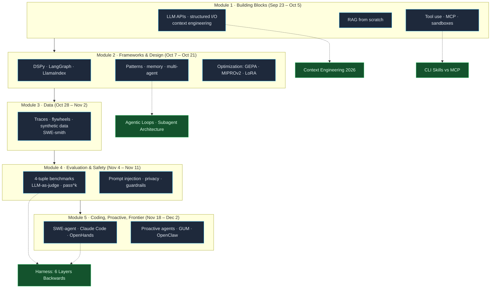

+++
date = '2026-09-04T10:00:00+08:00'
aliases = ['/posts/ai/2026-09-11-stanford-cs329z-engineering-ai-agents/', '/posts/ai/2026-09-18-stanford-cs329z-engineering-ai-agents/']
draft = false
title = 'Stanford CS329Z Engineering AI Agents: Syllabus + Self-Study'
description = 'Stanford CS329Z (Fall 2026) teaches AI agents as engineering: decomposition, data, evals. Full dated schedule, HW1/HW2, grading, and a no-video self-study plan.'
toc = true
tags = ['Stanford CS329Z', 'AI Agent', 'DSPy', 'Course Review', 'Agentic Engineering']
keywords = ['stanford cs329z', 'cs329z', 'engineering ai agents stanford', 'stanford ai agents course 2026', 'diyi yang agents course', 'cs329z syllabus', 'cs329z self study', 'stanford dspy course']

[[params.faqItems]]
question = "What is Stanford CS329Z?"
answer = "CS329Z: Engineering AI Agents is a new 3-unit Stanford course (class number 27855) first offered in Fall 2026, taught by Diyi Yang, Michael Ryan, and John Yang. It teaches how to build compound AI systems and agents: RAG, tool use, agent loops, DSPy and LangGraph, data curation, and evaluation. Lectures run Mon/Wed 1:30-2:50 pm in Packard 101 from Sep 23 to Dec 2, 2026."

[[params.faqItems]]
question = "Are CS329Z lecture videos public?"
answer = "No. As of September 2026 the syllabus states lectures are recorded but distributed only through the course Canvas site to enrolled students. The public site lists every lecture topic and all 50 readings, and says lecture materials will be linked as released, but there is no YouTube playlist and no public recording."

[[params.faqItems]]
question = "What are the prerequisites for CS329Z?"
answer = "Any one of CS224N, CS224U, CS224V, or CS336, or equivalent NLP background. In practice that means you should already understand how transformers, tokenization, and LLM APIs work. CS329Z is not an intro course; it assumes you can write Python against a chat-completion API on day one."

[[params.faqItems]]
question = "CS329Z vs CS146S: which Stanford AI course should I follow?"
answer = "CS146S teaches you to use AI coding agents to ship software faster (Claude Code, Cursor, MCP, code review). CS329Z teaches you to build agent systems that other people use: harnesses, RAG, evals, optimization. If your job is writing code with agents, follow CS146S. If your job is shipping an agent product, follow CS329Z. Both have public syllabi and neither has public lecture videos."

[[params.faqItems]]
question = "Can I self-study CS329Z without enrolling?"
answer = "Mostly, yes. All 50 readings are public papers and blog posts, and the two homework briefs are described in enough detail on the course site to rebuild as exercises: HW1 is an agent harness built with no frameworks, HW2 is an evaluation suite using the 4-tuple framework. What you cannot get without enrolling: the recordings, the pre-built agent and email corpus used in the homework, the two design-decision quizzes, guest lectures, and credit."
+++

Stanford's new agents course bans agent frameworks in its first assignment. HW1 of **Stanford CS329Z: Engineering AI Agents** tells students to build a company's internal AI assistant "with no agent frameworks: just a chat-completion call and code you write yourself." LangChain, LangGraph, DSPy, and LlamaIndex don't show up until lecture six, and when they do, the stated purpose is to compare "what frameworks abstract vs. what you built from scratch."

That one rule tells you what kind of course this is. It's not "learn LangChain in ten weeks," and it's not a coding-with-Claude-Code practicum like [CS146S](/posts/ai/2026-02-24-stanford-cs146s-overview/). It's an engineering-discipline course: the syllabus names three challenges up front (decomposition, data, evaluation), and 17 lectures, two homeworks, and 50 readings are organized around them.

This page is the syllabus breakdown plus the part I actually care about: since the recordings are Canvas-only, how far can you get on the public materials alone, and which weeks are worth your time if you already ship agents for a living. I haven't sat in Packard 101 (the first lecture is September 23, 2026), so everything below comes from the [course site](https://cs329z.stanford.edu/), the [Stanford Bulletin](https://bulletin.stanford.edu/courses/2283761), the instructors' own pages, and the readings themselves. Where I'm guessing, I say so.

## CS329Z at a Glance

| Item | Details |
|------|---------|
| **Course** | CS 329Z: Engineering AI Agents |
| **Term** | Fall 2026 (Autumn 1, 2026-27), first offering |
| **Lectures** | Mon/Wed 1:30-2:50 pm, Packard 101, Sep 23 to Dec 2 |
| **Units / class number** | 3 units, #27855, Letter or Credit/No Credit |
| **Instructors** | [Diyi Yang](https://cs.stanford.edu/~diyiy/) (Stanford NLP faculty), [Michael Ryan](https://michryan.com/) (PhD student, DSPy core contributor, MIPROv2 and GEPA author), [John Yang](https://john-b-yang.github.io/) (PhD student, SWE-bench / SWE-agent / SWE-smith first author) |
| **Prerequisite** | Any of CS224N, CS224U, CS224V, CS336, or equivalent NLP background |
| **Frameworks touched** | litellm, DSPy, LangChain/LangGraph, LlamaIndex, MCP |
| **Recordings** | Captured, distributed via Canvas only. Not public. |
| **Contact** | cs329z-staff@lists.stanford.edu |

The instructor lineup is the strongest signal about what the course values. Michael Ryan wrote the optimizer papers that make DSPy more than a prompt wrapper (MIPROv2 at EMNLP 2024, [GEPA](https://arxiv.org/abs/2507.19457), ICLR 2026 oral). John Yang built the benchmark the entire coding-agent industry reports against ([SWE-bench](https://arxiv.org/abs/2310.06770)), the reference agent that runs on it ([SWE-agent](https://github.com/SWE-agent/SWE-agent)), and the data engine that trains for it ([SWE-smith](https://github.com/SWE-bench/SWE-smith)). One instructor is optimization, one is evaluation and data. That's the course.

## Why "Engineering" Is the Operative Word

The course description opens with the [compound AI systems](https://bair.berkeley.edu/blog/2024/02/18/compound-ai-systems/) framing from Zaharia et al.: the interesting unit is no longer a model, it's a system of models, retrievers, tools, and optimizers. Then it lists what students learn to do: "pick what types of problems to focus on, decompose problems, select appropriate components, collect and curate data, build evaluations, and reason about the design tradeoffs."

Notice what's missing from that list: prompting. It gets a bullet in lecture two and then disappears. Compare that with most 2025 agent courses, where prompt patterns were half the syllabus.

The grading confirms it. Half the grade is a quarter-long group project ("Making Life at Stanford Better with Agents"), 20% is the two homeworks, and 15% is two ten-minute quizzes where you explain the design decisions and tradeoffs in your own homework. There's no exam on lecture content. You cannot pass CS329Z by remembering what was said in Packard 101, which, as it happens, is also why not having the videos hurts less than you'd think.

| Component | Weight | What it actually tests |
|-----------|--------|------------------------|
| Project (proposal 5, midway report 5, midpoint demo 7, final submission 15, final demo 18) | 50% | Can you scope and ship a working agent in ten weeks |
| HW1: Build an Agentic Harness | 10% | Can you build tools, memory, a terminal, and a human-in-the-loop with zero frameworks |
| HW2: Evaluate an Agent | 10% | Can you write code graders, an LLM judge, and 4-tuple benchmark tasks |
| HW-based quizzes (2 x 7.5%) | 15% | Can you defend your own design tradeoffs, closed-book |
| Paper video (7%) + 3 peer reviews (3%) | 10% | Can you critique a recent agent paper and add something (a reproduction, an experiment) |
| Participation | 5% | Discussion, teamwork, recitations |

Here's the mistake I expect people to make with this course: treating it as CS146S with a harder prerequisite. It isn't. CS146S (Fall 2026 runs Tue/Thu from Sep 22, and I wrote a [follow-along plan for it](/posts/ai/2026-09-11-cs146s-fall-2026-follow-along/)) is about *developer practice*: using Claude Code, Cursor, MCP servers, and code review to ship software faster. CS329Z is about *building the agent* that someone else uses. The prerequisites say the same thing: CS146S wants CS111-level programming; CS329Z wants CS224N.

| | CS146S: The Modern Software Developer | CS329Z: Engineering AI Agents |
|---|---|---|
| Question it answers | How do I ship software 10x faster with agents? | How do I build an agent system that works? |
| Unit of work | Your codebase, your PRs | Harness, RAG pipeline, eval suite |
| Frameworks | Claude Code, Cursor, Warp, MCP | litellm, DSPy, LangGraph, LlamaIndex, MCP |
| First assignment | Prompting playground (2025) / 200-line agent (2026) | Full harness with no frameworks |
| Evaluation content | One review week | Three lectures plus HW2 |
| Prerequisite | CS111 | CS224N / CS336 |
| Videos | None public | None public (Canvas only) |
| Who should follow | Engineers who write code with agents | Engineers who ship agents as the product |

If you're a working developer whose agent exposure is Claude Code and Cursor, CS146S first. If you own an "AI assistant" feature at work and your last three incidents were the agent doing something plausible but wrong, CS329Z is the one.

## The Full Fall 2026 Schedule

Twenty-one meeting slots between September 23 and December 2: 17 content lectures, 2 guest lectures (speakers TBA), and 2 Thanksgiving days off. The schedule is marked tentative on the site; this is the version as of September 4, 2026. Required readings are listed; each lecture also carries "additional readings" (27 in total) that I've folded into the self-study table further down.

| Wk | Date | Lecture | Required readings |
|----|------|---------|-------------------|
| 1 | Wed Sep 23 | Introduction: what are agentic systems? Monolithic models to compound systems to agents; the three challenges (decomposition, data, evaluation) | Zaharia et al., Compound AI Systems (BAIR 2024) |
| 2 | Mon Sep 28 | LLMs for builders: APIs and SDKs (litellm), structured I/O and constrained generation, decoding and test-time compute, context engineering, model selection, cost/latency | Anthropic, Building Effective Agents |
| 2 | Wed Sep 30 | Retrieval-Augmented Generation: grounding, embeddings and vector stores, chunking, hybrid search, cross-encoders and ColBERT. Hands-on: RAG from scratch | Lewis et al., RAG (NeurIPS 2020) |
| 3 | Mon Oct 5 | Tool use and function calling: the REPL, function-calling APIs, MCP, designing good tools, sandboxes, error handling and retries. Hands-on: tool-using system from scratch | MCP Specification (2025-06-18) |
| 3 | Wed Oct 7 | Frameworks and orchestration: DSPy (signatures, modules, optimizers), LangChain/LangGraph, LlamaIndex; what frameworks abstract vs. what you built | Khattab et al., DSPy (ICLR 2024) |
| 4 | Mon Oct 12 | Agent design patterns and scaffolds: workflows vs. agents, five workflow patterns, ReAct, plan-and-execute, reflection; scaffolds as design decisions | Yao et al., ReAct (ICLR 2023) |
| 4 | Wed Oct 14 | Agent memory architectures: short vs. long-term, memory as tool actions, the file system as memory, structured memory, cross-agent memory | Packer et al., MemGPT (2023) |
| 5 | Mon Oct 19 | Multi-agent systems: single vs. multi, orchestration, handoffs and state transfer, delegation, coordination and error propagation | Wu et al., AutoGen (COLM 2024) |
| 5 | Wed Oct 21 | Optimization: prompt optimization (GEPA, MIPROv2, OPRO, TextGrad), test-time compute, LoRA/QLoRA, distillation, RLHF/DPO; prompts vs. weights vs. inference compute | Snell et al., Scaling Test-Time Compute; Agrawal et al., GEPA |
| 6 | Mon Oct 26 | Guest lecture (TBA) | |
| 6 | Wed Oct 28 | What data do agents need? Traces, demonstrations, feedback; data for optimization vs. evaluation; flywheels; synthetic data | Shankar, Data Flywheels for LLM Applications |
| 7 | Mon Nov 2 | Data selection and quality: maximally informative data, filtering, tiny-but-targeted benchmarks, annotation, datasets from agent traces | Yang et al., SWE-smith; Shankar et al., Who Validates the Validators? |
| 7 | Wed Nov 4 | Evaluation fundamentals and benchmark design: why evals are hard, the 4-tuple (request, environment, stopping criteria, scorer), properties of good benchmarks, reliability | Zhu et al., Rigorous Agentic Benchmarks |
| 8 | Mon Nov 9 | LLM-as-judge and eval infrastructure: three grader types, judge prompts, known biases, pairwise vs. pointwise, pass@k vs. pass^k, harness design, Anthropic's 8-step roadmap | Anthropic, Demystifying Evals for AI Agents; Zheng et al., MT-Bench; Ryan et al., AutoMetrics |
| 8 | Wed Nov 11 | Agent safety and guardrails: privacy risks of tool access, prompt injection (incl. indirect), red-teaming, sandboxing and permissions, output guardrails, human-in-the-loop | Shao et al., PrivacyLens; Zhang & Yang, Privacy Risks via Simulation; Li, Agentic LLMs as Deanonymizers |
| 9 | Mon Nov 16 | Guest lecture (TBA) | |
| 9 | Wed Nov 18 | Coding and software agents: end-to-end; SWE-agent, Claude Code, and OpenHands architectures; scaffolds as design decisions; SWE-bench and the 4-tuple in practice | Yang et al., SWE-agent; Wang et al., OpenHands |
| 10 | Nov 23, 25 | No class (Thanksgiving) | |
| 11 | Mon Nov 30 | Proactive agents: reactive to proactive, General User Models, next-action prediction, open-source proactive agents, mixed initiative | Shaikh et al., General User Models (UIST 2025) |
| 11 | Wed Dec 2 | Frontiers and open problems: multimodal, web and computer-use agents, science agents, long-running architectures, observability and cost, reliability | (additional only: OSWorld, WebShop) |
| Finals | Dec 7-11 | Final project demo day | |

Deadlines, all Pacific: HW1 released Oct 5, project proposal due Oct 9, HW2 released Oct 26, HW1 due Oct 30, midpoint demo Nov 4 in class, midway report Nov 6, paper video Nov 13, HW2 due Nov 20, peer reviews Nov 30, final submission and demo during finals week.

Two things jump out from the table. First, the "from scratch" hands-on sessions (RAG on Sep 30, tools on Oct 5) come *before* the frameworks lecture on Oct 7, and HW1 releases the same day as the tools lecture. The course wants your hands dirty before it hands you an abstraction. Second, five of the 17 content lectures (Oct 21, Oct 28, Nov 2, Nov 4, Nov 9) are about data, optimization, and evaluation. Nearly 30% of the content is the part most agent tutorials skip entirely.

## The Five Modules, and Where This Blog Already Covers Them

The syllabus has ten section headers; I collapse them into five modules because that's how the dependencies actually run. Modules one and two are what you build; three and four are how you make it good and prove it; five is where the field is going.

The dotted lines are honest about coverage. This blog has written a lot about modules one, two, and five, mostly from the coding-agent angle: [context engineering](/posts/ai/2026-06-16-context-engineering-2026/), [agentic loops](/posts/ai/2026-07-03-agentic-loops/), [sub-agent architecture](/posts/ai/2026-04-13-harness-subagent-architecture/), and [harness layers](/posts/ai/2026-04-18-harness-six-layers-reverse-build/). Module three (data) is where I have almost nothing, and module four (evaluation) I've only covered as one layer of a harness. That gap is a fair proxy for the industry: everyone writes about the loop, few write about the flywheel.

## The Two Homeworks Are the Course

If you take one thing from CS329Z without enrolling, take the homework sequence. The site describes both briefs in enough detail to rebuild them, and together they encode the course's actual thesis: build the harness bare-handed, then find out you can't tell whether it works.

**HW1: Build an Agentic Harness (weeks 3-6, released Oct 5, due Oct 30).** "Build a company's internal AI assistant from scratch, with no agent frameworks: just a chat-completion call and code you write yourself. Start with LLM pipelines that retrieve and reason over a real corporate email archive, then grow them into a full agent harness with tools, a terminal, memory, and a human in the loop." The course doesn't name the archive; my guess is the Enron corpus, because it's the only large, public, real corporate email dataset, and it has the messy threads that make retrieval interesting.

**HW2: Evaluate an Agent (weeks 6-9, released Oct 26, due Nov 20).** "Given a pre-built agent, design a comprehensive evaluation suite with code-based graders, at least one LLM-as-judge eval, benchmark tasks built with the 4-tuple framework (request, environment, stopping criteria, scorer), and error analysis."

Read the order again. Students spend four weeks building a harness and then four weeks evaluating a *different*, pre-built agent, not their own. That's a deliberate move: it stops you from writing evals that flatter your own design, and it forces the 4-tuple discipline onto something you didn't build and can't quietly patch. The quiz after each homework is closed-book and asks you to explain tradeoffs, so "I copied the pattern from a tutorial" doesn't survive contact.

Here's how I'd reconstruct both as exercises you can run with Claude Code or Codex as your pair, without any course infrastructure:

```mermaid
flowchart LR
    subgraph HW1["HW1 substitute · 4 weekends · zero frameworks"]
        H1["Wk A · Pipeline<br/>Enron subset → chunk → embed<br/>answer 20 questions"] --> H2["Wk B · Tools<br/>search_email · read_thread<br/>run_python in a sandbox"]
        H2 --> H3["Wk C · Terminal + memory<br/>scratchpad file · summary memory<br/>cross-session recall"]
        H3 --> H4["Wk D · Human in the loop<br/>approve before send<br/>log every tool call"]
    end
    subgraph HW2["HW2 substitute · 4 weekends · evaluate a stranger's agent"]
        E1["Pick a pre-built agent<br/>OpenHands · SWE-agent · a friend's"] --> E2["Write 30 tasks as 4-tuples<br/>request · environment<br/>stopping criteria · scorer"]
        E2 --> E3["Code graders +<br/>one LLM judge with<br/>known-bias checks"]
        E3 --> E4["Run 5x per task<br/>report pass@k and pass^k<br/>error taxonomy"]
    end
    H4 --> E1
    classDef a fill:#1e293b,stroke:#38bdf8,color:#e2e8f0
    classDef b fill:#3b1d0e,stroke:#fb923c,color:#ffedd5
    class H1,H2,H3,H4 a
    class E1,E2,E3,E4 b
```

Two rules make the substitute worth doing. For HW1, the zero-frameworks constraint is the whole exercise: if you `pip install langgraph` on weekend one, you've skipped the course. Let your coding agent write boilerplate, but you write the loop, the tool dispatch, and the memory policy. For HW2, use an agent you didn't write. [OpenHands](https://github.com/OpenHands/OpenHands) and [SWE-agent](https://github.com/SWE-agent/SWE-agent) are both open, both configurable, and both were built by people who wrote the course readings.

The `pass^k` metric in the Nov 9 lecture is the one detail I'd flag for anyone who has shipped an agent. `pass@k` asks whether *any* of k runs succeeds; `pass^k` asks whether *all* k do. For a demo, the first number matters. For an agent that runs unattended on customer data, only the second one does, and it collapses fast: a task that passes 80% of the time has a pass^5 of about 33%. That single reframing is worth more than most agent tutorials.

## Self-Study Substitute, Module by Module

Every reading in the syllabus is public. Lecture slides "will be linked here as they are released," which may or may not happen; the Fall 2025 CS146S decks did eventually go public, so it's plausible. Until then, here's a substitute for each module, weighted toward what you can run rather than what you can read.

| Module | Watch/read instead of the lecture | Do instead of the section | Blog post to pair |
|--------|-----------------------------------|---------------------------|-------------------|
| 1. Building blocks (Sep 23-Oct 5) | [Compound AI Systems](https://bair.berkeley.edu/blog/2024/02/18/compound-ai-systems/); [Building Effective Agents](https://www.anthropic.com/engineering/building-effective-agents); Lewis RAG and ColBERT papers; the [MCP spec](https://modelcontextprotocol.io/specification/2025-06-18) | Write a RAG pipeline and a tool-calling loop with raw [litellm](https://docs.litellm.ai/docs/) calls. No vector DB service; a numpy matrix and cosine similarity is enough to learn the failure modes | [Context Engineering 2026](/posts/ai/2026-06-16-context-engineering-2026/), [CLI Skills vs MCP](/posts/ai/2026-07-04-cli-skills-vs-mcp/) |
| 2. Frameworks and design (Oct 7-21) | [DSPy docs](https://dspy.ai/) on signatures, modules, and [optimizers](https://dspy.ai/learn/optimization/optimizers/); [LangGraph docs](https://langchain-ai.github.io/langgraph/); ReAct, MemGPT, AutoGen papers; [Why Do Multi-Agent LLM Systems Fail?](https://arxiv.org/abs/2503.13657); Neubig's [Don't Sleep on Single-Agent Systems](https://openhands.dev/blog/dont-sleep-on-single-agent-systems) | Port your HW1 harness to DSPy, then to LangGraph. Write down what each framework took away from you. Then run `dspy.GEPA` or MIPROv2 on one module and measure the delta on a 50-example dev set | [Agentic Loops](/posts/ai/2026-07-03-agentic-loops/), [Subagent Architecture](/posts/ai/2026-04-13-harness-subagent-architecture/) |
| 3. Data (Oct 28-Nov 2) | Shankar's [Data Flywheels](https://www.sh-reya.com/blog/ai-engineering-flywheel/); [SWE-smith](https://arxiv.org/abs/2504.21798); Who Validates the Validators; LIMA | Log every trace from your HW1 agent. Build a 100-example dataset from the traces, then a 20-example "tiny but targeted" subset that predicts the full score | (gap, see below) |
| 4. Evaluation and safety (Nov 4-11) | [Demystifying Evals for AI Agents](https://www.anthropic.com/engineering/demystifying-evals-for-ai-agents); [Rigorous Agentic Benchmarks](https://arxiv.org/abs/2507.02825); MT-Bench; [AutoMetrics](https://arxiv.org/abs/2512.17267); OpenAI on [prompt injections](https://openai.com/index/prompt-injections/); PrivacyLens | The HW2 substitute above. Then plant one indirect prompt injection in your email corpus and see whether your HW1 agent takes the bait | [Harness: 6 Layers Backwards](/posts/ai/2026-04-18-harness-six-layers-reverse-build/) (layers 5-6) |
| 5. Coding, proactive, frontier (Nov 18-Dec 2) | [SWE-agent](https://arxiv.org/abs/2405.15793) and [OpenHands](https://arxiv.org/abs/2407.16741) papers; Anthropic's [Effective Harnesses for Long-Running Agents](https://www.anthropic.com/engineering/effective-harnesses-for-long-running-agents); General User Models; [OpenClaw](https://github.com/openclaw/openclaw) | Run SWE-agent on 10 SWE-bench Lite tasks with two different scaffolds (tool set or system prompt changed, model held constant). Report the scaffold delta | [Harness: 6 Layers Backwards](/posts/ai/2026-04-18-harness-six-layers-reverse-build/), [Agentic Loops](/posts/ai/2026-07-03-agentic-loops/) |

One warning on module two, because it's where self-learners lose the most time. DSPy's docs are good but they're organized as a tour, not a course; the thing the Oct 7 lecture will give enrolled students is the *comparison*: signatures/modules/optimizers against LangGraph's graph-of-nodes against LlamaIndex's data-first view. Without that framing you tend to learn one framework's vocabulary and mistake it for the concept. The fix is the exercise in the table: port the same harness across two frameworks and write the diff in prose. The prose is the deliverable.

For a broader map of what's free this fall, including CMU's parallel agents course, see the [Fall 2026 free AI agent courses hub](/posts/ai/2026-09-09-free-ai-agent-courses-fall-2026/) and the [CMU 11-768 breakdown](/posts/ai/2026-09-08-cmu-11-768-ai-agents-course/).

## The Most Valuable Week for Readers of This Blog

If you already run coding agents in production, the obvious pick is November 18: coding agents, taught by the person who wrote SWE-agent, covering Claude Code and OpenHands architectures side by side. It'll be the most fun lecture of the quarter. It's not the most valuable one for you, because you've already read the SWE-agent paper, the Claude Code best-practices post, and probably this blog's harness series, and there's no recording anyway.

The most valuable block is the evaluation fortnight, November 4 and 9, plus the HW2 brief. Here's my reasoning. In the 60 days I tracked a harness in production for the [six-layers post](/posts/ai/2026-04-18-harness-six-layers-reverse-build/), the layers that drove stability were eval and recovery, not the loop, and eval was the layer I built last and worst. That's the common pattern: teams build the loop in a week, tune prompts for a month, and then ship without a benchmark they'd bet money on. CS329Z spends three lectures and a full homework on exactly this, and the 4-tuple framework (request, environment, stopping criteria, scorer) is a portable artifact you can apply to any agent tomorrow, no Stanford login required.

Second place goes to October 21 (optimization), for a narrower audience. If your team is fine-tuning because "prompting plateaued," the GEPA paper on that week's list reports beating GRPO with up to 35x fewer rollouts through reflective prompt evolution. Whether that holds on your task is an afternoon with `dspy.GEPA` and your dev set, and that afternoon might cancel a fine-tuning project.

## What You Can't Get Without Enrolling

Self-study gets you the readings, the topic list, and two reconstructable homeworks. It doesn't get you these, and I'd rather list them than pretend the substitute is equivalent.

- **The recordings.** Cameras capture the instructor; the footage goes to Canvas. Non-enrolled means no video, full stop. Stanford Online does list [CS329Z](https://online.stanford.edu/courses/cs329z-engineering-ai-agents) as a course, which for other CS courses means non-degree enrollment at the published rate of $1,575 per unit with a 3-unit minimum (roughly $4,725 plus a $250 document fee). The listing itself wouldn't load for me, so confirm the non-degree option before you budget for it.
- **The homework infrastructure.** The email archive, the pre-built agent for HW2, the autograders, and whatever starter harness they hand out. My substitutes above are reconstructions from the brief, not the real assignments.
- **The quizzes.** Fifteen percent of the grade is a closed-book, ten-minute defense of your own design decisions. That's the single best forcing function in the course and it doesn't exist outside it, unless you get a colleague to grill you.
- **The two guest lectures** (Oct 26 and Nov 16, speakers TBA). CS146S's guest list was a major draw; CS329Z hasn't announced anyone yet.
- **Feedback from Michael Ryan and John Yang** on your eval suite and your optimizer runs. This is the thing I'd pay for.
- **Demo day** and a team. "Making Life at Stanford Better with Agents" is a group project with a proposal, a midway report, and a demo in finals week. Alone, you can build the system; you can't fake the deadlines or the audience.
- **Credit.** Three units, letter or credit/no credit, repeatable: no.

## Verdict

CS329Z is the first Stanford course that treats agents as an engineering discipline rather than a developer skill, and it proves it by grading design decisions and evals rather than lecture recall. Follow it if you build agents for other people to use; follow CS146S if you use agents to build for other people; skip both if you haven't yet written a tool-calling loop against a raw API, because both courses assume you have.

Without the recordings, the useful part of CS329Z is about 70% available: 50 public readings and two homework briefs specific enough to rebuild. Do HW1 with zero frameworks and HW2 against an agent you didn't write, and you'll have covered the part of this course that the industry most needs and least teaches. I'll update this page when the slides land or the guests are announced.

## Related Reading

- [Stanford CS146S: The Modern Software Developer, 2026 Guide](/posts/ai/2026-02-24-stanford-cs146s-overview/): the developer-practice sibling course, fully broken down
- [CS146S Fall 2026: How to Watch and Follow Along Free](/posts/ai/2026-09-11-cs146s-fall-2026-follow-along/): calendar and follow-along plan for the other Stanford course this fall
- [Free AI Agent Courses, Fall 2026](/posts/ai/2026-09-09-free-ai-agent-courses-fall-2026/): the hub page comparing every open agents syllabus this term
- [CMU 11-768: AI Agents Course Breakdown](/posts/ai/2026-09-08-cmu-11-768-ai-agents-course/): the CMU counterpart, and how it differs from CS329Z
- [Harness Engineering: Build the 6 Layers Backwards](/posts/ai/2026-04-18-harness-six-layers-reverse-build/): why eval and recovery are the layers that matter, with production numbers
- [Context Engineering for Coding Agents 2026](/posts/ai/2026-06-16-context-engineering-2026/): the lecture-two topic, in depth
- [Agentic Loops 2026](/posts/ai/2026-07-03-agentic-loops/): the ReAct-style loop that HW1 makes you write by hand
