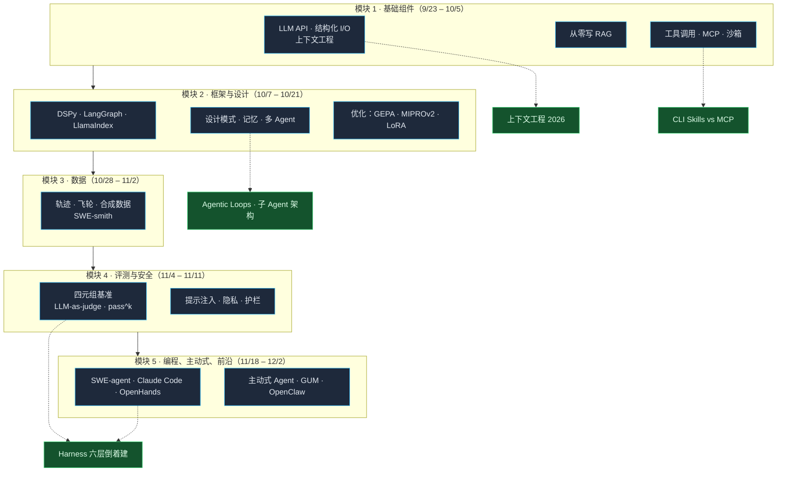
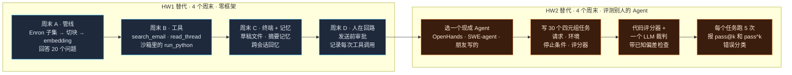

+++
date = '2026-09-04T10:00:00+08:00'
aliases = ['/posts/ai/2026-09-11-stanford-cs329z-engineering-ai-agents/', '/posts/ai/2026-09-18-stanford-cs329z-engineering-ai-agents/']
draft = false
title = '斯坦福 CS329Z Engineering AI Agents 课程拆解：没有公开录像，怎么用大纲自学'
description = '斯坦福 CS329Z（2026 秋）把 AI Agent 当工程学科教：拆解、数据、评测三大挑战。完整带日期课表、HW1/HW2 作业说明、评分表、和 CS146S 怎么二选一，以及没有公开录像时用 Claude Code 复刻作业的逐模块自学方案。'
toc = true
tags = ['Stanford CS329Z', 'AI Agent', 'DSPy', 'Course Review', 'Agentic Engineering']
keywords = ['斯坦福 cs329z', 'engineering ai agents 课程', '斯坦福 ai agent 课程', 'dspy 课程', 'ai agent 工程 课程', 'cs329z 自学', 'cs329z 课表', 'diyi yang agent 课程']

[[params.faqItems]]
question = "斯坦福 CS329Z 是什么课？"
answer = "CS329Z: Engineering AI Agents 是斯坦福 2026 秋季首次开设的 3 学分课（课程号 27855），由 Diyi Yang、Michael Ryan、John Yang 三人主讲。内容是从零构建复合 AI 系统和 Agent：RAG、工具调用、Agent 循环、DSPy 与 LangGraph、数据整理、评测体系。上课时间 2026 年 9 月 23 日到 12 月 2 日，每周一、三 13:30-14:50，Packard 101。"

[[params.faqItems]]
question = "CS329Z 有公开的课程录像吗？"
answer = "没有。截至 2026 年 9 月，课程官网写明教室后方摄像机会录制讲师授课，但录像只放在课程 Canvas 站点，仅限选课学生观看。官网公开的是每讲主题和全部 50 篇阅读材料，并注明讲义会随课程进度陆续放出。目前没有 YouTube 播放列表，也没有任何公开视频。"

[[params.faqItems]]
question = "CS329Z 的先修要求是什么？"
answer = "CS224N、CS224U、CS224V、CS336 任选其一，或同等 NLP 背景。换成工程师的语言：你得已经知道 Transformer、分词和 LLM API 是怎么回事，第一天就能用 Python 对着 chat-completion 接口写代码。这不是入门课。"

[[params.faqItems]]
question = "CS329Z 和 CS146S 该跟哪门？"
answer = "CS146S 教你用 AI 编程 Agent（Claude Code、Cursor、MCP、代码审查）把软件写得更快。CS329Z 教你造给别人用的 Agent 系统（harness、RAG、评测、优化）。你的工作是用 Agent 写代码，跟 CS146S。你的工作是把 Agent 当产品交付，跟 CS329Z。两门课大纲都公开，录像都不公开。"

[[params.faqItems]]
question = "不选课能自学 CS329Z 吗？"
answer = "大部分可以。50 篇阅读材料全是公开论文和博客，两份作业的说明在官网上写得足够具体，可以复刻成练习：HW1 是不用任何框架手写 Agent harness，HW2 是用四元组框架给一个现成 Agent 写评测集。不选课拿不到的：录像、作业用的邮件语料和预置 Agent、两次设计决策口试、嘉宾讲座和学分。"
+++

斯坦福新开的 Agent 课，第一份作业就禁用 Agent 框架。

<strong>斯坦福 CS329Z: Engineering AI Agents</strong> 的 HW1 要求学生从零搭一个公司内部 AI 助理。原话是「不用任何 Agent 框架：只有一个 chat-completion 调用，加上你自己写的代码」。

LangChain、LangGraph、DSPy、LlamaIndex 要到第六讲才登场。登场的目的写得很清楚：对比「框架帮你抽象掉了什么，和你自己从零写的有什么区别」。

这一条规则就把课的底色定了。它不是「十周学会 LangChain」，也不是 [CS146S](/posts/ai/2026-02-24-stanford-cs146s-overview/) 那种「用 Claude Code 写代码」的实践课。

它是一门工程学科课。大纲开篇就点名三个挑战：拆解（decomposition）、数据（data）、评测（evaluation）。17 场正课、两份作业、50 篇阅读，全绕着这三个挑战转。

这篇文章一半是课表拆解，另一半是我真正关心的两个问题。

录像只在 Canvas 上，光靠公开材料能学到几成？如果你已经在生产环境跑 Agent，哪几周值得花时间？

我没坐在 Packard 101 教室里，第一讲要到 2026 年 9 月 23 日才开始。凡是我在猜的地方，我都会明说。

信息来自四处：[课程官网](https://cs329z.stanford.edu/)、[斯坦福课程目录](https://bulletin.stanford.edu/courses/2283761)、三位讲师的个人主页，以及阅读材料本身。

## CS329Z 一览

| 项目 | 内容 |
|------|------|
| <strong>课程</strong> | CS 329Z: Engineering AI Agents |
| <strong>学期</strong> | 2026 秋（2026-27 学年 Autumn 1），首次开设 |
| <strong>上课时间</strong> | 周一、周三 13:30-14:50，Packard 101，9 月 23 日至 12 月 2 日 |
| <strong>学分 / 课程号</strong> | 3 学分，#27855，Letter 或 Credit/No Credit |
| <strong>讲师</strong> | [Diyi Yang](https://cs.stanford.edu/~diyiy/)（斯坦福 NLP 教授）、[Michael Ryan](https://michryan.com/)（博士生，DSPy 核心贡献者，MIPROv2 和 GEPA 作者）、[John Yang](https://john-b-yang.github.io/)（博士生，SWE-bench / SWE-agent / SWE-smith 一作） |
| <strong>先修</strong> | CS224N、CS224U、CS224V、CS336 任一，或同等 NLP 背景 |
| <strong>涉及框架</strong> | litellm、DSPy、LangChain/LangGraph、LlamaIndex、MCP |
| <strong>录像</strong> | 有录制，仅通过 Canvas 发放，不公开 |
| <strong>联系</strong> | cs329z-staff@lists.stanford.edu |

讲师阵容是这门课最强的信号。

Michael Ryan 写的正是让 DSPy 不只是「提示词包装器」的那几篇优化器论文：EMNLP 2024 的 MIPROv2，以及 ICLR 2026 收录的 [GEPA](https://arxiv.org/abs/2507.19457)。

GEPA 是一种提示词优化方法。它让模型读自己失败的样本、写出改进意见、再据此改写提示词，全程不动模型权重。

John Yang 负责另外半边。

他造了整个编程 Agent 行业都在报分数的基准 [SWE-bench](https://arxiv.org/abs/2310.06770)，造了跑这个基准的参考 Agent [SWE-agent](https://github.com/SWE-agent/SWE-agent)，还造了为它生产训练数据的引擎 [SWE-smith](https://github.com/SWE-bench/SWE-smith)。

一位管优化，一位管评测和数据。这门课就是这两件事拼起来的。

## 为什么关键词是"Engineering"

课程简介开篇用的是 Zaharia 等人的[复合 AI 系统](https://bair.berkeley.edu/blog/2024/02/18/compound-ai-systems/)框架。

值得研究的单元不再是一个模型，而是模型、检索器、工具、优化器组成的系统。

接着它列出学生要学会的事：「挑选值得做的问题、拆解问题、选择组件、收集和整理数据、搭建评测、权衡设计取舍。」

注意这个列表里少了提示词工程。它在第二讲里占一个要点，然后就消失了。

2025 年的大多数 Agent 课程里，提示词套路能占半个大纲。

评分结构印证了这个取向。一半分数是贯穿整个学期的小组项目，主题是「用 Agent 让斯坦福生活更好」。20% 是两份作业，15% 是两次十分钟口试。

口试考的是你自己作业里的设计决策和取舍。没有任何一场考试考讲课内容。

你不可能靠记住 Packard 101 里讲了什么来通过 CS329Z。反过来说，这也是没有录像的损失比你想的小的原因。

| 组成 | 权重 | 实际考什么 |
|------|------|-----------|
| 项目（开题 5、中期报告 5、中期 demo 7、终稿 15、最终 demo 18） | 50% | 十周内能不能把一个能跑的 Agent 从立项做到交付 |
| HW1：搭建 Agentic Harness | 10% | 不用框架，能不能写出工具、记忆、终端和人工介入 |
| HW2：评测一个 Agent | 10% | 能不能写代码评分器、LLM 裁判和四元组基准任务 |
| 作业口试（2 × 7.5%） | 15% | 闭卷，能不能为自己的设计取舍辩护 |
| 论文视频（7%）+ 3 份同行评审（3%） | 10% | 能不能批判一篇近期 Agent 论文并加点自己的东西（复现、小实验） |
| 课堂参与 | 5% | 讨论、团队协作、习题课 |

我预计很多人会犯一个错误：把这门课当成「先修更难的 CS146S」。不是。

CS146S 讲的是<strong>开发者实践</strong>，用 Claude Code、Cursor、MCP server、代码审查把软件写得更快。它 2026 秋从 9 月 22 日起周二、四上课，我写过一份[跟课方案](/posts/ai/2026-09-11-cs146s-fall-2026-follow-along/)。

CS329Z 讲的是<strong>造出 Agent 本身</strong>，交给别人用。

先修要求说的是同一件事：CS146S 要 CS111 水平的编程，CS329Z 要 CS224N。

| | CS146S：The Modern Software Developer | CS329Z：Engineering AI Agents |
|---|---|---|
| 回答的问题 | 怎么用 Agent 把软件交付提速 10 倍？ | 怎么造一个真正能用的 Agent 系统？ |
| 工作单元 | 你的代码库、你的 PR | Harness、RAG 管线、评测集 |
| 涉及工具 | Claude Code、Cursor、Warp、MCP | litellm、DSPy、LangGraph、LlamaIndex、MCP |
| 第一份作业 | 提示词实验台（2025）/ 200 行 Agent（2026） | 不用框架的完整 harness |
| 评测内容 | 一周代码审查 | 三讲加一整份作业 |
| 先修 | CS111 | CS224N / CS336 |
| 录像 | 不公开 | 不公开（仅 Canvas） |
| 适合谁 | 用 Agent 写代码的工程师 | 把 Agent 当产品交付的工程师 |

如果你是一线开发，接触 Agent 的方式就是 Claude Code 和 Cursor，先跟 CS146S。

如果你在公司负责某个「AI 助理」功能，最近三次事故都是 Agent 干了件看似合理其实错误的事，那 CS329Z 才是你要的。

## 2026 秋季完整课表

9 月 23 日到 12 月 2 日共 21 个课时：17 场正课、2 场嘉宾讲座（人选待定）、感恩节停课 2 天。

官网标注课表「暂定、可能调整」，下表是 2026 年 9 月 4 日的版本。

表里列的是必读材料。每讲还配有「补充阅读」，共 27 篇，我折进了后面的自学替代表。

| 周 | 日期 | 讲题 | 必读 |
|----|------|------|------|
| 1 | 9/23 周三 | 导论：什么是 Agentic 系统？从单体模型到复合系统再到 Agent；三大挑战（拆解、数据、评测） | Zaharia 等，Compound AI Systems（BAIR 2024） |
| 2 | 9/28 周一 | 面向构建者的 LLM：API 与 SDK（litellm）、结构化输入输出与约束生成、解码策略与推理时算力、上下文工程、选模、成本/延迟权衡 | Anthropic，Building Effective Agents |
| 2 | 9/30 周三 | RAG：grounding 与幻觉、embedding 与向量库、切块策略、混合检索、cross-encoder 与 ColBERT。动手：从零写 RAG 管线 | Lewis 等，RAG（NeurIPS 2020） |
| 3 | 10/5 周一 | 工具调用与 function calling：REPL、function-calling API、MCP、如何设计好的工具、代码执行沙箱、错误处理与重试。动手：从零写工具调用系统 | MCP 规范（2025-06-18） |
| 3 | 10/7 周三 | 框架与编排：DSPy（signature、module、optimizer）、LangChain/LangGraph、LlamaIndex；框架抽象了什么 vs 你手写了什么；抽象层次怎么选 | Khattab 等，DSPy（ICLR 2024） |
| 4 | 10/12 周一 | Agent 设计模式与脚手架：workflow vs agent 的分类、五种可组合 workflow 模式、ReAct、plan-and-execute、reflection；脚手架即设计决策 | Yao 等，ReAct（ICLR 2023） |
| 4 | 10/14 周三 | Agent 记忆架构：短期 vs 长期、记忆即工具动作、文件系统作外置记忆、结构化记忆、跨 Agent 记忆 | Packer 等，MemGPT（2023） |
| 5 | 10/19 周一 | 多 Agent 系统：单 vs 多、编排模式、交接与状态传递、委派与协作、协调难题与错误传播 | Wu 等，AutoGen（COLM 2024） |
| 5 | 10/21 周三 | 优化：从提示词到微调的全谱；提示词优化（GEPA、MIPROv2、OPRO、TextGrad）、推理时算力扩展、LoRA/QLoRA、蒸馏、RLHF/DPO 概览；什么时候优化提示词、权重还是推理算力 | Snell 等，Scaling Test-Time Compute；Agrawal 等，GEPA |
| 6 | 10/26 周一 | 嘉宾讲座（待定） | |
| 6 | 10/28 周三 | Agent 需要什么数据？轨迹、示范、反馈；优化用数据 vs 评测用数据；数据飞轮；合成数据；从人机交互中收集数据 | Shankar，Data Flywheels for LLM Applications |
| 7 | 11/2 周一 | 数据选择与质量：找信息量最大的数据、过滤与筛选、小而准的基准、标注实践、从 Agent 轨迹构建数据集 | Yang 等，SWE-smith；Shankar 等，Who Validates the Validators? |
| 7 | 11/4 周三 | 评测基础与基准设计：评测为什么难、四元组框架（请求、环境、停止条件、评分器）、好基准的性质、真实脚手架、可靠性维度 | Zhu 等，Rigorous Agentic Benchmarks |
| 8 | 11/9 周一 | LLM-as-judge 与评测基础设施：三类评分器、裁判提示词设计、已知偏差、成对 vs 单点、非确定性指标（pass@k vs pass^k）、harness 设计、Anthropic 八步路线图 | Anthropic，Demystifying Evals for AI Agents；Zheng 等，MT-Bench；Ryan 等，AutoMetrics |
| 8 | 11/11 周三 | Agent 安全与护栏：工具访问的隐私风险、提示注入（含间接注入）、红队、沙箱与权限模型、输出护栏、责任问题、人在回路 | Shao 等，PrivacyLens；Zhang & Yang，Privacy Risks via Simulation；Li，Agentic LLMs as Deanonymizers |
| 9 | 11/16 周一 | 嘉宾讲座（待定） | |
| 9 | 11/18 周三 | 编程与软件 Agent：端到端原理；SWE-agent、Claude Code、OpenHands 架构对比；脚手架即设计决策；SWE-bench 与四元组框架的实践 | Yang 等，SWE-agent；Wang 等，OpenHands |
| 10 | 11/23、11/25 | 感恩节停课 | |
| 11 | 11/30 周一 | 主动式 Agent：从被动到主动、通用用户模型（GUM）、下一步动作预测、开源主动式个人 Agent、混合主动权 | Shaikh 等，General User Models（UIST 2025） |
| 11 | 12/2 周三 | 前沿与开放问题：多模态、Web 与 computer-use Agent、科研 Agent、长时运行架构、可观测性与成本、可靠性 | （仅补充阅读：OSWorld、WebShop） |
| 期末周 | 12/7-11 | 项目 Demo Day | |

截止日期均为太平洋时间。HW1 于 10 月 5 日发布、10 月 30 日截止，HW2 于 10 月 26 日发布、11 月 20 日截止。

项目开题 10 月 9 日，中期 demo 11 月 4 日课上进行，中期报告 11 月 6 日，论文视频 11 月 13 日，同行评审 11 月 30 日。终稿与最终 demo 在期末周。

课表里有两处值得盯一眼。

第一，「从零手写」的两场动手课排在框架课<strong>之前</strong>。9 月 30 日讲 RAG，10 月 5 日讲工具，框架课是 10 月 7 日，HW1 也在工具课当天发布。课程要你先把手弄脏，再给你抽象。

第二，17 场正课里有 5 场讲数据、优化和评测，分别是 10/21、10/28、11/2、11/4、11/9。将近 30% 的内容，是大多数 Agent 教程直接跳过的部分。

## 五大模块，以及本站已有的对应文章

官网把课表分成十个小节，我压成五个模块，因为依赖关系实际上是这么走的。

模块一、二是你造什么。模块三、四是怎么把它做好、怎么证明它好。模块五是这个领域往哪走。

图里的虚线是老实话。本站在模块一、二、五上写过不少，基本都是从编程 Agent 的角度。

存货是这四篇：[上下文工程](/posts/ai/2026-06-16-context-engineering-2026/)、[Agentic Loops](/posts/ai/2026-07-03-agentic-loops/)、[子 Agent 架构](/posts/ai/2026-04-13-harness-subagent-architecture/)、[Harness 六层](/posts/ai/2026-04-18-harness-six-layers-reverse-build/)。

模块三的数据我几乎一片空白。模块四的评测，只当作 harness 的一层写过。

这个缺口也是整个行业的缩影：人人都写循环，没几个人写飞轮。

国内读者还有一个实际困难：DSPy 和 LangGraph 的中文资料都很薄。

LangGraph 好歹有零散的中文教程。DSPy 的中文内容基本停留在「什么是 signature」的入门层，MIPROv2 和 GEPA 所在的 optimizer 那一层，几乎只有英文论文和官方文档。

这门课恰恰是 DSPy 优化器作者亲自讲。所以模块二的自学，英文文档绕不开。

## 两份作业才是这门课的正文

不选课只带走一样东西的话，带走作业序列。官网对两份作业的描述足够具体，可以复刻。

两份合在一起，才是这门课真正的论点：先赤手空拳造 harness，然后发现你根本判断不了它到底行不行。

<strong>HW1：搭建 Agentic Harness（第 3-6 周，10/5 发布，10/30 截止）。</strong>

官网原话：「从零搭一个公司内部 AI 助理，不用任何 Agent 框架：只有一个 chat-completion 调用，加上你自己写的代码。先做能在真实企业邮件档案上检索和推理的 LLM 管线，再逐步长成带工具、终端、记忆和人工介入的完整 harness。」

agentic harness 指的是套在模型外面的那层工程代码：循环、工具分发、记忆、终端、人工审批，模型本身之外的部分全算。

官网没说是哪份邮件档案。我猜是 Enron 语料。它是唯一大规模、公开、真实的企业邮件数据集，而且里面乱糟糟的邮件线程正好让检索变得有意思。

<strong>HW2：评测一个 Agent（第 6-9 周，10/26 发布，11/20 截止）。</strong>

官网原话：「给定一个预置好的 Agent，设计一套完整评测：代码评分器、至少一个 LLM-as-judge 评测、用四元组框架（请求、环境、停止条件、评分器）构建的基准任务，以及错误分析。」

LLM-as-judge 就是让另一个模型来打分。把待评的回答连同评分标准一起喂给它，由它给出分数或者判定优劣。

再看一遍顺序。学生花四周搭自己的 harness，再花四周去评测<strong>另一个</strong>预置 Agent，不是自己那个。

这是刻意安排。它防止你写出讨好自己设计的评测，也逼你把四元组的纪律套到一个你没造过、也没法偷偷打补丁的系统上。

每份作业之后的口试是闭卷的，要你解释取舍。「我照着教程抄的模式」这种回答活不过第一个追问。

下面是我把两份作业复刻成练习的方案。用 Claude Code 或 Codex 当结对搭档，不依赖任何课程基础设施。

两条规则决定这套替代方案值不值得做。

第一条，HW1 的零框架约束就是练习本身。第一个周末就 `pip install langgraph`，等于把课跳过了。可以让编程 Agent 写样板代码，但循环、工具分发、记忆策略必须你自己写。

第二条，HW2 要用一个不是你写的 Agent。[OpenHands](https://github.com/OpenHands/OpenHands) 和 [SWE-agent](https://github.com/SWE-agent/SWE-agent) 都开源、都可配置，作者也都是这门课阅读材料的作者。

11 月 9 日那讲里的 `pass^k` 指标，我想单独提醒所有交付过 Agent 的人。

`pass@k` 问的是 k 次运行里<strong>有没有一次</strong>成功。`pass^k` 问的是 k 次运行是<strong>不是全部</strong>成功。

做 demo，前者重要。做一个在客户数据上无人值守跑的 Agent，只有后者算数。

而且 `pass^k` 掉得很快。单个任务 80% 的成功率，pass^5 只剩 33% 左右。光这一个视角的转换，就比大多数 Agent 教程值钱。

## 逐模块的自学替代方案

大纲里每一篇阅读材料都公开。讲义「会随课程发布陆续链接到官网」，可能兑现也可能不兑现。CS146S 2025 秋的幻灯片最终确实公开了，所以有希望。

在讲义放出之前，下面是每个模块的替代方案，偏向「能跑起来的」而不是「能读的」。

| 模块 | 替代讲课的阅读 | 替代课堂的动手 | 搭配阅读的本站文章 |
|------|--------------|--------------|-----------------|
| 1. 基础组件（9/23-10/5） | [Compound AI Systems](https://bair.berkeley.edu/blog/2024/02/18/compound-ai-systems/)；[Building Effective Agents](https://www.anthropic.com/engineering/building-effective-agents)；Lewis 的 RAG 论文和 ColBERT；[MCP 规范](https://modelcontextprotocol.io/specification/2025-06-18) | 用裸 [litellm](https://docs.litellm.ai/docs/) 调用写一个 RAG 管线和一个工具调用循环。不上向量数据库服务，一个 numpy 矩阵加余弦相似度就足够学到所有失败模式 | [上下文工程 2026](/posts/ai/2026-06-16-context-engineering-2026/)、[CLI Skills vs MCP](/posts/ai/2026-07-04-cli-skills-vs-mcp/) |
| 2. 框架与设计（10/7-21） | [DSPy 文档](https://dspy.ai/)的 signature、module、[optimizer](https://dspy.ai/learn/optimization/optimizers/) 三章；[LangGraph 文档](https://langchain-ai.github.io/langgraph/)；ReAct、MemGPT、AutoGen 论文；[Why Do Multi-Agent LLM Systems Fail?](https://arxiv.org/abs/2503.13657)；Neubig 的 [Don't Sleep on Single-Agent Systems](https://openhands.dev/blog/dont-sleep-on-single-agent-systems) | 把 HW1 的 harness 移植到 DSPy，再移植到 LangGraph，写下每个框架从你手里拿走了什么。然后在一个 module 上跑 `dspy.GEPA` 或 MIPROv2，在 50 条的 dev set 上量增量 | [Agentic Loops](/posts/ai/2026-07-03-agentic-loops/)、[子 Agent 架构](/posts/ai/2026-04-13-harness-subagent-architecture/) |
| 3. 数据（10/28-11/2） | Shankar 的 [Data Flywheels](https://www.sh-reya.com/blog/ai-engineering-flywheel/)；[SWE-smith](https://arxiv.org/abs/2504.21798)；Who Validates the Validators；LIMA | 记录 HW1 Agent 的每一条轨迹。从轨迹里构建 100 条的数据集，再从中挑出 20 条「小而准」的子集，验证它能预测全集分数 | （空白，见上文） |
| 4. 评测与安全（11/4-11） | [Demystifying Evals for AI Agents](https://www.anthropic.com/engineering/demystifying-evals-for-ai-agents)；[Rigorous Agentic Benchmarks](https://arxiv.org/abs/2507.02825)；MT-Bench；[AutoMetrics](https://arxiv.org/abs/2512.17267)；OpenAI 的[提示注入](https://openai.com/index/prompt-injections/)；PrivacyLens | 上面的 HW2 替代方案。然后在你的邮件语料里埋一条间接提示注入，看 HW1 的 Agent 会不会上钩 | [Harness 六层倒着建](/posts/ai/2026-04-18-harness-six-layers-reverse-build/)（第 5、6 层） |
| 5. 编程、主动式、前沿（11/18-12/2） | [SWE-agent](https://arxiv.org/abs/2405.15793) 和 [OpenHands](https://arxiv.org/abs/2407.16741) 论文；Anthropic 的 [Effective Harnesses for Long-Running Agents](https://www.anthropic.com/engineering/effective-harnesses-for-long-running-agents)；General User Models；[OpenClaw](https://github.com/openclaw/openclaw) | 用两套不同脚手架（换工具集或系统提示词，模型不变）在 10 个 SWE-bench Lite 任务上跑 SWE-agent，报告脚手架带来的差异 | [Harness 六层倒着建](/posts/ai/2026-04-18-harness-six-layers-reverse-build/)、[Agentic Loops](/posts/ai/2026-07-03-agentic-loops/) |

模块二要单独提醒一句，自学者最容易在这里耗时间。

DSPy 文档写得不错，但它是按「导览」组织的，不是按「课程」。10 月 7 日那讲能给选课学生的东西是<strong>对比</strong>：DSPy 的 signature/module/optimizer，对上 LangGraph 的节点图，再对上 LlamaIndex 的数据优先视角。

没有这层对比，你往往只学会一个框架的词汇表，然后把词汇表误认成概念本身。

解法就是表里那道练习：同一个 harness 移植到两个框架，用文字写出差异。文字才是交付物。

想看这个秋季所有免费 Agent 课程的全景，包括 CMU 同期开的那门，见 [2026 秋季免费 AI Agent 课程汇总](/posts/ai/2026-09-09-free-ai-agent-courses-fall-2026/)和 [CMU 11-768 课程拆解](/posts/ai/2026-09-08-cmu-11-768-ai-agents-course/)。

## 对本站读者最值钱的一周

如果你已经在生产环境跑编程 Agent，最显眼的选择是 11 月 18 日的编程 Agent 那讲。SWE-agent 的作者亲自讲，把 Claude Code 和 OpenHands 的架构并排拆开。

这会是整个学期最有意思的一课，但不是对你最有价值的一课。SWE-agent 论文、Claude Code 最佳实践、本站的 harness 系列，你多半都读过，何况也没有录像。

最值钱的是评测那两周：11 月 4 日、11 月 9 日，加上 HW2 的作业说明。

理由是我自己的收据。写[六层文章](/posts/ai/2026-04-18-harness-six-layers-reverse-build/)时，我在生产环境跟踪了一个 harness 60 天。

决定稳定性的是评测层和恢复层，不是循环本身。而评测层恰恰是我最后建、也建得最差的一层。

这是普遍模式：团队一周搭好循环，一个月调提示词，然后带着一个自己都不敢押钱的基准上线。

CS329Z 用三讲加一整份作业专攻评测。四元组框架（请求、环境、停止条件、评分器）明天就能套到任何 Agent 上，不需要斯坦福账号。

第二名给 10 月 21 日的优化课，受众窄一些。

如果你的团队正在微调，理由是「提示词调到头了」，先去看那一讲的阅读材料。GEPA 论文报告的结果是：靠反思式的提示词进化，rollout 最多能少用 35 倍，成绩还赢过 GRPO。

这个结论在你的任务上成不成立，一个下午就能试出来，`dspy.GEPA` 加你自己的 dev set 即可。而这个下午可能砍掉一个微调项目。

## 不选课拿不到的东西

自学能拿到阅读材料、主题清单和两份可复刻的作业。拿不到下面这些，我宁可列清楚，也不假装替代方案等价。

- <strong>录像。</strong>摄像机拍讲师，视频进 Canvas。没选课就是没视频，没有商量余地。Stanford Online 上确实有 [CS329Z](https://online.stanford.edu/courses/cs329z-engineering-ai-agents) 的条目。对其他 CS 课来说，这意味着可以非学位（non-degree）选修，公布的费率是每学分 1,575 美元、最少 3 学分，合计约 4,725 美元，外加 250 美元档案费。那个页面我没打开过，所以掏钱前先确认非学位选项确实开放。
- <strong>作业基础设施。</strong>邮件档案、HW2 用的预置 Agent、自动评分器、以及他们可能发的起步 harness。我上面的替代方案是从作业说明反推的重建，不是真题。
- <strong>口试。</strong>15% 的分数是闭卷十分钟、为自己设计决策辩护。这是整门课最好的一道倒逼机制，课外不存在，除非你拉个同事来盘问你。
- <strong>两场嘉宾讲座</strong>（10 月 26 日、11 月 16 日，人选待定）。CS146S 的嘉宾名单是一大卖点，CS329Z 目前还没公布任何人。
- <strong>Michael Ryan 和 John Yang 对你评测集和优化器实验的反馈。</strong>这是我愿意付钱买的东西。
- <strong>Demo Day 和一支队伍。</strong>「用 Agent 让斯坦福生活更好」是小组项目，有开题、中期报告和期末周 demo。一个人能造出系统，但造不出截止日期和观众。
- <strong>学分。</strong>3 学分，Letter 或 Credit/No Credit，不可重修。

## 结论

CS329Z 是斯坦福第一门把 Agent 当工程学科、而不是当开发者技能来教的课。证据是它的考法：考设计决策和评测，不考讲课内容。

你造 Agent 给别人用，跟 CS329Z。你用 Agent 给别人造东西，跟 CS146S。

如果你还没对着裸 API 写过一个工具调用循环，两门都先别跟，因为两门课都默认你写过。

没有录像，CS329Z 有用的部分大约七成可得：50 篇公开阅读，加两份具体到可以重建的作业说明。

用零框架做完 HW1，再拿一个不是你写的 Agent 做完 HW2，你就覆盖了这门课里行业最需要、也最少有人教的那部分。

讲义放出或嘉宾公布时，我会更新这一页。

## 延伸阅读

- [斯坦福 CS146S：The Modern Software Developer 2026 指南](/posts/ai/2026-02-24-stanford-cs146s-overview/)：开发者实践路线的姊妹课，完整拆解
- [斯坦福 CS146S 2026 秋季开课了：不注册怎么免费跟课](/posts/ai/2026-09-11-cs146s-fall-2026-follow-along/)：今秋另一门斯坦福课的课表和跟课方案
- [2026 秋季免费 AI Agent 课程汇总](/posts/ai/2026-09-09-free-ai-agent-courses-fall-2026/)：本学期所有公开 Agent 课程大纲的对比枢纽页
- [CMU 11-768 AI Agent 课程拆解](/posts/ai/2026-09-08-cmu-11-768-ai-agents-course/)：CMU 的对应课程，以及它和 CS329Z 的差别
- [Harness 六层架构倒着建](/posts/ai/2026-04-18-harness-six-layers-reverse-build/)：为什么评测和恢复才是关键的两层，附生产数据
- [上下文工程 2026](/posts/ai/2026-06-16-context-engineering-2026/)：第二讲的主题，深挖版
- [Agentic Loops 2026](/posts/ai/2026-07-03-agentic-loops/)：HW1 逼你手写的那个 ReAct 式循环
