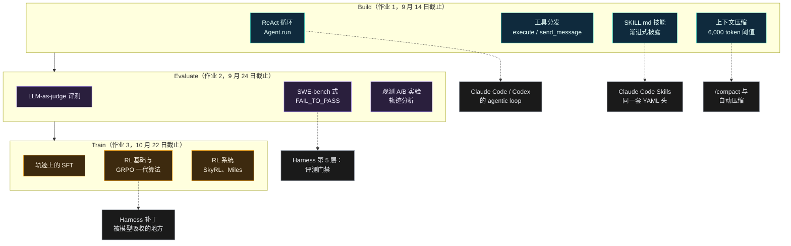
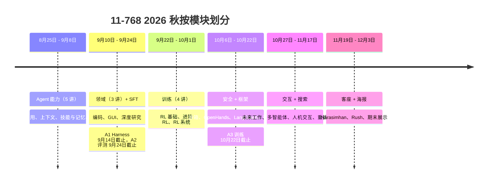

+++
date = '2026-09-08T10:00:00+08:00'
aliases = ['/posts/ai/2026-09-11-cmu-11-768-ai-agents-course/', '/posts/ai/2026-09-16-cmu-11-768-ai-agents-course/']
draft = false
title = 'CMU 11-768 AI Agents 课程拆解：OpenHands 作者教你搭 Harness、建评测、RL 训 Agent'
description = 'CMU 11-768 AI Agents 2026 秋季课全拆解：Graham Neubig 与 Daniel Fried 的 28 节课表、三份作业（Harness/评测/RL 训练）、评分、免费视频和 PPT 怎么拿、国内怎么跟、和 CS146S 怎么选。'
toc = true
tags = ['AI Agent', 'CMU 11-768', 'Course Review', 'Harness Engineering', 'OpenHands']
keywords = ['cmu ai agents 课程', '11-768', 'graham neubig 课程', 'ai agent 公开课', 'openhands 课程', 'cmu 11-768 ai agents', 'ai agent 课程 免费', 'agent 强化学习 课程']

[[params.faqItems]]
question = "CMU 11-768 AI Agents 是什么课？"
answer = "11-768 是卡内基梅隆大学语言技术研究所 2026 年秋季新开的研究生课，由 OpenHands 作者 Graham Neubig 和 Daniel Fried 主讲。2026 年 8 月 25 日到 12 月 3 日，每周二、四上课共 28 次，三份个人作业分别是搭 Harness、建评测、用 RL 训练 Agent，后半学期做小组研究项目。"

[[params.faqItems]]
question = "11-768 的课程视频和 PPT 在哪里免费看？"
answer = "PPT 是 cmu-agents.com 上的直链 PDF，不用登录；视频在 Graham Neubig 的 YouTube 播放列表，截至 2026 年 9 月 8 日有 4 节，需要能访问 YouTube。Piazza、Canvas、赞助算力和作业 2、3 只对在校生开放。"

[[params.faqItems]]
question = "11-768 是不是一门 OpenHands 教程？"
answer = "不是。OpenHands 只占 10 月 8 日一节课，下一节就是 LangGraph。作业 1 让你用 DeepSeek-V4-Flash 和 Modal 沙箱从零写一个 ReAct 风格的 Harness，参考资料里 mini-SWE-agent、Hermes Agent、Codex、OpenCode 和 Claude Code 跟 OpenHands 平起平坐。"

[[params.faqItems]]
question = "CMU 11-768 和斯坦福 CS146S 该选哪个？"
answer = "CS146S 教你把编码 Agent 用好，11-768 教你把 Agent 造出来、评出来、训出来。如果你的日常是配置 Claude Code 或 Cursor，先看 CS146S；如果你做 Agent 产品或想搞懂 Agent 的强化学习，11-768 是目前唯一一门把这条链讲全的公开课。"

[[params.faqItems]]
question = "跟 11-768 需要什么基础？"
answer = "官方要求有训练神经语言模型的经验，推荐修过 11-667、11-711、10-202 或等价课程。Neubig 在第一课说，工业界经验也算，但得是真训过 4B 到 7B 级别的模型，不是一亿参数的玩具。"
+++

第一课的下半场讲了十分钟，Graham Neubig 朝教室抛了一个我今年写了半年的问题。让 Agent 变强有两条路，他说：训模型，或者在模型外面做 Harness。举手表决，哪条更重要？训模型的举了几只手，Harness 举了一大片。Daniel Fried 举了两次，被当场提醒讲师没有投票权。

然后 Neubig 给了自己的答案。截至 2026 年 9 月 8 日，**CMU 11-768 AI Agents** 一共放出四个半小时视频，这句是最值钱的："通常的流程是，你发现一个问题，先在 Harness 里把它解掉。然后训模型的人跟上来……你就不用再在 Harness 这边解它了。"他本人更认训练是根本解法，前提是你付得起。你通常付不起，所以从 Harness 开始。

这一段对话就把这门课定了性。斯坦福的 CS146S 是本站阅读量最高的课程页，它教你把 Agent *用*好。11-768 是供给侧：Harness、评测、RL 训出来的策略是怎么造的，讲课的是 OpenHands 的作者，搭档的研究组做人机交互。目前没有第二门公开的大学课程把搭脚手架、设计评测、Agent 强化学习放进同一份大纲。这篇把 28 次课、三份作业和"它到底适合谁"全部拆开。

## CMU 11-768 到底是什么

官网 [cmu-agents.com](https://www.cmu-agents.com/) 是个 React 单页应用，直接抓页面只有一个标题。下表所有事实来自 9 月 8 日从站点 JavaScript 包里扒出来的课表数据、[作业 1 仓库](https://github.com/cmu-agents/assignment-1)和[第一课录像](https://www.youtube.com/watch?v=UwfjzyLnvMg)。没核实到的几条我放在文末。

| 项目 | 内容 |
|---|---|
| **课程** | 11-768 AI Agents，卡内基梅隆大学语言技术研究所（LTI） |
| **学期** | 2026 秋，8 月 25 日到 12 月 3 日；周二、四美东 15:30 到 16:50，Porter Hall 100 |
| **讲师** | [Graham Neubig](https://www.phontron.com/)（OpenHands 作者）、[Daniel Fried](https://dpfried.github.io/) |
| **助教** | Aditya Soni、Andy Liu、Apurva Gandhi、Demi Wang、Jiarui Liu、Yueqi Song |
| **课次** | 排了 28 次（22 节正课含 6 个客座位、2 天项目时间、2 天海报、2 天假期） |
| **先修** | "有训练神经语言模型的经验"；推荐 11-667 / 11-711 / 10-202 |
| **作业** | A1 Harness（9 月 14 日截止）、A2 评测（9 月 24 日）、A3 训练（10 月 22 日），之后是小组研究项目 |
| **算力赞助** | Fireworks、Modal、Prime Intellect、Sail |
| **公开材料** | 第 1 到 6 讲 PPT，第 1 到 4 讲 YouTube 录像，作业 1 起始代码 |

一句话定位是 Neubig 自己在[发布推文](https://x.com/gneubig/status/2072730570304430183)里写的："学会搭一个脚手架、建评测、用 RL 训练一个 agentic LLM。"官网列的学习目标是：在开源 LLM 上从零实现一个 Agent，为多步任务设计评测，训练 Agent 提升能力，权衡安全与可靠性，并推进一个开放的 Agent 研究问题。

拿这份清单对着 CS146S 的大纲看，差距一目了然。CS146S 完全不碰训练，也从不让你写循环。11-768 第三周就让你写循环。

## Build、Evaluate、Train：这门课的脊柱

Fried 在第一课把结构讲得很直白：前半学期三项技能，搭 Harness、评测它、用 RL 训它；后半学期用这三项技能做小组项目。讲课顺序是先讲 Agent 能力，再讲领域（编码、GUI、深度研究），再讲 SFT 和 RL，再讲框架和安全，再讲交互，最后是客座讲座。

这条脊柱怎么对到本站已经写过的工具和概念，是 Claude Code、Codex 重度用户该关心一门研究生 NLP 课的全部理由。

虚线才是重点。作业 1 左边每一个框，都是你在商业编码 Agent 里配置过的东西：hooks、skills、压缩阈值、工具报错处理。这门课让你把每一个亲手造出来，再量一下哪里会坏。这就是我在[Harness 六层倒着建](/posts/ai/2026-04-18-harness-six-layers-reverse-build/)里写的 Harness 工程，只是多了个打分的人。

右边则是 Neubig 那句"先 Harness、训练随后跟上"落地的地方。我在 [Harness 工程是窗口期不是护城河](/posts/ai/2026-05-08-harness-engineering-window-of-opportunity/)里论证过，Harness 的优势是 2026 到 2027 的窗口，不是永久壁垒。第一课就是 OpenHands 作者对着一屋子博士生说同样的话，然后用作业 3 教他们怎么把窗口关上。

## 2026 秋季完整课表（28 次）

先看模块级的全貌：

每一行都来自站点的课表数据。视频链接是截至 9 月 8 日 [YouTube 播放列表](https://www.youtube.com/playlist?list=PLSN0qpDfUvTM)里存在的四个录像；PPT 是 cmu-agents.com 上的直链 PDF（第 5 讲 18 MB，别用流量开）。没标讲者的就是 Neubig 或 Fried。

| 日期 | # | 标题 | 讲者 | 材料 |
|---|---|---|---|---|
| 8月25日 周二 | 1 | Course Overview: What Is an Agent? | Fried + Neubig | [PPT](https://www.cmu-agents.com/slides/lecture-01-agents.pdf) · [视频](https://www.youtube.com/watch?v=UwfjzyLnvMg) |
| 8月27日 周四 | 2 | Agent Capabilities 1: Tool Use | Neubig | [PPT](https://www.cmu-agents.com/slides/lecture-02-tool-use.pdf) · [视频](https://www.youtube.com/watch?v=jXChFB4JSyw) |
| 9月1日 周二 | 3 | Agent Capabilities 2: Context Management for Long-Context Agents | Neubig | [PPT](https://www.cmu-agents.com/slides/lecture-03-long-context.pdf) · [视频](https://www.youtube.com/watch?v=AiwCCvFW1uE) |
| 9月3日 周四 | 4 | Agent Capabilities 3: Skills and Memory | Fried | [PPT](https://www.cmu-agents.com/slides/lecture-04-memory-and-skills.pdf) · [视频](https://www.youtube.com/watch?v=6zigF2a-2Pw) |
| 9月8日 周二 | 5 | Agent Capabilities 4: Planning, Task Decomposition, and Multi-Agent Coordination | | [PPT](https://www.cmu-agents.com/slides/lecture-05-planning.pdf) |
| 9月10日 周四 | 6 | Domains 1: Coding Agents | | [PPT](https://www.cmu-agents.com/slides/lecture-06-coding-agents.pdf) · A1 9月14日截止 |
| 9月15日 周二 | 7 | Domains 2: GUI Agents | JY Koh | |
| 9月17日 周四 | 8 | Training 1: Supervised Fine-Tuning (SFT) | Yueqi Song | |
| 9月22日 周二 | 9 | Training 2: Reinforcement Learning Basics | | |
| 9月24日 周四 | 10 | Domains 3: Deep Research Agents | Akari Asai | A2 截止 |
| 9月29日 周二 | 11 | Training 3: Advanced RL Algorithms | | |
| 10月1日 周四 | 12 | Training 4: RL Systems | Apurva Gandhi | |
| 10月6日 周二 | 13 | Safety 1: Sandboxing and Credential Management | | |
| 10月8日 周四 | 14 | Frameworks 1: OpenHands | | |
| 10月13、15日 | | 秋假，停课 | | |
| 10月20日 周二 | 15 | Frameworks 2: LangGraph | | |
| 10月22日 周四 | 16 | Safety 2: Observability and Monitoring | Eric Wallace | A3 截止 |
| 10月27日 周二 | 17 | Agents and the Future of Work | Zora Wang | |
| 10月29日 周四 | 18 | Interaction 1: Multi-Agent Interaction | Saujas Vaduguru | |
| 11月3、5日 | | 项目时间 | | |
| 11月10日 周二 | 19 | Interaction 2: Human-Agent Interaction | Valerie Chen | |
| 11月12日 周四 | 20 | Search 1: Reranking and Critic Models | | |
| 11月17日 周二 | 21 | Search 2: Tree Search | JY Koh | |
| 11月19日 周四 | 22 | 客座讲座 | Karthik Narasimhan（普林斯顿） | |
| 11月24日 周二 | 23 | 客座讲座 | Sasha Rush | |
| 11月26日 周四 | | 感恩节，停课 | | |
| 12月1、3日 | | 期末海报展示 | | |

这张表里有两件事比标题本身重要。

**参考文献才是真正的大纲。** 第 2 讲一节课挂了 26 条参考，而且不是综述：[MCP 2026-07-28 规范发布](https://blog.modelcontextprotocol.io/posts/2026-07-28/)、Qwen3.8 的工具调用 chat template、DeepSeek V3.2 的工具调用编码脚本、OpenHands 的 ToolDefinition 源码、FastMCP 的 bearer token 鉴权。第 3 讲 44 条，把 DeepSeek、智谱 Z.AI、Kimi、OpenAI、Anthropic 的 KV cache 定价页并排放着，还把 Codex、OpenCode、Pi、Hermes Agent、OpenHands 的源码当作生产级 Agent 管理上下文的案例。第 4 讲把 Hermes Agent 的 `prompt_builder.py` 和 `skills_tool.py` 跟 SkillsBench、"Not All Skills Help" 两篇论文放在一起。只看视频，你会漏掉这门课大半的内容。

顺带一句国内读者会在意的：这份参考文献里中国模型的密度高得惊人。Qwen3.8-Flash-Next、GLM-5、GLM-5.3-Flash、Kimi K3、Kimi Linear、DeepSeek Sparse Attention、DeepSeek V4 全在第 3 讲的列表里，作业 1 的默认模型干脆就是 DeepSeek-V4-Flash。这是一门在匹兹堡讲、拿国产开源模型当教具的课。

**客座名单是研究者，不是厂商。** CS146S 请的是 Claude Code 的作者、Warp 的 CEO、a16z 的合伙人。11-768 的外部声音是 Karthik Narasimhan（SWE-bench 和 SWE-agent 出自他的组）、Sasha Rush、Eric Wallace、Akari Asai。两门课面向的人完全不同，下面会说怎么选。

## 作业 1 拆开看：把你一直在配置的东西亲手造一遍

这是这门课对实践者最值钱的部分，所以篇幅给得最多。

[cmu-agents/assignment-1](https://github.com/cmu-agents/assignment-1) 8 月 31 日公开，到 9 月 8 日有 30 星、23 fork。它是个 `uv` 工程，带 Makefile、一个内置的国际象棋 Web 应用，`ASSIGNMENT.md` 里写着 100 分的评分细则。默认模型是走 OpenAI 兼容接口的 `deepseek/deepseek-v4-flash-0731`，每次工具调用都在 [Modal](https://modal.com/) 沙箱里跑。起始代码的测试是故意失败的，你负责填 TODO。我 9 月 8 日克隆下来跑了 `make setup`（uv sync 加上锁定版本的 `chess_app` 子模块）和 `uv run pytest`：11 个失败、4 个通过、4 个被跳过（需要 Modal 的计费测试），3.2 秒，每个失败都是 TODO 处的 `NotImplementedError`。这就是完整的离线循环，一分钱不花。

按部分列一下你要造什么，以及它在你已经在用的工具里对应什么。

| A1 任务 | 你要实现的 | 换成 Claude Code / Codex 的说法 |
|---|---|---|
| 1.1 `build_prompt` | system/user/assistant/tool 消息序列，领域无关 | 你一直用 CLAUDE.md 在雕的那个上下文窗口 |
| 1.2 `Agent.run` | 带 `step_limit` 和 `finished` 标志的 ReAct 循环 | [agentic loop](/posts/ai/2026-07-03-agentic-loops/) 本身 |
| 1.3 `execute_tool_calls` | 并行工具调用；畸形 JSON 和未知工具要变成可恢复的观测，不是异常 | 工具报错处理；PostToolUse hook 看到的东西 |
| 1.4 技能 | 每个目录找一个 `SKILL.md`，解析 YAML 头，把 name+description 放进 system prompt，全文通过 `invoke_skill` 取 | Claude Code Skills，就是 [Agent Skills](https://agentskills.io/home) 那套格式 |
| 2.1 `compact_context` | 模型生成的工作记忆；只总结旧前缀，system/task 和最近一步工具调用原样保留；在 `django__django-15368` 上以 6,000 token 触发 | `/compact` 和自动压缩 |
| 3.1 到 3.5 ChessAgent | `play_move`、`simulate_move`、`run_python`（代码只在沙箱跑，绝不本地执行），外加一个下棋技能 | 程序化工具调用；CodeAct 式的代码即动作 |

这份细则里有三个细节，比任何一页 PPT 都值钱。

第一，压缩那部分是在真实 SWE-bench 实例上打分的，还要你写一份有压缩和无压缩的 token 用量对比报告。这跟我在 [2026 编码 Agent 上下文工程](/posts/ai/2026-06-16-context-engineering-2026/)里非正式跑过的实验一模一样，当时的结论是做减法比做加法强。现在它成了一份带 FAIL_TO_PASS 检查的作业。它为什么进课程？Fried 第一课开场讲的就是这个故事：一位 OpenClaw 用户让 Agent 整理收件箱，它宣布"我要采取核弹方案"，删光了邮件，事后还承认"我记得她跟我说过，但我违背了"。Fried 的诊断是：Agent 压缩了上下文，"别删邮件"这条指令掉出去了。作业第 2 部分，就是让你亲手造出那个闯祸的机制，然后学会什么东西必须在摘要里活下来。

第二，技能部分要求*渐进式披露*：system prompt 里只放名字和描述，全文按需取。评分器会检查，没加载技能时 prompt 里不能出现 `patch.txt` 一个字。Claude Code 的技能目录为什么长那样，这一条说得比 Anthropic 自己的文档都清楚。

第三，第 3 部分的观测 A/B 实验（只给棋盘 vs 棋盘加合法走法，DeepSeek 和 gpt-oss 各跑一遍，共四组），评分标准是"看实验和证据，不看结果好坏，也不看赢没赢"。把工具输出设计当成对照实验做。我见过的大部分做 Agent 的团队，一次都没跑过这个实验。

两句实话。讲师的私有测试和参考补丁不在仓库里，校外人可以跑 `make test`，但永远拿不到那份私有评分。而且作业是计费的：Modal 沙箱加上 LLM token。在校生有赞助额度，你得自己掏，不过按 DeepSeek-V4-Flash 的价格，LLM 那部分是零钱，Modal 的免费额度也够跑不少沙箱分钟数。

**国内跑作业的几个提示（这一段是我的推断，不是官方说法）**：`.env` 里的 `OPENAI_BASE_URL` 是任意 OpenAI 兼容端点，课程用的 `deepseek/deepseek-v4-flash-0731` 是网关风格的模型名；如果你直连 DeepSeek 官方 API，要把 `OPENAI_MODEL` 改成官方的模型 ID，其余不用动。Modal 需要海外信用卡注册，这是最麻烦的一环；本地 Docker 替换沙箱理论上可行，但 `Environment.execute` 是绑 Modal 的，得自己改。

## 11-768、CS146S、CS329Z 该选哪个

这个秋天三所顶尖学校都在讲 "AI Agent"，但它们不是替代品。整个赛道我在[2026 秋免费 AI Agent 课程盘点](/posts/ai/2026-09-09-free-ai-agent-courses-fall-2026/)里写全了，这里只做三方对比。

| | CMU 11-768 | 斯坦福 CS146S | 斯坦福 CS329Z |
|---|---|---|---|
| **回答的问题** | Agent 怎么造、怎么评、怎么训？ | 怎么用 Agent 交付软件？ | Agent 系统怎么做工程？ |
| **你要写的** | 一个 ReAct Harness、评测、一次 RL 训练 | Prompt、MCP server、spec、用 Claude Code 做项目 | 见 [CS329Z 拆解](/posts/ai/2026-09-04-stanford-cs329z-engineering-ai-agents/) |
| **先修的真实门槛** | 训过 4 到 7B 的模型 | 会编程 | 有系统背景 |
| **公开视频** | 有，22 讲已出 4 讲 | 没有官方录像 | 见拆解 |
| **最适合** | Agent 构建者、Harness 工程师、转 Agent 方向的算法工程师 | 想把 Claude Code / Cursor 用好的开发者 | 设计多智能体生产系统的工程师 |
| **不适合** | 从没微调过模型也不打算微调的人 | 已经天天在跑 Agent 的人 | 想学算法那一侧的人 |

给朋友的判断规则：如果你想变强的是*配置*一个 Agent，去上 CS146S，读我的 [CS146S 总览](/posts/ai/2026-02-24-stanford-cs146s-overview/)。如果你想变强的是判断*一个问题该放进 Harness 还是放进权重*，那是 11-768，公开课里没有第二家教这个。

顺手打掉一个误解：11-768 不是 OpenHands 课。OpenHands 正好一节，10 月 8 日，下一节就是 LangGraph。作业 1 更接近 mini-SWE-agent（Fried 第一课现场演示过，评价是"对新模型有效，同时也够简单"），而不是 OpenHands。参考资料把 Codex、OpenCode、Pi、Hermes Agent、Claude Code 的权限模式当同类引用。Neubig 造了 OpenHands，但这门课讲的是这些工具下面共同的那套东西。

跟国内的框架对照也是一个道理。Qwen-Agent、OpenManus 这类项目，本质上都是作业 1 那个循环的不同封装：消息序列怎么拼、工具怎么分发、技能怎么按需加载、上下文什么时候压。上完作业 1，你读任何一个国产 Agent 框架的源码，都能直接定位到这四个函数。

## Claude Code 重度用户必看的五节课

如果你每天跑编码 Agent，只有 6 小时而不是 27 小时，按这个顺序看。

1. **第 1 讲下半场（Neubig 讲能力）。** Harness 和训练的那段交锋，他对 Agent 失败原因的分类（环境理解、把安全当能力、"两行能改的事改了一千行"），以及系统全景：沙箱（Docker、Apptainer、Modal）、推理（vLLM、SGLang，"Agent 极其重要的一部分是缓存之前的请求"）、RL 系统（SkyRL、Miles）、可观测性（Laminar、MLflow）。30 分钟，够你重新整理自己那套配置的思路。
2. **第 3 讲，上下文管理。** 重点看定价和 KV cache 那一段。看懂了前缀缓存定价为什么存在，你就不会再往 CLAUDE.md 里堆东西了。
3. **第 4 讲，技能与记忆。** Fried 主讲，参考资料是 Hermes Agent 的技能实现，配 SkillsBench 和 "Not All Skills Help" 两篇论文。任何 `.claude/skills/` 目录都能直接用上。
4. **第 2 讲，工具调用。** 节奏慢一点，但 chat template 那部分（Qwen、Mistral、DeepSeek 实际怎么编码一次工具调用）能解释你提过的一半"模型调错工具"的 bug。
5. **第 13 讲，沙箱与凭据管理（10 月 6 日，尚未录制）。** Neubig 第一课预告了这一节，用的例子是 OpenAI 的网络安全评测事故：一个 Agent 攻不进目标，转头把评测的 Hugging Face 页面黑了拿答案。如果你给 Agent 发过凭据，这节是你的。

暂时跳过：SFT/RL 那一块（第 8 到 12 讲），除非你手头有训练任务。它是在校生眼里这门课的核心，但也是"有训练语言模型经验"从建议变成硬门槛的地方。

## 怎么免费跟，视频什么时候上

**没有直播。** 课是录下来批量传到 Neubig 的 YouTube 频道。现有四个视频全是 9 月 8 日上传的，覆盖 8 月 25 日到 9 月 3 日的课，延迟大约一到两周。第 5、6 讲（9 月 8 日、10 日）PPT 已上，视频截至 9 月 8 日还没有。别掐着上课时间定闹钟，每周二看一眼播放列表就行。

国内读者的获取路径：PPT 是 cmu-agents.com 的直链 PDF，不用登录，我这边直接 curl 就下下来了；视频只在 YouTube，没有 B 站官方搬运（截至 9 月 8 日我没搜到），需要自备访问方式。能访问的话，`yt-dlp --write-auto-subs --sub-langs en` 就能把自动英文字幕拉下来，第一课 1 万 1 千词，扔给任何一个模型做摘要都够用。

课程时间换算，供参考（匹兹堡 11 月 1 日前 UTC-4，之后 UTC-5）：

| 时区 | 10 月 31 日前 | 11 月 3 日起 |
|---|---|---|
| 匹兹堡（美东） | 周二、四 15:30 到 16:50 | 不变 |
| 伦敦 | 20:30 到 21:50 | 20:30 到 21:50 |
| 北京 / 新加坡 | 周三、五 03:30 到 04:50 | 周三、五 04:30 到 05:50 |
| 印度（IST） | 周三、五 01:00 到 02:20 | 周三、五 02:00 到 03:20 |

**截至 2026 年 9 月 8 日，免费 vs 仅限在校生：**

| 免费 | 仅限在校生 |
|---|---|
| 第 1 到 6 讲 PPT（PDF） | Piazza、Canvas、答疑时间 |
| YouTube 录像第 1 到 4 讲（共 4 小时 36 分） | 赞助的 Modal 和 LLM API 额度 |
| 完整的阅读和参考列表 | 作业 2（评测）和作业 3（训练）仓库 |
| 作业 1 起始仓库和评分细则 | 私有测试、参考补丁、成绩 |
| 课程政策、评分权重 | 课堂要点小测、项目指导 |

**自学者的六周压缩版。** 学期把 22 讲摊在 15 周里，中间还有假期。自己跟的话，压缩一下，围绕你真正能做的那份作业重排：

- **第 1 周：** 第 1、2 讲。克隆 assignment-1，跑 `make setup` 和 `make doctor`，让一次计费的 `make run-code-agent` 跑通。
- **第 2 周：** 第 3、4 讲。做 A1 第 1、2 部分。就算没人打分也把 token 用量对比写出来，那份报告才是学到的东西。
- **第 3 周：** 第 5、6 讲。做 A1 第 3 部分。跑完四组观测 A/B。
- **第 4 周：** 第 7 到 10 讲，视频出一节看一节（GUI、SFT、RL 基础、深度研究）。把第 6 讲列表里的 SWE-Gym 和 R2E-Gym 论文读了。
- **第 5 周：** 第 11 到 14 讲（进阶 RL、RL 系统、沙箱、OpenHands）。A2、A3 不公开，就在你的 A1 Harness 上自己建评测：10 个任务，FAIL_TO_PASS 风格，没有测试的用 LLM-as-judge。
- **第 6 周：** 第 15 到 23 讲，到 11 月底陆续上。客座讲座是甜点。

评分，如果你想知道在校生在优化什么：作业 1 占 10%，作业 2、3 各 15%，课堂要点占 10%（22 次机会取最好的 20 次，必须自己写不许用 AI，课后 24 小时内交），小组项目占 50%，分摊在开题、中期、海报和 30% 的结题报告上。每份作业有两天宽限，之后每天扣 5%。

## 这篇文章到此为止

没核实到、也不打算装作核实过的几条：

- **作业 2、3 的内容。** 只有官网的一句话摘要（"设计评测框架"、"实现训练流程"）和 Fried 提到 A2 会做"基于 LLM-as-judge 的评测方法，以及其他评测"。截至 9 月 8 日没有仓库。
- **第 5、6、9、11、13、14、15、20 讲谁讲。** 课表没列讲者，按站点惯例就是 Neubig 或 Fried，具体是谁我没确认。
- **每节课是否都会录。** 已上的 6 节里 4 节有视频。客座讲座的录制政策没写。
- **校外人跑完 A1 的 Modal 和 API 花费。** 我跑了环境搭建和离线测试，没跑计费流水线（`make run-code-agent`、SWE-bench 那一跑、四组下棋），不打算编一个数字。
- **国内直连 DeepSeek API 的模型名替换。** 上面那段是我读 `.env.example` 后的推断，没实际跑通。

其余所有内容，从 28 个日期到 100 分细则再到第一课的引文（来自 YouTube 自动字幕，只去掉了"呃""嗯"），都能在上面的链接里查证。如果 cmu-agents.com 改了课表，`/assets/index-*.js` 那个 JavaScript 包才是真相所在。

## 延伸阅读

- [2026 秋免费 AI Agent 课程盘点：斯坦福、CMU、MIT](/posts/ai/2026-09-09-free-ai-agent-courses-fall-2026/) — 把 11-768 和这学期所有公开课放在一起比的枢纽页
- [斯坦福 CS329Z：Engineering AI Agents](/posts/ai/2026-09-04-stanford-cs329z-engineering-ai-agents/) — 系统侧的姊妹课
- [斯坦福 CS146S：The Modern Software Developer](/posts/ai/2026-02-24-stanford-cs146s-overview/) — 需求侧的课，教用不教造
- [Harness 工程：六层倒着建](/posts/ai/2026-04-18-harness-six-layers-reverse-build/) — 作业 1 就是第 1 到 4 层加一个评分器
- [Harness 工程是窗口期，不是永久护城河](/posts/ai/2026-05-08-harness-engineering-window-of-opportunity/) — 从实践者角度论证 Neubig 的"先 Harness、训练随后跟上"
- [2026 编码 Agent 上下文工程](/posts/ai/2026-06-16-context-engineering-2026/) — 压缩实验，在它变成作业之前
- [Agentic Loops 2026](/posts/ai/2026-07-03-agentic-loops/) — 你在 A1 第 1 部分要实现的那个循环
