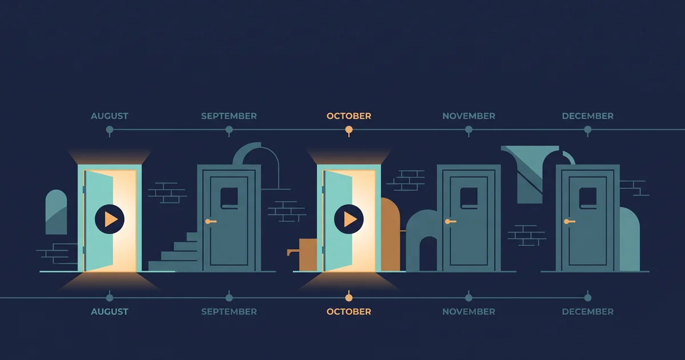
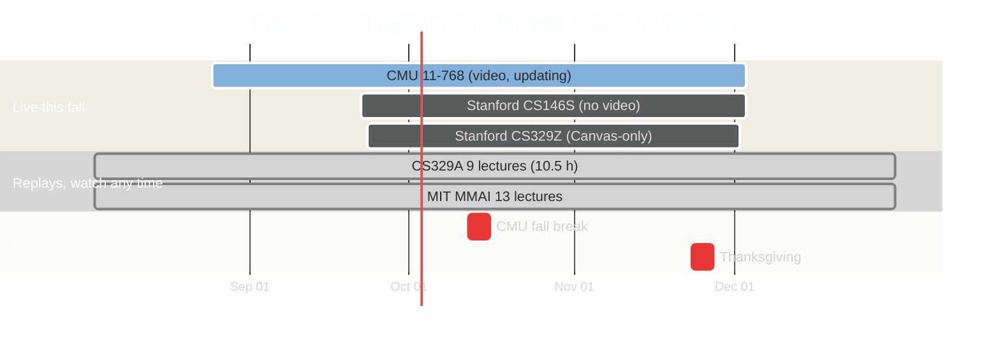
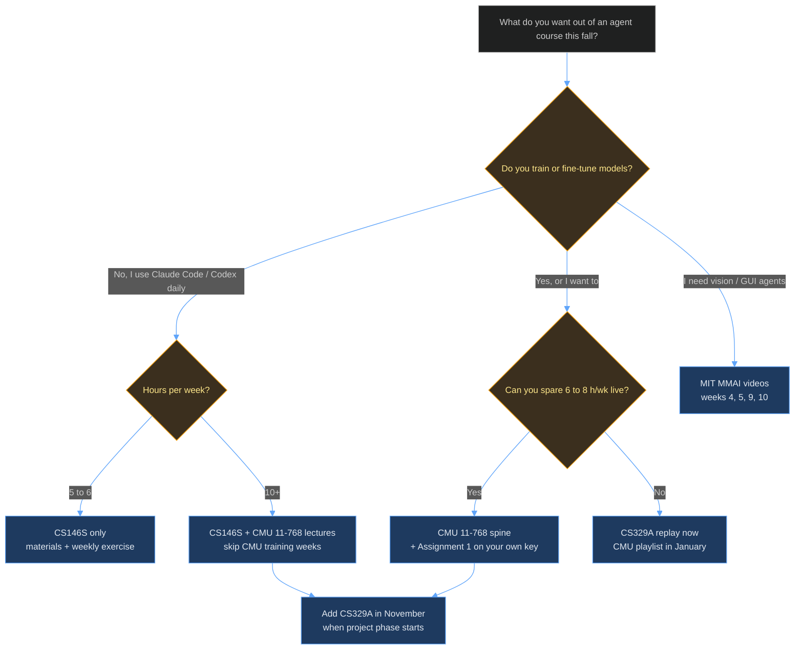

+++
date = '2026-09-09T10:00:00+08:00'
aliases = ['/posts/ai/2026-09-11-free-ai-agent-courses-fall-2026/', '/posts/ai/2026-09-14-free-ai-agent-courses-fall-2026/']
draft = false
title = 'Free AI Agent Courses Fall 2026: Stanford, CMU, MIT Compared'
description = 'Five free university AI agent courses for Fall 2026 compared: which have public lecture videos, which are materials-only, who each is for, and the stack to run.'
toc = true
tags = ['AI Agent', 'Learning Path', 'Stanford CS146S', 'Agentic Engineering']
keywords = ['free ai agent courses 2026', 'stanford ai agents course', 'cmu ai agents course', 'university ai agent courses fall 2026', 'cs329z', 'cs329a lectures', '11-768 ai agents', 'best ai agent course', 'stanford cs146s vs cmu 11-768']

[[params.faqItems]]
question = "Which free AI agent course has public lecture videos in Fall 2026?"
answer = "Only CMU 11-768 AI Agents (Graham Neubig and Daniel Fried) posts Fall 2026 lecture recordings as the term runs: four of 28 sessions were on YouTube as of September 9, 2026, with slides for six. Stanford CS329A has all nine lectures from its Autumn 2025 run on the Stanford Online channel. Stanford CS146S and CS329Z have no public video; MIT's multimodal course has 13 videos from Spring 2026."

[[params.faqItems]]
question = "Is the Stanford AI agents course free?"
answer = "The materials are, the course is not. Stanford CS329Z (Engineering AI Agents, Fall 2026) publishes its syllabus, schedule, and homework descriptions, but recordings are Canvas-only for enrolled students. Stanford CS146S publishes its syllabus and slides but has never released lecture video. Stanford CS329A is the exception: its full Autumn 2025 lecture set is free on YouTube."

[[params.faqItems]]
question = "CMU 11-768 vs Stanford CS146S: which should I follow?"
answer = "Both, if you can spare 10 to 12 hours a week; CMU first if you can't. CMU 11-768 is a graduate course on building, evaluating, and training agents, with lecture video and a public harness assignment. CS146S is a practitioner course on working inside coding agents (MCP, skills, hooks, spec-driven development) with no video. They cover different halves of the same problem and their terms overlap from September 22 to December 3, 2026."

[[params.faqItems]]
question = "How many hours a week does it take to follow these courses?"
answer = "Following CMU 11-768 live takes 6 to 8 hours a week (two 75-minute lectures, readings, and the assignment). CS146S takes 5 to 6 hours a week without grades. CS329A is a replay: nine lectures of 63 to 75 minutes each, about 10.5 hours total, best spread over six weeks. Running CMU plus CS146S together is 11 to 14 hours a week, which is the most I'd recommend."

[[params.faqItems]]
question = "Do I need a machine learning background for these AI agent courses?"
answer = "For two of them. CMU 11-768 expects prior experience training neural language models (CMU 11-667/11-711 level), and CS329Z lists CS224N-level NLP as a prerequisite. CS146S assumes only that you can program and want to work inside coding agents. CS329A's lectures are watchable with an ML basics background, though the RL-heavy middle third rewards more."
+++

Five universities are running or have just published **free AI agent courses for Fall 2026**, and three of them you cannot watch. That's the fact to start from, because the search results won't tell you. Stanford CS146S, Stanford CS329Z, Stanford CS329A, CMU 11-768, and MIT's multimodal course all have public websites, syllabi, and reading lists; only two of them have lecture recordings you can play today, and only one is recording *this* term as it happens.

I've been covering Stanford CS146S since February, and its [overview](/posts/ai/2026-02-24-stanford-cs146s-overview/), [study guide](/posts/ai/2026-07-02-cs146s-study-guide/), and [Fall 2026 follow-along](/posts/ai/2026-09-11-cs146s-fall-2026-follow-along/) are the most-read pages on this blog. That's why this hub exists: readers keep asking "which of these should I follow," and the answer isn't "all five" or "the Stanford one." As of September 9, 2026, I pulled every schedule from the official sites (for CMU, from the site's JavaScript bundle, because the page is client-rendered), counted the videos on every playlist, and read every grading table. What follows is the comparison, the honest inventory of what's actually free, and the stack I'd run.

## The Five Courses at a Glance

**The five aren't peers; they're three different kinds of course wearing the same "AI agents" label.** CS146S is a practitioner course about working *inside* coding agents. CMU 11-768 and CS329Z are graduate courses about *building and training* agents. CS329A is a research seminar on agents that improve themselves. MIT's course is a multimodal ML course that happens to have an agents week. Here's the whole picture in one table:

| Course | Term and dates | Instructors | Live video? | Slides / materials | Assignments public? | Prereqs | Best for |
|---|---|---|---|---|---|---|---|
| [Stanford CS146S](https://themodernsoftware.dev/) The Modern Software Developer | Fall 2026, Sep 22 to Dec 3, Tue/Thu | Mihail Eric | **No** (none, ever) | Syllabus public; Fall 2025 decks public; 2026 decks TBD | Fall 2025 assignments on GitHub; 2026 TBD | Programming | Engineers who use Claude Code / Codex daily and want the practice canon |
| [CMU 11-768](https://www.cmu-agents.com/) AI Agents | Fall 2026, Aug 25 to Dec 3, Tue/Thu 3:30 to 4:50 PM ET | Graham Neubig, Daniel Fried | **Yes**, YouTube, updating (4 of 28 as of Sep 9) | Slides PDF per lecture (6 so far), readings | Assignment 1 starter repo public | Trained an LM before (11-667/11-711 level) | Builders who want the whole loop: harness, eval, RL training |
| [Stanford CS329Z](https://cs329z.stanford.edu/) Engineering AI Agents | Fall 2026, Sep 23 to Dec 2, Mon/Wed 1:30 to 2:50 PM PT | Diyi Yang, Michael Ryan, John Yang | **No** (Canvas-only) | Syllabus and schedule public; slides TBD | Descriptions public; starter code not | CS224N-level NLP | Framework-literate builders who want a from-scratch harness plus eval discipline |
| [Stanford CS329A](https://cs329a.stanford.edu/) Self-Improving AI Agents | Autumn 2025, Sep 22 to Dec 5, 2025 (replay) | Azalia Mirhoseini, Aakanksha Chowdhery | **Yes**, 9 lectures on Stanford Online (posted Aug 2026) | Schedule public; slides not linked | No | ML basics; RL helps | Anyone who wants the test-time compute / verifier / RL frontier explained by people who shipped PaLM and Gemini |
| [MIT MAS.S60 / 6.S985](https://mit-mi.github.io/mmai-course/spring2026/) Modeling: Multimodal AI | Spring 2026, Feb 3 to May 12, 2026 (replay) | Paul Liang and three co-instructors | **Yes**, 13 of 28 sessions on YouTube | Slides for every lecture; application guest lectures slides-only | No | Deep learning basics | People building multimodal or GUI agents; not a general agents course |

Two rows deserve a second look. CS146S and CMU 11-768 are both live this fall, both Tuesday/Thursday, and both run through December 3. If you follow both, you'll be doing four lecture-topics a week from September 22 on. And the two Stanford courses that are actually running this fall, CS146S and CS329Z, are the two with no public video. The "Stanford AI agents course" people search for is, this term, a reading assignment.

## Which You Can Watch vs Which You Can Only Read

**"Free" here means three different things, and the difference decides whether you can follow along.** I sort the five into three tiers by what you can press play on as of September 9, 2026:

**Tier 1, watchable live: CMU 11-768.** The [Fall 2026 playlist](https://www.youtube.com/playlist?list=PLSN0qpDfUvTM) on Graham Neubig's channel had four lectures (57 to 76 minutes each) when I checked, covering the "What is an agent," tool use, long-context, and skills-and-memory sessions from August 25 to September 3. Slides are linked as PDFs for six sessions. The playlist had 1,413 views. That number matters: this is the least-discovered of the five, and the only one recording as it goes.

**Tier 2, watchable as a replay: CS329A and MIT.** Stanford Online put all nine CS329A lectures on YouTube in August 2026, ten months after the course ran; the [playlist](https://www.youtube.com/playlist?list=PLangBM27OtEA) had 68,302 views when I counted, and the lectures run 63 to 75 minutes. Nine is not the whole course, though. The official schedule lists 18 sessions including guest lectures from Denny Zhou and Thang Luong (Google DeepMind), Misha Laskin (Reflection AI), and Danny Driess (Physical Intelligence); none of those guest sessions are in the published set. MIT's course has [13 videos](https://www.youtube.com/playlist?list=PLWzwL390pi04) out of 28 sessions; the application lectures (manufacturing, design, cities, transportation) and the tutorials are slides-only.

**Tier 3, materials only: CS146S and CS329Z.** CS146S has never released video, a point I documented in the [follow-along post](/posts/ai/2026-09-11-cs146s-fall-2026-follow-along/); what you get is the syllabus and, based on the 2025 pattern, Google Slides decks within days of each lecture. CS329Z's course page is explicit: cameras in the back of the room record instructor presentations, and recordings "can be accessed by logging into the course Canvas site." Everything else about CS329Z is public, including a week-by-week schedule and the two homework descriptions, which are good enough to steal as self-study projects.

Here's how the five terms overlap on the calendar, which is the constraint nobody mentions:

The practical reading: from September 22 to December 3 there are three live courses on the same six weekday slots. Anything you add on top is a replay, and replays can wait until January.

## The Stack I'd Actually Run

**Run CMU 11-768 as the spine, CS146S as the practice track, and CS329A as the theory replay; skip or defer the other two.** That's the whole recommendation. Here's why it comes out that way and what it costs per week.

CMU is the spine because it's the only course that gives you all three pieces on the same week: a lecture you can watch, slides you can search, and a [public assignment](https://github.com/cmu-agents/assignment-1) you can run. The syllabus goes further than any of the others too. Weeks 1 to 3 are capabilities (tool use, context management, skills and memory, planning), weeks 4 to 6 are domains plus *training* (SFT, RL basics, advanced RL, RL systems), then safety, frameworks (an OpenHands session and a LangGraph session), interaction, and search. Twenty-eight sessions including a fall break and two guest lectures in November. Assignment 1 asks you to build a ReAct harness from scratch that fixes a bug in a chess app and then plays chess through tool calls, with context compaction in the middle; that's a better exercise than anything in the CS146S 2025 assignment set, and it was posted publicly on August 31.

CS146S is the practice track because it teaches what CMU deliberately skips: how to work inside Claude Code, Codex, and Cursor as a professional. MCP, agent skills, CLAUDE.md and hooks, agent-ready repos, background agents, and the software factory. No video, but each week's topic maps to a tool you can run that night, and I've already written the [week-by-week exercise plan](/posts/ai/2026-09-11-cs146s-fall-2026-follow-along/). If you've read my [loop engineering](/posts/ai/2026-07-05-loop-engineering/) or [CLI skills vs MCP](/posts/ai/2026-07-04-cli-skills-vs-mcp/) posts, you already know the shape of that syllabus.

CS329A is the theory replay because it explains the frontier the other two only gesture at: why test-time compute scales, what a verifier is and why it has to be robust, how RL post-training turned chatbots into agents, and how to evaluate long-horizon tasks. Nine lectures, 10.5 hours, no homework you can submit. Watch it in November when the two live courses hit their project phases and the lecture load drops.

The two I'd defer: CS329Z, because without recordings it's a syllabus to mine, not a course to follow (more on that below), and MIT, because it's a multimodal ML course; agents get one lecture (April 7) and one tutorial (April 23) out of 28 sessions, and if you need multimodal fusion and alignment you'll know it.

Hours per week, with the assumptions stated. CMU live: two lectures at 60 to 76 minutes, two to three readings (the tool-use lecture alone lists four papers and 26 reference links), and the assignment; 6 to 8 hours. CS146S without grades: one deck, one reading, one exercise; 5 to 6 hours, which is the number readers of the follow-along post told me they can sustain. CS329A replay: 1.75 hours per lecture including notes; 1 to 2 per week. Spine plus practice track is 11 to 14 hours a week. That's a real commitment, and if you can't make it, drop to CMU alone and read the CS146S decks on weekends. Don't do the reverse: CS146S without CMU leaves you fluent in tools and unable to explain why a harness works.

## Course by Course: What Each Is Really For

**CMU 11-768 is the closest thing to a complete agents curriculum any university has published, and it's the one nobody's talking about.** Neubig maintains OpenHands and Fried came from Meta's agent work, so the frameworks weeks aren't a survey; they're the authors explaining their own decisions. Grading is 40% individual assignments (harness 10%, eval 15%, training 15%), 10% "lecture highlights," and 50% a team research project with a poster on December 1 to 3. Two things to know before you start. The assignment defaults to DeepSeek-V4-Flash through an OpenAI-compatible endpoint and runs agent actions in Modal sandboxes; enrolled students get credits, you'll pay your own, and I haven't run it end to end myself, so budget for that. And Assignment 2 (eval) and 3 (training) were due September 24 and October 22 but hadn't been posted publicly when I checked; the site says starter materials "will be posted here as they become available."

**Stanford CS146S is the course for the working engineer, and the one I'd tell most readers of this blog to start with.** I've written three full posts on it, so I'll be brief: Fall 2026 is a rewrite of the 2025 syllabus around MCP, agent skills, CLAUDE.md and hooks, agent-ready codebases, background agents, and the software factory, with 30% of the grade now on open-source contributions and eight guest sessions from the people who build Cursor, Claude Code, Factory, Cognition, Semgrep, Cloudflare's agent stack, and Replit. Its weakness is exactly what CMU has: no video, no assignment you can grade yourself against, and a shallow treatment of how agents are trained. Its strength is that every week's topic is something you'll use at work on Monday.

**Stanford CS329Z is the syllabus to mine, not the course to follow.** Diyi Yang, Michael Ryan (DSPy core contributor), and John Yang (SWE-bench and SWE-agent co-creator) teach it from scratch: LLMs for builders, RAG, tool use, frameworks (DSPy, LangGraph, LlamaIndex, MCP, litellm), design patterns and scaffolds, memory, multi-agent, optimization, then coding agents and proactive agents in the back half. The two homeworks are the prize. HW1 is "build a company's internal AI assistant from scratch, with no agent frameworks: just a chat-completion call and code you write yourself," released October 5, due October 30. HW2 is an evaluation suite with code-based graders, at least one LLM-as-judge eval, and benchmark tasks built with the course's "4-tuple framework," due November 20. Both descriptions are public. Neither starter kit is. Do them anyway, on the course's dates, and you'll have reproduced 20% of a Stanford grade without Canvas. The recordings, quizzes, and the "Making Life at Stanford Better with Agents" project (50%) stay behind the login.

**Stanford CS329A is the lecture series to watch when you want the why.** Mirhoseini and Chowdhery (PaLM, Gemini, AlphaChip between them) organize the course around one question: how does an agent keep improving through interaction with its environment? The nine public lectures are the instructor sessions: course overview, test-time compute scaling, robust verification, learning from feedback with tools and code, planning and multi-step reasoning, train-time scaling and RL, self-improvement and deep research agents, agentic evaluations and long-horizon tasks, future research areas. If you've read my [agentic loops](/posts/ai/2026-07-03-agentic-loops/) post and wanted the training-side counterpart, this is it. Homework and the research project (35%) were for enrolled students, and the course hasn't announced a Fall 2026 run.

**MIT's course is excellent and mostly not about agents.** Paul Liang's Spring 2026 offering is a multimodal ML course: representation, fusion, alignment, large multimodal models, generation, reasoning, transfer, then applications with Media Lab and Sloan co-instructors. Thirteen of 28 sessions have video; the four application lectures and the three tutorials don't. The agents content is week 10.1 (multimodal interaction, with VisualWebArena, Mind2Web, and OpenVLA on the reading list), the April 23 agents tutorial (slides only), and week 14.1 on self-evolving AI. If you're building GUI or vision agents, watch weeks 4, 5, 9, and 10 and skip the rest. If you aren't, this isn't your course, and it's fine to say so.

## What's Not Free

**Everything that involves a human looking at your work stays behind enrollment, at all five.** The tables above say "free," and the materials are, but here's the honest list of what you don't get, because it's the same list every time:

- **Grades and feedback.** CMU's 50% project, CS329Z's 50% project, CS329A's 35% project, CS146S's 50% final project. No one reads your work. Substitute: publish it and ask the tool's community to review, which is worse but not nothing.
- **Assignment starter code, partially.** CMU posted Assignment 1; Assignments 2 and 3 weren't public on September 9. CS329Z's HW1 and HW2 are descriptions only. CS146S's 2026 assignments weren't posted; the 2025 set is on GitHub. CS329A and MIT posted none.
- **API and compute credits.** CMU's assignment expects a Modal account and an LLM key; the course arranges credits for students. Running the harness assignment on your own DeepSeek or OpenAI-compatible key is the one line item in this post that costs money, and I can't tell you how much because I haven't run it.
- **Discussion and office hours.** Piazza, Ed, Canvas, and TA hours are enrolled-only everywhere. CS329Z even keeps its quizzes closed-book and individual.
- **Guest lectures, mostly.** CS329A's DeepMind and Reflection AI guests aren't in the nine public videos. CS146S's eight guests have no video at all. CMU's two November guest lectures aren't named yet, and whether they're recorded is up to the speaker.
- **Recordings, for CS329Z and CS146S.** Canvas-only and nonexistent, respectively. If you need to *watch* a Stanford agents course, CS329A is the only one.

What is free is more than it sounds: every syllabus, every reading list, six CMU slide decks and four lectures with more coming, 17 CS146S decks from 2025, CS329A's nine lectures, MIT's 13, and one runnable CMU assignment. Ten weeks of that, done on the calendar the classes are on, is more than most enrolled students will finish.

## Following From Outside the US

**None of the live sessions are attendable remotely, so time zones only affect when materials land.** CMU lectures are Tuesday/Thursday 3:30 to 4:50 PM Eastern; the recordings have been showing up on the playlist within days, not hours. CS329Z is Monday/Wednesday 1:30 to 2:50 PM Pacific, but you can't watch it anyway. CS146S publishes days but not times. Daylight saving ends November 1 in the US, so any "next morning" habit shifts an hour after that.

The real access question for readers in China is YouTube and Google Slides, and the answer is that four of the five depend on them: CMU's recordings and CS329A's and MIT's lectures are YouTube-only, and CS146S's decks are Google Slides. CMU's slides are plain PDFs on the course domain, which is the one exception. I go into the download-and-cache workflow in the Chinese version of this post; the short version is that the PDFs and playlists are all public, so a one-time fetch per week is enough.

## Where This Page Stops

This is the routing page. The deep dives are where the week-by-week plans live: the [CS146S follow-along](/posts/ai/2026-09-11-cs146s-fall-2026-follow-along/) for the practice track, the [CMU 11-768 deep dive](/posts/ai/2026-09-08-cmu-11-768-ai-agents-course/) for the spine, and the [CS329Z breakdown](/posts/ai/2026-09-04-stanford-cs329z-engineering-ai-agents/) for the homework you can steal. I'll update the table when CMU posts Assignments 2 and 3, when CS146S posts its 2026 decks, and if CS329Z or CS329A releases any video; the "as of" dates in the text are the tell.

Three things I couldn't verify and want on the record: whether CMU's November guest lectures will be recorded, the cost of running CMU Assignment 1 on your own API key, and whether CS329A will run again in 2026-27. If you're enrolled in any of these and know, the comments are open.

## Related Reading

- [CS146S Fall 2026: How to Watch and Follow Along Free](/posts/ai/2026-09-11-cs146s-fall-2026-follow-along/): the calendar and week-by-week exercise plan for the practice track
- [Stanford CS146S: The Modern Software Developer, 2026 Guide](/posts/ai/2026-02-24-stanford-cs146s-overview/): the full ten-week breakdown and guest lineup
- [CS146S Study Guide 2026: Lecture-by-Lecture Notes and Workbook](/posts/ai/2026-07-02-cs146s-study-guide/): the two-week core route if you can't do the quarter
- [Agentic Loops 2026: Self-Looping AI Agents Explained](/posts/ai/2026-07-03-agentic-loops/): the ReAct loop CMU's Assignment 1 asks you to build
- [Loop Engineering: Building the Cage Your AI Agent Runs In](/posts/ai/2026-07-05-loop-engineering/): the discipline CS146S weeks 4, 6, and 8 are about
- [MCP vs Skills: Why CLI + Skill Wins the Agent Toolchain](/posts/ai/2026-07-04-cli-skills-vs-mcp/): the argument behind CS146S week 3 and CMU lecture 4
