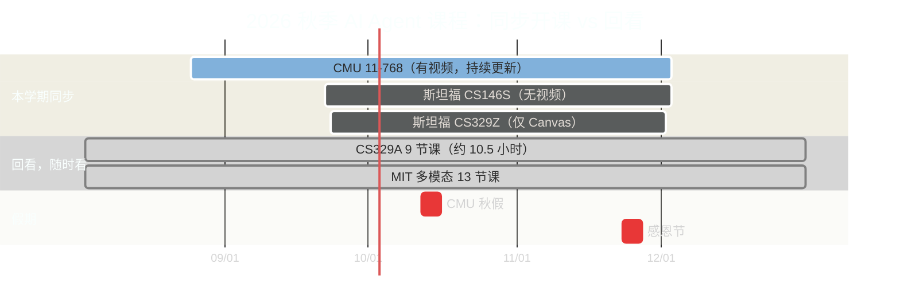
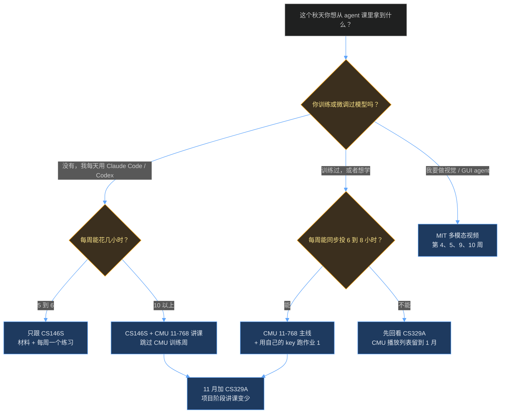

+++
date = '2026-09-09T10:00:00+08:00'
aliases = ['/posts/ai/2026-09-11-free-ai-agent-courses-fall-2026/', '/posts/ai/2026-09-14-free-ai-agent-courses-fall-2026/']
draft = false
title = '2026 秋季 5 门免费大学 AI Agent 课怎么跟：斯坦福、CMU、MIT'
description = '斯坦福 CS146S/CS329Z/CS329A、CMU 11-768、MIT 多模态课五门免费 AI Agent 课程横向对比：哪门有公开视频、哪门只有材料、国内怎么获取、先跟哪门、每周几小时。'
toc = true
tags = ['AI Agent', 'Learning Path', 'Stanford CS146S', 'Agentic Engineering']
keywords = ['ai agent 课程', '斯坦福 ai 课程', 'cmu ai agents', '免费 ai 课程 2026', '大学公开课 ai agent', 'cs329z', 'cs329a 课程', 'cmu 11-768', 'ai agent 公开课']

[[params.faqItems]]
question = "2026 秋季哪门免费 AI Agent 课有公开的课堂视频？"
answer = "跟着本学期同步更新视频的只有 CMU 11-768 AI Agents（Graham Neubig 和 Daniel Fried）：截至 2026 年 9 月 9 日，28 节课里已有 4 节上了 YouTube，6 节有 PDF 讲义。斯坦福 CS329A 的 9 节 2025 秋季课在 Stanford Online 频道可以完整回看。斯坦福 CS146S 和 CS329Z 没有公开视频。MIT 多模态课有 2026 春季的 13 节视频。"

[[params.faqItems]]
question = "斯坦福的 AI Agent 课程是免费的吗？"
answer = "材料免费，课不免费。CS329Z（Engineering AI Agents，2026 秋季）公开了大纲、课程表和两份作业说明，但录像只对注册学生在 Canvas 开放。CS146S 公开大纲和 PPT，但从来没发布过课堂视频。唯一例外是 CS329A：2025 秋季的 9 节主讲课全部免费放在 YouTube。"

[[params.faqItems]]
question = "CMU 11-768 和斯坦福 CS146S 应该先跟哪门？"
answer = "每周能抽 10 到 12 小时就两门一起跟，抽不出来先跟 CMU。CMU 11-768 是研究生课，讲怎么从零搭 harness、做评测、用 RL 训练 agent，有视频也有公开作业。CS146S 是工程实践课，讲怎么在 Claude Code、Codex 里用 MCP、skills、hooks 和规范驱动开发干活，没有视频。两门课正好互补，而且 2026 年 9 月 22 日到 12 月 3 日学期重叠。"

[[params.faqItems]]
question = "跟这些 AI Agent 课程每周要花多少时间？"
answer = "同步跟 CMU 11-768 每周 6 到 8 小时（两节 75 分钟的课、阅读材料、作业）。不计成绩跟 CS146S 每周 5 到 6 小时。CS329A 是回看，9 节课每节 63 到 75 分钟，总共约 10.5 小时，建议分 6 周看完。CMU 加 CS146S 同时跟是每周 11 到 14 小时，这是我建议的上限。"

[[params.faqItems]]
question = "跟这些 AI Agent 课需要机器学习基础吗？"
answer = "两门需要。CMU 11-768 要求有训练神经语言模型的经验（CMU 11-667 或 11-711 水平），CS329Z 要求 CS224N 级别的 NLP 背景。CS146S 只要求会编程并且想在 coding agent 里干活。CS329A 有 ML 基础就能看懂，中间偏 RL 的三分之一需要多补一点。"
+++

2026 年秋季有 5 门大学**免费 AI Agent 课程**在跑，或者刚放出材料。其中 3 门你根本看不到课。

五门是斯坦福 CS146S、斯坦福 CS329Z、斯坦福 CS329A、CMU 11-768、MIT 多模态课。官网、大纲、阅读清单都公开。但今天能点开播放的只有两门，本学期边上边录的只有一门。

这篇导航页是被问出来的。我从今年 2 月开始写斯坦福 CS146S，[全解析](/zh/posts/ai/2026-02-24-stanford-cs146s-overview/)、[自学手册](/zh/posts/ai/2026-07-02-cs146s-study-guide/)和 [2026 秋季跟课方案](/zh/posts/ai/2026-09-11-cs146s-fall-2026-follow-along/)是这个博客读得最多的页面。

读者一直在问「这几门到底跟哪门」。答案既不是「全跟」，也不是「跟斯坦福那门」。

截至 2026 年 9 月 9 日，我把五门课的课程表全部从官网扒了下来。CMU 官网是前端渲染的，我直接从它的 JS 包里取数据。我数了每个播放列表的视频数，读了每张评分表。

下面是对比表、「到底什么免费」的诚实清单，以及我自己会怎么排。

## 五门课一张表

**这五门不是同类，是三种不同的课挂了同一个"AI Agent"标签。** CS146S 是工程实践课，讲怎么在 coding agent *里面*干活。CMU 11-768 和 CS329Z 是研究生课，讲怎么*搭和训练* agent。

CS329A 是研究讨论课，讲会自我改进的 agent。MIT 那门是多模态机器学习课，只是恰好有一周讲 agent。全貌如下：

| 课程 | 学期与日期 | 主讲 | 课堂视频 | 讲义 / 材料 | 作业公开？ | 前置要求 | 适合谁 |
|---|---|---|---|---|---|---|---|
| [斯坦福 CS146S](https://themodernsoftware.dev/) The Modern Software Developer | 2026 秋，9 月 22 日至 12 月 3 日，周二/周四 | Mihail Eric | **没有**（历来没有） | 大纲公开；2025 秋 PPT 公开；2026 版待发 | 2025 秋作业在 GitHub；2026 版待发 | 会编程 | 每天用 Claude Code / Codex、想系统补实践方法论的工程师 |
| [CMU 11-768](https://www.cmu-agents.com/) AI Agents | 2026 秋，8 月 25 日至 12 月 3 日，周二/周四美东 15:30 到 16:50 | Graham Neubig、Daniel Fried | **有**，YouTube 持续更新（截至 9 月 9 日 28 节里 4 节） | 每讲 PDF 讲义（已发 6 份）、阅读清单 | 作业 1 起始仓库公开 | 训练过语言模型（11-667/11-711 水平） | 想吃透 harness、评测、RL 训练全链路的 builder |
| [斯坦福 CS329Z](https://cs329z.stanford.edu/) Engineering AI Agents | 2026 秋，9 月 23 日至 12 月 2 日，周一/周三太平洋 13:30 到 14:50 | Diyi Yang、Michael Ryan、John Yang | **没有**（仅 Canvas） | 大纲和课程表公开；PPT 待发 | 作业说明公开；起始代码不公开 | CS224N 级 NLP | 熟悉框架、想从零写 harness 并建立评测纪律的 builder |
| [斯坦福 CS329A](https://cs329a.stanford.edu/) Self-Improving AI Agents | 2025 秋，2025 年 9 月 22 日至 12 月 5 日（回看） | Azalia Mirhoseini、Aakanksha Chowdhery | **有**，Stanford Online 9 节（2026 年 8 月上传） | 课程表公开；PPT 未链接 | 无 | ML 基础；懂 RL 更好 | 想听做过 PaLM、Gemini 的人讲 test-time compute、验证器、RL 前沿的人 |
| [MIT MAS.S60 / 6.S985](https://mit-mi.github.io/mmai-course/spring2026/) Modeling: Multimodal AI | 2026 春，2026 年 2 月 3 日至 5 月 12 日（回看） | Paul Liang 及三位合授老师 | **有**，28 节里 13 节在 YouTube | 每讲都有 PPT；应用类客座课只有 PPT | 无 | 深度学习基础 | 做多模态或 GUI agent 的人；不是通用 agent 课 |

表里有两行值得再看一眼。

CS146S 和 CMU 11-768 都是本学期在跑，都是周二/周四，都上到 12 月 3 日。两门一起跟，从 9 月 22 日起每周就是四个新主题。

真正在这个秋季开课的两门斯坦福课是 CS146S 和 CS329Z，恰恰都没有公开视频。大家搜的「斯坦福 AI Agent 课」，这学期其实是一份阅读作业。

## 能看的和只能读的

**「免费」在这里有三种意思，区别决定你能不能跟得上。** 按 2026 年 9 月 9 日能点开播放的东西，我把五门分成三档。

**第一档，同步能看：CMU 11-768。** Graham Neubig 频道上的 [2026 秋季播放列表](https://www.youtube.com/playlist?list=PLSN0qpDfUvTM)我查的时候有 4 节课，每节 57 到 76 分钟。

内容覆盖 8 月 25 日到 9 月 3 日的四讲：「什么是 agent」、工具调用、长上下文、skills 与记忆。另有 6 节课放出了 PDF 讲义。

播放列表总播放量 1,413。这个数字很说明问题：五门里它最没人发现，却是唯一一门边上边录的。

**第二档，回看能看：CS329A 和 MIT。** Stanford Online 在 2026 年 8 月把 CS329A 的 9 节课放上了 YouTube，距离开课已经十个月。[播放列表](https://www.youtube.com/playlist?list=PLangBM27OtEA)我数的时候有 68,302 次播放，每节 63 到 75 分钟。

但 9 节不是全部。官方课程表列了 18 次课，其中 Denny Zhou、Thang Luong（Google DeepMind）、Misha Laskin（Reflection AI）、Danny Driess（Physical Intelligence）的客座讲座一节都没进公开集合。

MIT 那门 28 次课里有 [13 节视频](https://www.youtube.com/playlist?list=PLWzwL390pi04)。应用类讲座（制造、设计、城市、交通）和教程课只有 PPT。

**第三档，只有材料：CS146S 和 CS329Z。** CS146S 从没发过视频，我在[跟课方案](/zh/posts/ai/2026-09-11-cs146s-fall-2026-follow-along/)里查实过。你能拿到的是大纲，加上按 2025 年的惯例每节课后几天内挂出的 Google Slides。

CS329Z 官网写得很明白：教室后排的摄像机录下老师的讲解，录像「登录课程 Canvas 站点后可访问」。除了录像，CS329Z 其他东西全公开，包括逐周课程表和两份作业说明，拿来当自学项目完全够用。

五门课在日历上怎么重叠，是没人提但最要命的约束：

实际含义很直接。9 月 22 日到 12 月 3 日，三门同步课挤在同样的六个工作日时段里。再往上叠只能叠回看，而回看可以等到 1 月。

## 我自己会怎么排

**CMU 11-768 当主线，CS146S 当实践线，CS329A 当理论回看。另外两门跳过或往后推。** 这就是全部建议。下面说为什么是这个组合，以及每周要付多少小时。

CMU 当主线，因为它是唯一一门同一周里三样东西都给你的课：能看的视频、能搜的讲义、能跑的[公开作业](https://github.com/cmu-agents/assignment-1)。

它的大纲也比其他几门走得远。第 1 到 3 周是能力，包括工具调用、上下文管理、skills 与记忆、规划。第 4 到 6 周是应用领域加*训练*，包括 SFT、RL 基础、进阶 RL 算法、RL 系统。之后是安全、框架（一节 OpenHands、一节 LangGraph）、交互、搜索。全程 28 次课，含一周秋假和 11 月的两次客座。

作业 1 要你从零写一个 ReAct harness：先修好一个国际象棋 app 的 bug，再通过工具调用下棋，中间还要实现上下文压缩。它比 CS146S 2025 那套作业里任何一道都好，而且 8 月 31 日就公开了。

CS146S 当实践线，因为它教的正是 CMU 刻意跳过的部分：怎么像职业选手一样在 Claude Code、Codex、Cursor 里干活。主题是 MCP、agent skills、CLAUDE.md 和 hooks、agent-ready 代码库、后台 agent、软件工厂。

它没视频，但每周主题都对应一个当晚就能跑的工具，[逐周练习方案](/zh/posts/ai/2026-09-11-cs146s-fall-2026-follow-along/)我已经写好。读过我的 [Loop Engineering](/zh/posts/ai/2026-07-05-loop-engineering/) 或 [CLI + Skill vs MCP](/zh/posts/ai/2026-07-04-cli-skills-vs-mcp/) 的读者，对这份大纲的形状已经不陌生。

CS329A 当理论回看，因为它把另外两门只是点到的前沿讲透了：test-time compute 为什么能 scale，验证器是什么、为什么必须鲁棒，RL 后训练怎么把 chatbot 变成 agent，长程任务怎么评测。

它是 9 节课、10.5 小时，没有能提交的作业。放到 11 月看，那时两门同步课进入项目阶段，讲课量下降。

往后推的是另外两门。CS329Z 没有录像，它是一份可以挖的大纲，不是一门可以跟的课，下面细说。

MIT 那门是多模态 ML 课，28 次课里 agent 只占一讲（4 月 7 日）加一次教程（4 月 23 日）。你要是真需要多模态融合和对齐，自己心里有数。

每周小时数摆在下面，前提都写明。

同步跟 CMU 是 6 到 8 小时：两节 60 到 76 分钟的课，两到三篇阅读，加作业。光工具调用那一讲就列了 4 篇论文和 26 个参考链接。

不计成绩跟 CS146S 是 5 到 6 小时：一份 PPT、一篇阅读、一个练习。这个数字是跟课方案的读者告诉我他们能坚持的。

CS329A 回看每节连笔记 1.75 小时，每周看 1 到 2 节。

主线加实践线合计每周 11 到 14 小时。这是实打实的投入。做不到就砍到只跟 CMU，周末翻 CS146S 的 PPT。

别反过来。只跟 CS146S 不跟 CMU，结果是工具用得溜，却说不清 harness 为什么能跑。

## 逐门说：每门到底是干什么的

**CMU 11-768 是目前大学里公开过的最接近完整 agent 课程体系的一门，也是最没人聊的一门。** Neubig 维护 OpenHands，Fried 来自 Meta 的 agent 团队。所以框架那几周不是综述，是作者本人讲自己的设计取舍。

评分是 40% 个人作业（harness 10%、评测 15%、训练 15%），10% 「课堂要点」，50% 团队研究项目，12 月 1 到 3 日海报展示。

开跑前有两件事要知道。第一，作业默认通过 OpenAI 兼容接口调 DeepSeek-V4-Flash，agent 动作跑在 Modal 沙箱里。在校生有课程发的额度，你得自己掏，而且我自己没有从头到尾跑过，预算要留出来。

第二，作业 2（评测）和作业 3（训练）截止日分别是 9 月 24 日和 10 月 22 日，但我查的时候还没公开。官网原话是起始材料「可用后会陆续贴出」。

**斯坦福 CS146S 是给在职工程师的课，也是我会推荐这个博客大多数读者先跟的一门。** 我已经写了三篇长文，这里只说要点。

2026 秋季是对 2025 大纲的重写，主线换成 MCP、agent skills、CLAUDE.md 和 hooks、agent-ready 代码库、后台 agent、软件工厂。开源贡献现在占 30% 成绩。

八次客座来自做 Cursor、Claude Code、Factory、Cognition、Semgrep、Cloudflare agent 栈和 Replit 的人。

它的短板恰恰是 CMU 的长板：没视频、没有能自评的作业、对 agent 怎么训练的讲得很浅。它的长板是每周主题都是你下周一上班就会用到的东西。

**斯坦福 CS329Z 是拿来挖的大纲，不是拿来跟的课。** Diyi Yang、Michael Ryan（DSPy 核心贡献者）、John Yang（SWE-bench 和 SWE-agent 共同作者）从零讲起：面向 builder 的 LLM、RAG、工具调用、框架（DSPy、LangGraph、LlamaIndex、MCP、litellm）、设计模式与 scaffold、记忆、多 agent、优化。后半段是 coding agent 和主动式 agent。

两份作业是真正的宝贝。HW1 是「从零搭一家公司的内部 AI 助手，不用任何 agent 框架：只有一个 chat-completion 调用和你自己写的代码」，10 月 5 日发布，10 月 30 日截止。

HW2 是一套评测：代码打分器、至少一个 LLM-as-judge 评测、用课程的「4 元组框架」构建的 benchmark 任务，11 月 20 日截止。

两份说明都公开，起始代码都不公开。照样做，按课程的日期做，你就在没有 Canvas 的情况下复现了斯坦福 20% 的成绩。

留在登录墙后面的是录像、测验，还有那个占 50% 的「用 agent 让斯坦福生活更好」项目。

**斯坦福 CS329A 是你想知道「为什么」时该看的讲座。** Mirhoseini 和 Chowdhery 两人之间做过 PaLM、Gemini、AlphaChip。整门课组织在一个问题周围：agent 怎么通过和环境交互持续变强？

9 节公开课是主讲部分：课程概览、test-time compute scaling、鲁棒验证、从工具和代码反馈中学习、规划与多步推理、训练时 scaling 与 RL、自我改进与 deep research agent、agent 评测与长程任务、未来研究方向。

读过我的 [Agentic Loops](/zh/posts/ai/2026-07-03-agentic-loops/)、想找训练侧对应物的，就看它。作业和研究项目（35%）只对在校生，课程也没宣布 2026 秋季再开。

**MIT 那门课很好，但基本不是讲 agent 的。** Paul Liang 2026 春季这门是多模态 ML 课：表示、融合、对齐、大多模态模型、生成、推理、迁移，然后是和 Media Lab、Sloan 合授老师一起讲的应用。28 次课里 13 节有视频，四次应用讲座和三次教程没有。

agent 内容只有三处：第 10.1 周的多模态交互（阅读清单里有 VisualWebArena、Mind2Web、OpenVLA）、4 月 23 日的 agent 教程（只有 PPT）、第 14.1 周的自我进化 AI。

你要是做 GUI 或视觉 agent，看第 4、5、9、10 周，其余跳过。不做的话这不是你的课，直说没关系。

## 哪些不免费

**凡是需要一个真人看你作业的环节，五门课全部锁在注册墙后面。** 上面的表说「免费」，材料确实免费。但下面是你拿不到的东西的诚实清单，因为每门课的清单几乎一样：

- **成绩和反馈。** CMU 50% 的项目、CS329Z 50% 的项目、CS329A 35% 的项目、CS146S 50% 的期末项目。没人读你的作品。替代方案：公开发出来，找你用的那个工具的社区求 review，差一些但不是零。
- **作业起始代码，部分。** CMU 发了作业 1。作业 2 和 3 到 9 月 9 日还没公开。CS329Z 的 HW1 和 HW2 只有说明。CS146S 的 2026 作业未发。2025 那套在 GitHub。CS329A 和 MIT 一份都没发。
- **API 和算力额度。** CMU 作业要 Modal 账号和一个 LLM key，课程给学生安排额度。用自己的 DeepSeek 或 OpenAI 兼容 key 跑 harness 作业，是这篇文章里唯一一项要花钱的。花多少我说不上来，因为我没跑过。
- **讨论区和答疑。** Piazza、Ed、Canvas、助教答疑，五门都只对在校生。CS329Z 的测验还是闭卷个人完成。
- **客座讲座，大部分。** CS329A 的 DeepMind 和 Reflection AI 客座不在 9 节公开视频里。CS146S 的八位客座压根没有视频。CMU 11 月的两次客座还没公布人选，录不录看讲者。
- **录像，CS329Z 和 CS146S。** 一个只在 Canvas，一个不存在。你要是非得*看*一门斯坦福 agent 课，只有 CS329A。

免费的部分其实比听上去多：所有大纲、所有阅读清单、CMU 6 份讲义和 4 节还在更新的课、CS146S 2025 的 17 份 PPT、CS329A 的 9 节课、MIT 的 13 节，再加一份能跑的 CMU 作业。

按课堂的日历把这些做上十周，你完成的量比大多数在校生都多。

## 国内怎么跟：时区、材料、和 Claude Code 怎么配

**五门课的直播都不能远程旁听，所以时区只影响材料什么时候到手。** CMU 是周二/周四美东 15:30 到 16:50，也就是北京时间周三/周五凌晨 3:30。11 月 1 日美国夏令时结束后变成 4:30。录像目前是几天内上播放列表，不是几小时。

CS329Z 是周一/周三太平洋 13:30 到 14:50，北京时间周二/周四凌晨 4:30，反正你也看不到。CS146S 只公布了星期几，没公布时间。

所以别熬夜。养成「周三和周五早上刷一遍播放列表和大纲页」的习惯就够了。

**材料获取是国内读者真正的门槛：五门里四门依赖 YouTube 和 Google。** CMU 的录像、CS329A 和 MIT 的课都只在 YouTube。CS146S 的 PPT 是 Google Slides。唯一例外是 CMU 的讲义，挂在课程域名下的普通 PDF，直接下载。

我的做法是每周一次性拉取。播放列表用 yt-dlp 把当周新增的一两节拉到本地，都是公开视频，不涉及登录。讲义 PDF 直接 curl。Google Slides 在能访问的时候用「文件 - 下载 - PDF」存一份。

一周一次，不需要一直挂着代理。

**和 Claude Code / Codex 怎么配，是国内读者比美国读者更该问的问题，因为大多数人手里已经有一个能跑的 coding agent。** 我的配法是三条线各自对应一种用法。

CS146S 每周的练习直接在 Claude Code 里做，那本来就是课程的对象。

CMU 的作业 1 这样做：把 `ASSIGNMENT.md` 和 `src/` 喂给 Claude Code，让它先解释 ReAct 循环的骨架。然后自己写 `build_prompt` 和 `run`，别让它代写，写完再让它 review。作业要求的 DeepSeek-V4-Flash 走 OpenAI 兼容接口，国内直连没问题。

CS329A 的每节课，先让 Codex 或 Claude 把 YouTube 自动字幕整理成 10 条要点，再看视频。1 小时 15 分钟的课能压到 45 分钟，这是我自己看长课的固定做法。

## 这篇到此为止

这是导航页，逐周的方案在各篇深挖里。实践线看 [CS146S 跟课方案](/zh/posts/ai/2026-09-11-cs146s-fall-2026-follow-along/)，主线看 [CMU 11-768 深挖](/zh/posts/ai/2026-09-08-cmu-11-768-ai-agents-course/)，想偷作业的看 [CS329Z 拆解](/zh/posts/ai/2026-09-04-stanford-cs329z-engineering-ai-agents/)。

开头那张对比表我会一直更新。CMU 发出作业 2 和 3、CS146S 挂出 2026 版 PPT、CS329Z 或 CS329A 放出任何视频，我都会改。正文里的「截至」日期就是标记。

有三件我没能核实的事，记录在案：CMU 11 月的客座讲座会不会录像，用自己的 API key 跑 CMU 作业 1 要花多少钱，CS329A 2026-27 学年会不会再开。

你要是在读其中任何一门、知道答案，评论区开着。

## 延伸阅读

- [斯坦福 CS146S 2026 秋季开课了：不注册怎么免费跟课](/zh/posts/ai/2026-09-11-cs146s-fall-2026-follow-along/)：实践线的课程表和逐周练习方案
- [斯坦福 CS146S 全解析 2026](/zh/posts/ai/2026-02-24-stanford-cs146s-overview/)：完整十周拆解和客座阵容
- [斯坦福 CS146S 自学手册 2026](/zh/posts/ai/2026-07-02-cs146s-study-guide/)：没时间跟整个学期时的两周核心路线
- [Agentic Loops 2026：让 AI Agent 自主循环干活](/zh/posts/ai/2026-07-03-agentic-loops/)：CMU 作业 1 要你写的那个 ReAct 循环
- [Loop Engineering 循环工程：给 AI Agent 造一个笼子](/zh/posts/ai/2026-07-05-loop-engineering/)：CS146S 第 4、6、8 周背后的纪律
- [MCP 落伍了？CLI + Skill 才是 Agent 工具链的未来](/zh/posts/ai/2026-07-04-cli-skills-vs-mcp/)：CS146S 第 3 周和 CMU 第 4 讲背后的论点
