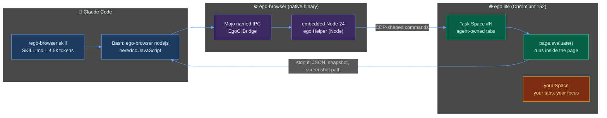
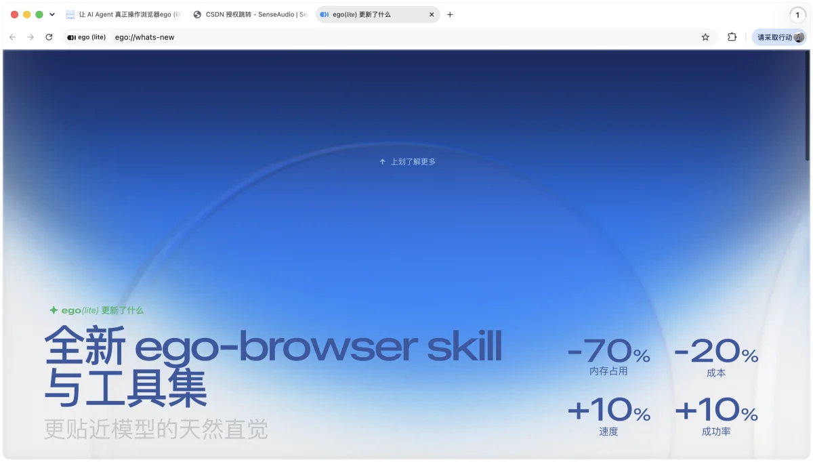
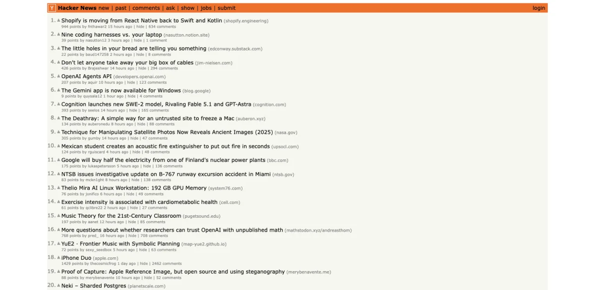

+++
date = '2026-09-10T10:00:00+08:00'
aliases = ['/posts/ai/2026-09-21-ego-lite-browser-review/']
draft = false
title = 'ego lite Review: Handing Claude Code Your Logged-In Browser'
description = 'ego lite v0.5 tested with Claude Code on 3 tasks vs agent-browser and Chrome DevTools MCP: 16s/$0.12 best, 195s worst. The token win is real; the isolation is not.'
toc = true
tags = ['ego lite', 'Claude Code', 'Browser Automation', 'AI Agent', 'Token Efficiency']
keywords = ['ego lite review', 'ego lite browser', 'ego browser claude code', 'ego lite vs agent-browser', 'browser for ai agents', 'claude code browser automation', 'ego lite skill install', 'ego lite spaces']

[[params.faqItems]]
question = "What is ego lite and how does it work with Claude Code?"
answer = "ego lite (citrolabs/ego-lite) is a free, closed-source Chromium fork for macOS that gives AI agents their own Spaces inside your daily browser. Claude Code drives it through the ego-browser skill: the agent writes a JavaScript snippet, the bundled ego-browser CLI runs it in an embedded Node 24 runtime, and page.evaluate() executes inside the page. In my September 2026 test a Hacker News extraction took one tool call, 16 seconds, and $0.12."

[[params.faqItems]]
question = "Is ego lite faster and cheaper than Vercel agent-browser?"
answer = "With Claude Code in full-access mode, yes: 16.4s/$0.12 vs 19.0s/$0.18 on Hacker News, and 40.5s/$0.22 vs 40.8s/$0.29 on a multi-page docs search. In Claude Code's default permission mode it was slower (76s vs 40s, 195s vs 43s) because heredoc JavaScript trips Claude Code's shell sanitizer. The saving comes from one-shot JavaScript, not from the snapshot, which cost 7,823 tokens on Hacker News versus agent-browser's 4,742."

[[params.faqItems]]
question = "Do ego lite Spaces isolate the agent from my logged-in session?"
answer = "No. Spaces isolate tabs, focus, and the visible window, not storage. A cookie and a localStorage value I set in one task space were readable from a second task space on the same profile, and open issue #303 shows a CDP cookie clear from a task space wiping the main Space's logins. Treat a Space as a private tab group over shared cookies, and give agents a dedicated ego lite profile."

[[params.faqItems]]
question = "Does ego lite work on Windows or Linux?"
answer = "As of September 2026, no. ego lite ships macOS builds for Apple Silicon and Intel only. Windows and Linux support is listed as Planned on the official roadmap with no date, and Windows-from-WSL2 is an open feature request (#374). Windows users should stay on Vercel agent-browser or Chrome DevTools MCP for now."

[[params.faqItems]]
question = "Why does the ego-browser skill fail in Claude Code with 'expansion obfuscation'?"
answer = "The skill's recommended pattern pipes JavaScript into ego-browser through a shell heredoc, and any object literal like { keep: [] } or { scope: 'full_page' } contains a brace next to a quote, which Claude Code's Bash guard rejects as 'Contains brace with quote character (expansion obfuscation)' in default permission mode. ego's own docs tell you to run Claude Code in full access; in that mode the same task went from 30 turns to 7."
+++


The first real task I gave ego lite was the one its whole pitch rests on: open GitHub and tell me who's logged in. The agent came back in 65 seconds with "not logged in." I *was* logged in. So was the browser. The agent had simply been handed the wrong one of my two imported profiles, and nothing in the skill, the docs, or the UI had told it that a second profile existed.

That's the review in miniature. [ego lite](https://github.com/citrolabs/ego-lite) is the most ambitious answer yet to a problem this blog has been circling since January — how to give a coding agent a browser without paying for it in tokens, flakiness, or your own sanity. The series went from headless drivers ([Vercel's agent-browser](/posts/ai/2026-01-13-vercel-agent-browser/)) to [attaching to your real browser](/posts/ai/2026-03-17-chrome-devtools-mcp-guide/) to [cutting the token bill to zero](/posts/ai/2026-04-18-playwright-cli-skill-zero-token-automation/) to a [12-star repo with the right cost model and no maintainer](/posts/ai/2026-07-27-ubrowser-review/). ego lite is the current end of that arc: one Chromium you use every day, in which your agents get their own Spaces, your logins, and a JavaScript API instead of a CLI. 15,666 GitHub stars as of September 10, 2026, up from about 7,900 when the Chinese tech press covered it on August 3.

I installed v0.5.0.28, drove it from Claude Code on three tasks of increasing difficulty, ran the same prompts through agent-browser and Chrome DevTools MCP, counted every token and every second, and then went looking for the seams. Cards on the table: at its best it was the cheapest agent browsing I have ever measured — one tool call, 16 seconds, twelve cents. At its worst it was the slowest — 30 turns and three minutes for a task agent-browser finished in 43 seconds. Both numbers are real, and the difference between them is a Claude Code setting, not the browser.

## What ego lite actually is, from the binary up

ego lite is a closed-source Chromium 152 fork from Citro Labs, distributed as a free DMG; the MIT-licensed GitHub repo holds only the `ego-browser` skill and docs. The pitch has three parts: **Spaces** (isolated workspaces inside one window — you browse in yours, agents work in theirs), **inherited state** (it imports your Chrome or Edge profile, cookies and extensions included), and **"code base, not CLI base"** — the agent writes JavaScript that runs against the page in one pass instead of issuing one shell command per click.

None of the existing coverage — [Hello.Reader's CSDN walkthrough](https://agent.csdn.net/6a62db7910ee7a33f291f217.html) is the clearest — explains what the CLI actually is, so I read the bundle. `ego-browser` is a 1.9 MB native arm64 Mach-O binary that lives inside the app (`ego Framework.framework/Versions/0.5.0.28/Helpers/`) and gets symlinked to `~/.local/bin` at onboarding. It doesn't open a TCP port or a WebSocket; `strings` shows it talks to the running app over a **Mojo named IPC channel** (`ego.mojom.EgoCliBootstrap` and `EgoCliBridge`), the same transport Chromium uses between its own processes. Your script runs in an embedded Node 24.18 runtime (a separate `ego Helper (Node)` process), against a small, deliberately un-Playwright API: `taskSpace()`, `page.goto()`, `page.snapshot()`, `page.click()`, `page.evaluate()`, and `page.cdp()` as the escape hatch.



The install is genuinely two commands. `npx skills add citrolabs/ego-lite` dropped the skill into `.agents/skills/ego-browser/` in 8.5 seconds (with a "High Risk" flag from the skills.sh scanner, which I'll come back to), and the app's own onboarding had already symlinked the same skill into `~/.agents/skills/` so every agent on the machine sees it. Typing `/ego-browser` in Claude Code loads a 19.5 KB SKILL.md — about 4,546 tokens by my count, versus 7,372 for agent-browser's core skill.



The app's own what's-new page for the September 10 v2.0.0 release claims the rewritten skill cuts memory 70%, cost 20%, and adds 10% to speed and success rate. No methodology is published for any of the four; keep that in mind when you read mine, which is.

Then it refused to run. Every `ego-browser nodejs` call answered "Please complete the onboarding process first. A setup window has opened" — with no setup window anywhere on screen, even though the app had imported my Chrome data two hours earlier. The missing step turned out to be an `ego://onboarding` page whose only content was "No importable browser data right now" and a Done button; pressing Done unlocked the CLI. Budget ten confused minutes for this.


## The receipts: three tasks, three tools, one model

Method, so you can reproduce it. Claude Code 2.1.268, `claude -p` with `--output-format json`, model pinned to Sonnet for every run, on an M5 MacBook Pro running macOS 26.5. Wall time is measured around the process; turns, cost, and tokens come from the JSON result. The same prompt went to each tool; only the sentence naming the tool changed. Baselines: [Vercel agent-browser](https://github.com/vercel-labs/agent-browser) 0.37.1 with its bundled skill, and [Chrome DevTools MCP](https://github.com/ChromeDevTools/chrome-devtools-mcp) 1.9.0 headless. The three tasks: **(a)** list Hacker News' top five titles with points; **(b)** open github.com and report the logged-in user; **(c)** search docs.python.org for `asyncio.gather`, open the result, and return the first code block verbatim.

The first table is what you get if you run Claude Code the way most people do — permission prompts on, with an allow-list for the browser command.

| Task | Tool | Wall | Turns | Cost | Calls blocked by Claude Code | Outcome |
|---|---|---:|---:|---:|---:|---|
| (a) HN top 5 | **ego lite** | 76.0s | 12 | $0.312 | 5 of 11 | ✅ correct |
| (a) HN top 5 | agent-browser | 39.9s | 11 | $0.298 | 4 of 10 | ✅ correct |
| (a) HN top 5 | Chrome DevTools MCP | 26.4s | 6 | $0.230 | 0 | ✅ correct (one 13,418-token snapshot) |
| (b) GitHub login | **ego lite**, default profile | 64.7s | 9 | $0.242 | 5 of 8 | ⚠️ "not logged in" — wrong profile |
| (b) GitHub login | **ego lite**, profile named | 35.6s | 6 | $0.178 | 2 of 5 | ✅ "logged in as heyuan110" |
| (c) Docs search | **ego lite** | 194.8s | 30 | $0.751 | 11 of 29 | ✅ correct, painfully |
| (c) Docs search | agent-browser | 42.6s | 13 | $0.305 | 1 of 11 | ✅ correct |
| (c) Docs search | Chrome DevTools MCP | 51.3s | 14 | $0.325 | 0 | ✅ correct |

Read the "blocked" column before anything else. ego lite's whole interaction model is a shell heredoc containing JavaScript, and Claude Code's Bash guard rejects any command where a brace sits next to a quote — which is to say any object literal: `{ keep: [] }`, `{ scope: "full_page" }`, `{ profileId: "Profile 1" }`. The error is `Contains brace with quote character (expansion obfuscation)`, and in `-p` mode it's a hard refusal, not a prompt. On task (c) the agent burned 11 of 29 calls on this, tried to write a script file instead (also refused — `Write` wasn't allow-listed), tried `printf`, tried `JSON.parse('{"scope":"full_page"}')` as a workaround, and eventually got there. agent-browser hit the same wall on its `eval --stdin` path, just less often, because most of its commands are flag-shaped.

ego's docs say to run Claude Code with "Full access." So I did — `--dangerously-skip-permissions` — and re-ran (a) and (c) for the two CLI tools. Chrome DevTools MCP wasn't blocked in the first round, so its numbers stand.

| Task | Tool | Wall | Turns | Browser calls | Cost | Tool-result tokens | Outcome |
|---|---|---:|---:|---:|---:|---:|---|
| (a) HN top 5 | **ego lite** | **16.4s** | **2** | **1** | **$0.123** | 151 | ✅ |
| (a) HN top 5 | agent-browser | 19.0s | 6 | 4 | $0.176 | 177 | ✅ |
| (c) Docs search | **ego lite** | 40.5s | 7 | 6 | $0.219 | 3,805 | ✅ |
| (c) Docs search | agent-browser | 40.8s | 12 | 10 | $0.290 | 4,253 | ✅ |

That's the number the marketing is about, and it holds. On Hacker News, one `ego-browser nodejs` call — `taskSpace`, `goto`, `waitForSelector`, one `page.evaluate` that maps the rows to `{title, points}` — and done: 2 turns, 151 tokens of tool output, 16.4 seconds of which most is Sonnet thinking. agent-browser needed `open`, `snapshot`, `eval`, `close`. On the docs task, the two tie on wall time and ego wins on turns and cost by about 25%. ego's own homepage claims "up to 3.45× faster than agent-browser" on complex tasks (the README says 2.5×; the numbers aren't published); my complex task came out even on time and cheaper by a quarter. Not 3.45×, but a real win — with the setting that its docs recommend and that most security-minded readers of this blog won't use.

## Where the token win actually comes from (not the snapshot)

Here is the misconception I most want to kill, because ego's own comparison matrix encourages it: the "compressed semantic input" checkbox. I loaded the exact same Hacker News front page in every tool and counted the snapshot each one hands the model, with the same `o200k_base` tokenizer I've used across this series.

| Tool | Snapshot | Chars | Tokens |
|---|---|---:|---:|
| **ego lite** | `page.snapshot()` (viewport) | 30,469 | **7,823** |
| **ego lite** | `page.snapshot({scope:"full_page"})` | 45,970 | 11,867 |
| agent-browser | `snapshot` (full a11y tree) | 27,845 | 7,368 |
| agent-browser | `snapshot -i` (interactive only) | 13,734 | **4,742** |
| Chrome DevTools MCP | `take_snapshot` | 39,123 | 13,418 |
| Playwright MCP | `browser_snapshot` (my July article-page measurement) | 28,874 | ~7,400 |
| ubrowser | compact format (100-element HN page, July) | — | ~1,720 |

ego's snapshot is *not* compact. It's a faithful accessibility tree with every `table > table_row > table_cell` level spelled out — Hacker News is nested tables all the way down, and the ego dump of the viewport alone costs more than agent-browser's interactive-only view of the whole page, and only 40% less than Chrome DevTools MCP's, which I called the most expensive in the business [back in July](/posts/ai/2026-07-21-claude-code-screenshot-mcp-frontend-debugging/). What it does have is refs (`[ref=7, loc=href:/newest]`) with stable-locator hints, iframe contents inline, and — per the v2.0.0 changelog — refs that survive `page.evaluate` calls, which was a real bug before September 9.

So why did the full-access run cost 151 tokens instead of 7,823? Because the agent never asked for a snapshot. It wrote `page.evaluate(() => [...document.querySelectorAll(".athing")].slice(0,5).map(...))` and got back a five-line JSON array. That is the [65-token `evaluate_script` pattern](/posts/ai/2026-07-21-claude-code-screenshot-mcp-frontend-debugging/) I've been preaching since July, and ego's contribution is to make it the *default* path rather than the expert path: the skill tells the model to write code, the runtime lets a whole navigate-wait-extract sequence ship in one process, and the snapshot is what you fall back to when you don't know the page. That's the correct design. It's the same insight ubrowser had — batch the steps, ship only the answer — with an actual company behind it and a screenshot tool.

The flip side showed up on docs.python.org. When the page is unfamiliar, the agent has to snapshot, and ego's snapshot of that page cost 8,300 chars per look; the docs site has three `input[name=q]` search boxes (one hidden), so `fill("css=input[name=q]")` threw `matched 3 elements`, the `@8` ref went stale after a re-snapshot, and the default-mode run spiraled to 30 turns. To be fair to ego, its error messages were the best of the three tools — "matched 3 elements (2 visible, 1 hidden). Candidates: 1. input 'Quick search' (hidden)…" tells the model exactly what to do next, which is what I dinged ubrowser for lacking. But the general rule from this series stands: **the browser tool doesn't decide your token bill; the agent's habit of asking for facts instead of trees does.** ego nudges the habit in the right direction and then hands you a tree as fat as anyone's when you ask for one.



## "Your logged-in browser" — half true, and the half that's false matters

The headline feature is the one the first paragraph tripped over, so let me lay out exactly what happened. ego lite's onboarding found two browsers on my Mac and imported both: Chrome's profile became ego's **Default** (`Bruce`), Edge's became **Profile 1** (`he bruce`). I live in Edge; that's where GitHub is signed in. `taskSpace()` with no arguments creates the space on the default profile, and the skill explicitly tells the agent not to "inspect or select profiles unless the user explicitly requests a particular profile." So the agent did the right thing by its instructions and got the wrong answer. Naming the profile — `taskSpace("…", { profileId: "Profile 1" })` — produced `logged in as heyuan110` in 36 seconds with 4 browser calls. If you have exactly one browser and one profile, you'll never see this. If you have two, or a work and a personal profile, you will, and the fix is one line the docs don't mention.

The bigger question is what "own Space" means for the data. The docs say each task space gets "its own native BrowserContext for cookies and storage," which any Playwright user reads as *isolation*. So I tested it: in task space A, on example.com, set `document.cookie = "isotest=fromA"` and a localStorage key; create task space B on the same profile, load example.com, read them back.

```json
{"spaceA":2,"spaceB":3,
 "seenInA":{"cookie":"isotest=fromA","ls":"fromA"},
 "seenInB":{"cookie":"isotest=fromA","ls":"fromA"}}
```

Space B saw everything. Spaces isolate **tabs, focus, and the window** — the thing you see in the overview screenshot, the thing that keeps an agent from hijacking your mouse — but on one profile they are one cookie jar. That's exactly why the agent lands on GitHub already logged in, and exactly why you should think of a Space as a private tab group over shared state, not a sandbox. Two open issues sharpen the point: [#303](https://github.com/citrolabs/ego-lite/issues/303) reports `cdp("Network.clearBrowserCookies")` from an agent task space logging the *user* out of every site in the main Space, and [#319](https://github.com/citrolabs/ego-lite/issues/319) shows `Storage.getCookies` from a task space on a secondary profile returning the default profile's full jar — 1,105 cookies, other profiles' auth included. [#315](https://github.com/citrolabs/ego-lite/issues/315) puts the whole thing in one sentence: model-generated JavaScript runs in a privileged Node process with unrestricted raw CDP and unrestricted outbound HTTP, so a prompt injection on any page the agent visits is a prompt injection with your session cookies in scope. To their credit, the ego team answered all three within a week or two, and the reply on #319 is the most honest line in the whole project: "A space is not the same as a profile, and spaces do not isolate cookies," with per-profile space creation promised for 0.5.0.x — which is the `profileId` option I used above, so that part shipped. The raw-CDP exposure in #315 is acknowledged and not yet fixed, and the repo's private vulnerability reporting was returning 403 when the reporter tried it.

Isolation between users and agents, though, held up under everything I threw at it. Six task spaces opened and loaded six real pages in 8.2 seconds without touching my tabs; the app cold-started from fully quit to first snapshot in 2.1 seconds without stealing focus from my terminal (the [focus-stealing bug](https://github.com/citrolabs/ego-lite/issues/284) filed against August builds didn't reproduce on 0.5.0.28); and the Spaces overview shows each agent's space labeled "running" with a live thumbnail, with a click to take it over. The CSDN piece quotes ego's own numbers for six concurrent tasks: "0.9 GB, 6 processes" for Space mode against "15 GB, 84 processes" for six separate browsers. For once a vendor number survived contact. My six spaces added exactly **6 processes and 0.91 GB** of RSS, going from 17 to 23 processes and 0.61 to 1.52 GB. The browser reclaimed most of it within a minute of idling, back down to 0.68 GB. I didn't measure the 84-process alternative; I believe it, and it's the least interesting comparison here, because nobody runs six full browsers for six tasks anyway.

## Rough edges, in the order they cost me time

- **The `-e` flag blocks on stdin.** `ego-browser nodejs -e '…'` never returns if its stdin is an open pipe — which it is inside most agent harnesses and CI runners. Three of my direct invocations hung until killed before I isolated it; `< /dev/null` fixes it. Heredocs are fine because the heredoc closes stdin.
- **The onboarding gate with no window.** Covered above; ten minutes, `ego://onboarding`, press Done.
- **Extensions import disabled.** Every Chrome extension arrived with "has been disabled — accept new permissions," and the app's first launch popped a permission bubble per extension in the toolbar. Fine for you; irrelevant to the agent, which doesn't get extension UI anyway.
- **Ownership flips silently.** After my cleanup script called `finish({ keep: [] })` on eight agent spaces, one survived as `ownership: "user"` — the GitHub tab had flipped it, per [#314](https://github.com/citrolabs/ego-lite/issues/314). It's harmless but it's a leaked renderer, and [#270](https://github.com/citrolabs/ego-lite/issues/270) says idle task spaces pile up across sessions.
- **Quitting loses your tabs.** When I quit ego lite to test cold start, it came back to a fresh New Tab; the three tabs I'd had open were gone. Chromium's "continue where you left off" is off by default here, and I'd turn it on before making this a daily driver.
- **macOS only, and the roadmap says "Planned" with no date for Windows and Linux.** [#203](https://github.com/citrolabs/ego-lite/issues/203), [#345](https://github.com/citrolabs/ego-lite/issues/345), and a [WSL2 request](https://github.com/citrolabs/ego-lite/issues/374) are the most-upvoted feature issues. If you're on Windows, this article is a preview, not a recommendation.
- **The skills.sh scanner flagged the skill "High Risk"** at install. Having read the skill, the flag is about capability, not malice: it teaches the model to run arbitrary JavaScript against a browser holding your cookies. That is the product. Decide accordingly.

Two things I expected to be rough and weren't: the skill's writing is excellent (the "use exactly one TaskSpace, print its id, resume it later" discipline saved the agent from tab sprawl in every run), and the v2 API's action receipts — popups, dialogs, downloads returned as data instead of surprises — are more thoughtful than agent-browser's.

## Verdict: use it, on a dedicated profile, with full access, on a Mac

My one-line judgment: **ego lite is the first agent browser where "your logged-in browser" is a two-command install and the token win is measurable rather than projected.** But that win only appears when you run Claude Code in full-access mode. And the isolation it implies does not exist at the cookie layer. So it belongs on a dedicated profile, signed into only the logins you'd hand an intern.

The comparison table I'd actually use, across everything measured in this series:

| | ego lite | agent-browser | Chrome DevTools MCP | Playwright MCP | ubrowser |
|---|---|---|---|---|---|
| Interface | JS via `ego-browser nodejs` | CLI, one command per action | MCP tools | MCP tools | MCP tools (batch) |
| Your logins | ✅ imported profile, shared jar | ❌ (unless you `connect` to your Chrome) | ✅ attach to real Chrome | ❌ | ❌ |
| Best measured run (HN) | 16.4s / 2 turns / $0.12 | 19.0s / 6 turns / $0.18 | 26.4s / 6 turns / $0.23 | — | 1 call / 641 tokens (July) |
| Snapshot cost, HN front page | 7,823 tokens | 4,742 (`-i`) | 13,418 | ~7,400 (July, article page) | ~1,720 (July) |
| Default-mode Claude Code | ❌ heredoc JS blocked | ⚠️ `eval` blocked | ✅ | ✅ | ✅ |
| Screenshot / evaluate | ✅ / ✅ | ✅ / ✅ | ✅ / ✅ | ✅ / ✅ | ❌ / ❌ |
| Platforms | macOS | macOS / Linux / Windows | all | all | all |
| Maintained | v2.0.0 on 2026-09-10 | active | active | active | abandoned Dec 2025 |

And the decision rule, since that's what you'll screenshot:

| If you… | Use |
|---|---|
| Are on a Mac, run Claude Code with bypass permissions, and your tasks need *your* logins (dashboards, admin panels, your own SaaS) | **ego lite**, on a dedicated profile that's logged into only those sites |
| Run agents in default permission mode and want the cheapest clean-room browsing | agent-browser (`snapshot -i` + `eval`), or [Playwright CLI in a skill](/posts/ai/2026-04-18-playwright-cli-skill-zero-token-automation/) |
| Are debugging your own frontend | Chrome DevTools MCP with targeted `evaluate_script`, as before |
| Need real isolation between the agent and your session | Not ego lite. Separate browser, separate profile, or a cloud browser |
| Are on Windows or Linux, or running in CI | Not ego lite, until the roadmap moves |

Three concrete setup rules, earned the hard way. One: create a fresh ego lite profile for agents and sign it into only what the agent needs. The shared cookie jar means "inherits your logins" also means "inherits your bank." Two: if you keep two browsers, check `profiles()` once and put the right `profileId` in your CLAUDE.md, or your agent will confidently report "not logged in." Three: never `-e` without `< /dev/null`, and never `cdp("Network.clear…")` from a task space unless you enjoy re-authenticating everything.

The bigger picture, for anyone following the series: the field has now split cleanly into two philosophies. Drivers (agent-browser, Playwright, the MCPs) give you a browser the agent owns and you don't; ego lite gives you a browser you own and the agent borrows. The second is more useful and more dangerous in exactly equal measure, and the token economics — the thing I started measuring in January — turned out to be the easy part. Both camps have converged on "write code, ship the answer, don't ship the DOM." What separates them now is whose cookies are in the jar.

## FAQ

**What is ego lite and how does it work with Claude Code?**

A free, closed-source Chromium 152 fork for macOS with agent-owned Spaces inside your daily browser. Claude Code uses the `ego-browser` skill: the agent writes JavaScript, the bundled native CLI sends it over Mojo IPC to an embedded Node runtime, and `page.evaluate()` runs inside the page. My best run was one tool call, 16.4 seconds, $0.12.

**Is ego lite faster and cheaper than Vercel agent-browser?**

In full-access mode, yes — 16.4s/$0.12 vs 19.0s/$0.18 on Hacker News; even on time and 25% cheaper on a multi-page docs search. In Claude Code's default permission mode it was slower, because heredoc JavaScript trips the shell sanitizer.

**Do ego lite Spaces isolate the agent from my logged-in session?**

No. A cookie set in one task space was readable in another on the same profile, and issue #303 shows a task-space cookie clear logging out the main Space. Spaces isolate tabs and focus; give agents a dedicated profile.

**Does ego lite work on Windows or Linux?**

Not as of September 2026. Both are "Planned" on the roadmap with no date.

**Why does the skill fail with "expansion obfuscation" in Claude Code?**

Because any JavaScript object literal in a heredoc puts a brace next to a quote, which Claude Code's Bash guard rejects in default permission mode. ego's docs say to use full access; the same docs task went from 30 turns to 7 when I did.

## Related Reading

- [ubrowser Review: Fastest Cheapest Browser Automation? Tested](/posts/ai/2026-07-27-ubrowser-review/) — the abandoned repo that got the cost model right first; ego lite is what it looked like it wanted to become
- [Browser Automation in Claude Code: 5 Tools Compared](/posts/ai/2026-01-28-claude-code-browser-automation/) — the January field map this review updates
- [Claude Code Screenshot MCP Setup: Browser Automation 2026](/posts/ai/2026-07-21-claude-code-screenshot-mcp-frontend-debugging/) — where the 13,418-token snapshot and the 65-token evaluate come from
- [Vercel Agent Browser: AI-Native Browser Automation CLI Tool](/posts/ai/2026-01-13-vercel-agent-browser/) — the baseline tool in this test, back when it launched
- [Playwright CLI + Skills: 0-Token Browser Automation](/posts/ai/2026-04-18-playwright-cli-skill-zero-token-automation/) — the pattern to use if you want ego-class economics without ego's cookie jar

## Series Navigation

This is Part 7 of the **Browser Automation for AI Agents** series — the arc from headless drivers, to attaching to your real browser, to cutting the token bill, to sharing your logged-in session:

1. [Vercel Agent Browser](/posts/ai/2026-01-13-vercel-agent-browser/) — a snapshot-driven CLI built for agents, not test suites
2. [Browser Automation in Claude Code: 5 Tools Compared](/posts/ai/2026-01-28-claude-code-browser-automation/) — the field map — token cost, speed, stability
3. [Chrome DevTools MCP Setup 2026](/posts/ai/2026-03-17-chrome-devtools-mcp-guide/) — attaching to your real browser, and the port 9222 traps
4. [Playwright CLI + Skills: 0-Token Automation](/posts/ai/2026-04-18-playwright-cli-skill-zero-token-automation/) — the pattern that removes the MCP token tax
5. [Claude Code Screenshot MCP Setup](/posts/ai/2026-07-21-claude-code-screenshot-mcp-frontend-debugging/) — the frontend debugging loop, 10,220 vs 65 tokens
6. [ubrowser Review](/posts/ai/2026-07-27-ubrowser-review/) — the right design trapped in an abandoned repo
7. **This article**: ego lite Review — handing agents your logged-in session through Spaces
