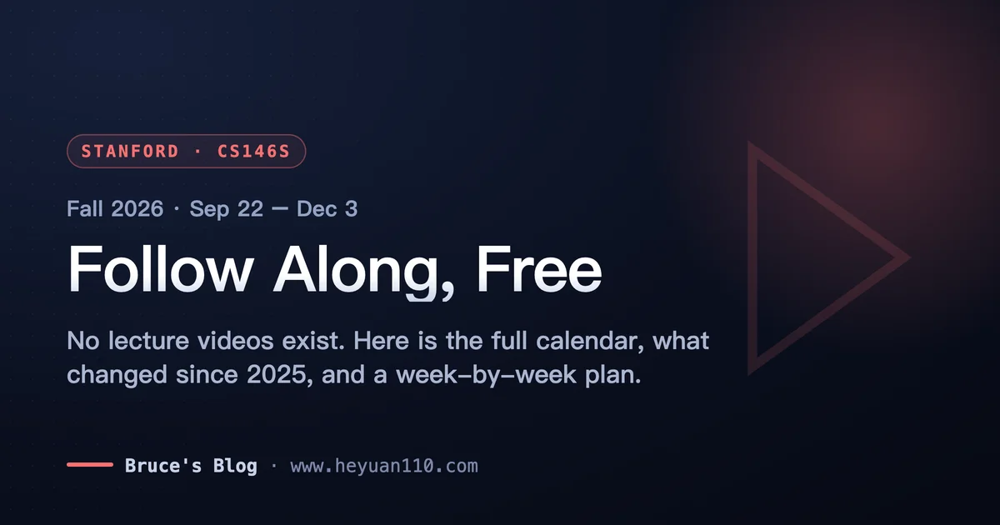
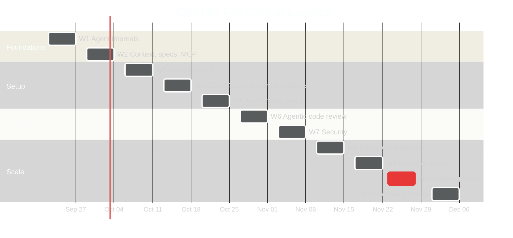
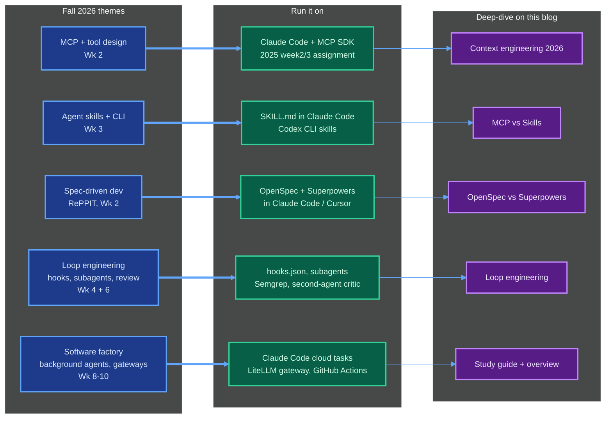

+++
date = '2026-09-11T10:00:00+08:00'
draft = false
title = 'CS146S Fall 2026: How to Watch and Follow Along Free'
description = 'Stanford CS146S Fall 2026 runs Sep 22 to Dec 3 with no official lecture videos. What is free, full calendar, what changed since 2025, and a follow-along plan.'
toc = true
tags = ['Stanford CS146S', 'AI Coding', 'Learning Path', 'Agentic Engineering']
keywords = ['cs146s fall 2026', 'cs146s video', 'cs146s online', 'cs146s course', 'stanford vibe coding course', 'cs146s free', 'how to watch cs146s', 'cs146s enroll', 'cs146s schedule 2026']

[[params.faqItems]]
question = "Is CS146S free?"
answer = "The materials are free; the course is not. As of September 2026 the syllabus, the full Fall 2025 slide decks, readings, and eight weeks of assignment code are public at themodernsoftware.dev and on GitHub. Enrollment, grading, Ed Discussion, Canvas, office hours, and the final project review are for registered Stanford students only."

[[params.faqItems]]
question = "Where are the CS146S lecture videos?"
answer = "There are none. Stanford has not published lecture recordings for CS146S in Fall 2025 or Fall 2026. The nine-video YouTube playlist that ranks for 'cs146s video' is a third-party channel (AI With Ryan) posting 14-16 minute AI-narrated recaps of the Fall 2025 slides, not classroom footage. The closest official substitutes are the Google Slides decks linked from the Fall 2025 syllabus."

[[params.faqItems]]
question = "Can non-Stanford students enroll in CS146S?"
answer = "No. CS146S is a 3-4 unit Stanford course (Letter or Credit/No Credit). The course FAQ limits auditing to Stanford students and staff, and I found no SCPD or Stanford Online listing for it. Students without the formal prerequisites must apply by September 27. Everyone else follows along with the public materials or takes the instructor's paid 4-week Maven cohort."

[[params.faqItems]]
question = "What's new in CS146S Fall 2026 vs Fall 2025?"
answer = "Most of the syllabus. Lectures move from Mon/Fri to Tue/Thu (Sep 22 to Dec 3). Six of ten weeks are new topics: agent skills and CLI, CLAUDE.md/AGENTS.md/hooks/subagents, agent-ready codebases, background agents, AI-native teams (MCP portals, LLM gateways), and the software factory. Grading changes from 80/15/5 to Final Project 50%, Open Source Contributions 30%, Assignments 15%, Participation 5%. New guests include Lee Robinson (Cursor), Eno Reyes (Factory), Amjad Masad (Replit), and Elad Gil."

[[params.faqItems]]
question = "How long does it take to follow CS146S along?"
answer = "The official FAQ budgets 10-12 hours per week for enrolled students. Following along without grades, plan on 5-6 hours per week for ten weeks: one lecture topic, one reading, one hands-on exercise, and one open-source contribution attempt every two weeks. If you cannot commit to the quarter cadence, the two-week core route in my CS146S study guide is the better use of your time."
+++

You can follow Stanford **CS146S Fall 2026** for free starting Tuesday, September 22, but you can't *watch* it: as of September 11, 2026, there are no official lecture recordings, and the "CS146S video" playlist Google keeps surfacing is a third-party recap of *last year's* syllabus. That distinction matters more this year than last, because the Fall 2026 syllabus is a different course. Six of ten weeks are new topics, the grading now puts 30% on open-source contributions, and Tuesday/Thursday replaces Monday/Friday.

This page is the operational answer to the questions people keep landing here with: where the videos are (and aren't), the exact Fall 2026 calendar, what's free versus enrollment-only, what changed since Fall 2025, and a week-by-week plan that pairs each new theme with a tool you can run tonight. I'm deliberately not re-explaining the ten-week syllabus or the guest lineup here; that lives in my [CS146S overview](/posts/ai/2026-02-24-stanford-cs146s-overview/). And the lecture-by-lecture notes for the Fall 2025 material are in the [CS146S study guide](/posts/ai/2026-07-02-cs146s-study-guide/). This post is the layer on top for people who want to run the quarter in real time.

One receipt up front, because the calendar is the whole point. The official site's Calendar tab is client-rendered and currently links to `#`, so I pulled the Fall 2026 schedule straight out of the site's JavaScript bundle on September 11. Every date and speaker below comes from that data, not from a secondhand post.

## What "CS146S Video" Actually Gets You

**There is no official CS146S lecture video, and there never was.** A student who worked through the Fall 2025 course wrote it plainly in his [notes repo](https://github.com/georgestephenson/cs146s-modern-software-dev): "As of writing there are no video recordings of the lectures that are publicly available." Nothing on the [Fall 2026 site](https://themodernsoftware.dev/) changes that. Course materials and submissions go through Stanford Canvas; Ed Discussion links go "to enrolled students."

So what is the playlist that ranks for the query? It's [CS146S The Modern Software Development](https://www.youtube.com/playlist?list=PLxpwjSdVZQ95OWe3QvkVEcU1f1X-6NDj9) on a channel called AI With Ryan: nine videos, 14 to 16 minutes each, 29,044 views as of this week, last updated February 16, 2026. They're AI-narrated summaries of the Fall 2025 slide decks. The Week 1 description even opens by calling CS146S a course on "scalable systems, real-world algorithms, and high-performance engineering," which it is not. They're fine as a commute-length preview of the 2025 topics. They are not lectures, and they cover a syllabus that Fall 2026 has largely replaced.

Here's the honest inventory of everything you can actually press play on:

| Source | What it is | Term covered | Verdict |
|---|---|---|---|
| [AI With Ryan playlist](https://www.youtube.com/playlist?list=PLxpwjSdVZQ95OWe3QvkVEcU1f1X-6NDj9) | 9 AI-narrated recaps, 14-16 min each | Fall 2025 | Preview only; not lectures |
| [From Writing Code to Managing Agents](https://www.youtube.com/watch?v=wEsjK3Smovw) (EO) | Interview with Mihail Eric | Course philosophy | Worth 30 minutes for the "agent manager" framing |
| [The Modern Software Engineer](https://www.youtube.com/watch?v=jOe4fJSc2IE) (AAIF Live) | Conference talk by Eric | Course philosophy | Same thesis, different audience |
| Fall 2025 Google Slides | Linked per session on the [/fall2025](https://themodernsoftware.dev/fall2025) syllabus tab | Fall 2025 | The real primary source; 17 decks |
| Fall 2026 slides | Not posted as of Sep 11 | Fall 2026 | Check the syllabus tab each Tuesday |

The practical consequence: "how can I watch it" has the same answer as "how can I follow along." You read the deck, do the reading, run the exercise, and you do it on the week the class does, so the guest-talk chatter on X and the speakers' own posts land while the topic is fresh. That's the plan in the second half of this post.

## The CS146S Fall 2026 Calendar

**Fall 2026 runs ten weeks, Tuesday and Thursday, from September 22 to December 3, in room 420-041.** Tuesdays are Eric's lectures; Thursdays are mostly guests. Stanford's [2026-27 academic calendar](https://studentservices.stanford.edu/calendar-events/academic-calendars/future-academic-calendars/stanford-academic-calendar-2026-2027) puts instruction start on September 22, the study-list deadline on October 9, Thanksgiving recess November 23-27, last day of classes December 4, and exams December 7-11. The course skips the Thanksgiving week entirely, which is why Week 10 lands on December 1.

| Wk | Tuesday lecture | Thursday session | Guest |
|---|---|---|---|
| 1 | Sep 22: Course intro + build Claude Code in 200 lines | Sep 24: How SOTA coding agents are designed (system prompts) | — |
| 2 | Sep 29: Advanced prompting + RePPIT, spec-driven development | Oct 1: Full introduction to MCP and tool calling | — |
| 3 | Oct 6: All about agent skills (incl. web skills) | Oct 8 | Lee Robinson, VP DevRel @ Cursor |
| 4 | Oct 13: Customizing your setup (CLAUDE.md, AGENTS.md, hooks) | Oct 15 | Boris Cherny, creator of Claude Code @ Anthropic |
| 5 | Oct 20: Agent readiness in your repos | Oct 22 | Eno Reyes, CTO @ Factory |
| 6 | Oct 27: Agentic code review, best practices and architectures | Oct 29 | Silas Alberti, SVP Research @ Cognition |
| 7 | Nov 3: Security in AI codebases | Nov 5 | Isaac Evans, CEO @ Semgrep |
| 8 | Nov 10: Background agents, launching tasks asynchronously | Nov 12 | Rajesh Bhatia, Senior Director @ Cloudflare |
| 9 | Nov 17: Guest, Elad Gil, investor @ Gil Capital | Nov 19 | Amjad Masad, CEO @ Replit |
| — | Nov 23-27: Thanksgiving recess, no class | | |
| 10 | Dec 1: Coding agents in big teams (MCP portals, gateways, routing) | Dec 3: The Software Factory: self-running, self-improving systems | — |

Two logistics notes for people outside California. Lecture times aren't published on the public site, only the days. And Pacific time flips from PDT (UTC-7) to PST (UTC-8) on November 1, 2026, so a Thursday afternoon guest talk is Friday early morning in Beijing, Singapore, or Tokyo either way, and one hour later after the switch. If you're following from Europe, Thursday afternoon Pacific is late Thursday evening for you. Since you can't attend anyway, what this actually affects is *when* the post-talk material shows up: speakers' slides and threads tend to land within 24 hours, so a Friday-morning check on the syllabus tab and on X is the habit that pays off.

## What's New in Fall 2026 vs Fall 2025

**Fall 2025 was a lifecycle tour; Fall 2026 is an operator's manual.** The 2025 syllabus walked the SDLC (prompting, agents, IDE, terminal, testing, review, app building, ops, future). The 2026 syllabus assumes you already live inside a coding agent and asks how you configure, constrain, review, parallelize, and scale it. Here's the diff, item by item:

| Dimension | Fall 2025 | Fall 2026 | My read |
|---|---|---|---|
| Days | Mon / Fri | Tue / Thu | Guest talks now mid-week; slides land before the weekend |
| Grading | Final project 80%, assignments 15%, participation 5% | Final project 50%, **open source contributions 30%**, assignments 15%, participation 5% | The biggest change on the page |
| Week 1 | LLM basics, prompting | Build Claude Code in 200 lines, read production system prompts | Deep end, day one |
| Week 2 | Agent anatomy, MCP | RePPIT + spec-driven dev, MCP | Specs promoted to a core method |
| Week 3 | AI IDE, context | **Agent skills + CLI** | New |
| Week 4 | Agent patterns | **CLAUDE.md / AGENTS.md, hooks, subagents** | New |
| Week 5 | Warp terminal | **Agent-ready codebases** | Terminal week gone; readiness scoring in |
| Week 6 | Testing + security | Agentic code review | Review gets its own week, earlier |
| Week 7 | Code review | Security (SAST/SCA, prompt injection) | Swapped order with review |
| Week 8 | One-prompt app building | **Background agents, fleets, issue-to-PR** | New |
| Week 9 | Post-deployment ops | **AI-native team: MCP portals, LLM gateways, cost routing** | New |
| Week 10 | Future of SWE | **The Software Factory** | New |
| Returning guests | — | Boris Cherny, Silas Alberti, Isaac Evans | Anthropic, Cognition, Semgrep again |
| New guests | — | Lee Robinson (Cursor), Eno Reyes (Factory), Rajesh Bhatia (Cloudflare), Elad Gil, Amjad Masad (Replit) | Two of the five run agent companies |
| Dropped | Zach Lloyd (Warp), Tomas Reimers (Graphite), Gaspar Garcia (Vercel), Resolve.ai, Martin Casado (a16z) | — | Terminal, UI-gen, and ops angles cut |

The 30% for open-source contributions is the line to stare at. Fall 2025 was "build a thing"; Fall 2026 is "get a PR merged into a real project with an agent." The site lists fifteen open-source partners (OpenHands, marimo, CrewAI, Semgrep, Milvus, Unsloth, cmux, pi.dev, Arize Phoenix, Browserbase, CopilotKit, HeyGen, Vercel, Warp, Anyscale), and it's a safe bet that's the contribution pool. Read it as the instructor saying out loud that agent-built code that never leaves your laptop isn't the skill being taught anymore.

Two things haven't caught up yet, and you should know before you start. The [assignments repo](https://github.com/mihail911/modern-software-dev-assignments) sits at 3,950 stars and 949 forks, but its last push was November 10, 2025; it still has `week1` through `week8` for the 2025 syllabus and nothing for 2026. And the Fall 2026 syllabus entries currently have topics and speakers but no readings, no slides, and no assignment links. I'd expect those to appear week by week, the way they did in 2025. Until then, the 2025 repo is the only runnable material, and about half of it maps cleanly onto the new weeks (the table further down says which half).

## Free vs Enrollment-Only

**"Is CS146S free?" has a two-part answer: the materials are, the course isn't.** The [Stanford bulletin](https://bulletin.stanford.edu/courses/2274401) lists it as 3-4 units, Letter or Credit/No Credit, with a September 27 application deadline for students who lack the formal prerequisites (CS111 and CS161 equivalents). The course FAQ says auditing is open "to Stanford students and staff." I searched for an SCPD or Stanford Online listing and found none, so as of today there's no route for a working engineer to enroll remotely.

| You get | Free, public | Enrolled Stanford students only |
|---|---|---|
| Syllabus with topics, dates, speakers (both terms) | Yes | |
| Fall 2025 slide decks, readings, 8 weeks of assignment code | Yes | |
| Fall 2026 slides and readings | As they're posted (none yet) | |
| Lectures in 420-041, Tue/Thu | | Yes |
| Guest Q&A (Cherny, Robinson, Masad, and the rest) | | Yes |
| Ed Discussion, Canvas, office hours (Fri 12:00-12:30) | | Yes |
| Graded assignments and final project feedback | | Yes |
| Open-source contribution as a graded, scaffolded deliverable | Self-imposed only | Yes |
| Units on a Stanford transcript | | Yes |
| Tool subscriptions (Claude Code and similar) | Your own bill; the FAQ warns "some cloud-based services may require subscriptions" | Course "will provide access or alternatives where possible" |

If you want live instruction from Eric without a Stanford ID, the only option is his paid Maven course, [AI Software Development: From First Prompt to Production Code](https://maven.com/the-modern-software-developer/ai-course): four weeks, 3-4 hours a week, eight live sessions. Its module list mirrors the Fall 2026 themes almost line for line ("Build and Integrate an MCP Server or Agent Skill," "Implementing the RePPIT Dev Loop"), which tells you the new Stanford syllabus and the public course were designed together.

Two caveats I can't resolve from outside: the most recent cohort I can see in the page data ran June 22 to July 17, 2026, with no fall cohort listed yet, and the price isn't shown publicly without going through checkout. Treat it as the "I need feedback and a deadline" option, not the default.

## The Follow-Along Plan: Each New Theme, Paired With a Tool

**Every one of the five headline themes on the Fall 2026 site (MCP, agent skills, spec-driven development, loop engineering, the software factory) already has a runnable 2026 stack, and most of them have a deep-dive on this blog.** That's the pairing that makes following along without a classroom actually work: the lecture gives you the *why* and the vocabulary; the tool gives you the reps.

The week-by-week version below is the thing to screenshot. "2025 material" is what's runnable today from the public repo and slides; "Do this" is the one exercise I'd spend the week's hours on; "Read" is the post on this blog that goes deeper than the deck will.

| Wk | Dates | Theme | 2025 material you can use now | Do this (4-6 hrs) | Read |
|---|---|---|---|---|---|
| 1 | Sep 22-24 | Agent internals | 2025 W2 Mon deck "Building a coding agent from scratch" + completed exercise | Write a 200-line agent loop with read/write/edit/bash tools; then diff it against a real CLI agent's system prompt | [Study guide, Weeks 1-2](/posts/ai/2026-07-02-cs146s-study-guide/) |
| 2 | Sep 29-Oct 1 | Specs, RePPIT, MCP | 2025 W3 assignment "Build a Custom MCP Server"; W3 design-doc template | Ship one MCP server, then run the same feature spec-first with OpenSpec and compare token spend | [OpenSpec + Superpowers workflow](/posts/ai/2026-06-28-openspec-superpowers-workflow/) |
| 3 | Oct 6-8 | Agent skills + CLI | None (new topic) | Convert one of your MCP tools into a SKILL.md + script; measure the context cost of each | [MCP vs Skills: why CLI + Skill wins](/posts/ai/2026-07-04-cli-skills-vs-mcp/) |
| 4 | Oct 13-15 | CLAUDE.md, AGENTS.md, hooks, subagents | 2025 W4 "Coding with Claude Code" assignment; Anthropic's Claude Code best practices | Add a lint/test hook that blocks bad commits; split one task into planner / implementer / reviewer subagents | [Context engineering 2026](/posts/ai/2026-06-16-context-engineering-2026/) |
| 5 | Oct 20-22 | Agent-ready codebases | None (new topic) | Score one of your repos: docs, tests, checks, structure; fix the top two gaps an agent trips on | [Triple stack: Claude Code + OpenSpec + Superpowers](/posts/ai/2026-04-09-claude-code-openspec-superpowers/) |
| 6 | Oct 27-29 | Agentic code review | 2025 W7 "Code Review Reps" assignment | Adversarially review an AI-written PR with a second agent as critic; count what it catches vs misses | [Loop engineering: a critic that says no](/posts/ai/2026-07-05-loop-engineering/) |
| 7 | Nov 3-5 | Security | 2025 W6 "Writing Secure AI Code" assignment; Semgrep blog on finding vulns with Claude Code | Run Semgrep on your agent-built repo; then try one prompt-injection attack on your own MCP server | [Overview, Week 6 + guests](/posts/ai/2026-02-24-stanford-cs146s-overview/) |
| 8 | Nov 10-12 | Background agents | None (new topic) | Wire one issue-to-PR trigger (GitHub issue label or Slack message) to a cloud-run agent; review the PR cold | [Loop engineering: stop conditions](/posts/ai/2026-07-05-loop-engineering/) |
| 9 | Nov 17-19 | AI-native team | None (new topic) | Put an LLM gateway in front of your agents, route one cheap task to a cheaper model, look at the bill | [Context engineering 2026](/posts/ai/2026-06-16-context-engineering-2026/) |
| — | Nov 23-27 | Recess | | Catch-up week; this is when you land your open-source PR | |
| 10 | Dec 1-3 | Software factory | None (new topic) | Chain Weeks 4, 6, and 8 into one unattended pipeline: spec in, reviewed PR out; write down where it broke | [MCP vs Skills](/posts/ai/2026-07-04-cli-skills-vs-mcp/) |

Notice where the 2025 material runs out: Weeks 3, 5, 8, 9, and 10 have no public assignment yet. That's not a reason to wait. Those are exactly the weeks where the 2026 tooling is furthest ahead of any syllabus, and the exercises above are what practitioners were already doing this summer. If the course posts an official assignment for one of those weeks, do that one instead and treat mine as the warm-up.

Two things not to do. Don't spend Week 1 re-reading the 2025 prompting deck; Fall 2026 skips prompting basics for a reason, and if you need them, the study guide's two-week core is faster. And don't stack the Maven cohort on top of this plan; the two overlap enough that you'd be paying for the same reps with a deadline attached.

One thing worth doing: pair CS146S with the agent courses running in parallel this fall, because they cover what CS146S deliberately skips (training and evaluating the agent itself). Stanford [CS329Z: Engineering AI Agents](https://cs329z.stanford.edu/) (Diyi Yang, Sep 23 to Dec 2) has a public syllabus, though its recordings are Canvas-only. CMU's [11-768: AI Agents](https://www.cmu-agents.com/) (Graham Neubig and Daniel Fried) is the one that actually posts lecture video: four Fall 2026 lectures were on YouTube as of September 11, with more landing as the term runs. And Stanford [CS329A: Self-Improving AI Agents](https://cs329a.stanford.edu/) has all nine lectures from its last run on Stanford Online's YouTube channel. If you only have bandwidth for one companion, CMU's is the closest thing to the "watchable" course people keep searching for.

## What You Lose by Not Enrolling

**You lose the two things a syllabus can't ship: feedback on your final project, and being in the room for the guest Q&A.** Everything else is recoverable with discipline. Here's the honest accounting:

- **Final project feedback (50% of the grade).** A TA reading your project and telling you where the agent workflow was fake is the single most valuable thing enrolled students get. Substitute: post the project publicly and ask for review in the repo of the tool you used. It's worse, but it's not nothing.
- **Guest Q&A.** Eight practitioners, including the people who run Cursor's developer relations, Anthropic's Claude Code, Factory, Cognition, Semgrep, Cloudflare's agent work, and Replit. You get their slides if they post them and whatever they tweet. You don't get to ask Boris Cherny why hooks are designed the way they are.
- **The 30% open-source scaffold.** Enrolled students will have partner repos, presumably some mentoring, and a grade riding on a merged PR. You have the same fifteen partner repos on the public site. Pick one by Week 4, ship something by the Thanksgiving recess, and you've reproduced the deliverable, minus the grade.
- **Cohort pressure.** The FAQ budgets 10-12 hours a week. Nobody following along on their own sustains that for ten weeks; 5-6 hours is what I've seen people actually keep up, which is why the table above scopes each week to one exercise.

What you don't lose is the content. Every deck the class sees will, based on the 2025 pattern, be a Google Slides link on the syllabus tab within days. The readings are public URLs. The tools are the same ones you'd install anyway. If you follow the calendar, do the exercises, and land one PR, you'll finish the quarter with more evidence of skill than most enrolled students had in December 2025, when the deliverable was still a solo project.

## Where This Page Stops

This post is the calendar and the plan. It intentionally doesn't re-explain what each lecture teaches or grade the 2025 lectures; that's the job of the [overview](/posts/ai/2026-02-24-stanford-cs146s-overview/) and the [study guide](/posts/ai/2026-07-02-cs146s-study-guide/). I'll update the calendar table if the course posts times, slides, or a Fall 2026 assignments branch, and I'll note it at the top when I do.

Three facts I couldn't verify and want on the record: the lecture time of day (not on the public site), the Maven course price and whether a fall cohort exists, and whether the 30% open-source contributions are restricted to the listed partner projects. If you're enrolled and know any of these, the comments are open.

## Related Reading

- [Stanford CS146S: The Modern Software Developer, 2026 Guide](/posts/ai/2026-02-24-stanford-cs146s-overview/): the full ten-week breakdown and guest lineup
- [CS146S Study Guide 2026: Lecture-by-Lecture Notes and Workbook](/posts/ai/2026-07-02-cs146s-study-guide/): verdicts and exercises for the Fall 2025 material
- [Loop Engineering: Building the Cage Your AI Agent Runs In](/posts/ai/2026-07-05-loop-engineering/): the discipline behind Weeks 4, 6, and 8
- [MCP vs Skills: Why CLI + Skill Wins the Agent Toolchain](/posts/ai/2026-07-04-cli-skills-vs-mcp/): the Week 3 argument, with token numbers
- [OpenSpec vs Superpowers: My Spec-Driven Workflow](/posts/ai/2026-06-28-openspec-superpowers-workflow/): spec-driven development in practice for Week 2
- [Context Engineering for Coding Agents 2026](/posts/ai/2026-06-16-context-engineering-2026/): what to put in CLAUDE.md and what to leave out
