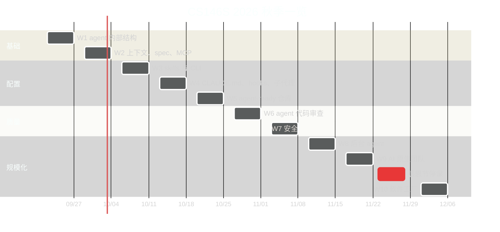
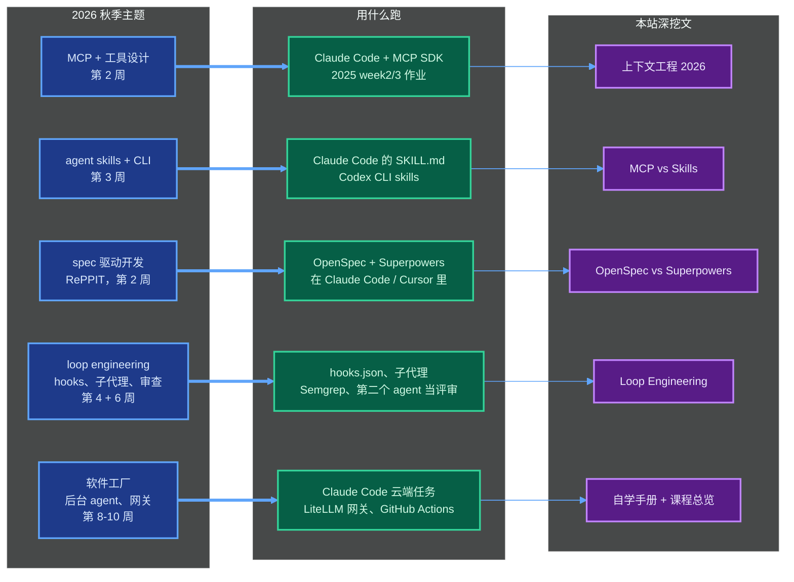

+++
date = '2026-09-11T10:00:00+08:00'
draft = false
title = '斯坦福 CS146S 2026 秋季开课了：不注册怎么免费跟课'
description = '斯坦福 CS146S 2026 秋季 9 月 22 日开课到 12 月 3 日。官方没有录像，本文给出完整课程表、免费与付费边界、对比 2025 的新内容，以及国内时区的逐周跟课方案。'
toc = true
tags = ['Stanford CS146S', 'AI Coding', 'Learning Path', 'Agentic Engineering']
keywords = ['斯坦福 cs146s', 'cs146s 课程', 'cs146s 视频', '斯坦福 vibe coding 课程', 'cs146s 免费', 'cs146s 2026 秋季', 'cs146s 怎么看', 'cs146s 报名', 'cs146s 课程表']

[[params.faqItems]]
question = "CS146S 是免费的吗？"
answer = "材料免费，课程本身不免费。截至 2026 年 9 月，官网 themodernsoftware.dev 公开了大纲、2025 秋季全部 PPT、阅读材料，GitHub 上有 8 周作业代码，都能免费看。但注册、评分、Ed 讨论区、Canvas、答疑时间和期末项目反馈只对斯坦福在校学生开放。"

[[params.faqItems]]
question = "CS146S 的课程视频在哪里看？"
answer = "没有官方视频。2025 秋季和 2026 秋季斯坦福都没有发布课堂录像。搜「cs146s 视频」排第一的是一个 9 集 YouTube 播放列表，来自第三方频道 AI With Ryan。它是用 AI 配音把 2025 年 PPT 讲一遍的 14-16 分钟摘要，不是课堂实录。最接近官方的替代品是 2025 秋季大纲页上每节课挂的 Google Slides。"

[[params.faqItems]]
question = "非斯坦福学生能报名 CS146S 吗？"
answer = "不能。CS146S 是 3-4 学分的斯坦福正式课程（字母评分或 Credit/No Credit）。官方 FAQ 写明旁听只对斯坦福学生和教职工开放。我也没有找到 SCPD 或 Stanford Online 的远程版本。没有正式先修课的斯坦福学生要在 9 月 27 日前提交申请。校外的人只能跟着公开材料学，或者报讲师在 Maven 上开的 4 周付费班。"

[[params.faqItems]]
question = "CS146S 2026 秋季和 2025 秋季有什么不同？"
answer = "大纲改了大半。上课日从周一/周五改为周二/周四（9 月 22 日到 12 月 3 日）。10 周里有 6 周是新主题：agent skills 与 CLI、CLAUDE.md/AGENTS.md/hooks/子代理、agent-ready 代码库、后台 agent、AI 原生团队（MCP 门户、LLM 网关）、软件工厂。评分从 80/15/5 改为期末项目 50%、开源贡献 30%、作业 15%、参与 5%。新嘉宾有 Lee Robinson（Cursor）、Eno Reyes（Factory）、Amjad Masad（Replit）和 Elad Gil。"

[[params.faqItems]]
question = "跟完 CS146S 要花多长时间？"
answer = "官方 FAQ 给在校生的预算是每周 10-12 小时。不拿学分只跟课的话，按每周 5-6 小时、连续 10 周来规划。每周一个讲座主题、一篇阅读、一个动手练习，每两周试着提一次开源 PR。如果保证不了学期节奏，不如走我那篇 CS146S 自学手册里的两周速通路线。"
+++

斯坦福 **CS146S 2026 秋季** 9 月 22 日（周二）开课。校外的人可以免费跟，但没法「看」。截至 2026 年 9 月 11 日，官方没有发布任何课堂录像。搜「cs146s 视频」冒出来的那个播放列表，是第三方用 AI 配音复述**去年**大纲的摘要。

这个差别今年格外重要。2026 秋季的大纲是一门换了半个身子的新课。10 周里 6 周是新主题，评分把 30% 压在开源贡献上，上课日从周一/周五改成了周二/周四。

这篇是给「想实时跟课」的人写的操作页。先回答视频到底有没有，再给出 2026 秋季精确到日的课程表。然后划清哪些免费、哪些只对注册学生开放，列出比 2025 年多了什么。最后是一份把每个新主题和你手上工具对上号的逐周方案。

10 周大纲和嘉宾阵容我不在这里重讲，那些写在[CS146S 课程总览](/zh/posts/ai/2026-02-24-stanford-cs146s-overview/)里。2025 秋季材料的逐讲笔记，写在[CS146S 自学手册](/zh/posts/ai/2026-07-02-cs146s-study-guide/)里。这一篇只加「跟学期走」的那一层。

先交一张收据，因为课程表就是这篇的全部价值。官网的 Calendar 标签是前端渲染的，链接现在指向 `#`。我在 9 月 11 日直接从站点的 JS bundle 里抠出了 2026 秋季的课程表数据。下面每个日期、每位嘉宾都来自这份数据，不是转述别人的帖子。

## 搜「cs146s 视频」到底能搜到什么

**CS146S 没有官方课堂视频，从来没有过**。

一位跟完 2025 秋季课程的学生写得很直白。他在[笔记仓库](https://github.com/georgestephenson/cs146s-modern-software-dev)里留了一句："As of writing there are no video recordings of the lectures that are publicly available."（截至写作时，没有任何公开的课堂录像。）

2026 秋季也一样。[官网](https://themodernsoftware.dev/)写明课程材料和作业提交走斯坦福 Canvas，Ed 讨论区链接「只发给注册学生」。

排在搜索结果第一的那个播放列表来自 AI With Ryan 频道，标题是 [CS146S The Modern Software Development](https://www.youtube.com/playlist?list=PLxpwjSdVZQ95OWe3QvkVEcU1f1X-6NDj9)。内容是用 AI 配音把 2025 秋季的 PPT 复述一遍。

它一共 9 集，每集 14-16 分钟，本周累计 29,044 次播放，最后更新停在 2026 年 2 月 16 日。

第 1 集的简介甚至把 CS146S 说成一门讲「可扩展系统、真实算法、高性能工程」的课。完全不是。当通勤路上的预习材料可以，当讲座不行。它复述的那份大纲，2026 秋季已经大面积替换掉了。

下面是所有你真的能点开播放的东西，一张表说清：

| 来源 | 是什么 | 覆盖学期 | 结论 |
|---|---|---|---|
| [AI With Ryan 播放列表](https://www.youtube.com/playlist?list=PLxpwjSdVZQ95OWe3QvkVEcU1f1X-6NDj9) | 9 集 AI 配音摘要，每集 14-16 分钟 | 2025 秋季 | 只能预习，不是课 |
| [From Writing Code to Managing Agents](https://www.youtube.com/watch?v=wEsjK3Smovw)（EO 频道） | 对讲师 Mihail Eric 的访谈 | 课程理念 | 值得花 30 分钟，理解「agent 管理者」这个定位 |
| [The Modern Software Engineer](https://www.youtube.com/watch?v=jOe4fJSc2IE)（AAIF Live） | Eric 的会议演讲 | 课程理念 | 同一套论点，换了听众 |
| 2025 秋季 Google Slides | 挂在 [/fall2025](https://themodernsoftware.dev/fall2025) 大纲页每节课下面 | 2025 秋季 | 真正的一手材料，共 17 份 PPT |
| 2026 秋季 PPT | 截至 9 月 11 日尚未发布 | 2026 秋季 | 每周二去大纲页刷一次 |

所以「怎么看这门课」和「怎么跟这门课」是同一个答案：读 PPT、做阅读、跑练习。关键是跟着课堂的进度做，课上到哪一周就做哪一周。

这样排的好处是时效。嘉宾演讲之后 X 上的讨论、讲者自己发的帖子，正好落在你脑子里还热着的时候。本文后半段的方案就是这么设计的。

国内读者要提前准备一件事。官网和 GitHub 仓库直连都能打开。但 2025 秋季的 PPT 全部挂在 Google Slides 上，部分嘉宾资料在 Google Drive 和 Figma，这几样要自己解决访问问题。

## CS146S 2026 秋季课程表

**2026 秋季一共 10 周，每周二、周四上课，9 月 22 日到 12 月 3 日，教室 420-041**。周二是 Eric 自己的讲座，周四基本是嘉宾。

日期都对得上斯坦福 [2026-27 校历](https://studentservices.stanford.edu/calendar-events/academic-calendars/future-academic-calendars/stanford-academic-calendar-2026-2027)：9 月 22 日开始授课，10 月 9 日选课截止，11 月 23-27 日感恩节假期，12 月 4 日最后一天上课，12 月 7-11 日考试周。

课程整整跳过感恩节那一周，所以第 10 周落在 12 月 1 日。

| 周 | 周二讲座 | 周四 | 嘉宾 |
|---|---|---|---|
| 1 | 9/22：课程介绍 + 用 200 行代码造一个 Claude Code | 9/24：顶级编码 agent 是怎么设计的（读系统提示词） | — |
| 2 | 9/29：高级提示 + RePPIT、spec 驱动开发 | 10/1：MCP 与工具调用完整入门 | — |
| 3 | 10/6：agent skills 全解（含 web skills） | 10/8 | Lee Robinson，Cursor 开发者关系 VP |
| 4 | 10/13：定制你的 agent 环境（CLAUDE.md、AGENTS.md、hooks） | 10/15 | Boris Cherny，Claude Code 作者 @ Anthropic |
| 5 | 10/20：让你的仓库 agent-ready | 10/22 | Eno Reyes，Factory CTO |
| 6 | 10/27：agent 代码审查的最佳实践与架构 | 10/29 | Silas Alberti，Cognition 研究 SVP |
| 7 | 11/3：AI 代码库的安全 | 11/5 | Isaac Evans，Semgrep CEO |
| 8 | 11/10：后台 agent，异步派发任务 | 11/12 | Rajesh Bhatia，Cloudflare 高级总监 |
| 9 | 11/17：嘉宾 Elad Gil，Gil Capital 投资人 | 11/19 | Amjad Masad，Replit CEO |
| — | 11/23-27：感恩节假期，停课 | | |
| 10 | 12/1：大团队里的编码 agent（MCP 门户、网关、模型路由） | 12/3：软件工厂——自运行、自改进的软件系统 | — |

两条给国内读者的时区说明。第一，官网只公布了上课日，没公布具体时间。第二，太平洋时间 11 月 1 日从 PDT（UTC-7）切到 PST（UTC-8），北京时间对应从 +15 小时变成 +16 小时。

换算下来，帕洛阿尔托周四下午的嘉宾演讲，在北京永远是周五早上，11 月之后再晚一小时。

反正你也进不了教室，时区真正影响的是材料什么时候出来。讲者的 PPT 和推文一般 24 小时内落地。所以周五早上刷一遍大纲页和 X，是最划算的习惯。

## 2026 秋季比 2025 秋季新在哪

**2025 秋季是一趟软件生命周期观光，2026 秋季是一本操作手册**。2025 年的大纲沿着 SDLC 走了一圈：提示、agent、IDE、终端、测试、审查、建应用、运维、展望。

2026 年的大纲默认你已经天天泡在编码 agent 里。它问的是怎么配置它、约束它、审查它、并行它、把它规模化。逐项对比如下：

| 维度 | 2025 秋季 | 2026 秋季 | 我的解读 |
|---|---|---|---|
| 上课日 | 周一 / 周五 | 周二 / 周四 | 嘉宾演讲挪到周中，PPT 周末前就能拿到 |
| 评分 | 期末项目 80%、作业 15%、参与 5% | 期末项目 50%、**开源贡献 30%**、作业 15%、参与 5% | 整页最大的变化 |
| 第 1 周 | LLM 基础、提示 | 200 行造 Claude Code、读生产级系统提示词 | 第一天就下深水区 |
| 第 2 周 | agent 结构、MCP | RePPIT + spec 驱动开发、MCP | spec 升格为核心方法 |
| 第 3 周 | AI IDE、上下文 | **agent skills + CLI** | 新 |
| 第 4 周 | agent 协作模式 | **CLAUDE.md / AGENTS.md、hooks、子代理** | 新 |
| 第 5 周 | Warp 终端 | **agent-ready 代码库** | 终端周砍掉，换成仓库就绪度评分 |
| 第 6 周 | 测试 + 安全 | agent 代码审查 | 审查单独成周，还提前了 |
| 第 7 周 | 代码审查 | 安全（SAST/SCA、提示注入） | 和审查对调顺序 |
| 第 8 周 | 一句话建应用 | **后台 agent、agent 集群、issue 到 PR** | 新 |
| 第 9 周 | 部署后运维 | **AI 原生团队：MCP 门户、LLM 网关、成本路由** | 新 |
| 第 10 周 | 软件工程的未来 | **软件工厂** | 新 |
| 回归嘉宾 | — | Boris Cherny、Silas Alberti、Isaac Evans | Anthropic、Cognition、Semgrep 再来一轮 |
| 新嘉宾 | — | Lee Robinson（Cursor）、Eno Reyes（Factory）、Rajesh Bhatia（Cloudflare）、Elad Gil、Amjad Masad（Replit） | 五人里两位是 agent 公司掌门 |
| 取消 | Zach Lloyd（Warp）、Tomas Reimers（Graphite）、Gaspar Garcia（Vercel）、Resolve.ai、Martin Casado（a16z） | — | 终端、UI 生成、运维三个角度被砍 |

30% 的开源贡献是最该盯着看的一行。2025 年是「做个东西出来」，2026 年是「用 agent 往真实项目里合一个 PR」。

官网列了 15 个开源合作方：OpenHands、marimo、CrewAI、Semgrep、Milvus、Unsloth、cmux、pi.dev、Arize Phoenix、Browserbase、CopilotKit、HeyGen、Vercel、Warp、Anyscale。基本可以断定这就是贡献池。

讲师其实在明说一件事：agent 写出来却从没离开过你笔记本的代码，已经不是这门课要教的能力了。

开工前先知道有两样东西还没跟上。第一是[作业仓库](https://github.com/mihail911/modern-software-dev-assignments)，已经 3,950 star、949 fork，但最后一次 push 停在 2025 年 11 月 10 日。里面还是 2025 大纲的 `week1` 到 `week8`，没有任何 2026 的内容。

第二是 2026 秋季的大纲条目，现在只有主题和嘉宾，没有阅读、没有 PPT、没有作业链接。我预期它们会像 2025 年那样一周一周补上。

补上之前，2025 的仓库是唯一能跑的材料。它大约一半能干净地对到新的周次上，后面那张表标了是哪一半。

顺带一个数据。韩国开发者社区做了个 [CS146S 韩文版仓库](https://github.com/team-attention/stanford-cs146s-kr)，291 star。中文圈目前没有对应的仓库。这门课在国内的讨论热度和实际关注度之间，有个明显的空档。

## 免费的边界在哪：材料免费，课程不免费

**「CS146S 免费吗」要分两半回答：材料免费，课不免费**。

[斯坦福课程目录](https://bulletin.stanford.edu/courses/2274401)把它列为 3-4 学分，字母评分或 Credit/No Credit。没有正式先修课（CS111、CS161 同等水平）的学生，要在 9 月 27 日前提交申请。

课程 FAQ 写的是旁听「对斯坦福学生和教职工开放」。我搜了 SCPD 和 Stanford Online，都没有这门课的远程版本。截至今天，在职工程师没有任何远程注册的路径。

| 你能拿到 | 免费公开 | 仅限注册的斯坦福学生 |
|---|---|---|
| 两个学期的大纲：主题、日期、嘉宾 | 有 | |
| 2025 秋季全部 PPT、阅读材料、8 周作业代码 | 有 | |
| 2026 秋季 PPT 和阅读 | 发一份看一份（目前为零） | |
| 420-041 教室的周二/周四课堂 | | 有 |
| 嘉宾问答（Cherny、Robinson、Masad 等） | | 有 |
| Ed 讨论区、Canvas、答疑时间（周五 12:00-12:30） | | 有 |
| 作业评分与期末项目反馈 | | 有 |
| 开源贡献作为带脚手架的评分项 | 只能自己给自己立规矩 | 有 |
| 斯坦福成绩单上的学分 | | 有 |
| 工具订阅（Claude Code 等） | 自己掏钱；FAQ 提醒「部分云服务可能需要订阅」 | 课程「尽量提供访问或替代方案」 |

想不靠斯坦福学生身份听 Eric 亲自讲课，只有一条路：他在 Maven 上的付费课 [AI Software Development: From First Prompt to Production Code](https://maven.com/the-modern-software-developer/ai-course)。课程是 4 周，每周 3-4 小时，8 次直播。

它的模块列表和 2026 秋季的主题几乎逐行对应，比如"Build and Integrate an MCP Server or Agent Skill「和」Implementing the RePPIT Dev Loop"。说明新的斯坦福大纲和这门公开课是一起设计的。

有两个疑问我在校外解不开。一是开课时间，页面数据里能看到的最近一期是 2026 年 6 月 22 日到 7 月 17 日，秋季班还没有挂出来。二是价格，不走到结账页看不到。

所以把 Maven 付费课当成「我需要反馈和 deadline」时的选项，别当默认选项。

## 逐周跟课方案：每个新主题配一个能跑的工具

**2026 秋季官网首页点名了五个主题：MCP、agent skills、spec 驱动开发、loop engineering、软件工厂。每一个在 2026 年都已经有能直接跑的工具栈，大部分在这个博客上都有深挖文**。

主题配工具，是没有教室也能跟下来的关键。讲座给你「为什么」和术语，工具给你练习量。

下面这张逐周表值得截图。「2025 材料」是今天就能从公开仓库和 PPT 里跑的东西。「这周做这个」是我会把整周时间押上去的那一个练习。「延伸阅读」是本站比 PPT 讲得更深的那篇。

| 周 | 日期 | 主题 | 现在就能用的 2025 材料 | 这周做这个（4-6 小时） | 延伸阅读 |
|---|---|---|---|---|---|
| 1 | 9/22-24 | agent 内部结构 | 2025 第 2 周周一 PPT「从零造一个编码 agent」+ 完成版练习 | 用 200 行写一个带 read/write/edit/bash 工具的 agent 循环，再和真实 CLI agent 的系统提示词对比 | [自学手册第 1-2 讲](/zh/posts/ai/2026-07-02-cs146s-study-guide/) |
| 2 | 9/29-10/1 | spec、RePPIT、MCP | 2025 第 3 周作业「Build a Custom MCP Server」；第 3 周设计文档模板 | 交付一个 MCP server，再用 OpenSpec 把同一个功能 spec 先行做一遍，对比 token 消耗 | [OpenSpec + Superpowers 实战工作流](/zh/posts/ai/2026-06-28-openspec-superpowers-workflow/) |
| 3 | 10/6-8 | agent skills + CLI | 无（新主题） | 把你的一个 MCP 工具改写成 SKILL.md + 脚本，量一下两种方式各吃多少上下文 | [MCP 落伍了？CLI + Skill 才是未来](/zh/posts/ai/2026-07-04-cli-skills-vs-mcp/) |
| 4 | 10/13-15 | CLAUDE.md、AGENTS.md、hooks、子代理 | 2025 第 4 周作业「Coding with Claude Code」；Anthropic 的 Claude Code 最佳实践 | 加一个能拦住坏提交的 lint/test hook；把一个任务拆成规划 / 实现 / 评审三个子代理 | [上下文工程 2026](/zh/posts/ai/2026-06-16-context-engineering-2026/) |
| 5 | 10/20-22 | agent-ready 代码库 | 无（新主题） | 给自己一个仓库打分：文档、测试、检查、结构；修掉 agent 最容易绊倒的前两个坑 | [Claude Code + OpenSpec + Superpowers 三件套](/zh/posts/ai/2026-04-09-claude-code-openspec-superpowers/) |
| 6 | 10/27-29 | agent 代码审查 | 2025 第 7 周作业「Code Review Reps」 | 用第二个 agent 当评审，对抗式审一个 AI 写的 PR；数清它抓到几个、漏掉几个 | [Loop Engineering：一个会说不的评审](/zh/posts/ai/2026-07-05-loop-engineering/) |
| 7 | 11/3-5 | 安全 | 2025 第 6 周作业「Writing Secure AI Code」；Semgrep 用 Claude Code 找漏洞的博客 | 对你的 agent 写的仓库跑一遍 Semgrep，再对自己的 MCP server 试一次提示注入 | [课程总览第 6 周 + 嘉宾](/zh/posts/ai/2026-02-24-stanford-cs146s-overview/) |
| 8 | 11/10-12 | 后台 agent | 无（新主题） | 接一条 issue 到 PR 的触发链（GitHub issue 标签或 Slack 消息）到云端 agent；冷读它的 PR | [Loop Engineering：停止条件](/zh/posts/ai/2026-07-05-loop-engineering/) |
| 9 | 11/17-19 | AI 原生团队 | 无（新主题） | 在 agent 前面架一个 LLM 网关，把一类便宜任务路由到便宜模型，看账单 | [上下文工程 2026](/zh/posts/ai/2026-06-16-context-engineering-2026/) |
| — | 11/23-27 | 停课 | | 补课周；开源 PR 就在这周合进去 | |
| 10 | 12/1-3 | 软件工厂 | 无（新主题） | 把第 4、6、8 周串成一条无人值守流水线：spec 进、审过的 PR 出；记下它在哪里断了 | [MCP vs Skills](/zh/posts/ai/2026-07-04-cli-skills-vs-mcp/) |

注意 2025 材料在哪里断供：第 3、5、8、9、10 周目前没有公开作业。

这不是等的理由。恰恰是这几周，2026 年的工具链跑在任何大纲前面最远。上表给这几周安排的练习，就是今年夏天一线的人已经在做的事。如果课程后来发了官方作业，就做官方的，把我的当热身。

两件别做的事。第一，别把第 1 周花在重读 2025 的提示词 PPT 上。2026 秋季跳过提示基础是有原因的，真需要补，自学手册里的两周速通更快。

第二，别把 Maven 付费班叠在这套方案上。两者重合度太高，等于花钱买同样的练习，外加一个 deadline。

倒是有一件值得做的事：把 CS146S 和今年秋天并行开的几门 agent 课搭着学。它们讲的恰好是 CS146S 刻意跳过的部分，也就是训练和评测 agent 本身。

斯坦福 [CS329Z: Engineering AI Agents](https://cs329z.stanford.edu/)（Diyi Yang，9 月 23 日到 12 月 2 日）大纲公开，但录像只在 Canvas 上。

CMU 的 [11-768: AI Agents](https://www.cmu-agents.com/)（Graham Neubig 和 Daniel Fried）是真正往外发视频的那门。截至 9 月 11 日，2026 秋季已有 4 讲上了 YouTube，学期进行中持续更新。

斯坦福 [CS329A: Self-Improving AI Agents](https://cs329a.stanford.edu/) 上一轮的 9 讲，全部在 Stanford Online 的 YouTube 频道。

只有精力搭一门的话，选 CMU 那门。它最接近大家一直在搜的那种「能看的课」。

最后是跑 2025 作业仓库的最小步骤，省得你踩环境坑。Python 3.12，官方 README 用 conda 建环境。用 `curl` 装 Poetry，在仓库根目录跑 `poetry install --no-interaction`。然后进 `week2`、`week3` 目录，按 `assignment.md` 走。

国内 pip 源慢的话，给 Poetry 配一下镜像。其余没有特殊依赖。

工具方面，Claude Code、Cursor、Codex CLI 三选一都能覆盖全部 10 周。MCP 和 skills 那两周的练习在 Claude Code 里最省事，因为课程自己的示例就是围着它写的。

## 不注册，你到底损失了什么

**你损失的是大纲给不了的两样东西：期末项目的反馈，和坐在教室里问嘉宾问题的机会**。其他都能靠自律补回来。老实算一笔账。

- **期末项目反馈（占 50%）**。一位助教读完你的项目、指出 agent 工作流哪里是装出来的，这是注册学生拿到的最值钱的东西。替代方案：把项目公开，去你用的那个工具的仓库里求 review。差一截，但不是零。
- **嘉宾问答**。八位一线从业者，包括管 Cursor 开发者关系的、做 Claude Code 的、Factory、Cognition、Semgrep、Cloudflare 做 agent 的、Replit 的老板。他们发 PPT 你就有 PPT，他们发推你就看推。但你没法当面问 Boris Cherny 为什么 hooks 要那样设计。
- **30% 开源贡献的脚手架**。注册学生有合作方仓库、大概率有辅导、还有一个绑在 PR 合并上的分数。你手上是官网同样那 15 个合作方仓库。第 4 周前选一个，感恩节假期前交付点东西，你就复现了这个交付物，只是没有分数。
- **同侪压力**。FAQ 预算每周 10-12 小时。自己跟课的人没人能撑十周这个强度。我见过真正坚持下来的都是每周 5-6 小时，这也是上表把每周压缩成一个练习的原因。

你不会损失的是内容。按 2025 年的规律，课堂上放的每一份 PPT 几天内都会变成大纲页上的 Google Slides 链接。阅读材料是公开 URL，工具就是你本来就要装的那几个。

跟着课程表走、做完练习、合进一个 PR，学期结束时你手里的能力证据，会比 2025 年 12 月大多数注册学生还多。那时候的交付物还只是一个单人项目。

## 这篇到此为止

这篇只负责课程表和跟课方案。每节课教什么、2025 的讲座值不值得听，那是[课程总览](/zh/posts/ai/2026-02-24-stanford-cs146s-overview/)和[自学手册](/zh/posts/ai/2026-07-02-cs146s-study-guide/)的活。

课程后续公布上课时间、PPT 或 2026 作业分支，我会更新课程表，并在文首标注。

三件我没能核实的事，记在这里。一是上课的具体时间，公开站点没有。二是 Maven 课程的价格，以及秋季班是否存在。三是 30% 开源贡献是否限定在官网列出的合作方项目。

如果你是注册学生，知道其中任何一条，评论区开着。

## 延伸阅读

- [斯坦福 CS146S 课程总览 2026](/zh/posts/ai/2026-02-24-stanford-cs146s-overview/)：完整 10 周拆解与嘉宾阵容
- [斯坦福 CS146S 自学手册 2026：逐讲笔记与实操路线](/zh/posts/ai/2026-07-02-cs146s-study-guide/)：2025 秋季材料的逐讲判断与练习
- [Loop Engineering 循环工程：给 AI Agent 造一个笼子](/zh/posts/ai/2026-07-05-loop-engineering/)：第 4、6、8 周背后的方法论
- [MCP 落伍了？CLI + Skill 才是 Agent 工具链的未来](/zh/posts/ai/2026-07-04-cli-skills-vs-mcp/)：第 3 周的论点，带 token 数据
- [OpenSpec vs Superpowers 实战工作流：spec 驱动开发怎么落地](/zh/posts/ai/2026-06-28-openspec-superpowers-workflow/)：第 2 周的 spec 驱动开发实操
- [上下文工程 2026：编码 Agent 该做减法而不是加法](/zh/posts/ai/2026-06-16-context-engineering-2026/)：CLAUDE.md 该写什么、不该写什么
