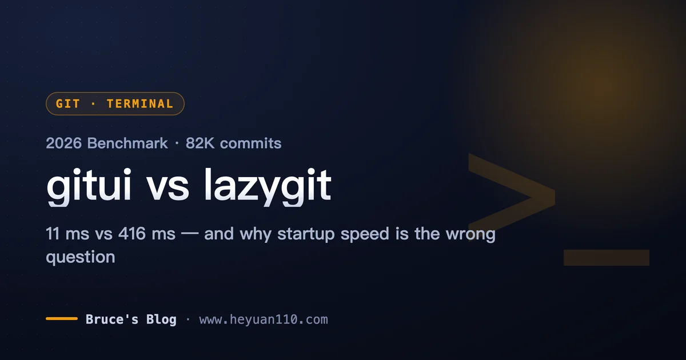
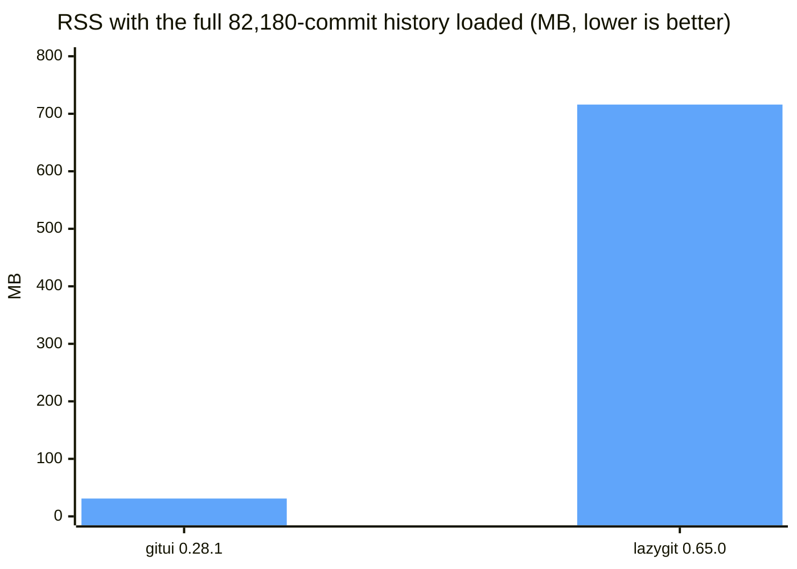
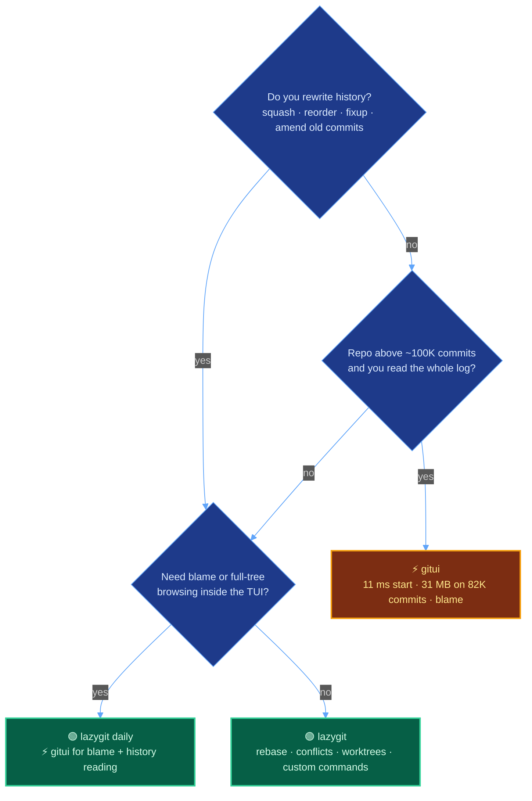

+++
date = '2026-09-12T10:00:00+08:00'
aliases = ['/posts/ai/2026-09-11-gitui-vs-lazygit/']
draft = false
title = 'gitui vs lazygit in 2026: Benchmarked on 82K Commits'
description = 'gitui vs lazygit on an 82K-commit repo: gitui paints in 11 ms with 31 MB, lazygit needs 416 ms but owns rebase, conflicts, worktrees and custom commands. Pick guide.'
toc = true
tags = ['Developer Tools', 'Git', 'Terminal', 'Productivity']
keywords = ['gitui vs lazygit', 'lazygit vs gitui', 'gitui review 2026', 'best git tui', 'lazygit alternatives', 'gitui interactive rebase', 'git terminal ui rust vs go', 'lazygit benchmark large repo']

[[params.faqItems]]
question = "Is gitui faster than lazygit?"
answer = "Yes, by a lot: on an 82,180-commit repo gitui reached a usable screen in 11 ms and held the full history in 31 MB, while lazygit v0.65.0 took 416 ms and 716 MB with every commit loaded. Below roughly 100K commits the gap is under half a second, so speed alone rarely decides the pick."

[[params.faqItems]]
question = "Does gitui support interactive rebase?"
answer = "No. As of v0.28.1 (March 2026) gitui has no interactive rebase; issue #32 has been open since April 2020 and still sits on the 1.0 roadmap. Lazygit does squash, fixup, reorder, drop and edit directly in the commits panel."

[[params.faqItems]]
question = "Which is better for a large monorepo, gitui or lazygit?"
answer = "For reading history, blaming files and browsing the full tree in a huge repo, gitui: it loads all commits asynchronously in a flat 31 MB. For editing history in the same repo, lazygit still works fine at 82K commits (416 ms start, 300 commits paged at a time) and gives you rebase, conflicts and worktrees."

[[params.faqItems]]
question = "Which pairs better with Claude Code or Codex sessions?"
answer = "Lazygit. Reviewing agent-generated diffs hunk by hunk, juggling worktrees per agent, and wiring one-key custom commands (open a worktree, copy a diff for the agent) are all built in. Gitui has no custom commands and no worktree view."

[[params.faqItems]]
question = "Do gitui or lazygit require a Nerd Font?"
answer = "Neither. Both render with plain box-drawing characters. Lazygit can show file icons if you set gui.nerdFontsVersion to '3', but it is optional; gitui has no icon mode at all."
+++



Eleven milliseconds. That's how long gitui took to paint a usable screen on an 82,180-commit clone of git/git on my M5 MacBook, and the number didn't move when I pointed it at a 630-commit blog repo instead. Lazygit took 416 ms on the same repo. If you came here for "gitui vs lazygit, which is faster," you can stop reading: gitui, by a factor of nearly 40.

It's also the least important fact in this comparison. The tool that paints 40x faster can't do an interactive rebase, can't show you a conflict diff, has no custom commands and no worktree view, and shipped three releases in the last twenty months. The tool that takes 416 ms shipped twelve in the last seven.

So the real question isn't speed. It's whether the things gitui does uniquely well (blame, full-tree browsing, flat memory on giant histories) matter more to you than the things only lazygit does. I spent a week with both, wrote a pty harness to time them properly, and I'll give you the receipts and then a straight answer.

## The gitui vs lazygit benchmark: three repos, one harness

Cards on the table: you can't benchmark a TUI with `hyperfine` the way you'd time `ls`. Both tools refuse to start without a terminal, and "startup time" is meaningless until the screen shows something you can act on. So I wrote a small Python harness that forks each tool inside a pseudo-terminal, feeds the output into a `pyte` screen emulator, and stops the clock when the screen meets a readiness condition. For lazygit that's "the Commits panel is drawn and contains a hash." For gitui it's "the tab bar is drawn and every `Loading ...` placeholder is gone." Memory is the RSS of the whole process tree sampled after the screen settles, because lazygit spawns `git` children (it auto-fetches on launch) and those count.

Setup, so you can reproduce or argue with it:

| Item | Value |
|---|---|
| Machine | MacBook Pro, Apple M5, macOS 26.5.2 |
| lazygit | v0.65.0 (Homebrew, released 2026-09-05), 18.4 MB binary |
| gitui | v0.28.1 (Homebrew, released 2026-03-24), 9.5 MB binary |
| Small repo | this blog, 630 commits |
| Medium repo | neovim/neovim, 38,077 commits, 331 MB `.git` |
| Large repo | git/git, 82,180 commits, 334 MB `.git` |
| Cache | warm (10 runs each, median reported); I couldn't purge the page cache without sudo, so no cold numbers |
| Terminal | 200x50 pty, `TERM=xterm-256color`, startup popups disabled |

**Time to a usable screen** (median of 10 runs):

| Repo | lazygit | gitui | Ratio |
|---|---|---|---|
| 630 commits | 88 ms | 11 ms | 8x |
| 38,077 commits | 232 ms | 11 ms | 21x |
| 82,180 commits | 416 ms | 11 ms | 38x |

**Memory (process tree RSS) right after that screen:**

| Repo | lazygit | gitui |
|---|---|---|
| 630 commits | 43 MB | 16 MB |
| 38,077 commits | 34 MB | 18 MB |
| 82,180 commits | 40 MB | 31 MB |

Those numbers describe two different strategies, not two speeds of the same strategy. Gitui draws the frame first and fills it asynchronously: at 11 ms the status tab is ready, and the log tab is still counting up in a corner (`300/3000`, then `82180/82180`). Lazygit runs `git log` for the first 300 commits, builds the graph, and only then shows you anything. That's why its startup scales with history and gitui's doesn't.

## What 11 milliseconds actually buys you

The honest framing: gitui's speed advantage is real, and below roughly 100K commits you will not feel it. A 416 ms launch is slower than a keypress but faster than a tab switch in VS Code. Where the strategies diverge for real is when you want the *whole* history, and that's where the numbers get dramatic.

| Full history loaded | lazygit | gitui |
|---|---|---|
| 38,077 commits: time | under 0.5 s (press `>` twice in Commits) | 150 ms from launch |
| 38,077 commits: RSS | 129 MB | 25 MB |
| 82,180 commits: time | 1.92 s | 484 ms from launch |
| 82,180 commits: RSS | **716 MB** (peak 788 MB) | **31 MB** |
| Jump to the first commit ever | after the load above | instant, 24 MB |



Lazygit at 716 MB isn't a leak, it's the commit graph. Lazygit renders the branch-line graph for every loaded commit, and on git/git's merge-heavy history that graph is dozens of columns wide. Gitui doesn't draw a graph at all (branch visualization is [roadmap item #81](https://github.com/gitui-org/gitui/issues/81)), so it keeps a flat list and a flat memory profile. You are trading a picture of the history for 23x less RAM. On a laptop with 16 GB that's a trade you never notice; on a shared dev box with a 2M-commit monorepo it's the difference between a tool you use and a tool you kill.

This also puts gitui's own README benchmark in perspective. It quotes the Linux kernel (900K+ commits): 24 s and 0.17 GB for gitui versus 57 s and 2.6 GB for lazygit, with lazygit "freezing" and "sometimes crashing." Those numbers date to a 2020 RustBerlin meetup talk and were measured on lazygit builds several years old; I saw no freezes or crashes at 82K commits on v0.65.0. Extrapolate my memory curve, though, and 2.6 GB at 900K commits is entirely plausible. The README isn't wrong, it's just describing a repo size most of us don't work in.

**Verdict on performance, dated 2026-09-11:** if your repo has fewer than ~100K commits, startup speed should not be in your decision at all. If you routinely read the entire history of a Linux-kernel-sized repo, gitui is the only one of the two that does it comfortably.

## Feature matrix from a week of real use

Everything below I did with my own hands on v0.65.0 and v0.28.1, not from the READMEs. Where a feature is missing I link the issue so you can watch it.

| Capability | lazygit v0.65.0 | gitui v0.28.1 |
|---|---|---|
| Interactive rebase (squash, fixup, reorder, drop, edit) | Yes, in-place in the commits panel | **No**; [#32](https://github.com/gitui-org/gitui/issues/32) open since 2020-04-23, 91 reactions |
| Line and hunk staging | `space` / `v` range select | `s` stage lines, Enter stage hunk; equally good |
| Conflict resolution | Dedicated view: pick hunk, pick both, next conflict, undo | Marks file `!`, diff panel shows `size: 0 B -> 62 B` and nothing else ([#2865](https://github.com/gitui-org/gitui/issues/2865)); resolve in an external editor |
| Custom commands | YAML `customCommands` with Go templates, prompts and menus | None |
| Worktrees | Files panel has a Worktrees tab; `w` creates one from a branch | No worktree view |
| Blame | **None** (not in the keybindings reference) | `B` in the Files tab, syntax highlighted, go-to-line |
| Browse the full tree at any commit | No (only changed files) | Files tab, any revision |
| Commit graph | Yes | No |
| Amend an old commit / custom patches / bisect / undo | Yes; `ctrl+z` undoes almost anything via the reflog | Amend HEAD only; no bisect; `U` undoes the last commit and that's it |
| Keybinding discovery | Context bar at bottom plus `?` filterable menu | Context bar at bottom plus `h` help popup |
| Config format | YAML (`config.yml`) | RON (`theme.ron`, `key_bindings.ron`) |
| Nerd Font | Optional icons (`gui.nerdFontsVersion: "3"`) | Not used |
| UI languages | auto-detects zh-CN, zh-TW, ja, ko, ru, pl, nl, pt | English only |
| Windows install | winget, scoop, choco | winget, scoop, choco |
| Releases, last 12 months | 17 (v0.55.1 on 2025-09-17 through v0.65.0 on 2026-09-05) | 2 (v0.28.0 on 2025-12-14, v0.28.1 on 2026-03-24) |
| GitHub stars (2026-09-11) | 82,214 | 22,477 |

Three rows on that table decided the article for me.

**Interactive rebase.** I wrote a whole post about why [lazygit's rebase feels like cheating](/posts/ai/2026-04-10-lazygit-guide/), and nothing in gitui replaces it. Gitui's log tab offers reword, revert, reset and "rebase branch" (a plain `git rebase` onto another branch). It does not let you squash two commits, move one above another, or drop one. The 91 thumbs-up on issue #32 say I'm not alone in wanting that, and the fact that it's been open for six years says it isn't coming soon. If you rebase weekly, this row alone ends the comparison.

**Conflicts.** I built a two-branch repo with a one-line conflict and opened both tools. Lazygit switched the files panel to "(only conflicting)", showed the `<<<<<<<` / `=======` / `>>>>>>>` blocks in the right pane, and the bottom bar read `Pick hunk: <space> | Pick both hunks: b | Previous conflict: <left> | Next conflict: <right> | Undo: z`. Gitui marked `app.py` with a `!`, and the diff pane said `size: 0 B -> 62 B (+62 B)` on an otherwise empty panel. The only conflict-specific key was `Abort merge`. That's an open bug ([#2865](https://github.com/gitui-org/gitui/issues/2865)), and the workaround is `e` to open your editor, which is exactly the trip a TUI is supposed to save you.

**Blame and tree browsing.** This is where gitui genuinely wins, and I don't want the rebase point to bury it. Lazygit's Files panel only lists *changed* files; there is no way to walk the repository tree and ask "who wrote this line." Gitui's Files tab shows the whole tree at any commit, `B` gives you a syntax-highlighted blame with go-to-line, and `H` gives per-file history. When I'm reading an unfamiliar codebase, that's the thing I actually want from a Git TUI, and lazygit simply doesn't have it.

## gitui vs lazygit for AI coding agents

The way I use Git changed in 2025: most diffs on my machine are now written by Claude Code or Codex, and my job is to review them, not author them. That shifts what I need from a Git TUI, and it shifts the comparison hard toward lazygit for three concrete reasons.

**Hunk-by-hunk review of agent output.** Both tools stage lines. But an agent-generated diff is where you want to stage the good half of a file, drop the hallucinated half, and commit in logical units the agent didn't think about. Lazygit's `v` range select plus its "custom patch" flow (pull lines out of a commit the agent already made) covers that; gitui stops at staging.

**One worktree per agent.** Running two or three agents in parallel means [one worktree per task](/posts/ai/2026-02-28-claude-code-worktree-guide/), and the annoying part is never creating them, it's remembering which is which and cleaning up. Lazygit's Worktrees tab lists them, switches with `space`, and deletes directory plus metadata with `d`. Gitui has no worktree concept; the only mentions in its tracker are bugs about running inside one.

**Custom commands as the glue.** This is the feature that makes lazygit a hub rather than a viewer. Two bindings I actually use, in `config.yml`:

```yaml
customCommands:
  # Copy the selected commit's diff so I can paste it to the agent for a review pass
  - key: '<c-y>'
    context: 'commits'
    command: 'git show {{.SelectedCommit.Hash}} | pbcopy'
    description: 'Copy commit diff to clipboard'
  # Open a Claude Code session in the selected worktree, in a new tmux window
  - key: 'C'
    context: 'worktrees'
    command: 'tmux new-window -c {{.SelectedWorktree.Path | quote}} "claude"'
    description: 'Start Claude Code in this worktree'
```

Gitui can't express either of those. There is no custom command system, and searching its issues for one turns up nothing beyond a closed build error. For a pure "look at the repo" tool that's fine; for a tool that sits between me and an agent, it's disqualifying.

The one place gitui earns a slot in an agent workflow is review of *unfamiliar* code the agent touched: `B` blame on a file to see whether the line it changed was load-bearing and who last touched it. I keep gitui installed for exactly that and open it maybe twice a week.

## Two things I hit that neither README mentions

**Lazygit shows escaped bytes in diff headers for non-ASCII paths.** I made a repo with a file named `中文文件名.md`. Lazygit's file tree rendered the name correctly, but the diff header read `diff --git "a/\344\270\255\346\226\207..."`, because lazygit shells out to `git diff` and Git quotes non-ASCII paths by default. One config line fixes it globally, and you should set it anyway if you ever touch CJK, accented or emoji file names:

```bash
git config --global core.quotepath false
```

Gitui was clean out of the box because it reads diffs through libgit2 instead of parsing porcelain output. Small thing, but it's the kind of small thing that makes a tool feel broken on day one.

**Lazygit picks your UI language from the locale.** On my machine, which runs a zh_CN locale, lazygit v0.65.0 launched with a fully translated Chinese interface before I'd touched a config file (`gui.language: auto` is the default). Nice for the audience of this blog's Chinese edition, mildly startling if you're following an English tutorial and every keybinding hint is in another language. Set `gui.language: en` if you want the docs to match your screen. Gitui has no localization at all.

Neither hurt gitui, so in fairness, the gitui-specific wart I found is older and documented: over HTTPS it needs `credential.helper` set explicitly or push and fetch fail, and on WSL2 there's a [still-open report](https://github.com/gitui-org/gitui/issues/1974) of fetch and pull hanging while the CLI and lazygit work. I couldn't test Windows or WSL in this session; treat those as things to check on your own box, not as findings.

## Verdict: install lazygit, keep gitui for blame



My recommendation, as of September 2026, for most people reading this:

1. **`brew install lazygit`** (or `winget install -e --id=JesseDuffield.lazygit`, `scoop install lazygit`) and make it your daily driver. It's the one with rebase, a real conflict view, worktrees, custom commands, seventeen releases in twelve months and 82K stars. The 416 ms it costs to open on an 82K-commit repo is a price you'll stop noticing by Tuesday.
2. **Also install gitui** if you read other people's code for a living, work in a repo with hundreds of thousands of commits, or just want `B` for blame. It's a 9.5 MB binary, 16 MB of RAM, and it has no opinions about your workflow. Bind it to a separate alias and let it be the microscope while lazygit is the workbench.
3. **Pick gitui alone** only if history rewriting is something you never do and memory on the box is genuinely tight. That's a real population (SRE boxes, Termux on a phone, a 2M-commit monorepo on a shared VM), it's just not most developers.

What I'd skip: choosing by language. "gitui is Rust, lazygit is Go" tells you the binary size (9.5 vs 18.4 MB) and nothing about which one will get you out of a botched merge at 6 pm. Choose by the feature rows above.

If you're coming from the [fish shell](/posts/linux/2026-04-18-fish-shell-rust-2026/) and Rust-tool crowd and want the rest of the terminal sorted first, my [terminal emulator roundup](/posts/macos/2025-01-22-terminal-tools-guide/) and the [Windows Terminal ranking](/posts/ai/2026-06-22-best-windows-terminal-2026/) cover the layer underneath either of these.

*Footnote on tig: yes, it still exists (13.3K stars, v2.6.1 in June 2026), and as a read-only pager over `git log` it starts even lighter than gitui. It doesn't stage, rebase or resolve anything, so it isn't a third contender here; it's a very good `less` for Git.*

## Related Reading

- [Lazygit in 2026: The Git TUI That Makes Interactive Rebase Feel Like Cheating](/posts/ai/2026-04-10-lazygit-guide/) — the deep dive on the tool this article picks
- [Claude Code Worktree: Run Multiple AI Tasks in Parallel](/posts/ai/2026-02-28-claude-code-worktree-guide/) — the workflow lazygit's Worktrees tab was made for
- [Best Windows Terminal 2026: Ranked for Developers](/posts/ai/2026-06-22-best-windows-terminal-2026/) — pick the terminal before you pick the Git TUI
- [Best Terminal Emulators in 2025: 23 Tools Compared](/posts/macos/2025-01-22-terminal-tools-guide/) — the cross-platform terminal roundup
- [Fish Shell 4.6 Review](/posts/linux/2026-04-18-fish-shell-rust-2026/) — the shell that pairs nicely with both tools
