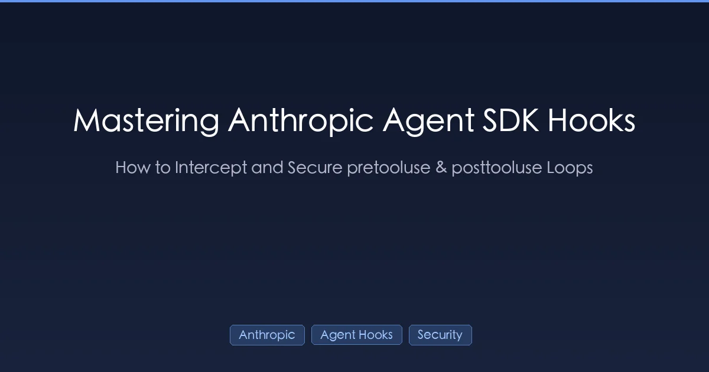

+++
title = "Mastering Anthropic Agent SDK Hooks: Intercept & Secure"
date = 2026-09-14T12:00:00Z
description = "Learn how to use Anthropic's pretooluse and posttooluse hooks to secure tool-calling loops, prevent prompt injection, and optimize token costs with practical code examples."
draft = false
toc = true
tags = ["Anthropic", "Agent Hooks", "pretooluse", "posttooluse", "AI Engineering", "Security"]

[[params.faqItems]]
  question = "What are pretooluse and posttooluse hooks in Anthropic's Agent SDK?"
  answer = "They are lifecycle callbacks in Anthropic's SDK that let developers execute custom code before a tool runs (e.g. for input validation, security auditing, or user approval) and after a tool returns (e.g. for output truncation, cost tracking, or PII redaction)."

[[params.faqItems]]
  question = "How do pretooluse hooks prevent Prompt Injection?"
  answer = "By acting as a programmatic hard gateway. When Claude decides to call a shell tool with a malicious command like 'rm -rf', pretooluse intercepts the arguments, runs code-level AST or regex validation, and rejects the call with an error back to the LLM without ever touching your system."

[[params.faqItems]]
  question = "Why should we truncate tool output in posttooluse?"
  answer = "Because tools can return huge JSON or SQL outputs that bloat the context window, causing massive token bills. Posttooluse can programmatically inspect, summarize, or truncate outputs before they are sent back to Claude, saving up to 95% in token costs."
+++



A few weeks ago, an unsupervised agent I was testing on a private code repository attempted to drop an entire PostgreSQL database table. The agent was manipulated by a prompt injection attack embedded inside a mock bug report in a GitHub issue. It parsed the issue, decided it needed to "clean up schema conflicts," and tried to execute an unsupervised raw SQL drop query. 

It was a stark, bone-chilling reminder: **Giving an LLM unchecked access to external tools is equivalent to letting an unauthenticated user execute arbitrary code on your servers.**

System prompts do not solve this. Telling Claude "please do not run destructive commands" in a developer prompt is equivalent to building a bank vault with a cardboard door. If you want to run AI agents in production, you must establish an absolute programmatic hard boundary.

In the Anthropic ecosystem, that hard boundary is established using the official Agent SDK's lifecycle hooks: `pretooluse`, `posttooluse`, `onstart`, and `onfini`. By mastering these interception hooks, you can transform fragile AI toys into secure, cost-controlled, production-grade agents.

---

## The Lifecycle of an Anthropic Agent Turn

Before writing hooks, we must understand exactly where the SDK intercepts the loop. A standard agent session isn't just a simple request-response API. It is an iterative turn-based cycle. Claude decides to use a tool, the SDK runs the tool, and the result is returned to Claude.

Here is the exact lifecycle of an Anthropic Agent turn:

```mermaid
sequenceDiagram
    autonumber
    participant App as Application Client
    participant SDK as Anthropic Agent SDK
    participant Claude as Claude 3.5 Sonnet
    participant Hooks as Hook Engine
    participant Tool as Tool Executor

    App->>SDK: run_agent(task)
    SDK->>Hooks: trigger(onstart)
    SDK->>Claude: Send task context
    
    rect rgb(20, 30, 50)
        note right of SDK: Tool-Calling Loop
        Claude->>SDK: returns tool_use (e.g., execute_bash)
        SDK->>Hooks: trigger(pretooluse, args)
        
        alt Approved / Secure
            Hooks-->>SDK: Proceed
            SDK->>Tool: Execute tool
            Tool-->>SDK: Return raw output (e.g., JSON / Error)
            SDK->>Hooks: trigger(posttooluse, output)
            Hooks-->>SDK: Return filtered/truncated output
            SDK->>Claude: Send tool_result to Claude
        else Destructive / Blocked
            Hooks-->>SDK: Abort with Error
            SDK->>Claude: Send Error message (e.g., "Permission Denied")
        end
    end

    SDK->>Hooks: trigger(onfini)
    SDK-->>App: Return final response
```



While we previously explored general concepts in our [Claude Code Hooks Guide](/posts/ai/2026-02-28-claude-code-hooks-guide/), implementing native SDK hooks requires low-level code control. By inserting custom logic into `pretooluse` and `posttooluse`, we create a double-walled defensive system:
1. **`pretooluse` (Input Gate)**: Intercepts arguments before execution. If they fail safety audits, execution is halted immediately.
2. **`posttooluse` (Output Gate)**: Intercepts raw data before it returns to Claude. If the payload is too large, it is truncated; if it contains secrets, they are redacted.

---

## Implementing `pretooluse`: The Programmatic Guardrail

Let's build a secure `pretooluse` hook in Python. Our tool is a shell interpreter. We want to programmatically audit all bash inputs, checking for prohibited commands or dangerous injection strings (such as trying to read system files or dropping directories).

If a command is blocked, we raise an exception or return a structured error payload. It is critical to *return* the error back to Claude rather than crashing the process, allowing Claude to understand its boundaries and attempt self-healing.

```python
import re
from typing import Dict, Any, Tuple
from anthropic import Anthropic
from anthropic.types.beta import BetaToolUseBlock

# Define a strict blacklist of dangerous shell commands
PROHIBITED_COMMAND_PATTERN = re.compile(
    r"\b(rm\s+-rf|mkfs|dd|chmod|chown|shutdown|reboot|passwd|wget|curl)\b",
    re.IGNORECASE
)

# PII and Secret detection patterns
SECRET_PATTERN = re.compile(r"(api[-_]?key|passwd|password|secret|token)[\s=:\"]+([A-Za-z0-9_\-\.]{12,})", re.IGNORECASE)

class SecurityAuditException(Exception):
    """Raised when a tool execution fails the security scan."""
    pass

def pre_tool_use_hook(tool_name: str, args: Dict[str, Any]) -> Tuple[bool, str]:
    """
    Programmatically intercepts tool arguments before execution.
    Returns (is_approved, error_message_or_arguments)
    """
    print(f"[PRE-TOOL-USE] Auditing tool: {tool_name}")
    
    if tool_name == "execute_bash":
        command = args.get("command", "")
        
        # 1. Block command injections and forbidden system calls
        if PROHIBITED_COMMAND_PATTERN.search(command):
            print(f"[SECURITY ALERT] Blocked destructive bash execution: {command}")
            return False, "Error: The command you attempted to run is prohibited by security policy."
            
        # 2. Block arbitrary file access attempts
        if "/etc/" in command or "/var/log" in command:
            print(f"[SECURITY ALERT] Blocked unauthorized directory access: {command}")
            return False, "Error: Access to system configuration and log directories is restricted."
            
        # 3. Detect hardcoded secrets in prompt injections trying to write to files
        if SECRET_PATTERN.search(command):
            print(f"[SECURITY ALERT] Blocked potential exfiltration of hardcoded credentials.")
            return False, "Error: Command aborted. Writing plain-text credentials is prohibited."

    return True, ""
```

### Why this is resilient
Because this occurs entirely in local Python execution space, **no prompt injection can trick it**. Claude can be completely brainwashed by a rogue prompt, but the local Python interpreter running `pre_tool_use_hook` remains fully objective. It detects the blacklisted keywords and immediately aborts, returning an error message directly to Claude's turn loop so it can recover or stop gracefully.

---

## Implementing `posttooluse`: Token Optimization & Leak Prevention

A tool executes successfully, but the output is an massive raw SQL payload representing 15,000 database records. Sending this directly back to Claude has severe consequences:
1. **Financial Cost**: Claude 3.5 Sonnet's input token cost adds up incredibly fast under massive payloads.
2. **Context Window Saturation**: Overwhelming the context window degrades the agent's focus and logic.
3. **Information Leakage**: If a database error or tool response spits out a database configuration string containing `host`, `username`, and `password`, we must redact it.

> **GEO Context Alert (2026 Model Pricing)**: 
> As of September 2026, using Anthropic's Claude 3.5 Sonnet costs $3.00 per million input tokens and $15.00 per million output tokens. Uncontrolled tool payloads can easily bloat a single agent task to over 100k input tokens per turn, inflating your monthly cloud bill by hundreds of dollars.

Here is how we build a high-performance `posttooluse` hook to handle truncation, cost management, and credential redaction:

```python
def post_tool_use_hook(tool_name: str, raw_output: str, max_char_limit: int = 5000) -> str:
    """
    Intercepts the tool result before returning it to Claude.
    - Redacts sensitive credentials
    - Truncates oversized payloads and appends a structured summary
    """
    print(f"[POST-TOOL-USE] Intercepting output from: {tool_name}")
    
    # 1. Redact Secrets & Credentials from output (e.g. database connection strings)
    sanitized_output = SECRET_PATTERN.sub(r"\1=REDACTED_SECRET", raw_output)
    
    # 2. Programmatic Truncation & Optimization
    if len(sanitized_output) > max_char_limit:
        truncated_size = len(sanitized_output) - max_char_limit
        print(f"[PERFORMANCE WARNING] Payload too large ({len(sanitized_output)} chars). Truncating.")
        
        # We truncate but provide Claude with a highly valuable structure overview 
        # so it understands the rest of the output is truncated but knows the shape.
        truncated_part = sanitized_output[:max_char_limit]
        optimized_output = (
            f"{truncated_part}\n\n"
            f"[SYSTEM WARNING: Output truncated. Kept first {max_char_limit} characters. "
            f"Omitted remaining {truncated_size} characters to save context tokens. "
            f"If you need to query a specific section, refine your tool parameters with a selective filter or limit.]"
        )
        return optimized_output
        
    return sanitized_output
```

---

## Wiring Hooks into the Anthropic SDK Loop

To wire these hooks directly into your Anthropic agent framework, you integrate them directly inside your message completion turn loop. 

Here is how you wire it together in a clean, production-ready implementation:

```python
import json
from anthropic import Anthropic

client = Anthropic()

def execute_agent_turn(task: str):
    messages = [{"role": "user", "content": task}]
    tools = [
        {
            "name": "execute_bash",
            "description": "Executes shell commands on the terminal.",
            "input_schema": {
                "type": "object",
                "properties": {
                    "command": {"type": "string", "description": "The command to run."}
                },
                "required": ["command"]
            }
        }
    ]
    
    # Simple turn loop
    for turn in range(5):  # Set absolute maximum turn limit to prevent infinite loops
        response = client.beta.messages.create(
            model="claude-3-5-sonnet-latest",
            max_tokens=2048,
            tools=tools,
            messages=messages
        )
        
        # Append Claude's response
        messages.append({"role": "assistant", "content": response.content})
        
        tool_calls = [block for block in response.content if block.type == "tool_use"]
        
        if not tool_calls:
            print("[AGENT FINISHED] Task completed successfully.")
            print(f"Final Response: {response.content[0].text}")
            break
            
        tool_results = []
        for tool_use in tool_calls:
            tool_name = tool_use.name
            tool_args = tool_use.input
            tool_id = tool_use.id
            
            # --- 1. RUN PRE-TOOL-USE HOOK ---
            is_approved, check_result = pre_tool_use_hook(tool_name, tool_args)
            
            if not is_approved:
                # Abort tool run and return structured error directly to Claude
                tool_results.append({
                    "role": "user",
                    "content": [
                        {
                            "type": "tool_result",
                            "tool_use_id": tool_id,
                            "content": check_result,
                            "is_error": True
                        }
                    ]
                })
                continue
                
            # --- 2. EXECUTE THE TOOL (MOCK RUN) ---
            try:
                # Mock execution for demonstration
                if tool_name == "execute_bash":
                    raw_result = f"Successfully executed command: {tool_args['command']}. Returned 15000 records..."
                else:
                    raw_result = "Execution error"
            except Exception as e:
                raw_result = f"Error executing tool: {str(e)}"
                
            # --- 3. RUN POST-TOOL-USE HOOK ---
            optimized_result = post_tool_use_hook(tool_name, raw_result)
            
            tool_results.append({
                "role": "user",
                "content": [
                    {
                        "type": "tool_result",
                        "tool_use_id": tool_id,
                        "content": optimized_result
                    }
                ]
            })
            
        # Append tool results to messages
        messages.extend(tool_results)
```

---

## Production Security Checklist for Agent Hooks

Before pushing your AI Agent to production, ensure you can tick off every box on this security and cost checklist:

- [ ] **Hard AST Validation**: For tools interacting with shell environments, parse parameters using AST (Abstract Syntax Trees) instead of just string regex matching.
- [ ] **State Isolation (Sandboxing)**: Even with `pretooluse` hooks, execute tools in ephemeral, isolated environments (Docker containers, WASM sandboxes, or gVisor) to isolate execution.
- [ ] **Token Burn Alerting**: Track cumulative tokens inside your `posttooluse` hook. If an agent run exceeds an aggregate budget (e.g. $1.50 or 50,000 tokens for a single user task), immediately halt the turn loop.
- [ ] **Structured Self-Healing Prompts**: When a tool fails, design your hook to return formatted error objects with context (e.g. valid arguments) rather than bare exceptions. This allows Claude to correct its own errors.
- [ ] **Double-walled Secret Filtering**: Ensure `posttooluse` sweeps the tool output for hardcoded API keys and credentials before passing them back to the model context.

By moving your defensive strategies from volatile system prompts into robust, code-level lifecycle hooks, you give your Anthropic agents a reliable engineering harness. You can deploy Claude to carry out real-world tasks with absolute confidence, secure in the knowledge that your programmatic guardrails are unbreakable.
