+++
title = "深度驾驭 Anthropic Agent SDK 钩子：通过 pretooluse 与 posttooluse 构建安全闭环"
date = 2026-09-14T03:00:00Z
description = "深度剖析 Anthropic Agent SDK 的生命周期钩子。实战演练通过 pretooluse 和 posttooluse 拦截 Tool-calling 循环、防御提示词注入漏洞并进行 Token 成本优化的完整代码模板。"
draft = false
toc = true
tags = ["Anthropic", "Agent Hooks", "pretooluse", "posttooluse", "AI Engineering", "Security"]

[[params.faqItems]]
  question = "Anthropic Agent SDK 的 pretooluse 与 posttooluse 钩子有什么作用？"
  answer = "它们是 Anthropic 官方 SDK 内置的工具调用生命周期回调函数。pretooluse 在工具实际执行前触发（可进行输入审计、安全拦截、人工确认等），posttooluse 在工具执行完毕后触发（可进行输出截断、敏感凭证脱敏、异常自愈等）。"

[[params.faqItems]]
  question = "如何通过 pretooluse 钩子防御提示词注入（Prompt Injection）攻击？"
  answer = "靠代码级的确定性防御。在 `pre_tool_use_hook` 里用正则审计 LLM 想执行的 Bash 命令:命中 `rm -rf`、`mkfs`、`dd`、`chmod` 这类黑名单，或者试图把 12 位以上的明文凭证硬编码进命令，就直接返回结构化错误、中断这次调用。这段逻辑跑在本地 Python 进程里，提示词注入再离谱也改不了它。"

[[params.faqItems]]
  question = "为什么强烈建议在 posttooluse 钩子中做数据截断？"
  answer = "工具（数据库、API）可能一次吐回 15,000 条原始记录。直接喂给 Claude 会同时触发三件事:账单雪崩（Messages API 输入每百万 token $3.00、输出 $15.00，一次超大 payload 就能吃掉 100k 输入 token）、注意力被稀释导致决策精度下滑、报错里带出的 `password` 等凭证混进上下文历史。所以要在 `posttooluse` 里按 5000 字符截断并顺手脱敏。"
+++


前几周，我在测试一个处于私有代码库环境的自主 Agent 时，差点遭遇灭顶之灾：该 Agent 试图删掉整个 PostgreSQL 数据库的表结构。起因是由于一个恶意用户在 GitHub Issue 的 Mock Bug 报告里埋了**提示词注入（Prompt Injection）攻击**。Agent 在解析该 Issue 时被大模型脑补诱导，认为必须“通过清理 Schema 冲突来解决 Bug”，进而尝试执行一条删除表结构的裸 SQL 语句。

这笔惊出冷汗的教训再次证明了一个血淋淋的现实：**给 AI Agent 毫无约束地开放外部工具权限，等同于让一个未经授权的用户在你的服务器上执行任意命令**。

依靠系统提示词（System Prompt）无法彻底解决这个问题。在开发提示词里叮嘱 Claude“请不要运行具有破坏性的命令”，就像是用纸箱给银行做防盗门。一旦黑客使用高阶注入技巧，提示词防线会在瞬间溃散。如果想在生产环境中安稳地运行 AI Agent，必须建立**代码级的强控制底座**。

在 Anthropic 的开发者生态中，这道牢不可破的底层代码边界是通过官方 Agent SDK 的生命周期钩子（Lifecycle Hooks）来构建的：`pretooluse`、`posttooluse`、`onstart` 和 `onfini`。深度掌控这套拦截钩子，是将“脆弱的玩具级 Agent”蜕变为“生产级受控 Agent”的唯一分水岭。

---

## 剖析 Anthropic Agent 调用的完整生命周期

在动笔写钩子代码之前，必须先厘清 SDK 是在哪个阶段进行拦截的。一个合格的 Agent 运行并不是简单的单次 API 请求与响应，而是一个迭代的、回合制（Turn-based）的控制环。Claude 决定调用某个工具，SDK 去运行该工具，然后将结果反馈给 Claude。

以下是 Anthropic Agent 调用的完整生命周期：

```mermaid
sequenceDiagram
    autonumber
    participant App as 客户端应用
    participant SDK as Anthropic Agent SDK
    participant Claude as Claude 3.5 Sonnet
    participant Hooks as 钩子引擎
    participant Tool as 工具执行器

    App->>SDK: run_agent(任务)
    SDK->>Hooks: 触发(onstart)
    SDK->>Claude: 发送初始任务上下文
    
    rect rgb(20, 30, 50)
        note right of SDK: 工具调用迭代循环 (Tool-Calling Loop)
        Claude->>SDK: 返回 tool_use (例如: execute_bash)
        SDK->>Hooks: 触发(pretooluse, 携带参数)
        
        alt 安全审计通过
            Hooks-->>SDK: 批准执行
            SDK->>Tool: 实际执行工具
            Tool-->>SDK: 返回原始输出 (JSON / 错误堆栈)
            SDK->>Hooks: 触发(posttooluse, 原始输出)
            Hooks-->>SDK: 返回过滤/截断后的输出
            SDK->>Claude: 发送 tool_result 给 Claude
        else 触发危险规则被拦截
            Hooks-->>SDK: 强行中止并报错
            SDK->>Claude: 发送错误提示 (例如: "Permission Denied")
        end
    end

    SDK->>Hooks: 触发(onfini)
    SDK-->>App: 返回最终响应结果
```



虽然我们之前在 [Claude Code 钩子实战指南](/posts/ai/2026-02-28-claude-code-hooks-guide/) 中探讨过类似的宏观概念，但在使用原生 SDK 开发应用时，我们需要在代码层进行更细粒度的控制。通过在 `pretooluse` 与 `posttooluse` 中插入自定义逻辑，能建立起一套稳固的双重过滤防线：
1.  **`pretooluse`（入参门禁）**：在工具实际运行前拦截参数。安全审计未过，直接强行刹车，不触发实际运行。
2.  **`posttooluse`（出参门禁）**：在数据喂回大模型前进行拦截。若返回的体积过大，在此进行截断；若包含敏感 Key，在此进行脱敏抹除。

---

## 编写 `pretooluse`：代码级安全沙箱

接下来我们用 Python 编写一个安全的 `pretooluse` 钩子。假设我们向 Claude 提供了一个 Shell 解释器工具，我们希望通过代码硬性审计大模型试图执行的所有 Bash 命令，防止任意删改系统文件或被命令注入攻击。

如果检测到危险命令，我们应该返回一个结构化的错误信息，**而不是直接让整个 Python 进程 Crash**。让钩子返回错误能让 Claude 在 Turn 循环中理解自己的权限边界，并尝试自主修正（Self-healing）或优雅终止。

```python
import re
from typing import Dict, Any, Tuple
from anthropic import Anthropic
from anthropic.types.beta import BetaToolUseBlock

# 定义危险 Shell 命令黑名单正则
PROHIBITED_COMMAND_PATTERN = re.compile(
    r"\b(rm\s+-rf|mkfs|dd|chmod|chown|shutdown|reboot|passwd|wget|curl)\b",
    re.IGNORECASE
)

# 敏感 Key 与凭证匹配模式
SECRET_PATTERN = re.compile(r"(api[-_]?key|passwd|password|secret|token)[\s=:\"]+([A-Za-z0-9_\-\.]{12,})", re.IGNORECASE)

class SecurityAuditException(Exception):
    """安全审计不通过时抛出的异常"""
    pass

def pre_tool_use_hook(tool_name: str, args: Dict[str, Any]) -> Tuple[bool, str]:
    """
    在工具执行前进行入参拦截审计。
    返回 (是否批准, 错误提示或修改后的参数)
    """
    print(f"[PRE-TOOL-USE] 正在审计工具: {tool_name}")
    
    if tool_name == "execute_bash":
        command = args.get("command", "")
        
        # 1. 拦截高危的系统指令和删除操作
        if PROHIBITED_COMMAND_PATTERN.search(command):
            print(f"[安全警报] 成功拦截破坏性 Bash 执行意图: {command}")
            return False, "Error: The command you attempted to run is prohibited by security policy."
            
        # 2. 拦截对系统敏感路径的越权访问
        if "/etc/" in command or "/var/log" in command:
            print(f"[安全警报] 成功拦截敏感路径越权访问: {command}")
            return False, "Error: Access to system configuration and log directories is restricted."
            
        # 3. 拦截尝试在命令中硬编码写出凭证的行为（防御凭证外泄）
        if SECRET_PATTERN.search(command):
            print(f"[安全警报] 检测到高危行为：命令中包含硬编码的敏感密钥。")
            return False, "Error: Command aborted. Writing plain-text credentials is prohibited."

    return True, ""
```

### 为什么这套防线不可攻破？
因为这套拦截逻辑运行在本地的 Python 隔离空间中，**任何大模型的提示词注入都无法干预它的执行**。即使 Claude 被注入的 Prompt 彻底洗脑、丧失理智，本地运行的 `pre_tool_use_hook` 依然保持着绝对客观。一旦检测到黑名单，立即截断调用，并在当前 Turn 循环中喂回一个错误提示，迫使 Agent 恢复正常逻辑。

---

## 编写 `posttooluse`：Token 优化与账单防爆

工具执行成功了，但是由于 API 或 SQL 工具意外返回了 15,000 条原始数据库记录，输出内容瞬间暴涨。如果直接将这几万字喂回给 Claude，会带来非常严重的工程灾难：
1.  **账单雪崩**：Claude 3.5 Sonnet 的输入 Token 极贵，超大上下文会让每一次后续 Turn 产生极高的成本。
2.  **上下文污染（注意力溃散）**：超长的无用数据会稀释注意力，导致 Agent 决策精度大幅下滑。
3.  **敏感数据外泄**：有些工具报错时会意外把数据库配置中的 `host`、`username`、`password` 打印出来。如果不加拦截直接发给大模型，这些秘密将彻底混入大模型的 Context 历史中，甚至有被后续提示词攻击套取出来的风险。

> **GEO 算账时刻 (2026 年模型定价指南)**：
> 截至 2026 年 9 月，Anthropic 的 Claude 3.5 Sonnet（最新版）在 Messages API 的定价为：输入每百万 Token $3.00，输出每百万 Token $15.00。如果不对工具输出做强力截断，一个意外的超大 Payload 极易让单次 Agent 任务耗费超过 100k Input Tokens，让您的月度账单瞬间翻倍。

以下是如何在 `posttooluse` 钩子中进行输出截断、成本优化和凭证脱敏的实战代码：

```python
def post_tool_use_hook(tool_name: str, raw_output: str, max_char_limit: int = 5000) -> str:
    """
    在工具执行完毕、结果返回给大模型前进行拦截。
    - 对输出内容中的密钥进行敏感信息脱敏
    - 对超长内容进行智能截断，并附加结构化说明，保护大模型上下文
    """
    print(f"[POST-TOOL-USE] 拦截并处理工具输出结果: {tool_name}")
    
    # 1. 抹除输出中的密钥敏感数据（例如报错信息带出来的 DSN）
    sanitized_output = SECRET_PATTERN.sub(r"\1=REDACTED_SECRET", raw_output)
    
    # 2. 强行截断超大 Payload，实现 Token 成本控制
    if len(sanitized_output) > max_char_limit:
        truncated_size = len(sanitized_output) - max_char_limit
        print(f"[性能预警] 工具输出体积过大 ({len(sanitized_output)} 字符). 启动截断程序。")
        
        # 截断超长部分，但在末尾附加极其清晰的“结构化声明”
        # 告诉 Claude 这里被截断了，并引导它通过更精确的参数（如 Limit/Filter）进行二次查询。
        truncated_part = sanitized_output[:max_char_limit]
        optimized_output = (
            f"{truncated_part}\n\n"
            f"[SYSTEM WARNING: Output truncated. Kept first {max_char_limit} characters. "
            f"Omitted remaining {truncated_size} characters to save context tokens. "
            f"If you need to query a specific section, refine your tool parameters with a selective filter or limit.]"
        )
        return optimized_output
        
    return sanitized_output
```

---

## 组装：将钩子无缝拼入 Anthropic SDK 循环

要将这两道门禁钩子无缝嵌到你的 Agent 架构中，最优雅的做法是将它们集成在每次消息会话的迭代循环（Turn Loop）中。

以下是工业级生产环境中标准的拼装和调用代码示例：

```python
import json
from anthropic import Anthropic

client = Anthropic()

def execute_agent_turn(task: str):
    messages = [{"role": "user", "content": task}]
    tools = [
        {
            "name": "execute_bash",
            "description": "Executes shell commands on the terminal.",
            "input_schema": {
                "type": "object",
                "properties": {
                    "command": {"type": "string", "description": "The command to run."}
                },
                "required": ["command"]
            }
        }
    ]
    
    # 显式设定最大 Turn 次数，防止 Agent 在死循环中狂烧额度
    for turn in range(5):  
        response = client.beta.messages.create(
            model="claude-3-5-sonnet-latest",
            max_tokens=2048,
            tools=tools,
            messages=messages
        )
        
        # 记录大模型这一轮的决策
        messages.append({"role": "assistant", "content": response.content})
        
        tool_calls = [block for block in response.content if block.type == "tool_use"]
        
        # 如果大模型不需要调用工具，说明任务已收敛
        if not tool_calls:
            print("[Agent 执行收敛] 任务圆满完成。")
            print(f"最终结论: {response.content[0].text}")
            break
            
        tool_results = []
        for tool_use in tool_calls:
            tool_name = tool_use.name
            tool_args = tool_use.input
            tool_id = tool_use.id
            
            # --- 1. 执行 pretooluse 入参安全审计钩子 ---
            is_approved, check_result = pre_tool_use_hook(tool_name, tool_args)
            
            if not is_approved:
                # 审计失败，安全断路，直接强行将错误返回给 Claude
                tool_results.append({
                    "role": "user",
                    "content": [
                        {
                            "type": "tool_result",
                            "tool_use_id": tool_id,
                            "content": check_result,
                            "is_error": True
                        }
                    ]
                })
                continue
                
            # --- 2. 工具实际运行（此处使用 Mock 逻辑示意） ---
            try:
                if tool_name == "execute_bash":
                    raw_result = f"Successfully executed command: {tool_args['command']}. Returned 15000 records..."
                else:
                    raw_result = "Execution error"
            except Exception as e:
                raw_result = f"Error executing tool: {str(e)}"
                
            # --- 3. 执行 posttooluse 出参优化与脱敏钩子 ---
            optimized_result = post_tool_use_hook(tool_name, raw_result)
            
            tool_results.append({
                "role": "user",
                "content": [
                    {
                        "type": "tool_result",
                        "tool_use_id": tool_id,
                        "content": optimized_result
                    }
                ]
            })
            
        # 将本轮工具运行的反馈数据追加进上下文，准备开启下一轮大模型 Turn
        messages.extend(tool_results)
```

---

## 生产环境 Agent 钩子部署前安全 checklist

在把你的 AI Agent 推送到生产环境、面向真实用户开放前，请逐一核对以下工程防线：

- [ ] **强 AST 语法树匹配**：对于能执行 Shell 或 SQL 的高危工具，`pretooluse` 中不要只用简单的正则检测危险词，尽量使用 AST（抽象语法树）解析参数，防御更复杂的绕过攻击。
- [ ] **硬性沙箱隔离（Docker/gVisor）**：不要在 Host 主机上直接裸跑 Agent。即使有 `pretooluse` 钩子，实际的工具执行器依然必须运行在 ephemeral（即用即弃）的 Docker 容器或 WASM 轻量沙箱中。
- [ ] **多 Turn 累计费用熔断**：在 `posttooluse` 中对单次任务的累计 Token/费用进行全局累加。如果单次会话消耗超过阈值（如 $1.50 或 50,000 Token），强行熔断并报警。
- [ ] **引导式自我修复设计**：工具执行失败返回错误时，让钩子提供清晰、结构化的替代建议（例如列出合法的参数名称），大模型在下一轮 Turn 中修复错误的成功率会翻倍。
- [ ] **凭证数据多重扫除**：确保 `posttooluse` 中内置了针对 AWS Key、GitHub Token、Database DSN 的多重正则清洗，绝对不让大模型上下文吃进任何敏感凭证。

通过将 Agent 的安全控制逻辑从容易受魔法攻击影响的“System Prompt”中解耦，并在代码层通过 `pretooluse` 和 `posttooluse` 钩子实施强硬拦截，你就为你的 Agent 套上了一套工业级的**高强度控制马缰**。至此，你可以信心百倍地让 Claude 去替你干脏活累活，因为你心知肚明——代码铸造的安全围栏坚不可摧。

---

## 常见问题解答 (FAQ)

<details>
<summary><b>1. Anthropic Agent SDK 的 pretooluse 与 posttooluse 钩子有什么作用？</b></summary>
它们是 Anthropic 官方 SDK 内置的工具调用生命周期回调函数。pretooluse 在工具实际执行前触发（可进行输入审计、安全拦截、人工确认等），posttooluse 在工具执行完毕后触发（可进行输出截断、敏感凭证脱敏、异常自愈等）。
</details>

<details>
<summary><b>2. 如何通过 pretooluse 钩子防御提示词注入（Prompt Injection）攻击？</b></summary>
通过在 pretooluse 钩子中加入代码级别的确定性防御。当 LLM 被提示词注入诱导，尝试调用敏感工具（如 Bash）执行危险命令时，pretooluse 会通过代码级正则或 AST 解析对参数进行过滤，直接强行返回错误并中断调用，绝对安全。
</details>

<details>
<summary><b>3. 为什么强烈建议在 posttooluse 钩子中做数据截断？</b></summary>
工具（如数据库、API）有时会返回极大（数万字）的原始数据。如果直接喂回给 Claude，会导致上下文窗口剧增、Token 消耗账单翻倍甚至溢出失效。在 posttooluse 中进行智能摘要或截断，能极大优化运营成本。
</details>
