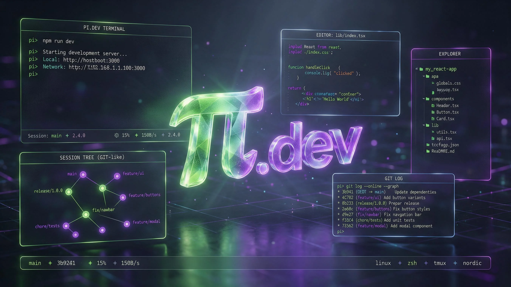

+++
date = '2026-09-14T18:00:00+08:00'
title = '极简主义的胜利：深度解析 Terminal AI 编码利器 Pi (pi.dev'
description = '在这个各大 AI Agent 疯狂堆砌功能的时代，pi 以“五无”哲学横空出世，成为最纯粹的黑客级 Terminal Harness。本文深度剖析 Pi (pi.dev) 的设计哲学、双队列会话机制...'
toc = true
tags = ['AI', 'AI Agent', 'Pi Agent', 'Developer Tools']
keywords = ['Pi Agent', 'pi.dev', 'Terminal AI Agent', 'AI 编码工具', 'TypeScript Extensions', 'Agent Skills', 'Mario Zechner']

[[params.faqItems]]
question = "既然 pi.dev 强调“No MCP”，它和支持 MCP 的 Agent 工具相比有什么优势？"
answer = "MCP（Model Context Protocol）为了把系统工具暴露给 AI，使用了一套繁琐的 JSON Schema 包装协议，这不仅增加了开发复杂度，还让 AI 的上下文塞满了工具的冗长说明。Pi 的理念是：CLI（命令行界面）本身就是人与计算机、AI 与系统最完美的标准协议。Pi 通过 Lazy-loaded Skills，在需要时才将工具指南调入上下文。如果你非要 MCP，Pi 允许你通过 TypeScript Extension 自己写一个适配器。极简的核心，无限的外延，这就是 Pi 的魅力。"

[[params.faqItems]]
question = "什么是 JSONL 多分支树会话管理？它在实际开发中怎么帮到我？"
answer = "市面上绝大多数 Agent 都是线性历史，AI 聊歪了或者搞砸了，你只能删掉重来。Pi 采用类似 Git 的树状 JSONL 保存结构。你在交互界面按下 Escape 两次，就能打开一个华丽的 `/tree` 视图。在这个视图里，你可以看到 AI 的所有探索分支，并且可以直接“回滚”到任意历史节点，克隆当前分支，或者从之前的某一步“分叉（fork）”出新的探索。这让尝试复杂的重构方案变得完全无痛，且不丢失任何探索历史。"

[[params.faqItems]]
question = "双消息队列（Steering 和 Follow-up）有什么用？"
answer = "这是 Pi 独创的绝活。传统的 Agent 思考或调用工具时，你只能干等。而在 Pi 中，当你看到 AI 正在跑一个错误的工具或漏掉了某个关键细节，你可以直接在 Editor 输入文字。敲回车（Enter），该信息会作为 Steering 消息，在 AI 跑完当前这步 Tool Call 后的瞬间插入它的脑中进行干预；敲 Alt+Enter 则是 Follow-up 消息，作为后续任务队列。这个设计不仅节省了你宝贵的 Token，更让开发者拥有了前所未有的“即时接管权”。"

[[params.faqItems]]
question = "自动上下文压缩（Proactive Compaction）会让我丢失代码细节吗？"
answer = "不会。Pi 的 Compaction（压缩）是智能且有损的。当你的会话很长，上下文窗口快被榨干时，Pi 会触发主动压缩：将早期的对话和工具调用过程提炼总结成摘要，以此释放几万乃至十几万的 Token，而保留最近的对话和工具输出。更厉害的是，旧有的完整历史并不会从物理文件里消失，你可以随时通过 `/tree` 重温。如果你觉得 AI 快不行了，你还可以通过向它下达手动压缩指令，或者用 rewind 技巧清空临时上下文，只保留它做完工作的文档路径。"

[[params.faqItems]]
question = "Skills 和 Extensions 到底有什么区别？"
answer = "Skills 遵循 Agent Skills 开放规范，它是对 AI 模型的“行为指南”，指导 AI 如何使用现有的命令行或工作流；Extensions 是对 Pi 这个“宿主程序（Harness）”的硬核武装。Extensions 用 TypeScript 编写，可以直接修改 Pi 的 UI、注册全新的 CLI 命令和 LLM 专用工具、监听系统事件，甚至能定制一整个子 Agent 的派发逻辑。可以说，Skills 决定了 AI 能“想”到什么，Extensions 决定了 Pi 能“做”到什么。"
+++



AI 编程工具的战局已经进入到了一个“堆功能、拼体量”的军备竞赛阶段。

不管是商业闭源的 Cursor Agent，还是大厂背书的 Claude Code，亦或是社区开源的 Cline、Roo Code，都在疯狂地向自己的代码中填充各种规划模式（Plan Mode）、子 Agent 派发框架、网络浏览器适配、以及极其繁杂的 MCP（Model Context Protocol）接入。

然而，在这种疯狂堆砌功能的热潮中，一个特立独行的“反叛者”悄然诞生了。

它就是 **Pi (https://pi.dev)**。

由资深开发者 Mario Zechner 打造的 Pi，自称为一个 **“Minimal terminal coding harness”**（极简终端编码马具/容器）。它以一己之力抗拒当下日益臃肿的 AI 潮流，甚至提出了让主流工程界感到震惊的**“五无哲学”**。

但千万不要以为它是个残缺的半成品。Pi 拥有着极其惊艳的 TUI 交互、类似 Git 的多分支会话管理、双队列 Steering 机制，以及可以说是目前市面上**最硬核、最纯粹的 TypeScript Extension 与 Skills 扩展能力**。

今天，我们将深入 Pi 的黑客世界，通过**真实、可运行的实战案例**，看看为什么“少即是多”在 AI Agent 时代依然是颠扑不破的真理。

---

## 一、 Pi 的 “五无” 反叛哲学

在 Pi 的官方哲学陈述中，作者指出了目前大多数 AI 工具的通病：**功能过度设计（Over-engineered），在没有充分发挥 CLI（命令行）威力的情况下，急于用复杂的自定义协议和多 Agent 框架把事情搞复杂。**

为此，Pi 在核心功能中砍掉了五样东西：

### 1. No MCP (没有内置 MCP)
> *“与其用冗长的 JSON 规范去包装工具，不如直接写一个生动的 CLI README（Skills）。”*

MCP（模型上下文协议）是当前非常火热的概念。然而，Mario 在其博文《What if you don't need MCP?》中犀利地指出：**Unix 命令行界面（CLI）已经是人、计算机和 AI 之间最完美、最成熟的标准协议。**

在 MCP 模式下，你需要编写大量的描述性 JSON 和客户端-服务端逻辑，而这些描述最终都会一股脑塞进 AI 的 Prompt 提示词里，让有限的上下文窗口很快被工具的冗余定义占满。Pi 采用更清爽、更符合黑客习惯的 [Agent Skills](https://agentskills.io) 规范。只有当 AI 确实需要使用某个 Skill 时，它的完整说明才会被**懒加载（Lazy-load）**进来，保护了宝贵的上下文卫生。

### 2. No Sub-agents (没有内置子 Agent)
子 Agent 之间的委派和上下文交接往往伴随着严重的信息丢失和庞大的 Token 开销。Pi 的核心保持纯粹。它主张：如果你需要多任务，通过 tmux 窗口开两个 Pi 实例去干活就是最直观的；或者，如果你真的有业务痛点需要子 Agent，Pi 提供了极强大的 TypeScript API，你可以用几行 Extension 代码自己写一套最适合你特定场景的委派逻辑，而不是由工具强加给你一套难用的分发框架。

### 3. No Permission Popups (没有权限弹窗)
频频弹出的“AI 想要执行 `npm run dev`，允许还是拒绝？”不仅严重打断了开发者的工作流，也会阻碍 AI 在后台执行链式推理。Pi 的理念非常硬核：要么你完全信任这个项目，要么你在 Docker 等安全沙箱容器中运行 Pi。Pi 让你一次性决定是否信任该项目（Project Trust）。如果你确实需要限制某些危险路径的读写，可以通过写一个 TypeScript Extension 拦截危险操作，高度自定制。

### 4. No Plan Mode (没有内置规划模式)
很多 Agent 工具在动手前，非要先打印一个冗长的规划（Plan Stage），并且反复和你确认。这在大规模重构时纯粹是在浪费昂贵、漫长且带有延迟的 Token 输出。Pi 主张：在项目里直接维护一个 `TODO.md` 文件是最简单、最显式也是最容易被人和 AI 共同编辑的方法。

### 5. No Background Bash (没有后台异步 Bash)
AI 默默在后台跑脚本而你不自知是一件极度危险和缺乏控制感的事情。Pi 所有的命令都显式地在 TUI 中流式（Streaming）展示。如果需要长时间跑服务，在 tmux 里跑就行了。

---

## 二、 令人惊叹的技术硬实力

虽然哲学上极度克制，但在开发者体验和运行时设计上，Pi 却展现出了令人赞叹的技术高度：

### 1. 类似 Git 的 JSONL 分支树会话管理
这大概是 Pi 最令人着迷的功能。在传统的 Agent 中，会话只是一条单向的时间线，一旦 AI 跑歪或者把代码改乱了，你只能删掉整个对话或者忍受被弄脏的历史继续。

而在 Pi 中，所有的会话都是以 `JSONL` 树状结构保存的。你可以在 TUI 中输入快捷键（在交互模式下按住 Escape 键两次），即可唤起一个华丽的 `/tree` 视图：

- **就地回滚**：选中任何一个历史气泡，直接回退并从这一步继续。
- **分支分叉**：使用 `/fork` 基于历史上的某一步派生出一个独立的新会话文件。
- **分支克隆**：使用 `/clone` 复制当前分支的状态到新会话中，原历史完好无损。

所有的尝试都被完整地记录在树上，极大地降低了开发者在探索高风险代码重构时的心理负担。

### 2. 双队列 Steering & Follow-up 机制
在传统的终端 Agent 运行长任务或长 Tool Call 时，你的终端通常是被锁死的。如果你发现 AI 读错了文件，或者参数填错了，你唯一的选择就是按 Ctrl+C 强行终止，然后重新构思 prompt 发送。

Pi 独创了**双队列异步提交机制**：
- **Steering 消息（敲 Enter 发送）**：当 AI 正在运行工具时，你随时可以敲入文字并回车。Pi 会将它作为“Steering（舵向/操纵）”指令，暂存在队列中。当 AI 执行完当前的这**一个** Tool Call 后，会立刻读取该 Steering 消息并改变接下来的行为。
- **Follow-up 消息（敲 Alt+Enter 发送）**：如果你想等 AI 把手头所有的工具调用和工作干完后，再让它去做下一件事，你可以敲入文字并使用 Alt+Enter，它会被作为一个挂起的后续任务，等 AI 闲置后自动执行。

---

## 三、 实战演练：Skills 与 TypeScript Extensions 零基础实战

理论聊完，我们用最真实的落地代码，来展示 Pi 独步天下的定制威力。

### 案例一：编写你的第一个自动化测试 Skill
假设你正在开发一个复杂的 Python Web 项目，你希望 AI 能够极其稳健地帮你调试并修好所有的测试报错。在 MCP 下你需要配置庞大的外部工具，而在 Pi 中，你只需要在项目的 `.agents/skills/pytest-runner/SKILL.md` 中写下如下的“大模型使用说明书”：

```markdown
# Pytest Runner Skill
当用户要求运行测试、排查测试错误或修复 Bug 导致测试通过时，使用此 Skill。

## 适用条件
项目中包含 pytest 测试框架，且存在 `tests/` 目录或带有 `test_*.py` 的测试文件。

## 调试步骤
1. **执行测试**：首先通过 bash 工具运行 `pytest -v` 获取当前的详细报错信息。
2. **分析日志**：重点看 `AssertionError` 或 `Traceback` 的最底层报错，定位发生错误的文件和代码行号。
3. **环境排查**：如果是缺包报错（ModuleNotFoundError），先执行 `pip install <package>` 解决，再重新跑 pytest。
4. **代码修复**：定位到源码后，先通读对应的 test 文件与实现逻辑，使用精确的编辑（edit/write）工具修复。
5. **循环验证**：修复后必须重新运行 `pytest -v` 验证，直到获取全部 OK/PASSED 为止，绝不可提前宣告胜利。
```

当你在 Pi 的 TUI 终端中对 AI 说：“*帮我看看怎么项目里有测试在报错*”：
1. Pi 在启动时就已经**懒加载**了这个 Skill 的名字与功能。
2. LLM 感知到任务后，会自动激活 `/skill:pytest-runner` 并将上面的 5 步规范调入脑中。
3. 它会极其守规矩地遵循“运行 → 定位 → 修复 → 重测 → 循环”的工程纪律，一次性完美解决你的测试故障。

---

### 案例二：编写你的第一个 TypeScript Extension —— 自动 Git 快照
在让 AI 进行大规模重构代码前，开发者最害怕的就是它把工作区改得一塌糊涂，而没有进行提交备份。

我们可以写一个高度硬核的 TypeScript Extension。当 AI 在修改重要代码前，Pi 会自动在背后默默通过 Git 创建一个临时备份分支（Snapshot）。如果改错了或跑测试挂了，我们能够一键回滚。

在 `.pi/extensions/git-snapshot.ts` 中写入如下的真实代码：

```typescript
import { ExtensionAPI } from "@earendil-works/pi-coding-agent";
import { execSync } from "child_process";

export default function (pi: ExtensionAPI) {
  // 1. 注册一个专门给 LLM 调用的工具
  pi.registerTool({
    name: "create_git_snapshot",
    description: "Create a temporary git snapshot branch before performing major code refactoring or risky operations.",
    execute: async () => {
      try {
        const timestamp = Date.now();
        const branchName = `pi-snapshot-${timestamp}`;
        
        // 检查当前是否有脏代码需要暂存
        const isDirty = execSync("git status --porcelain").toString().trim().length > 0;
        if (!isDirty) {
          return "✓ Current git working tree is clean. No snapshot needed.";
        }
        
        // 执行 Git 快照逻辑：将当前脏代码全量 add 并 commit，然后切出一个专门备份的分支
        execSync("git add -A");
        execSync(`git commit -m "Pi auto-snapshot: before refactoring" --no-verify`);
        execSync(`git checkout -b ${branchName}`);
        
        // 恢复原有的工作区状态
        execSync("git checkout -");
        execSync("git reset --hard HEAD~1");
        
        return `✓ Successfully created a safe snapshot on temporary branch [${branchName}]. If things go wrong, you can recover via 'git checkout ${branchName}'.`;
      } catch (err: any) {
        return `✗ Failed to create git snapshot: ${err.message}`;
      }
    }
  });

  // 2. 注册一个专门给开发者在 TUI 输入框中运行的快捷斜杠命令 (Slash Command)
  pi.registerCommand("checkpoint", {
    description: "Create a local git checkpoint manually",
    execute: async () => {
      pi.emitMessage("🔧 Creating a manual git stash checkpoint...");
      try {
        const isDirty = execSync("git status --porcelain").toString().trim().length > 0;
        if (!isDirty) {
          pi.emitMessage("✓ Working directory is clean. Checkpoint skipped.");
          return;
        }
        execSync("git stash push -m 'Pi manual checkpoint'");
        pi.emitMessage("✓ Successfully stashed your changes to 'Pi manual checkpoint'. Use 'git stash pop' to restore.");
      } catch (err: any) {
        pi.emitMessage(`✗ Checkpoint failed: ${err.message}`);
      }
    }
  });
}
```

#### 🚀 实战测试：
当你在终端中启用 Pi，如果对 AI 说：“*我想把这个模块重构成 TypeScript。在重构前，先帮我建一个 Git 快照。*”

1. **LLM 调用工具**：AI 发现自己有 `create_git_snapshot` 工具，它会先调用。终端会流式显示它在默默创建 `pi-snapshot-1721000000` 分支，工作区瞬间多了一个安全的时光回滚节点。
2. **开发者手动执行**：你在终端输入框中输入 `/checkpoint`，Pi 宿主也会自动执行插件里的 Git Stash 逻辑，保护你手头的临时工作，两层保险！

---

## 四、 常见问题 FAQ

为了让大家少走弯路，这里整理了关于 Pi 实战中最常见的几个高频疑问：

### Q1: 在运行 `npm install -g @earendil-works/pi-coding-agent` 时为什么要带 `--ignore-scripts`？
这是为了**最大化你的系统安全性**。Pi 在正常的 npm 安装中完全不需要生命周期安装脚本（install scripts）。使用 `--ignore-scripts` 可以防止 npm 运行那些可能存在于依赖包中的危险代码。

### Q2: 既然 Pi 是在沙箱中运行更安全，我如何与外部主机建立顺畅的代码协作？
你可以通过 **SSH / DevContainer / Docker** 挂载。在 Docker 镜像中预装好 `npm` 和 `pi`，并将你本地的项目目录挂载（mount）到容器中运行。这样既能利用 Pi 强大的文件改写能力，又彻底杜绝了 AI 执行恶意代码对真实主机的破坏，甚至不用再为了弹窗确认而烦恼。

### Q3: 为什么我在输入队列消息时，Alt+Enter 在 Windows 终端不起作用？
在 Windows Terminal 等终端中，`Alt+Enter` 默认是“切换全屏”的系统热键，因此会被操作系统拦截而无法送达 Pi。你需要打开终端的设置文件（settings.json），解除或重映射 `Alt+Enter` 快捷键，以便把这个极其好用的“Follow-up”队列热键交还给 Pi。

### Q4: 如何让 Pi 只用特定的工具，不让它用 bash 工具？
Pi 提供了无与伦比的白名单/黑名单机制。如果你想让它进入“只读、只搜索”的绝对安全状态，启动时加上这行指令即可：
```bash
pi --tools read,grep,find,ls
```
这样 AI 会感知到它只有只读权限，从而完美化身为一个高精度的**代码阅读和审查专家**。

---

## 五、 总结：当黑客精神遇上大语言模型

`pi.dev` 的诞生，像是一股清流吹进了已经有些令人窒息的 AI Agent 战场。

它向我们证明了：**一个好的 AI 工具，其核心竞争力不在于它替你预置了多少笨重的业务流程，而在于它是否提供了一个稳健、极简、完全透明且可任意插拔扩展的运行时。**

如果你是一个极度重视控制感、不喜欢被工具链绑架、同时又希望将 AI 的能力丝滑地融入到现有终端工作流中的黑客级开发者，那么 Pi 绝对是目前最懂你的那匹“黑马”。

适应工具的时代已经过去了。利用 Pi，去定制属于你自己的 AI Harness。
