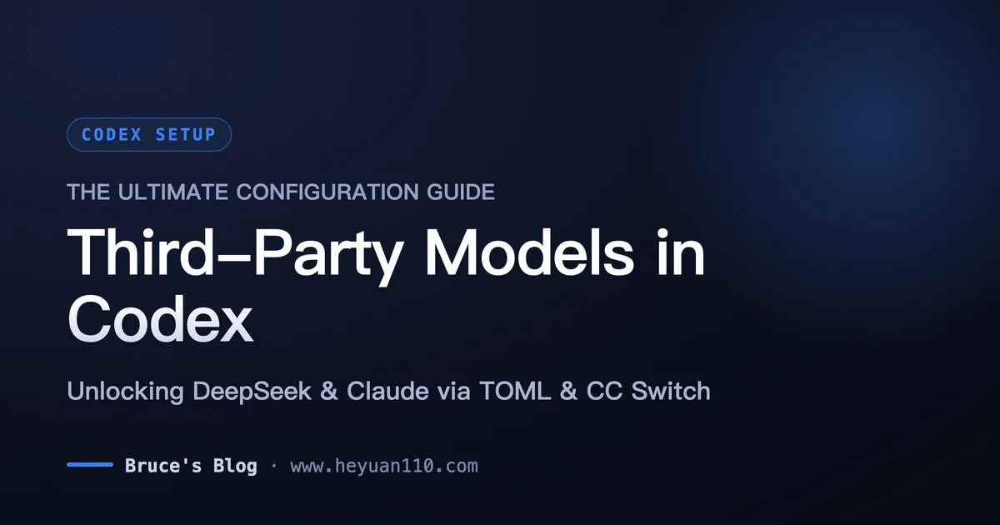
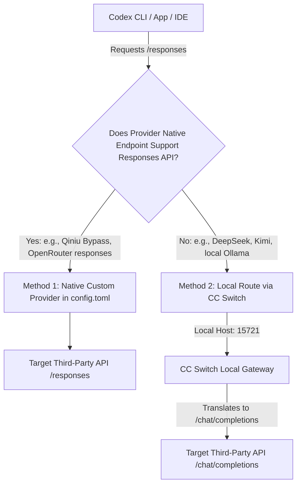
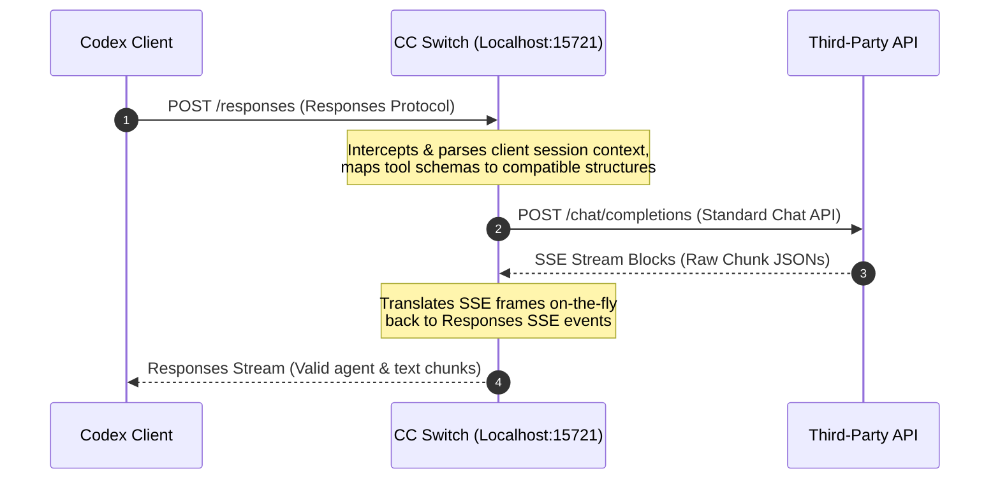

+++
date = '2026-09-15T20:00:00+08:00'
draft = false
title = 'Configuring Third-Party Models in OpenAI Codex: The Ultimate TOML & CC Switch Guide'
description = 'Unlock third-party models like DeepSeek & Claude in OpenAI Codex. Complete guide covering custom config.toml providers, separate profiles, and CC Switch protocol routing.'
toc = true
tags = ['Codex', 'AI Agent', 'Configuration', 'DeepSeek', 'Claude']
keywords = ['Codex third-party models', 'Codex config.toml', 'CC Switch Codex', 'OpenAI Responses API', 'Codex Desktop custom model']

[[params.faqItems]]
question = "Why does my third-party model fail with a 400 or 404 error when connected directly?"
answer = "Most 'OpenAI-compatible' APIs only support Chat Completions (/v1/chat/completions), whereas Codex expects the Responses API (/responses) wire protocol. You must use CC Switch or another proxy to translate the protocols."

[[params.faqItems]]
question = "How do I configure profiles in Codex 0.134.0+ without them being ignored?"
answer = "Starting with version 0.134.0, inline profile definitions inside config.toml are ignored. You must create a standalone profile file under ~/.codex/<profile-name>.config.toml and call it using 'codex --profile <profile-name>'."

[[params.faqItems]]
question = "Do I need to configure the Codex App, CLI, and VS Code extension separately?"
answer = "No. Codex features a 'Three Clients, One Configuration' (三端同源) architecture. All three clients read from ~/.codex/config.toml, so configuring it once covers all environments. Remember to restart the Desktop App for changes to take effect."

[[params.faqItems]]
question = "How can I make my custom models appear in the Codex model selector menu?"
answer = "You can customize the model selector list by copying models_cache.json to a custom JSON file (like my-models.json), defining your models there, and pointing to it using 'model_catalog_json = \"my-models.json\"' in your config.toml."
+++



Unlocking OpenAI Codex's capabilities with third-party models is the single most effective way to optimize your agentic coding workflows. By default, Codex is configured to talk directly to OpenAI's native API. However, for high-frequency development, the sheer volume of code ingested during multi-file edits, codebase analyses, and deep refactoring can rapidly drain your token budget. Swapping the backend to cost-effective alternatives like DeepSeek-V3 or highly specialized reasoning models like Claude 3.5 Sonnet / Fable 5 gives you the best of both worlds: Codex's elite agent loop running on the most cost-efficient intelligence available.

But connecting these models is not as simple as swapping a `base_url` inside your settings. Because Codex operates on a highly specialized wire protocol, most standard OpenAI-compatible API endpoints will silently fail. In this deep-dive guide, we will dissect the underlying protocol barriers, walk through the manual TOML configurations for native providers, master local protocol translation via **CC Switch**, and cover critical configuration updates for Codex 0.134.0+ to prevent silent profile ignores.

---

## 1. The Protocol Barrier: Responses API vs. Chat Completions

To successfully route Codex to a custom backend, you must understand its strict protocol requirement. Almost every API provider in 2026 advertises "OpenAI Compatibility." However, in 99% of cases, this compatibility refers strictly to the **Chat Completions API** (`/v1/chat/completions`). 

Codex does not use Chat Completions. Codex’s native wire protocol is built entirely around the newer, more structured **Responses API** (`/responses`). 

### Why Standard Endpoints Fail

The Responses API and Chat Completions API handle data streams, tool-calling structures, and multi-turn state variables in fundamentally different ways:

| Feature | OpenAI Responses API (`/responses`) | Chat Completions API (`/chat/completions`) |
| :--- | :--- | :--- |
| **Endpoint Format** | `POST /responses` | `POST /chat/completions` |
| **Protocol Stream** | Native Server-Sent Events (SSE) returning structured tool outputs and reasoning steps | Chunked text streams or standard tool-call message blocks |
| **State Tracking** | Managed via `previous_response_id` across turns | Managed by appending raw message arrays on the client side |
| **Tool Execution** | Highly strict JSON schema validation for sequential execution | Standard parallel tool call format |

If you plug a standard Chat Completions endpoint directly into Codex's `base_url`, Codex will attempt to parse the stream as Responses JSON. The result? Immediate `400 Bad Request` or `404 Not Found` errors, or a silent freeze during code streaming as the agent fails to deserialize the chunk events.

### The Two Integration Pathways

Depending on your model provider's native protocol capabilities, you must choose between two distinct integration pathways:



1. **Method 1: Direct TOML Custom Provider (Native)**: Only viable if the third-party endpoint natively supports the Responses protocol. (For example, Qiniu's bypass route or OpenRouter's specific Responses proxy).
2. **Method 2: Local Gateway Protocol Translation (CC Switch)**: The universal method. You run a lightweight local bridge (CC Switch) that intercepts Codex’s native `/responses` requests, translates them into `/chat/completions` on the fly, forwards them to your provider, and translates the response back.

---

## 2. Standalone Profiles: Critical Codex 0.134.0+ Update

Before writing any configuration, we must address a major breaking change introduced in **Codex version 0.134.0+**. 

In older versions of Codex, developers commonly created multi-model profiles directly inside the main `~/.codex/config.toml` file like this:

```toml
# ❌ OBSOLETE INLINE CONFIGURATION - DO NOT USE IN v0.134.0+
[profiles.deepseek]
model = "deepseek-chat"
model_provider = "my-custom-provider"
```

**Starting with version 0.134.0, Codex completely dropped support for inline `[profiles.x]` blocks.** If you use this syntax, passing `--profile deepseek` will be silently ignored, and Codex will fall back to its default OpenAI configuration.

### The New Standalone File Convention

Profiles must now live as **completely separate configuration files** located directly in the user-level configuration directory:

*   **macOS / Linux**: `~/.codex/<profile-name>.config.toml`
*   **Windows**: `%USERPROFILE%\.codex\<profile-name>.config.toml`

For instance, to run a DeepSeek configuration, you must write a dedicated file named `~/.codex/deepseek.config.toml` and launch Codex with the corresponding flag:

```bash
codex --profile deepseek
```

---

## 3. Method 1: Direct Custom Provider Setup (Direct TOML)

Use this method **only** if your provider natively supports the strict `/responses` protocol. A perfect example of a direct native bridge is Qiniu Cloud's AI Marketplace bypass interface (`https://api.qnaigc.com/bypass/openai/v1`), which translates protocol specs on their side.

### Step 1: Set Up Your Profile File
Create a new standalone profile file named `~/.codex/qiniu.config.toml`:

```toml
# ~/.codex/qiniu.config.toml
model = "openai/gpt-5.5" # Your target model identifier on the gateway
model_provider = "qiniu-gateway"

[model_providers.qiniu-gateway]
name = "Qiniu Cloud Gateway"
base_url = "https://api.qnaigc.com/bypass/openai/v1"
env_key = "QINIU_API_KEY" # Points to the environment variable containing the actual key
wire_api = "responses"   # Strict Responses protocol flag
requires_openai_auth = false
request_max_retries = 4
stream_idle_timeout_ms = 300000
```

### Step 2: Configure Environment Variables
To keep your credentials secure, **never hardcode API keys in TOML files**. Instead, reference them using the `env_key` parameter and export the key inside your shell rc profile:

```bash
# ~/.zshrc or ~/.bashrc
export QINIU_API_KEY="your_actual_qiniu_api_key_here"
```

*Note for macOS GUI/App users:* Graphical applications launched from the Dock or Finder do not read shell configuration files automatically. To make this key visible to the Codex App, set the environment variable globally using `launchctl`:

```bash
launchctl setenv QINIU_API_KEY "your_actual_qiniu_api_key_here"
```

### Step 3: Populate Custom Model Selector list (Optional)
By default, the `/model` dropdown menu inside Codex reads from a pre-built local cache (`~/.codex/models_cache.json`). If you want your custom third-party models to show up dynamically in this list, copy your model cache into a custom JSON template and point to it inside your top-level `config.toml`:

1. Copy the cache file:
   ```bash
   cp ~/.codex/models_cache.json ~/.codex/my-models.json
   ```
2. Open `~/.codex/my-models.json` and append your custom model entries in the `models` array:
   ```json
   {
     "slug": "openai/gpt-5.5",
     "display_name": "Qiniu GPT-5.5 Pro",
     "description": "High-speed reasoning model powered by Qiniu Gateway"
   }
   ```
3. Link the catalog in your profile `~/.codex/qiniu.config.toml`:
   ```toml
   model_catalog_json = "my-models.json"
   ```

---

## 4. Method 2: Universal Setup via CC Switch (Protocol Bridge)

If you are using direct upstream providers like Anthropic (Messages protocol), DeepSeek (Standard `/chat/completions`), Kimi, or local instances like Ollama, you **must** use a protocol translation layer. 

**CC Switch** is a highly optimized, developer-friendly local proxy daemon built specifically to solve the Codex protocol mismatch. It spawns a local server on your loopback interface that seamlessly intercept requests and performs full bi-directional translations of tools, reasoning frames, and SSE data blocks.

### Step 1: Install CC Switch
To install CC Switch on macOS, use Homebrew:

```bash
brew install --cask cc-switch
```

For Windows or Linux users, download the latest `.msi` or `.deb` packages directly from the official CC Switch GitHub Releases page.

### Step 2: Configure Your Third-Party Provider in CC Switch
1. Open the CC Switch application window and navigate to the **Codex** tab.
2. Click **Add Custom Provider** in the top-right corner.
3. Configure the following fields based on your target service:

| Field | Configuration Value |
| :--- | :--- |
| **Provider Name** | E.g., `DeepSeek Cloud` |
| **API Key** | `your_deepseek_api_key_here` |
| **Base URL** | `https://api.deepseek.com` *(Do not append `/v1` or `/chat/completions`)* |
| **Model ID** | `deepseek-chat` *(Must exactly match upstream API docs)* |
| **Upstream Format** | Choose **Chat Completions (routing required)** |

4. Toggle on **Needs Local Routing** under Advanced Settings.
5. Save the configuration.

### Step 3: Activate Local Routing
Once your provider is configured, you must authorize CC Switch to act as the primary local gateway:

1. Navigate to **Settings** -> **Routing** -> **Local Routing**.
2. Toggle on the global **Local Routing Switch**.
3. Under **Routing Enabled Apps**, toggle on **Codex**.
4. In the main Codex tab, select your newly added provider and click **Enable**.

```
Codex (CLI / App) -> Localhost Proxy (127.0.0.1:15721) -> Translates JSON Structures -> Upstream API Endpoints
```

Once enabled, CC Switch automatically rewrites your `~/.codex/config.toml` to point directly to its local loopback daemon (`http://127.0.0.1:15721`).

### CC Switch Protocol Translation Loop

To help visualize how CC Switch intercepts and translates communication between your client and standard third-party servers, see the sequence loop below:



By keeping CC Switch running in the background, your system will enjoy zero-latency translation, bridging the gap between proprietary agent specifications and generic model completions.

---

## 5. Three Clients, One Heart: Multi-Client Integration

One of the cleanest aspects of Codex's engineering is its unified configuration framework. There is no separate configuration layer for CLI vs. Desktop App. 

All three execution environments share the exact same user configuration directory:

```
                          ~/.codex/config.toml
                                    │
         ┌──────────────────────────┼──────────────────────────┐
         ▼                          ▼                          ▼
  Codex CLI Client          Codex Desktop App           VS Code Extension
(Runs inside terminal)      (Separate Electron App)      (Native IDE Plugin)
```

Because of this "Three Clients, One Heart" (三端同源) architecture, any modification to your user configuration automatically cascades across all interfaces.

### Critical Notes for the Codex Desktop App

While the CLI and VS Code extension read config modifications instantly on the next session launch, the **Codex Desktop App** requires special care:

*   **Hard Restart Needed**: The desktop application caches configuration states in memory. After modifying `config.toml` or toggling provider profiles, you must fully quit the app (`Cmd+Q`) and restart it. Simply closing the window will not apply your changes.
*   **The OS Environment Trap**: If you rely on shell-exported environment variables (like `export DEEPSEEK_API_KEY="..."` in your `.zshrc`), the Desktop App will not see them when launched via macOS Finder or the Dock. You must either configure global OS variables via `launchctl`, or utilize CC Switch (which manages API keys inside its own secure process memory space, bypassing OS environment limitations entirely).

---

## 6. Diagnostic Matrix & Common Pitfalls

Even with careful configuration, protocol bridges and custom providers can experience hiccups. Use this runtime troubleshooting matrix to resolve configuration friction:

| Symptom | Probable Cause | Actionable Fix |
| :--- | :--- | :--- |
| **401 Unauthorized Error** | Codex Desktop App cannot read the shell `.zshrc` / `.bashrc` environment variables. | If launching via GUI, set the key globally using `launchctl setenv <KEY> <VALUE>`. Alternatively, use CC Switch to manage keys safely inside the proxy app memory. |
| **400 Bad Request / 404 Not Found** | Direct TOML provider is attempting to use a standard `/chat/completions` API endpoint. | Verify the `base_url` supports native `/responses`. If the upstream provider only supports chat completions, transition immediately to the **CC Switch** local routing workflow. |
| **Profile flag ignored on launch** | You are using the deprecated inline `[profiles.name]` TOML syntax inside the main config. | Upgrade to Codex 0.134.0+ standards. Remove the inline blocks and create a dedicated standalone profile file under `~/.codex/<profile-name>.config.toml`. |
| **Agent gets stuck in infinite loops** | The chosen third-party model lacks advanced tool-calling and function-calling schemas. | Ensure you are targeting high-tier reasoning models like `deepseek-chat` (V3) or `claude-3-5-sonnet`. Lightweight models (e.g., Llama-3-8B-Instruct) often fail to properly serialize tool outputs, causing loop crashes. |
| **Custom model does not show up in CLI** | The local CLI selector reads strictly from `models_cache.json`. | Duplicate your local model list, append your custom metadata, and register the catalog using `model_catalog_json = "my-models.json"` in your TOML config. |

---

## 7. Production Summary & Recommendations

When selecting a pathway to connect third-party models to Codex, weigh the administrative overhead against your production needs:

*   **For Swift Local Testing**: Run **CC Switch**. It handles the entire protocol translation, eliminates OS-level environment variable issues, and provides real-time traffic inspection logs to quickly debug request payloads.
*   **For Headless CI/CD & Automated Pipelines**: Use **Direct TOML Custom Providers** referencing native Response endpoints. Running headless environments benefits from removing GUI application dependencies, making standalone environment variables and custom profile configurations the cleanest approach.

By structuring your Codex backend correctly, you maintain complete model sovereignty, bypass prohibitive cloud pricing, and unleash the full potential of multi-model agentic engineering in your terminal.
