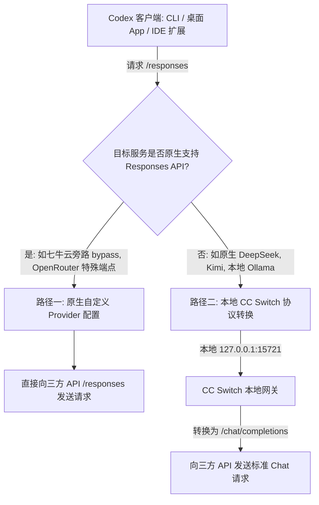
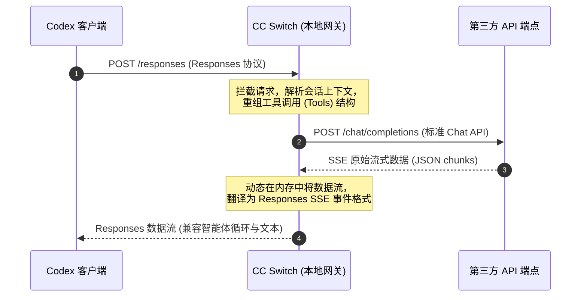

+++
date = '2026-09-15T20:00:00+08:00'
draft = false
title = 'Codex 接入第三方模型完美指南：深入 config.toml 与 CC Switch 协议转换'
description = '解锁 DeepSeek、Claude 等三方模型在 OpenAI Codex 中的无限潜能。详尽拆解 Responses 协议差异、0.134.0+ 独立 profile 新规，以及 CC Switch 协议转换实操。'
toc = true
tags = ['Codex', 'AI Agent', 'Configuration', 'DeepSeek', 'Claude']
keywords = ['Codex 接入第三方模型', 'Codex config.toml', 'CC Switch 教程', 'Responses API 协议', 'Codex 桌面端自定义模型']

[[params.faqItems]]
question = "为什么我把第三方 OpenAI 兼容 API 直接写进 base_url 会报 400 或 404 错误？"
answer = "市面上绝大多数宣传'兼容 OpenAI'的接口，实际只兼容 Chat Completions 协议（/v1/chat/completions），而 Codex 必须使用 Responses API 协议（/responses）。如果不做协议转换直接套用，就会导致接口报错或数据流解析失败。"

[[params.faqItems]]
question = "为什么在 Codex 0.134.0+ 版本中，我配置的 profile 会被静默忽略？"
answer = "自 0.134.0 版本起，Codex 废弃了在 config.toml 顶层内联编写 [profiles.x] 的做法。所有 profile 必须写成独立的配置文件（如 ~/.codex/deepseek.config.toml），否则参数无法生效。"

[[params.faqItems]]
question = "Codex 桌面端（App）、CLI 终端和 IDE 插件需要分别配置三份配置文件吗？"
answer = "不需要。Codex 采用了'三端同源'的统一架构，它们都读取 ~/.codex/config.toml。不过桌面端有内存缓存，修改配置文件后需要彻底退出 App 并重启才会生效。"

[[params.faqItems]]
question = "如何才能让自定义的第三方模型出现在 Codex 的命令行 /model 选择器菜单中？"
answer = "你需要把默认的 models_cache.json 复制一份并重命名（例如 my-models.json），在 models 数组中填入自定义模型的信息，最后在配置文件顶层加上 model_catalog_json = \"my-models.json\" 来指定它。"
+++


在 AI 编程 Agent 的日常实战中，将 OpenAI Codex 的底层模型替换为第三方大模型（如 DeepSeek-V3 或 Claude 3.5 Sonnet / Fable 5），是极客开发者优化成本与调用效率的终极武器。由于 Codex 在执行多文件重构、自动化代码库扫描、深度测试修复等高频长程任务时会消耗天量 Token，如果一味直连 OpenAI 官方模型，高昂的账单往往让人望而却步。将请求改道至性价比极高的 DeepSeek，或拥有最强逻辑推理的 Claude 旗舰模型，能让我们在不改变 Codex 顶尖智能体运行逻辑的前提下，享受到最极致的性价比与模型选择权。

然而，这条接入之路绝非简单修改一行 `base_url` 就能搞定。由于 Codex 内部采用了一套极为严苛、结构复杂的原生通信协议，直接套用普通的“OpenAI 兼容端点”必然会遭遇各种静默报错。本文将带大家从底层通信协议切入，详细剖析 Responses API 的独特机制，演示如何编写最新的 0.134.0+ 独立配置文件（Profile），并实操如何通过 **CC Switch** 实现完美的本地协议转换，助你彻底打通 CLI、桌面端与 IDE 扩展。

---

## 1. 协议障壁：Responses API 与 Chat Completions 的底层对决

要成功将 Codex 改道至自定义后端，首先必须击碎最核心的“协议障壁”。现在几乎所有的大模型聚合平台或中转服务都宣称“完全兼容 OpenAI 接口”。但必须看清的事实是：**它们兼容的只是 Chat Completions 接口（`/v1/chat/completions`），而 Codex 运行所需的底层通道是 Responses API（`/responses`）。**

### 为什么直连中转端点必然失败？

这两套协议在流式传输、工具调用（Tool Calling）机制以及多轮会话状态管理上，有着完全不同的数据结构设计：

| 协议特性 | OpenAI Responses API (`/responses`) | Chat Completions API (`/chat/completions`) |
| :--- | :--- | :--- |
| **通信端点** | `POST /responses` | `POST /chat/completions` |
| **流式传输 (SSE)** | 返回带有推理步骤、Tool 状态的 Native 结构化流 | 传统的文本 Chunk 流，或扁平的工具调用消息块 |
| **多轮对话管理** | 通过 `previous_response_id` 在云端或网关层无缝维护上下文状态 | 由客户端在请求体中手动 append 历史 `messages` 数组 |
| **工具调用执行** | 支持针对 Agent 任务链的高度严苛的 JSON Schema 顺序校验 | 标准的并行工具调用，对自主执行回路缺乏结构化支撑 |

当你直接在 Codex 的 `base_url` 中填入普通的 Chat Completions 接口时，Codex 依然会尝试按照 Responses 协议去反序列化返回的数据。结果往往是收到 `400 Bad Request`、`404 Not Found` 错误，或者在流式生成代码时终端直接“卡死”。

### 解决协议 mismatch 的两条路径

基于第三方服务的实际协议支持情况，我们需要在以下两条路径中做出抉择：



1. **路径一：原生自定义 Provider 配置（免中介直接 TOML）**：仅适用于极少数在网关层做好了 Responses 协议适配的云厂商。例如七牛云 AI 广场提供的 bypass 转换路径，可以直接接收 `/responses` 请求，在后台帮开发者完成格式转换。
2. **路径二：本地 CC Switch 协议中转（万能方案）**：最普适的方案。在本地启动一个轻量级路由守护进程（CC Switch），它会在本地监听并接管 Codex 客户端的 `/responses` 请求，并在内存中高效率翻译为 `/chat/completions` 格式发送给任意第三方大模型，随后将响应流翻译回 Responses 格式返给 Codex。

---

## 2. 规则巨变：Codex 0.134.0+ 独立 Profile 新规

在动笔修改配置前，必须先同步一个广大技术博主和社区教程尚未完全覆盖的“大坑”。

在老版本的 Codex 教程中，我们习惯于在主配置文件 `~/.codex/config.toml` 中通过内联方式管理多个模型切换，例如：

```toml
# ❌ 旧版内联写法 - 在 0.134.0+ 版本中已被废弃！
[profiles.deepseek]
model = "deepseek-chat"
model_provider = "my-custom-provider"
```

**自 0.134.0 版本起，Codex 已经完全移除并静默忽略了主配置文件中的 `[profiles.x]` 段！** 如果你继续使用这种内联写法，并在终端中输入 `codex --profile deepseek`，Codex 将完全无视你的配置，直接回退到官方默认模型。

### 0.134.0+ 独立配置文件规范

在新版本中，Profile 必须写成**完全独立的配置文件**，并存放在用户级配置目录下：

*   **macOS / Linux**: `~/.codex/<profile-name>.config.toml`
*   **Windows**: `%USERPROFILE%\.codex\<profile-name>.config.toml`

例如，若要配置 DeepSeek 运行，必须在 `~/.codex/` 下单独创建一个名为 `deepseek.config.toml` 的文件，并在启动 Codex 时通过参数进行显式指定：

```bash
codex --profile deepseek
```

---

## 3. 路径一：原生自定义 Provider 配置（手动修改 TOML）

只有当你的第三方代理厂商或企业内部模型网关已经原生实现了 Responses 接口时，才可以采用这种免本地中介直连的方法。下面以七牛云大模型广场 bypass 转换接口（`https://api.qnaigc.com/bypass/openai/v1`）为例进行配置。

### 第一步：创建独立的 Profile 文件
在配置目录下创建一个全新的独立 Profile 文件，命名为 `~/.codex/qiniu.config.toml`：

```toml
# ~/.codex/qiniu.config.toml
model = "openai/gpt-5.5" # 目标网关中配置的模型 ID
model_provider = "qiniu-gateway"

[model_providers.qiniu-gateway]
name = "Qiniu Cloud Gateway"
base_url = "https://api.qnaigc.com/bypass/openai/v1"
env_key = "QINIU_API_KEY" # 告诉 Codex 查找 API Key 的环境变量名称
wire_api = "responses"   # 声明走严苛的 Responses 协议
requires_openai_auth = false
request_max_retries = 4
stream_idle_timeout_ms = 300000
```

### 第二步：配置环境变量，杜绝 Key 明文泄露
为了防止敏感密钥被同步、提交到 Git 仓库或在截图中泄露，**严禁将 API Key 明文写入 TOML 配置文件中**。必须使用 `env_key` 关联的环境变量。

编辑你的 shell 配置文件（以 zsh 为例）：

```bash
# ~/.zshrc 或 ~/.bashrc
export QINIU_API_KEY="你的七牛云真实API_KEY"
```

*macOS 桌面客户端（App）用户专属避坑提示：*
从 Dock 或 Launchpad 启动的 macOS GUI 应用程序在启动时是不读取 shell rc 配置文件的。这会导致桌面端 Codex 报 `401 Unauthorized` 鉴权失败。为了解决这一痛点，你必须通过 `launchctl` 将环境变量注册到系统级：

```bash
launchctl setenv QINIU_API_KEY "你的七牛云真实API_KEY"
```

### 第三步：让自定义模型出现在本地 CLI 的 `/model` 菜单中（可选）
Codex 的命令行模型选择器是通过本地模型名片缓存（`~/.codex/models_cache.json`）进行加载的。要想让你的自定义模型名正言顺地出现在菜单里：

1. 拷贝一份现有的缓存文件：
   ```bash
   cp ~/.codex/models_cache.json ~/.codex/my-models.json
   ```
2. 编辑 `~/.codex/my-models.json`，在 `models` 数组中仿照已有条目增加你自己的第三方模型：
   ```json
   {
     "slug": "openai/gpt-5.5",
     "display_name": "七牛 GPT-5.5 极速版",
     "description": "基于七牛旁路网关的高智能推理模型"
   }
   ```
3. 在你的 Profile 文件 `~/.codex/qiniu.config.toml` 中，通过这一行将目录挂载：
   ```toml
   model_catalog_json = "my-models.json"
   ```

---

## 4. 路径二：本地 CC Switch 协议转换（万能配置路径）

如果你的目标是直连 OpenAI 兼容性最好的 DeepSeek-V3 官方原生接口、Anthropic 的 Messages 接口，或是本地通过 Ollama 跑的开源模型，你**必须**使用协议转换层。

**CC Switch** 是一款在本地运行、专为 Codex 协议重构而开发的图形化切换与代理转换工具。它会拉起一个超轻量级的本地环回服务，在内存中高效翻译请求与流式事件。

### 第一步：安装 CC Switch
在 macOS 上，推荐直接通过 Homebrew 进行极速安装：

```bash
brew install --cask cc-switch
```

Windows 及 Linux 用户可直接前往 CC Switch 官方 GitHub 仓库的 Releases 页面，下载 `.msi` 或 `.deb` 安装包。

### 第二步：在 CC Switch 中添加第三方 Provider
1. 启动 CC Switch，切换至顶部的 **Codex** 配置面板。
2. 点击右上角的 **Add Custom Provider**，根据你的第三方供应商提供的信息填入参数：

| 配置字段 | 填入内容示例 |
| :--- | :--- |
| **Provider Name** | 自定义名称，例如：`DeepSeek 原生` |
| **API Key** | 填入你在第三方平台申请的真实密钥 |
| **Base URL** | `https://api.deepseek.com` *(注意：不要自作聪明拼接 `/v1` 或 `/chat/completions`)* |
| **Model ID** | `deepseek-chat` *(必须与第三方供应商官方文档给出的模型编码完全一致)* |
| **Upstream Format**| 选中 **Chat Completions (routing required)** |

3. 在高级设置中，确认 **Needs Local Routing**（需要本地路由）已被勾选启用。
4. 保存配置。

### 第三步：开启本地路由，接管 Codex 调用
配置完成后，我们需要把 Codex 客户端的真实流量“截流”到本地转换器：

1. 在 CC Switch 中，打开 **Settings** -> **Routing** -> **Local Routing**。
2. 开启 **Local Routing Switch** 全局开关。
3. 在 **Routing Enabled** 列表里，勾选启用 **Codex**。
4. 返回 Codex 配置页面，选中刚刚配置的 Provider，点击 **Enable**。

```
Codex (CLI/App/插件) ──(Responses API)──> 本地环回 127.0.0.1:15721 ──(协议转换)──> 外部三方大模型 API
```

此时，CC Switch 会悄悄重写你的 `~/.codex/config.toml` 顶层配置，将其指向本地环回地址（通常为 `http://127.0.0.1:15721`），并在本地守护进程中承担起双向数据翻译的重任。

### CC Switch 协议转换双向链路

为了让大家更直观地理解 CC Switch 是如何在本地截获请求并进行协议重组的，请参考以下时序图：



只要保持 CC Switch 在后台静默运行，你的终端或客户端就能享受零延迟的协议桥接转换，真正抹平私有智能体规范与通用模型接口之间的鸿沟。

---

## 5. “三端同源”：统一客户端架构与桌面端专属死穴

Codex 在设计上非常优雅的一点在于其“三端同源”的架构体系。CLI 终端、桌面端客户端（Codex App）和 IDE 扩展（如 VS Code 插件）共享完全相同的一套配置文件。

```
                          ~/.codex/config.toml
                                    │
         ┌──────────────────────────┼──────────────────────────┐
         ▼                          ▼                          ▼
  Codex CLI 命令行工具           Codex 桌面 App               VS Code 扩展插件
 (终端中直接执行工程任务)      (独立的 Electron 可视化应用)    (编辑器中即时补全与协同)
```

因此，你在本地通过 TOML 编写的 Profile，或者通过 CC Switch 切换的本地中转，会对三个客户端同时生效。

### ⚠️ 桌面端 App 的两大专属“死穴”

虽然 CLI 在下一次运行时就会自动加载最新配置，但桌面客户端（Codex App）有着独立的生命周期，有以下两个关键问题需要注意：

*   **必须彻底重启（Hard Restart）**：桌面 App 内部会常驻配置内存缓存。当你手动编辑完 `config.toml` 或是在 CC Switch 里切换了模型，仅仅关闭 App 的窗口是完全不生效的！你必须使用 `Cmd + Q` 彻底杀掉进程，再重新双击启动桌面 App，配置才会成功覆写。
*   **无法读取 Shell 环境变量**：前文已提到，如果你采用路径一的手动配置方案，将 Key 存在 `.zshrc` 里，桌面端 App 启动时无法识别。如果你不想动用 launchctl 修改全局系统变量，推荐直接采用 **CC Switch** 方案——CC Switch 将 Key 安全地存储在自己的应用进程内存中，直接在协议中转阶段拼入 Header，完美绕开了操作系统的环境变量加载限制。

---

## 6. 验证、诊断与排错指南

接入第三方大模型后，千万不要随便发送一句“你好”就以为大功告成。由于 Codex 会利用多轮对话执行复杂智能体行为（列出文件、运行终端、解析测试结果等），你必须运行一次完整的能力测试（如输入 `/debug-config`、让 Codex 尝试修改一个小代码文件并运行测试），并根据下表进行故障排查：

| 故障症状 | 可能的原因 | 行动解决方案 |
| :--- | :--- | :--- |
| **401 Unauthorized 鉴权失败** | 桌面端 App 启动时无法读取 Shell 环境变量中的密钥。 | ① 通过终端运行 `launchctl setenv KEY VALUE` 将变量注入系统级环境；② 推荐直接使用 CC Switch 转换，它在本地中转层注入 Key，不依赖 OS 环境变量。 |
| **400 Bad Request / 404 Not Found** | 在路径一中，直接把只能接收普通 Chat Completions 协议的 Base URL 填入了 Codex 的 `base_url`。 | 该端点不支持原生 `/responses` 协议。必须立即改用<strong>路径二（CC Switch 本地路由与中转）</strong>方案。 |
| **启动时通过 --profile 指定的模型完全不生效** | 使用了已被 Codex 0.134.0+ 版本彻底废弃的内联 `[profiles.x]` TOML 写法。 | 将内联段落全部删除。在 `~/.codex/` 目录下创建独立的 `deepseek.config.toml` 文件存放对应配置。 |
| **智能体陷入死循环，或者在执行工具后卡死** | 所选第三方大模型（尤其是一些轻量级小模型）的工具调用与 Schema 输出能力严重不足。 | 切换至 DeepSeek-V3 或 Claude 3.5 Sonnet 等专门针对 Agent 框架深度优化的主力大模型，普通小模型极易由于 JSON 序列化不规范中断自主循环。 |
| **命令行中 `/model` 切换菜单看不到自定义的模型名字** | 本地 CLI 菜单仅加载本地 models_cache.json。 | 参考前文配置 my-models.json，并在 TOML 中引入 `model_catalog_json = "my-models.json"` 强制覆盖。 |

---

## 7. 终极选型与部署建议

为了实现最顺畅的 Codex 使用体验，我们对不同使用场景提出以下最终建议：

*   **本地开发、随时切换（推荐）**：使用 **CC Switch 本地路由中转**。它在图形界面上提供了极低的学习成本、直观的请求流量监控日志，同时完美解决了 macOS 桌面端 App 的环境变量和硬重启缓存难题。
*   **服务器端、CI/CD 自动化流水线**：使用 **路径一（独立 TOML Profile 文件 + 原生 Responses 协议端点）**。在这种无图形界面的 headless 生产环境中，移除一切外部 GUI 软件的依赖，使用纯环境变量与独立的 Profile 配置文件是最为稳健、干净的做法。

搞定大模型的底层通信协议后，你不仅跳出了高昂的官方订阅账单局限，更能真正掌握跨模型的 Agent Sovereignty（模型主权），在自己的终端命令行中随心所欲释放顶尖智能体的实力。
