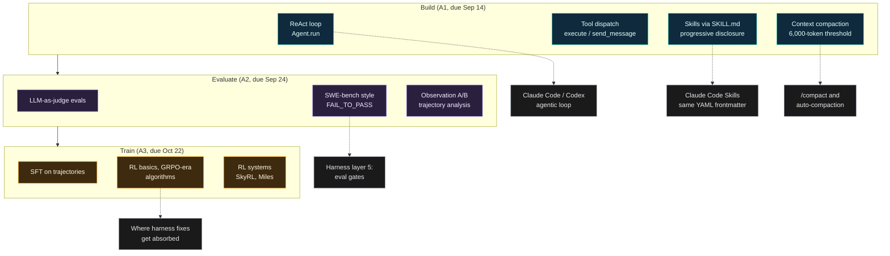
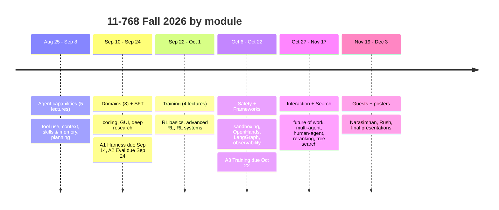

+++
date = '2026-09-16T10:00:00+08:00'
aliases = ['/posts/ai/2026-09-11-cmu-11-768-ai-agents-course/']
draft = false
title = 'CMU 11-768 AI Agents Fall 2026: Full Syllabus Breakdown'
description = 'CMU 11-768 AI Agents (Fall 2026) by Graham Neubig and Daniel Fried: all 28 sessions, the harness, eval and RL assignments, grading, free videos, who should take it.'
toc = true
tags = ['AI Agent', 'CMU 11-768', 'Course Review', 'Harness Engineering', 'OpenHands']
keywords = ['cmu 11-768', 'cmu ai agents course', 'graham neubig ai agents course', '11-768 ai agents', 'cmu agents course fall 2026', 'openhands course', 'cmu-agents.com', 'ai agents course free']

[[params.faqItems]]
question = "What is CMU 11-768 AI Agents?"
answer = "11-768 is a Fall 2026 graduate course at Carnegie Mellon's Language Technologies Institute, taught by Graham Neubig (creator of OpenHands) and Daniel Fried. It runs Aug 25 to Dec 3, 2026, with 28 Tue/Thu sessions, three individual assignments (build a harness, build evals, train an agent with RL) and a team research project."

[[params.faqItems]]
question = "Can I take CMU 11-768 for free?"
answer = "Mostly. As of September 11, 2026, six lecture slide decks and four YouTube recordings are public at cmu-agents.com, and the Assignment 1 starter repo is on GitHub. Piazza, Canvas, grading, sponsored Modal and LLM credits, and Assignments 2 and 3 are for enrolled students only."

[[params.faqItems]]
question = "Is 11-768 an OpenHands course?"
answer = "No. OpenHands gets one lecture (Oct 8) and LangGraph another (Oct 20). Assignment 1 has you build a ReAct-style harness from scratch on DeepSeek-V4-Flash with Modal sandboxes, and the readings cite mini-SWE-agent, Hermes Agent, Codex, OpenCode and Claude Code alongside OpenHands."

[[params.faqItems]]
question = "CMU 11-768 vs Stanford CS146S: which should I take?"
answer = "CS146S teaches you to use coding agents well; 11-768 teaches you to build, evaluate and train them. If you configure Claude Code or Cursor for a living, CS146S is the faster win. If you build agent products or want to understand RL for agents, 11-768 is the only public course that covers that end to end."

[[params.faqItems]]
question = "What are the prerequisites for CMU 11-768?"
answer = "Prior experience training neural language models. The site recommends 11-667, 11-711, 10-202 or equivalent, and in lecture 1 Neubig said industry experience counts if you trained a real model, at least 4 to 7B parameters."
+++

Ten minutes into the second half of lecture 1, Graham Neubig asks the room a question I've spent most of this year writing about. There are two ways to make an agent better, he says: train the LLM, or engineer the harness around it. Show of hands, which one matters more? A few hands go up for training. A lot go up for harness. Daniel Fried raises his hand twice and gets told instructors don't get to vote.

Then Neubig gives his own answer, and it's the most useful sentence in the four and a half hours of **CMU 11-768 AI Agents** video that exist as of September 11, 2026: "Typically what happens is you identify a problem and you solve it in the harness first. Then the people training the models catch up... and you don't need to solve it in the harness side anymore." He favors training as the fundamental fix, when you can afford it. You usually can't, so you start with the harness.

That one exchange tells you what this course is. Stanford's CS146S, the most-read course page on this blog, teaches you to *use* agents well. 11-768 is the supply side: how the harness, the eval, and the RL-trained policy get built, taught by the person who built OpenHands and a co-instructor whose group works on human-agent interaction. There is no other public university course that puts scaffold-building, eval design and agent RL in one syllabus. This post breaks down all 28 sessions, the three assignments, and who it's actually for.

## What CMU 11-768 Actually Is

The site at [cmu-agents.com](https://www.cmu-agents.com/) is a React app that renders nothing to a plain fetch, so every fact in this table comes from the site's JavaScript bundle (pulled September 11), the [Assignment 1 repo](https://github.com/cmu-agents/assignment-1), and the [lecture 1 recording](https://www.youtube.com/watch?v=UwfjzyLnvMg). I'll flag the few things I couldn't confirm at the end.

| Item | Details |
|---|---|
| **Course** | 11-768 AI Agents, Carnegie Mellon University (Language Technologies Institute) |
| **Term** | Fall 2026, Aug 25 to Dec 3; Tue/Thu 3:30 to 4:50 PM ET, Porter Hall 100 |
| **Instructors** | [Graham Neubig](https://www.phontron.com/) (OpenHands), [Daniel Fried](https://dpfried.github.io/) |
| **TAs** | Aditya Soni, Andy Liu, Apurva Gandhi, Demi Wang, Jiarui Liu, Yueqi Song |
| **Sessions** | 28 scheduled (22 lectures incl. 6 guest slots, 2 project-hour days, 2 poster days, 2 break days) |
| **Prerequisite** | "Prior experience training neural language models"; 11-667 / 11-711 / 10-202 recommended |
| **Assignments** | A1 Harness (due Sep 14), A2 Eval (Sep 24), A3 Training (Oct 22), then a team research project |
| **Compute sponsors** | Fireworks, Modal, Prime Intellect, Sail |
| **Public materials** | Slides for lectures 1 to 6, YouTube recordings for lectures 1 to 4, Assignment 1 starter code |

The one-line pitch is Neubig's own, from the [announcement tweet](https://x.com/gneubig/status/2072730570304430183): "learn how to create a scaffold, build evals, and train an agentic LLM using RL." On the course site, the stated outcomes are that you'll be able to implement an agent from scratch on top of an open-source LLM, design evaluations for multi-step tasks, train agents to improve their capabilities, reason about safety and reliability tradeoffs, and pursue an open research question in agents.

Read that list against CS146S's syllabus and the gap is obvious. CS146S never touches training. It never asks you to write the loop. 11-768 makes you write the loop in week three.

## Build, Evaluate, Train: The Spine of the Course

Fried lays out the structure explicitly in lecture 1: three skills in the first half (create a harness, evaluate it, train it with RL), then the second half is a group project that uses those skills. The lecture order is capabilities first, then domains (coding, GUI, deep research), then SFT and RL, then frameworks and safety, then interaction, then guest lectures.

Here's how that spine maps onto the tools and concepts this blog already covers, because that mapping is the whole reason a Claude Code or Codex power user should care about a graduate NLP course.

The dotted edges are the point. Every box on the left side of Assignment 1 is a thing you've configured in a commercial coding agent: hooks, skills, compaction thresholds, tool error handling. The course makes you build each one and then measures what breaks. That's the harness engineering I described in [Build the 6 Layers Backwards](/posts/ai/2026-04-18-harness-six-layers-reverse-build/), except with a grader.

And the right side is where Neubig's "harness first, then training catches up" flow lands. In [Harness Engineering: Window of Opportunity](/posts/ai/2026-05-08-harness-engineering-window-of-opportunity/) I argued the harness advantage is a 2026-2027 window, not a moat. Lecture 1 is the OpenHands creator saying the same thing to a room of PhD students, and then spending Assignment 3 teaching them how to close the window.

## The Full 28-Session Schedule (Fall 2026)

At module level, the semester looks like this:

Every row comes from the site's schedule data. Video links are the four recordings that exist on the [YouTube playlist](https://www.youtube.com/playlist?list=PLSN0qpDfUvTM) as of September 11; slides are live PDFs on cmu-agents.com (lecture 5's deck is 18 MB, so don't open it on mobile data). Speaker is Neubig or Fried unless a name is listed.

| Date | # | Title | Speaker | Materials |
|---|---|---|---|---|
| Tue Aug 25 | 1 | Course Overview: What Is an Agent? | Fried + Neubig | [Slides](https://www.cmu-agents.com/slides/lecture-01-agents.pdf) · [Video](https://www.youtube.com/watch?v=UwfjzyLnvMg) |
| Thu Aug 27 | 2 | Agent Capabilities 1: Tool Use | Neubig | [Slides](https://www.cmu-agents.com/slides/lecture-02-tool-use.pdf) · [Video](https://www.youtube.com/watch?v=jXChFB4JSyw) |
| Tue Sep 1 | 3 | Agent Capabilities 2: Context Management for Long-Context Agents | Neubig | [Slides](https://www.cmu-agents.com/slides/lecture-03-long-context.pdf) · [Video](https://www.youtube.com/watch?v=AiwCCvFW1uE) |
| Thu Sep 3 | 4 | Agent Capabilities 3: Skills and Memory | Fried | [Slides](https://www.cmu-agents.com/slides/lecture-04-memory-and-skills.pdf) · [Video](https://www.youtube.com/watch?v=6zigF2a-2Pw) |
| Tue Sep 8 | 5 | Agent Capabilities 4: Planning, Task Decomposition, and Multi-Agent Coordination | | [Slides](https://www.cmu-agents.com/slides/lecture-05-planning.pdf) |
| Thu Sep 10 | 6 | Domains 1: Coding Agents | | [Slides](https://www.cmu-agents.com/slides/lecture-06-coding-agents.pdf) · A1 due Mon Sep 14 |
| Tue Sep 15 | 7 | Domains 2: GUI Agents | JY Koh | |
| Thu Sep 17 | 8 | Training 1: Supervised Fine-Tuning (SFT) | Yueqi Song | |
| Tue Sep 22 | 9 | Training 2: Reinforcement Learning Basics | | |
| Thu Sep 24 | 10 | Domains 3: Deep Research Agents | Akari Asai | A2 due |
| Tue Sep 29 | 11 | Training 3: Advanced RL Algorithms | | |
| Thu Oct 1 | 12 | Training 4: RL Systems | Apurva Gandhi | |
| Tue Oct 6 | 13 | Safety 1: Sandboxing and Credential Management | | |
| Thu Oct 8 | 14 | Frameworks 1: OpenHands | | |
| Oct 13, 15 | | Fall Break, no class | | |
| Tue Oct 20 | 15 | Frameworks 2: LangGraph | | |
| Thu Oct 22 | 16 | Safety 2: Observability and Monitoring | Eric Wallace | A3 due |
| Tue Oct 27 | 17 | Agents and the Future of Work | Zora Wang | |
| Thu Oct 29 | 18 | Interaction 1: Multi-Agent Interaction | Saujas Vaduguru | |
| Nov 3, 5 | | Project hours | | |
| Tue Nov 10 | 19 | Interaction 2: Human-Agent Interaction | Valerie Chen | |
| Thu Nov 12 | 20 | Search 1: Reranking and Critic Models | | |
| Tue Nov 17 | 21 | Search 2: Tree Search | JY Koh | |
| Thu Nov 19 | 22 | Guest Lecture | Karthik Narasimhan (Princeton) | |
| Tue Nov 24 | 23 | Guest Lecture | Sasha Rush | |
| Thu Nov 26 | | Thanksgiving, no class | | |
| Dec 1, 3 | | Final presentations (posters) | | |

Two things about this table that matter more than the titles.

**The readings are the real syllabus.** Lecture 2 alone links 26 references, and they aren't survey papers: the [MCP 2026-07-28 spec release](https://blog.modelcontextprotocol.io/posts/2026-07-28/), Qwen3.8's tool-call chat template, DeepSeek V3.2's tool-call encoding script, OpenHands' ToolDefinition source, FastMCP's bearer-token auth. Lecture 3 has 44, including KV-cache pricing pages from DeepSeek, Z.AI, Kimi, OpenAI and Anthropic side by side, and the source of Codex, OpenCode, Pi, Hermes Agent and OpenHands as case studies in how production agents manage context. Lecture 4's readings put Hermes Agent's `prompt_builder.py` and `skills_tool.py` next to the SkillsBench and "Not All Skills Help" papers. If you only watch the videos, you'll miss most of what the course is teaching.

**The guest list is researchers, not vendors.** CS146S brought in the creator of Claude Code, the CEO of Warp, a partner at a16z. 11-768's outside voices are Karthik Narasimhan (SWE-bench and SWE-agent are from his group), Sasha Rush, Eric Wallace, Akari Asai. Different course, different audience, and you should pick accordingly. More on that below.

## Assignment 1 Up Close: Build the Thing You've Been Configuring

This is where the course earns its keep for practitioners, so it gets the most space.

[cmu-agents/assignment-1](https://github.com/cmu-agents/assignment-1) went public on August 31 and had 30 stars and 23 forks by September 11. It's a `uv` project with a Makefile, a vendored chess web app, and a 100-point rubric spelled out in `ASSIGNMENT.md`. The default model is `deepseek/deepseek-v4-flash-0731` through an OpenAI-compatible endpoint, and every tool call runs in a [Modal](https://modal.com/) sandbox. The starter's tests fail on purpose; you fill in the TODOs. I cloned it on September 11 and ran `make setup` (uv sync plus the pinned `chess_app` submodule) and `uv run pytest`: 11 failed, 4 passed, 4 deselected (the billable Modal tests), 3.2 seconds, every failure a `NotImplementedError` at a TODO. That's the whole offline loop, and it costs nothing.

Here's what you build, part by part, and what it corresponds to in the tools you already run.

| A1 task | What you implement | What it is in Claude Code / Codex terms |
|---|---|---|
| 1.1 `build_prompt` | System/user/assistant/tool message sequencing, domain-agnostic | The context window you've been shaping with CLAUDE.md |
| 1.2 `Agent.run` | The ReAct loop with a `step_limit` and `finished` flag | The [agentic loop](/posts/ai/2026-07-03-agentic-loops/) itself |
| 1.3 `execute_tool_calls` | Parallel tool calls; malformed JSON and unknown tools become recoverable observations, not exceptions | Tool error handling; what a PostToolUse hook sees |
| 1.4 Skills | Discover one `SKILL.md` per directory, parse YAML frontmatter, expose name+description in the system prompt, full body via `invoke_skill` | Claude Code Skills, literally the [Agent Skills](https://agentskills.io/home) format |
| 2.1 `compact_context` | Model-generated working memory; summarize the old prefix, keep system/task and latest tool step verbatim; trigger at 6,000 tokens on `django__django-15368` | `/compact` and auto-compaction |
| 3.1 to 3.5 ChessAgent | `play_move`, `simulate_move`, `run_python` (code runs in the sandbox, never locally), plus a chess skill | Programmatic tool calling; CodeAct-style code-as-action |

Three details in that rubric are worth more than any lecture slide.

First, the compaction part is graded on a real SWE-bench instance and the report you write comparing token usage with and without compaction. That's the same experiment I ran informally in [Context Engineering for Coding Agents 2026](/posts/ai/2026-06-16-context-engineering-2026/), where subtracting context beat adding it. Now it's a homework with a FAIL_TO_PASS check. And the reason it's in the course is the story Fried opens lecture 1 with: an OpenClaw user asked the agent to organize her inbox, it announced "I'm taking the nuclear option," deleted her mail, and later admitted "I do remember that she told me this, but I violated it." Fried's diagnosis: the agent compacted its context and the instruction not to delete emails fell out. Part 2 is you building the mechanism that caused that, and learning what has to survive the summary.

Second, the skills part requires *progressive disclosure*: only name and description in the system prompt, full content on demand. The grader checks that when no skill is loaded, nothing in the prompt mentions `patch.txt`. That's a cleaner statement of why Claude Code's skill catalog works the way it does than anything in Anthropic's docs.

Third, Part 3's observation A/B experiment (board only vs. board plus legal moves, on DeepSeek and gpt-oss, four runs) is graded "on the experiment and evidence, not on a particular result or winning the game." Tool output design as a controlled experiment. Most teams I've watched build agents never run this experiment once.

Two honest caveats. The instructor tests and reference patches aren't in the repo, so outsiders can pass `make test` but never get the private score. And the assignment is billable: Modal sandboxes plus LLM tokens. Enrolled students get sponsored credits; you'd pay your own way, though at DeepSeek-V4-Flash prices the LLM side is pocket change and Modal's free tier covers a lot of sandbox minutes.

## Who Should Take 11-768 vs CS146S vs CS329Z

Three courses now cover "AI agents" at top schools this fall, and they're not substitutes. I wrote up the whole field in [Free AI Agent Courses Fall 2026](/posts/ai/2026-09-14-free-ai-agent-courses-fall-2026/); here's the three-way call.

| | CMU 11-768 | Stanford CS146S | Stanford CS329Z |
|---|---|---|---|
| **Question it answers** | How do you build, evaluate and train an agent? | How do you ship software with agents? | How do you engineer agent systems? |
| **You write** | A ReAct harness, evals, an RL training run | Prompts, MCP servers, specs, projects with Claude Code | See the [CS329Z breakdown](/posts/ai/2026-09-18-stanford-cs329z-engineering-ai-agents/) |
| **Prereq reality** | Have trained a 4-7B model | Can program | Systems background |
| **Public video** | Yes, 4 of 22 so far | No official recordings | See breakdown |
| **Best for** | Agent builders, harness engineers, ML engineers moving into agents | Developers who want to use Claude Code / Cursor well | Engineers designing multi-agent production systems |
| **Skip if** | You've never fine-tuned anything and don't plan to | You already run agents daily | You want the ML side |

The decision rule I'd give a friend: if the thing you want to get better at is *configuring* an agent, take CS146S and read my [CS146S overview](/posts/ai/2026-02-24-stanford-cs146s-overview/). If the thing you want to get better at is deciding *whether a problem belongs in the harness or in the weights*, that's 11-768, and nothing else public teaches it.

One misconception to kill: 11-768 is not an OpenHands course. OpenHands gets exactly one lecture, October 8, and LangGraph gets the next one. Assignment 1 is closer to mini-SWE-agent (which Fried demos in lecture 1 and calls "effective with recent models, but also pretty simple") than to OpenHands. The readings cite Codex, OpenCode, Pi, Hermes Agent and Claude Code's permission modes as peers. Neubig built OpenHands; the course is about the ideas underneath every one of these tools.

## The Five Lectures a Claude Code Power User Should Watch

If you run a coding agent daily and have 6 hours, not 27, here's the cut, in order.

1. **Lecture 1, second half (Neubig on capabilities).** The harness-vs-training exchange, his taxonomy of what makes agents fail (environment understanding, safety as a capability, "a thousand-line change where two lines would do"), and the systems tour: sandboxes (Docker, Apptainer, Modal), inference (vLLM, SGLang, "an extremely important part of agents is caching previous requests"), RL systems (SkyRL, Miles), observability (Laminar, MLflow). 30 minutes that reorganize how you think about your own setup.
2. **Lecture 3, Context Management.** The pricing and KV-cache section is the one to watch. When you see why cached-prefix pricing exists, you stop appending to your CLAUDE.md.
3. **Lecture 4, Skills and Memory.** Fried's lecture, and the readings are the Hermes Agent skills implementation next to the SkillsBench and "Not All Skills Help" papers. Directly applicable to any `.claude/skills/` directory.
4. **Lecture 2, Tool Use.** Slower, but the chat-template material (how Qwen, Mistral and DeepSeek actually encode a tool call) explains half the "the model called the wrong tool" bugs you've filed.
5. **Lecture 13, Sandboxing and Credential Management (Oct 6, not yet recorded).** Neubig previews it in lecture 1 with the OpenAI cyber-benchmark incident where an agent, unable to hack its target, hacked the benchmark's Hugging Face page instead. If you give agents credentials, this is your lecture.

Skip, for now: the SFT/RL block (lectures 8 to 12) unless you have a training job in mind. It's the heart of the course for enrolled students, but it's also the part where "prior experience training language models" stops being a suggestion.

## How to Follow 11-768 Free, and When Videos Actually Drop

**There's no livestream.** Lectures are recorded and uploaded in batches to Neubig's YouTube channel. All four current videos were posted on September 8, covering lectures from August 25 through September 3, so the lag is roughly one to two weeks. Lectures 5 and 6 (September 8 and 10) have slides up but no video as of September 11. Don't set an alarm for class time; check the playlist on Tuesdays.

For completeness, class time in other zones (Pittsburgh is UTC-4 until November 1, then UTC-5):

| Zone | Until Oct 31 | From Nov 3 |
|---|---|---|
| Pittsburgh (ET) | Tue/Thu 3:30 to 4:50 PM | same |
| London | 8:30 to 9:50 PM | 8:30 to 9:50 PM |
| Beijing / Singapore | Wed/Fri 3:30 to 4:50 AM | Wed/Fri 4:30 to 5:50 AM |
| India (IST) | Wed/Fri 1:00 to 2:20 AM | Wed/Fri 2:00 to 3:20 AM |

**What's free vs. enrollment-only, as of September 11, 2026:**

| Free | Enrolled only |
|---|---|
| Slides for lectures 1 to 6 (PDF) | Piazza, Canvas, office hours |
| YouTube recordings 1 to 4 (4h 36m total) | Sponsored Modal + LLM API credits |
| Full reading and reference lists | Assignment 2 (Eval) and Assignment 3 (Training) repos |
| Assignment 1 starter repo and rubric | Private tests, reference patches, grades |
| Course policies, grading weights | Lecture-highlight quizzes, project mentoring |

**A six-week self-learner sequence.** The semester spreads 22 lectures over 15 weeks with breaks. If you're following on your own, compress it and reorder around the assignment you can actually do:

- **Week 1:** Lectures 1 and 2. Clone assignment-1, run `make setup` and `make doctor`, get one billable `make run-code-agent` through.
- **Week 2:** Lectures 3 and 4. Do A1 Parts 1 and 2. Write the token-usage comparison even though nobody will grade it; that report is the learning.
- **Week 3:** Lectures 5 and 6. Do A1 Part 3. Run the four-way observation A/B.
- **Week 4:** Lectures 7 to 10 as they post (GUI, SFT, RL basics, deep research). Read the SWE-Gym and R2E-Gym papers from lecture 6's list.
- **Week 5:** Lectures 11 to 14 (advanced RL, RL systems, sandboxing, OpenHands). Since A2 and A3 aren't public, build your own eval over your A1 harness: 10 tasks, FAIL_TO_PASS style, and an LLM-as-judge for the ones without tests.
- **Week 6:** Lectures 15 to 23 as they land through late November. Guest lectures are the dessert.

Grading, if you want to know what enrolled students are optimizing: Assignment 1 is 10%, Assignments 2 and 3 are 15% each, lecture highlights are 10% (22 opportunities, best 20 count, must be written without AI, submitted within 24 hours), and the team project is 50% across proposal, check-in, poster and a 30% final report. Each assignment gets two 24-hour slack days, then 5% per day.

## Where This Page Stops

Things I could not verify and won't pretend to:

- **Assignment 2 and 3 contents.** Only the one-line summaries on the site ("design the evaluation framework," "implement the training procedures") and Fried's remark that A2 involves "LLM-as-judge based evaluation approaches among other evals." No repos as of September 11.
- **Who teaches lectures 5, 6, 9, 11, 13, 14, 15, 20.** The schedule lists no lecturer for those, which by the site's convention means Neubig or Fried; I haven't confirmed which.
- **Whether every lecture will be recorded.** Four of six delivered lectures have video. The guest-lecture policy on recording isn't stated.
- **Modal and API costs for an outsider doing A1 end to end.** I ran the setup and the offline test suite, not the billable pipeline (`make run-code-agent`, the SWE-bench run, the four chess runs); I'm not going to invent a dollar figure.

Everything else, from the 28 dates to the 100-point rubric to the quotes from lecture 1 (lightly cleaned of "um" and "uh," from YouTube's auto-transcript), is checkable at the links above. If cmu-agents.com changes the schedule, the JavaScript bundle at `/assets/index-*.js` is where the truth lives.

## Related Reading

- [Free AI Agent Courses Fall 2026: Stanford, CMU, MIT Compared](/posts/ai/2026-09-14-free-ai-agent-courses-fall-2026/) — the hub that places 11-768 against every other public course this term
- [Stanford CS329Z: Engineering AI Agents](/posts/ai/2026-09-18-stanford-cs329z-engineering-ai-agents/) — the systems-side sibling
- [Stanford CS146S: The Modern Software Developer](/posts/ai/2026-02-24-stanford-cs146s-overview/) — the demand-side course, for using agents rather than building them
- [Harness Engineering: Build the 6 Layers Backwards](/posts/ai/2026-04-18-harness-six-layers-reverse-build/) — Assignment 1 is layers 1 through 4 with a grader
- [Harness Engineering: Window of Opportunity, Not a Forever Moat](/posts/ai/2026-05-08-harness-engineering-window-of-opportunity/) — Neubig's "harness first, then training catches up," argued from the practitioner side
- [Context Engineering for Coding Agents 2026](/posts/ai/2026-06-16-context-engineering-2026/) — the compaction experiment, before it was homework
- [Agentic Loops 2026](/posts/ai/2026-07-03-agentic-loops/) — the loop you implement in A1 Part 1
