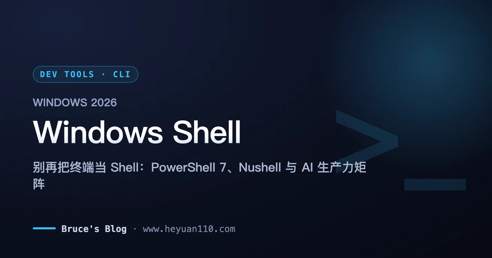
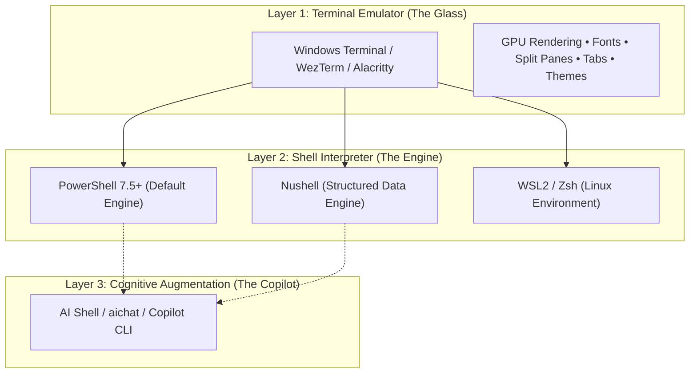
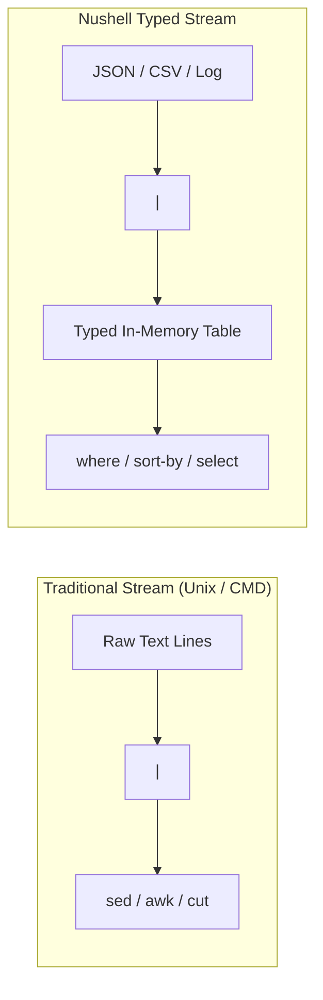
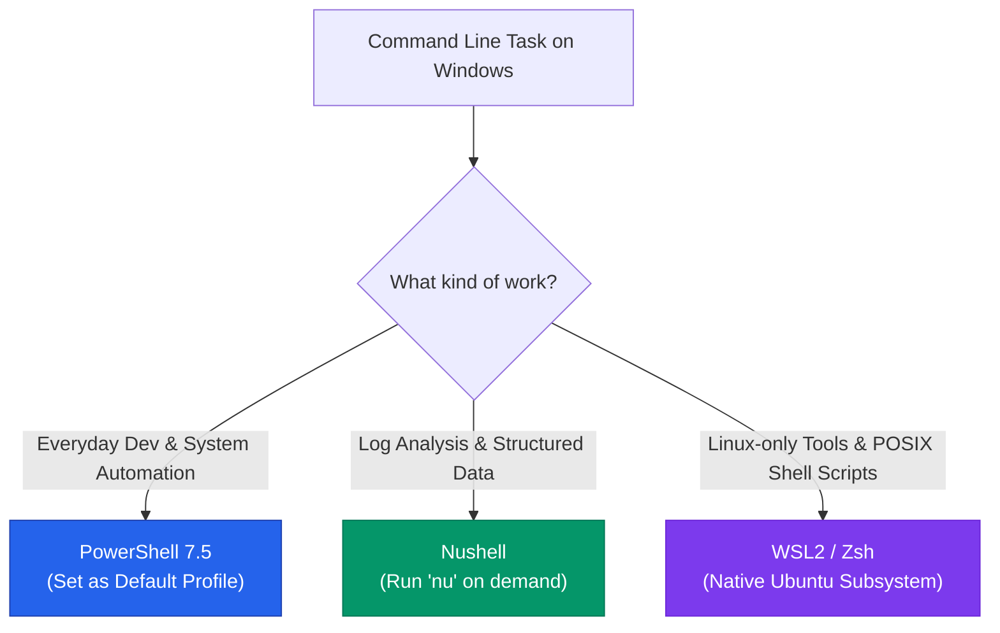

+++
date = '2026-09-17T12:00:00+08:00'
draft = false
title = 'Modern Windows Shell Guide 2026: PowerShell 7 & Nushell'
description = 'Stop mistaking terminals for shells. In 2026, the ultimate Windows CLI setup pairs PowerShell 7 for everyday development, Nushell for structured data, and WSL2.'
toc = true
tags = ['PowerShell', 'Windows Terminal', 'Nushell', 'Dev Tools', 'CLI']
keywords = ['modern windows shell', 'best shell for windows', 'powershell 7 vs nushell', 'windows terminal shell setup', 'windows cli productivity 2026', 'nushell tutorial', 'powershell 7 setup']

[[params.faqItems]]
question = "What is the difference between a terminal and a shell on Windows?"
answer = "A terminal emulator (e.g., Windows Terminal, WezTerm) handles input rendering, fonts, tabs, and GPU acceleration. A shell (e.g., PowerShell 7, Nushell, Bash) is the command interpreter that parses instructions, manages processes, and directs pipelines."

[[params.faqItems]]
question = "Why should I upgrade to PowerShell 7 instead of Windows PowerShell 5.1?"
answer = "PowerShell 7 runs on cross-platform .NET 9+, offers 3x to 5x faster pipeline execution, supports parallel foreach loops (ForEach-Object -Parallel), ternary operators, modern JSON handling, and clean UTF-8 encoding by default."

[[params.faqItems]]
question = "Is Nushell ready to replace PowerShell as my daily Windows shell?"
answer = "No. Nushell treats output as structured tables instead of unstructured text streams, making it unmatched for data querying and logs. However, its non-POSIX syntax breaks standard environment activation scripts and node/python ecosystem tooling. Use it as your data-crunching weapon, not your default login shell."

[[params.faqItems]]
question = "Why not just use Git Bash for everything on Windows?"
answer = "Git Bash is an antiquated MSYS2 emulation layer plagued by path separator mismatches (slashes vs backslashes), missing pseudo-terminals (winpty requirements), and poor subshell performance. In 2026, if you need true Linux Bash, run native Ubuntu inside WSL2."

[[params.faqItems]]
question = "How do I add native AI command completion to PowerShell 7?"
answer = "Install Microsoft's official AI Shell (Invoke-AIShell) or integrate a standalone CLI like aichat. Combined with PSReadLine keybindings, you can generate complex pipelines from natural language prompts directly inside your terminal."
+++



Most developers struggling with command-line productivity on Windows are fixing the wrong layer. They swap terminal emulators every three months—bouncing from Windows Terminal to WezTerm, then Alacritty—while leaving the default shell untouched.

A terminal emulator is just the canvas. The shell is the engine. In 2026, the difference between a frustrating Windows CLI experience and a lightning-fast engineering workflow comes down to one principle: **Use PowerShell 7 as your universal daily driver, keep Nushell at hand for structured data manipulation, and delegate all native Linux operations directly to WSL2.**

Dump legacy CMD and stop using Git Bash as a crutch. Here is the architectural reality, real-world benchmarks, and the exact setup required to make Windows your most powerful development environment.

<!--more-->

## Terminal vs Shell: Stop Confusing the Glass with the Engine

Before writing a single line of configuration, we must kill the industry's most stubborn misconception: confusing your terminal emulator with your shell interpreter.



- **The Terminal Emulator** (Windows Terminal, WezTerm, Alacritty) only renders pixels on your screen. It listens to keystrokes, calculates glyph boundaries, applies color palettes, and draws split tabs. It does not know what `cd`, `grep`, or `git commit` means.
- **The Shell** (PowerShell 7, Nushell, Bash) receives your text input, resolves path variables, executes process forks, manages environment state, and coordinates data streaming across pipes.

If your command line hangs on complex path strings or fails to parse JSON responses, changing your terminal theme does nothing. You need a modern shell.

---

## The 2026 Windows Shell Matrix: Pick the Right Tool

| Feature / Metric | PowerShell 7.5+ | Nushell 0.102+ | WSL2 (Bash/Zsh) | Legacy CMD | Git Bash (MSYS2) |
| :--- | :--- | :--- | :--- | :--- | :--- |
| **Pipeline Paradigm** | Object Pipeline | Structured Tables / Records | Raw Byte Stream | Plain Text Stream | Emulated Byte Stream |
| **Windows Native API** | 100% Native (.NET 9) | Native (Rust) | Virtualized (Hyper-V VM) | Deprecated | Fragile Wrapper |
| **Script Ecosystem** | Massive (.ps1 / NuGet) | Growing (nu scripts) | Massive (.sh) | Dead | Incompatible |
| **JSON/REST Querying** | Excellent (`ConvertFrom-Json`) | Unbeatable (`open api.json`) | Requires `jq` / `awk` | Impossible | Slow `jq` calls |
| **Performance Overhead** | ~40ms startup | ~8ms startup | ~250ms (VM spinup) | ~5ms | ~120ms fork latency |
| **Primary Verdict** | **Daily Default Engine** | **Data & Log Weapon** | **Linux Workloads** | **Delete from Memory** | **Obsolete Crutch** |

---

## 1. PowerShell 7: The Undisputed Daily Driver

If you are running Windows, PowerShell 7 (v7.4 or v7.5) must be your primary login shell. Not the archaic "Windows PowerShell 5.1" baked into the operating system since 2016, but modern cross-platform PowerShell built on .NET.

### Why It Dominates: The Power of Object Streams

Unix shells pass unstructured strings through pipes. When you pipe command outputs in Bash, you spend mental energy slicing characters with `cut`, `sed`, and `awk`.

PowerShell pipes **live .NET objects**. Properties and metadata remain intact across boundaries:

```powershell
# Kill all node processes consuming more than 500MB of Working Set memory
Get-Process -Name node | Where-Object WorkingSet64 -gt 500MB | Stop-Process -WhatIf
```

No regex matching. No PID column parsing. You query concrete object properties directly.

### The Essential Setup: 60 Seconds to macOS-Grade Polish

Out of the box, PowerShell looks austere. With three Winget packages and a curated profile, it matches any tuned Zsh setup on macOS:

```powershell
# 1. Install modern runtime, prompt engine, and fuzzy search
winget install Microsoft.PowerShell
winget install JanDeDobbeleer.OhMyPosh
winget install junegunn.fzf
```

Open your profile file by typing `notepad $PROFILE` and insert this performance-tested configuration:

```powershell
# Enable Prediction and Smart History Completion
Set-PSReadLineOption -PredictionSource HistoryAndPlugin
Set-PSReadLineOption -PredictionViewStyle ListView
Set-PSReadLineKeyHandler -Key Tab -Function Complete

# Initialize Fuzzy Finder Keybindings (Ctrl+R history, Ctrl+T file pick)
Import-Module PSFzf
Set-PsFzfOption -PSReadlineChordReverseHistory 'Ctrl+r'

# Initialize Fast Oh My Posh Prompt
oh-my-posh init pwsh --config "$env:POSH_THEMES_PATH/clean-detailed.omp.json" | Invoke-Expression

# Native Aliases for Muscle Memory
Set-Alias -Name ll -Value Get-ChildItem
Set-Alias -Name g -Value git
```

You immediately get tab-driven history search, inline autosuggestions, and sub-50ms prompt latency.

---

## 2. Nushell: The Data Engineer's Secret Weapon

[Nushell](https://www.nushell.sh/) is the most radical innovation in command-line architecture since the invention of the Unix pipeline in 1973. Written in Rust, it discards the concept of "unstructured byte streams" entirely. Every piece of command output is treated as a typed table, a record, or a structured list.



### The Benchmark: Querying a 100,000-Row JSON File

Consider a common task: parsing a massive Google Search Console export (`gsc-metrics.json`) to find queries with more than 1,000 impressions sorted by click count.

**The Unix/Bash way:**

```bash
cat gsc-metrics.json | jq -r '.queries[] | select(.impressions > 1000) | [.clicks, .impressions, .query] | @tsv' | sort -rn | head -n 10
```

**The Nushell way:**

```nu
open gsc-metrics.json | get queries | where impressions > 1000 | sort-by clicks --reverse | first 10
```

Nushell reads JSON, CSV, TOML, YAML, SQLite, and Parquet files as native memory structures. You query them using SQL-like filtering primitives:

```nu
# Inspect top memory-consuming processes formatted as an interactive grid
ps | where mem > 200mb | sort-by mem --reverse | select name pid mem cpu
```

### Why You Should NOT Make Nushell Your System Default

Despite its brilliance, **do not set Nushell as your Windows system-wide default shell.**

1. **Ecosystem Incompatibility**: Nushell does not conform to POSIX syntax. Activating Python virtual environments (`.venv\Scripts\activate.ps1`), nvm/fnm environment switches, and complex Docker build tasks will fail because they expect classic shell variables.
2. **Quoting and Escaping**: When passing complicated flags to external binaries (e.g., `ffmpeg` or `kubectl`), Nushell's strict parser frequently rejects string arguments that traditional shells pass transparently.

**The Golden Rule**: Use PowerShell 7 for orchestration. Fire up `nu` when exploring APIs, analyzing log dumps, or wrangling tabular files.

---

## 3. The Graveyard: Why You Must Abandon Git Bash and CMD

Two legacy tools still pollute Windows developer machines in 2026. Both should be permanently deprecated.

### Misconception: "Git Bash gives me a lightweight Linux on Windows"

Git Bash uses MSYS2, an emulation layer dating back decades. It creates endless friction:

- **Path Escaping Nightmare**: Git Bash converts `/c/Users` to `C:\Users` on the fly, but breaks whenever you pass Unix-style flags (like `-v /host/path:/container/path` in Docker). You end up prefixing commands with `MSYS_NO_PATHCONV=1`.
- **Missing Pseudo-Terminal**: Running interactive CLI tools like `docker exec -it`, `python`, or `node` often results in a silent freeze unless wrapped in `winpty`.
- **Sluggish Forking**: Windows does not have a native `fork()` syscall. Git Bash scripts that spawn hundreds of child processes execute up to **8x slower** than in native WSL2.

If you need Linux utilities, open **WSL2**. A full Ubuntu environment running on an optimized Linux kernel takes less than 200MB of idle memory and executes POSIX scripts without translation layers.

### Misconception: "Command Prompt (CMD) is lightweight and reliable"

CMD lacks basic Unicode rendering, does not support command substitution, cannot handle object pipelines, and fails on long file paths exceeding 260 characters without registry hacks. It exists purely for backwards compatibility with batch files written in 1995. Never write new automation in CMD.

---

## 4. Supercharging Your Shell with Local AI

In 2026, typing out flags from memory is obsolete. Integrating AI directly into your shell eliminates context switching to a browser.

### Option A: Microsoft AI Shell (`Invoke-AIShell`)

Microsoft provides an official AI Shell agent that connects PowerShell 7 to OpenAI, Azure OpenAI, or local Ollama endpoints.

```powershell
# Install the official Microsoft AI Shell module
Install-Module -Name PowerShell-AIShell -Scope CurrentUser

# Start an interactive sidecar session
Start-AIShell
```

Pressing `Ctrl + G` brings up an interactive prompt. Type:
> *"Find all files modified in the last 24 hours larger than 100MB and zip them"*

AI Shell generates the exact PowerShell command pipeline, explains each parameter, and inserts it onto your command line ready for execution.

### Option B: Lightning-Fast Inline Generation via `aichat`

For a zero-overhead, compiled Rust binary, install `aichat`:

```powershell
winget install sigoden.aichat
```

Create a quick keybinding in your PowerShell profile:

```powershell
function Invoke-AIAssist {
    $currentLine = $null
    $cursorIndex = $null
    [Microsoft.PowerShell.PSConsoleReadLine]::GetBufferState([ref]$currentLine, [ref]$cursorIndex)
    if (-not [string]::IsNullOrWhiteSpace($currentLine)) {
        $cmd = aichat --prompt "Generate ONLY the exact one-line Windows PowerShell 7 command for: $currentLine. Do not wrap in markdown or backticks."
        [Microsoft.PowerShell.PSConsoleReadLine]::RevertLine()
        [Microsoft.PowerShell.PSConsoleReadLine]::Insert($cmd.Trim())
    }
}
Set-PSReadLineKeyHandler -Chord 'Ctrl+e' -ScriptBlock ${function:Invoke-AIAssist}
```

Type a plain-text intent, hit `Ctrl + E`, and watch the line transform into an optimized PowerShell command in under 500 milliseconds.

---

## The Decision Tree: Which Shell When?



## Summary Checklist for 2026

1. **Uninstall or ignore Git Bash shortcuts.** Remove them from your desktop.
2. **Install PowerShell 7.5 via Winget** and set it as your default profile in Windows Terminal.
3. **Configure Oh My Posh and PSReadLine** for instant autocomplete and history recall.
4. **Install Nushell** to replace clumsy `jq` / `awk` queries when inspecting JSON and API payloads.
5. **Bind an AI command generator** (`Ctrl + E` or `Ctrl + G`) to turn plain English into production-safe shell pipelines.

Windows has the most capable command-line ecosystem in personal computing—provided you stop treating it like an imitation of a 1980s Unix box. Run the right engine, and everything else follows.

---

## Related Reading

- [Windows Terminal Recommendation 2026: 5-Way Comparison & Decision Tree](/posts/ai/2026-06-22-best-windows-terminal-2026/)
- [Mastering the Codex CLI: Complete Guide](/posts/ai/2026-02-12-codex-cli-mastery-guide/)
- [AI Coding Agents Comparison 2026: The Complete Benchmark](/posts/ai/2026-03-10-ai-coding-agents-comparison-2026/)
- [Local Image Generation on Mac Mini M4: Complete Guide](/posts/ai/2026-02-15-mac-mini-local-image-generation/)
