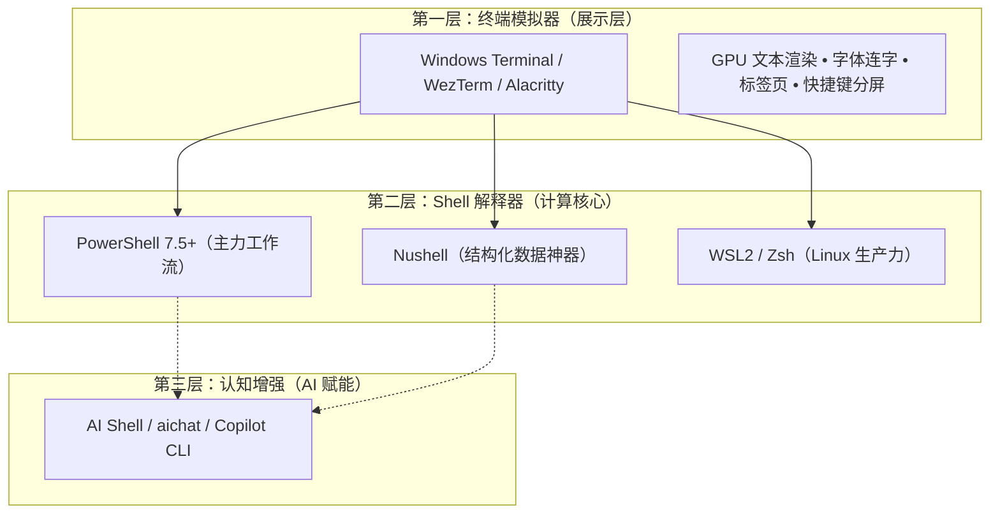
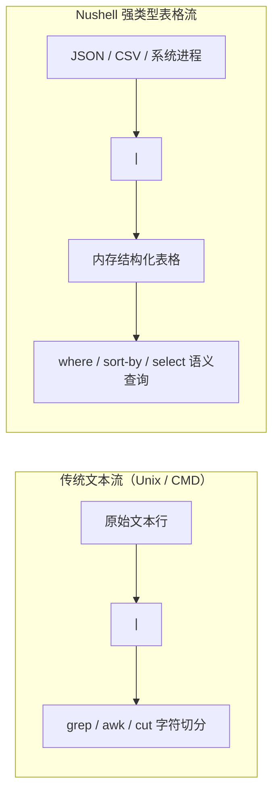
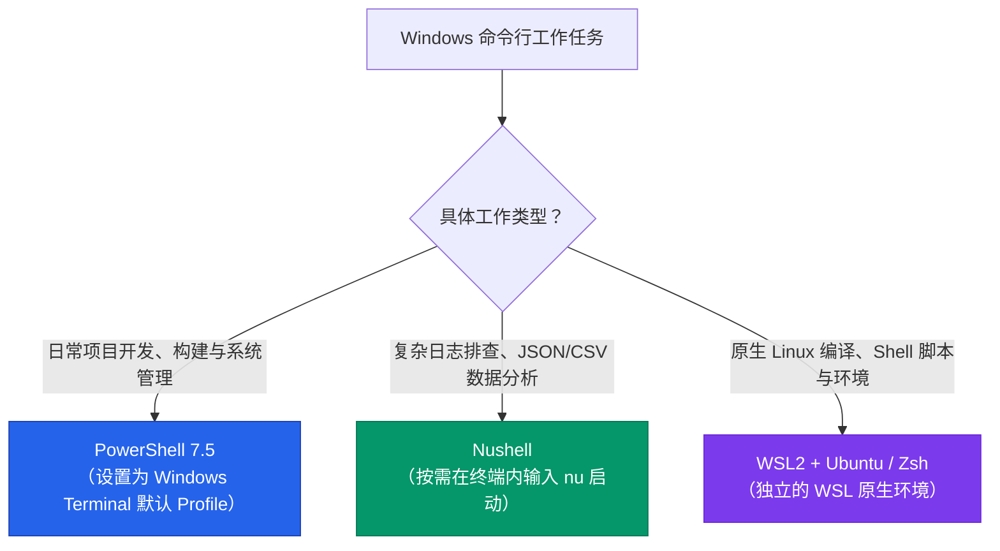

+++
date = '2026-09-17T12:00:00+08:00'
draft = false
title = 'Windows 下好用的 Shell 推荐：别再把终端当 Shell 了'
description = '2026 年 Windows 命令行终极方案：彻底理清 Terminal 与 Shell 区别，日常主力用 PowerShell 7，数据处理用 Nushell，Linux 依赖走 WSL2。'
toc = true
tags = ['PowerShell', 'Windows Terminal', 'Nushell', 'Dev Tools', 'CLI']
keywords = ['windows 下好用的shell', 'windows shell推荐', 'powershell 7配置', 'nushell使用教程', 'windows命令行工具', 'git bash替代品']

[[params.faqItems]]
question = "Windows 下 Terminal 和 Shell 到底有什么区别？"
answer = "Terminal（终端模拟器，如 Windows Terminal、WezTerm）负责渲染界面、字体、分屏和 GPU 加速；Shell（命令行解释器，如 PowerShell 7、Nushell、Bash）才是真正解析命令、调度进程、管理管道与环境变量的核心引擎。"

[[params.faqItems]]
question = "为什么强烈推荐升级到 PowerShell 7，而不是用系统自带的 PowerShell？"
answer = "系统预装的 Windows PowerShell 5.1 基于陈旧的 .NET Framework，存在编码和性能硬伤。PowerShell 7 基于现代跨平台 .NET 9+ 构建，管道性能提升数倍，原生支持三元运算符、并行 ForEach 循环以及完美的 UTF-8 编码。"

[[params.faqItems]]
question = "Nushell 能完全替代 PowerShell 作为 Windows 默认 Shell 吗？"
answer = "不建议。Nushell 将输出处理为强类型表格，分析 JSON/CSV/日志极强；但由于其非 POSIX 语法，会导致 Python 虚拟环境激活（.venv）、nvm 环境切换及各类前端构建脚本报错。最佳实践是作为专属数据分析工具按需唤起。"

[[params.faqItems]]
question = "Windows 上为什么应该彻底放弃 Git Bash？"
answer = "Git Bash 基于 MSYS2 模拟层，长期存在路径斜杠转换错误（如 Docker 挂载报错）、缺少伪终端导致交互命令挂起（需要 winpty）以及极度缓慢的子进程创建（fork）性能。需要 Linux 环境时，WSL2 才是真正零成本的原生解决方案。"

[[params.faqItems]]
question = "如何在 PowerShell 7 中一键接入本地大模型 AI 补全？"
answer = "可通过安装微软官方的 PowerShell-AIShell 模块，或安装高性能 Rust 编写的 aichat CLI，并通过绑定快捷键（如 Ctrl+E），实现自然语言到准确 PowerShell 命令的原生内联转换。"
+++


许多在 Windows 上抱怨命令行不好用的开发者，从一开始就找错了问题根源。

他们频繁在 Windows Terminal、WezTerm 和 Alacritty 之间换来换去，以为换个界面就能解决卡顿、乱码和繁杂的语法问题。但终端模拟器只是那层“玻璃”，真正干活的引擎是 Shell。

到了 2026 年，Windows 命令行最高效的铁律非常纯粹：**将 PowerShell 7 配到极致作为全能主力，常备 Nushell 降维处理结构化数据，剩下的 Linux 脚本全部交给 WSL2。**

把老旧的 CMD 彻底扫进历史，别再用半吊子的 Git Bash 苟延残喘。以下是架构拆解、实测对比与可以直接照抄的配置方案。

<!--more-->

## Terminal 与 Shell：别把窗户当成了发动机

在动笔写任何配置前，必须先纠正技术圈流传最广的一个概念混淆：终端模拟器（Terminal Emulator）与命令行解释器（Shell）。



- **终端模拟器**（如 Windows Terminal、WezTerm）：本质是一个图形界面窗口。它捕获你的键盘输入，渲染字符点阵，提供多标签页和主题颜色。它根本不知道 `ls` 或 `git commit` 是什么。
- **Shell 解释器**（如 PowerShell 7、Nushell、Bash）：后台默默运行的命令解析程序。它负责解析路径、管理环境变量、运行二进制程序，并在程序之间建立数据管道。

如果你的脚本遇到奇怪的路径转义报错，或者处理 JSON 慢得像蜗牛，更换终端主题没有任何意义。你需要换一个现代化的 Shell。

---

## 2026 年 Windows 主流 Shell 选型全景图

| 评估维度 | PowerShell 7.5+ | Nushell 0.102+ | WSL2 (Bash/Zsh) | 旧版 CMD | Git Bash (MSYS2) |
| :--- | :--- | :--- | :--- | :--- | :--- |
| **管道数据模型** | .NET 对象管道 | 强类型数据表格/记录 | 原始无类型字节流 | 纯文本行流 | 模拟字节流 |
| **Windows 原生集成** | 100% 原生 (.NET 9) | 100% 原生 (Rust) | 虚拟机层 (Hyper-V) | 已停更维护 | 脆弱的模拟包装层 |
| **现代生态支持** | 庞大 (.ps1 / NuGet) | 快速发展 (nu scripts) | 极其庞大 (.sh) | 已归零 | 不兼容 |
| **JSON/数据处理** | 原生对象转换 | **碾压级优势** | 依赖 `jq` / `awk` | 无法处理 | 依赖缓慢的外部工具 |
| **冷启动耗时** | ~40ms | ~8ms | ~250ms (VM 启动) | ~5ms | ~120ms (模拟层开销) |
| **核心选型结论** | **日常默认首选** | **日志与数据分析神器** | **重度 Linux 开发** | **彻底删除快捷方式** | **落后的历史妥协** |

---

## 一、 PowerShell 7：不可动摇的 Windows 日常主力

如果你在 Windows 环境下工作，PowerShell 7（当前为 7.4/7.5）必须是你的主力默认 Shell。

请注意：**它不是 Windows 系统自带的 PowerShell 5.1。** 自带版本是 2016 年前的遗留物；而 PowerShell 7 是基于现代开源 .NET 重新构建的跨平台利器。

### 为什么对象管道具备降维打击能力？

传统的 Unix Shell 在管道之间传递的是没有任何格式保证的字符串。想要从进程输出中截取想要的数据，你必须费劲心机去数第几列、用 `awk` 切割。

而 PowerShell 的管道流淌的是**活生生的结构化对象**。对象身上的属性、方法在流转过程中完整保留：

```powershell
# 找出所有内存占用超过 500MB 的 node 进程并模拟终止
Get-Process -Name node | Where-Object WorkingSet64 -gt 500MB | Stop-Process -WhatIf
```

不需要复杂的正则表达式，没有字符截取的边界错误。点语法直接取对象属性，健壮且符合直觉。

### 60 秒打造媲美 macOS 的极致体验

很多开发者觉得 PowerShell 难用，是因为微软出厂默认的配置太保守。只需通过 WinGet 安装三个工具，就能立刻拥有现代代码补全与颜值：

```powershell
# 1. 安装最新版运行时、提示词引擎与模糊搜索
winget install Microsoft.PowerShell
winget install JanDeDobbeleer.OhMyPosh
winget install junegunn.fzf
```

在终端输入 `notepad $PROFILE` 打开配置文件，把下面这份经过实战检验的高性能配置贴进去：

```powershell
# 开启历史记录与智能预测建议
Set-PSReadLineOption -PredictionSource HistoryAndPlugin
Set-PSReadLineOption -PredictionViewStyle ListView
Set-PSReadLineKeyHandler -Key Tab -Function Complete

# 初始化 fzf 历史记录模糊搜索 (按 Ctrl+R 唤起)
Import-Module PSFzf
Set-PsFzfOption -PSReadlineChordReverseHistory 'Ctrl+r'

# 载入轻量现代主题
oh-my-posh init pwsh --config "$env:POSH_THEMES_PATH/clean-detailed.omp.json" | Invoke-Expression

# 常用肌肉记忆别名
Set-Alias -Name ll -Value Get-ChildItem
Set-Alias -Name g -Value git
```

保存后重新打开，你立刻获得了基于历史输入的预测高亮、按 Tab 键的弹出补全菜单，以及毫秒级的响应速度。

---

## 二、 Nushell：数据工程师与运维的核武器

[Nushell](https://www.nushell.sh/) 是近几年命令行领域最亮眼的创新。由 Rust 编写，它彻底革新了沿用半个世纪的“流式文本”概念。在 Nushell 看来，所有的输出都应该是**自带 Schema 的结构化表格**。



### 实测对决：过滤 10 万行搜索词数据

假设我们需要从一份庞大的 `gsc-metrics.json` 数据中，筛选出展现量大于 1000 的词，并按点击量降序排列取前 10 名。

**传统 Bash 做法（繁琐且脆弱）：**

```bash
cat gsc-metrics.json | jq -r '.queries[] | select(.impressions > 1000) | [.clicks, .impressions, .query] | @tsv' | sort -rn | head -n 10
```

**Nushell 做法（如 SQL 般优雅）：**

```nu
open gsc-metrics.json | get queries | where impressions > 1000 | sort-by clicks --reverse | first 10
```

Nushell 天然理解 JSON、CSV、YAML、TOML 甚至 SQLite 数据库文件。直接 `open` 就能在内存中将其映射为交互式可滚动的现代化表格，并支持开箱即用的多列排序与提取。

### 为什么千万不要把 Nushell 设为系统默认 Shell？

虽然 Nushell 极度惊艳，但**请不要盲目将其设为 Windows 的默认日常 Shell**：

1. **生态兼容性断层**：Nushell 并非 POSIX 兼容语法。Python 虚拟环境的激活脚本（`activate`）、Node 的版本管理器（`nvm`/`fnm`）在 Nushell 下往往无法直接执行，需要寻找专门编写的封装。
2. **外部命令参数传递陷阱**：在运行某些复杂的构建命令（如某些 Docker build 标志或特殊的 `ffmpeg` 参数）时，Nushell 严格的语法解析器往往会和外部程序的参数发生冲突。

**正确定位**：日常开发与脚本编排使用 PowerShell 7；当需要排查服务日志、清洗 API 返回或探索多维数据时，输入 `nu` 进入专属数据战场。

---

## 三、 避坑清单：为什么必须抛弃 Git Bash 与 CMD？

两款老旧的工具至今仍然残留在许多国内开发者的桌面上。在 2026 年，它们已经成了拖慢生产力的累赘。

### 迷思 1：“Git Bash 能让我在 Windows 上使用原汁原味的 Linux”

Git Bash 基于历史悠久的 MSYS2 兼容层，充斥着各种不可调和的底层冲突：

- **斜杠与路径转义黑洞**：Git Bash 会自作聪明地在后台把 Unix 路径转换为 Windows 路径。但当你在运行类似 `docker run -v /c/data:/app/data` 时，这套机制往往会发生灾难性的二次转义，必须使用各种环境变量 hack（如 `MSYS_NO_PATHCONV=1`）来修复。
- **缺少伪终端（TTY）**：使用 Git Bash 运行类似 Python REPL、`docker exec -it` 等交互式程序时，经常会遇到控制台无法输入甚至假死的问题，必须前置加 `winpty`。
- **低效的进程创建**：Windows 内核原生没有 `fork()` 机制。MSYS2 在模拟多进程时性能极差，复杂脚本的执行耗时通常是原生 Linux 的数倍。

需要真正的 Linux 环境，直接用 **WSL2**。完整的 Ubuntu 虚拟机冷启动仅需两秒，内存随用随释，没有任何兼容层包袱。

### 迷思 2：“CMD 快速小巧，随便敲两行很方便”

CMD 缺少现代 Unicode 支持，不支持命令替换与高级函数，处理超长路径容易溢出，且不支持对象流。它唯一的价值是运行上世纪留存下来的 `.bat` 批处理文件。不要再在 CMD 中编写任何新流程。

---

## 四、 本地 AI 赋能：让 Shell 会思考

2026 年的现代命令行绝不仅仅是敲击死记硬背的参数，而是把大模型深度植入输入流中。

### 方案 A：微软官方 AI Shell（`Invoke-AIShell`）

微软推出了官方 AI 代理工具，将 PowerShell 7 与大语言模型（OpenAI、Azure 或本地部署的 Ollama）无缝链接：

```powershell
# 安装官方 AI Shell 模块
Install-Module -Name PowerShell-AIShell -Scope CurrentUser

# 启动与当前会话并行的 AI 侧边协作面板
Start-AIShell
```

按下 `Ctrl + G`，直接输入自然语言：
> *“找出当前目录下 24 小时内修改过且大于 100MB 的文件，压缩成 zip 包”*

AI Shell 会即时推导出严谨安全的 PowerShell 管道代码，附带参数解释，并允许你一键采纳到主终端行中执行。

### 方案 B：基于 Rust 的极速内联工具 `aichat`

如果你追求极致的本地毫秒级响应，可以通过 WinGet 安装轻量高效的 `aichat`：

```powershell
winget install sigoden.aichat
```

在 `$PROFILE` 中注册一个快捷按键：

```powershell
function Invoke-AIAssist {
    $currentLine = $null
    $cursorIndex = $null
    [Microsoft.PowerShell.PSConsoleReadLine]::GetBufferState([ref]$currentLine, [ref]$cursorIndex)
    if (-not [string]::IsNullOrWhiteSpace($currentLine)) {
        $cmd = aichat --prompt "Generate ONLY the exact one-line Windows PowerShell 7 command for: $currentLine. Do not wrap in markdown or backticks."
        [Microsoft.PowerShell.PSConsoleReadLine]::RevertLine()
        [Microsoft.PowerShell.PSConsoleReadLine]::Insert($cmd.Trim())
    }
}
Set-PSReadLineKeyHandler -Chord 'Ctrl+e' -ScriptBlock ${function:Invoke-AIAssist}
```

在命令行敲入中文需求，按 `Ctrl + E`，整行文字在 500 毫秒内瞬间变成精准的 PowerShell 命令。

---

## 终极选型决策树



## 2026 年快速实施自查清单

1. **清理桌面**：隐藏或彻底删除 Git Bash 和 CMD 快捷方式，告别历史包袱。
2. **升级核心**：通过 `winget install Microsoft.PowerShell` 安装 PowerShell 7，并设为 Windows Terminal 默认入口。
3. **注入灵魂**：配置 Oh My Posh 和 PSReadLine 自动历史预测，告别单调灰底黑字。
4. **装备武器**：安装 Nushell，在需要分析结构化日志和文件时一秒切入。
5. **AI 提效**：接入 `aichat` 或 AI Shell，绑定快捷键，用自然语言取代死记硬背的命令行参数。

Windows 拥有极其强大的底层系统和现代化工具生态。选对正确的 Shell，你的开发效率将迎来质的跃升。

---

## 相关阅读

- [Windows 终端推荐 2026：5 款横评与选型决策树](/zh/posts/ai/2026-06-22-best-windows-terminal-2026/)
- [深入掌握 Codex CLI：AI 时代的命令行提效指南](/zh/posts/ai/2026-02-12-codex-cli-mastery-guide/)
- [2026 年 AI 代码生成与编程 Agent 深度横评](/zh/posts/ai/2026-03-10-ai-coding-agents-comparison-2026/)
- [Mac mini M4 本地部署 AI 生图实操完整指南](/zh/posts/ai/2026-02-15-mac-mini-local-image-generation/)
