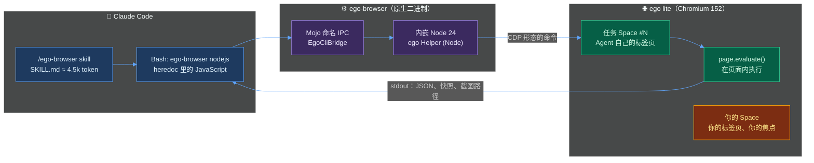
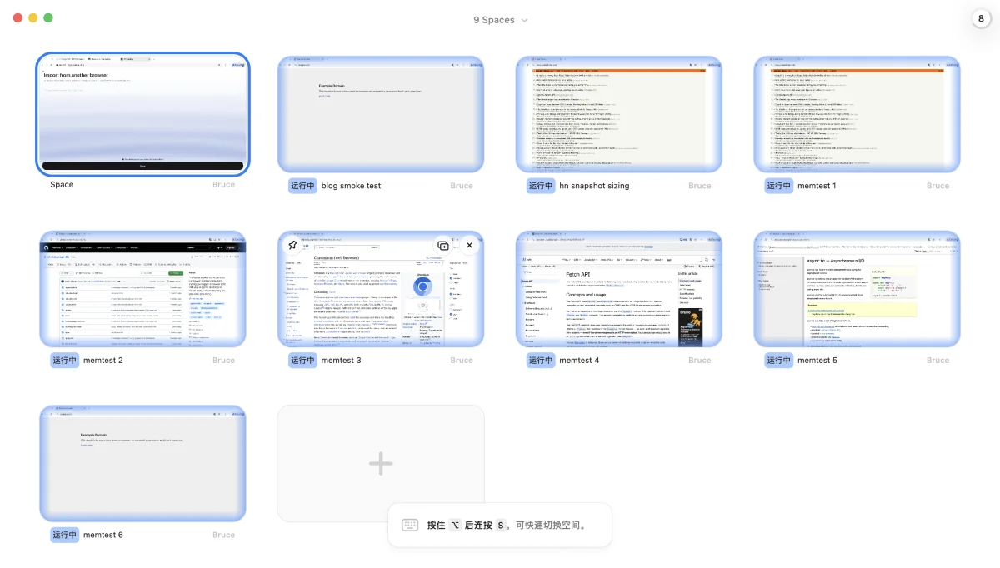

+++
date = '2026-09-21T10:00:00+08:00'
draft = false
title = 'ego lite 实测：把你登录好的浏览器交给 Claude Code，token 省了多少'
description = 'ego lite v0.5 接 Claude Code 跑 3 个真实任务，对比 agent-browser 和 Chrome DevTools MCP：最好 16 秒 $0.12，最差 195 秒。省 token 是真的，隔离是假的；本地 Chromium 不需要梯子。'
toc = true
tags = ['ego lite', 'Claude Code', 'Browser Automation', 'AI Agent', 'Token Efficiency']
keywords = ['ego lite', 'ai agent 浏览器', 'claude code 浏览器自动化', 'ego browser 教程', 'ai 专属浏览器', 'ego lite 实测', 'ego lite windows', 'ego lite 隐私']

[[params.faqItems]]
question = "ego lite 是什么？怎么和 Claude Code 一起用？"
answer = "ego lite（citrolabs/ego-lite）是 Citro Labs 出的免费闭源 Chromium 分支，只有 macOS 版，让 AI Agent 在你日常用的浏览器里拥有自己的 Space。Claude Code 通过 ego-browser skill 驱动它：Agent 写一段 JavaScript，随 App 附带的 ego-browser 命令把脚本交给内嵌的 Node 24 运行时执行，page.evaluate() 直接在页面里跑。2026 年 9 月我实测抓 Hacker News 前五条只用了 1 次工具调用、16 秒、$0.12。"

[[params.faqItems]]
question = "ego lite 比 Vercel agent-browser 快吗、省 token 吗？"
answer = "Claude Code 开完全权限时是的：Hacker News 任务 16.4 秒/$0.12 对 19.0 秒/$0.18，多页面文档检索 40.5 秒/$0.22 对 40.8 秒/$0.29。但在 Claude Code 默认权限模式下反而更慢（76 秒对 40 秒、195 秒对 43 秒），因为 heredoc 里的 JavaScript 会触发 Claude Code 的 shell 安检。省下来的 token 来自一次性跑完的 JavaScript，不是快照——它的快照在 HN 首页要 7,823 token，agent-browser 只要 4,742。"

[[params.faqItems]]
question = "ego lite 的 Space 能把 Agent 和我的登录态隔开吗？"
answer = "不能。Space 隔离的是标签页、焦点和窗口，不是存储。我在一个任务 Space 里写入的 cookie 和 localStorage，在同一 profile 的另一个任务 Space 里原样可读；官方在 issue #319 里也承认「Space 不隔离 cookie」，issue #303 更是从任务 Space 里清 cookie 直接把主 Space 的登录全清掉了。把 Space 当成共享 cookie 之上的私有标签组，给 Agent 单开一个 profile。"

[[params.faqItems]]
question = "ego lite 需要梯子吗？有 Windows 版吗？"
answer = "浏览器本身是本机 Chromium，登录态和数据都在本地，Agent 访问什么站就走什么网络，不额外需要梯子；从 GitHub 拉 skill 走的是 npx。截至 2026 年 9 月只有 macOS 版（Apple Silicon 和 Intel），Windows 和 Linux 在官方 roadmap 上标为 Planned，没有日期，WSL2 支持也只是一个未处理的 feature request（#374）。Windows 用户先用 agent-browser 或 Chrome DevTools MCP。"

[[params.faqItems]]
question = "在 Claude Code 里用 ego-browser 报 expansion obfuscation 是怎么回事？"
answer = "skill 推荐的写法是用 shell heredoc 把 JavaScript 喂给 ego-browser，任何对象字面量比如 { keep: [] } 或 { scope: 'full_page' } 都会出现引号紧挨花括号，Claude Code 的 Bash 安检在默认权限模式下会直接拒绝，报 Contains brace with quote character (expansion obfuscation)。ego 官方文档让你把 Claude Code 设成 Full access；开了以后同一个任务从 30 轮降到 7 轮。"
+++


我给 ego lite 的第一个正经任务，就是它整个卖点押注的那件事：打开 GitHub，告诉我现在登录的是谁。Agent 跑了 65 秒，回来一句「not logged in」。我明明登着，浏览器也登着。它只是拿到了我两个导入 profile 里错的那一个，而 skill、文档、界面，没有任何一处告诉它还有第二个 profile。

这就是这篇实测的缩影。[ego lite](https://github.com/citrolabs/ego-lite) 是我从一月开始追的那个问题迄今最野心勃勃的答案——怎么给编程 Agent 一个浏览器，又不用拿 token、稳定性和自己的耐心去换。

这条线从 headless 驱动（[Vercel agent-browser](/zh/posts/ai/2026-01-13-vercel-agent-browser/)）走到[接管你的真实浏览器](/zh/posts/ai/2026-03-17-chrome-devtools-mcp-guide/)，再到[把 token 砍到零](/zh/posts/ai/2026-04-18-playwright-cli-skill-zero-token-automation/)，再到[一个成本模型对了但没人维护的 12 星仓库](/zh/posts/ai/2026-07-27-ubrowser-review/)。

ego lite 是这条弧线现在的终点：一个你每天用的 Chromium，Agent 在里面有自己的 Space、你的登录态，以及一套 JavaScript API 而不是命令行。截至 2026 年 9 月 11 日 GitHub 15,666 星，8 月 3 日国内技术媒体报道时还是 7,900 左右——五周翻倍。

我装了 v0.5.0.28，从 Claude Code 里驱动它跑了三个难度递增的任务，同样的提示词又喂给 agent-browser 和 Chrome DevTools MCP，逐个数 token、数秒，然后专门去找接缝。先把结论摆桌上：状态最好的时候，它是我测过最便宜的 Agent 浏览——1 次工具调用、16 秒、一毛二美金。状态最差的时候，它是最慢的——30 轮、三分钟，而 agent-browser 43 秒干完。两个数字都是真的，中间的差别是一个 Claude Code 设置，不是浏览器本身。

## ego lite 到底是什么：从二进制往上看

ego lite 是 Citro Labs 基于 Chromium 152 做的闭源分支，免费 DMG 下载；GitHub 上那个 MIT 仓库只放 `ego-browser` skill 和文档。卖点三件套：**Spaces**（一个窗口里的隔离工作区——你在你的里面浏览，Agent 在它的里面干活）、**继承状态**（导入你的 Chrome 或 Edge profile，cookie 和扩展一起带过来）、以及**「code base 而不是 CLI base」**——Agent 写一段对页面执行的 JavaScript 一次跑完，而不是每点一下发一条 shell 命令。

现有的中文报道——[Hello.Reader 在 CSDN 的那篇](https://agent.csdn.net/6a62db7910ee7a33f291f217.html)讲机制讲得最清楚——都没说这个 CLI 究竟是个什么东西，所以我把 App 包拆开看了。`ego-browser` 是一个 1.9 MB 的原生 arm64 Mach-O 二进制，就住在 App 里（`ego Framework.framework/Versions/0.5.0.28/Helpers/`），onboarding 时软链到 `~/.local/bin`。

它不开 TCP 端口，也不走 WebSocket；`strings` 一看，它和运行中的 App 之间是一条 **Mojo 命名 IPC 通道**（`ego.mojom.EgoCliBootstrap` 和 `EgoCliBridge`），也就是 Chromium 自己进程间用的那套传输。你的脚本跑在一个内嵌的 Node 24.18 运行时里（独立的 `ego Helper (Node)` 进程），面对一套刻意不像 Playwright 的小 API：`taskSpace()`、`page.goto()`、`page.snapshot()`、`page.click()`、`page.evaluate()`，以及兜底的 `page.cdp()`。



安装确实只有两条命令。`npx skills add citrolabs/ego-lite` 用 8.5 秒把 skill 放进 `.agents/skills/ego-browser/`（skills.sh 的扫描器顺手打了个「High Risk」，后面说），而 App 自己的 onboarding 早就把同一份 skill 软链进了 `~/.agents/skills/`，机器上所有 Agent 都能看见。在 Claude Code 里敲 `/ego-browser` 会加载一份 19.5 KB 的 SKILL.md——我数了约 4,546 token，agent-browser 的核心 skill 是 7,372。


App 自己为 9 月 10 日 v2.0.0 弹出的更新说明页写着：重写后的 skill 内存占用降 70%、成本降 20%、速度和成功率各加 10%。这四个数一个都没公开方法；读我下面那些数的时候记住这点——我的方法是公开的。

然后它拒绝运行。每次 `ego-browser nodejs` 都回「Please complete the onboarding process first. A setup window has opened」——屏幕上根本没有什么 setup window，而 App 两个小时前就已经把我的 Chrome 数据导完了。缺的那一步最后发现是一个 `ego://onboarding` 页面，内容只有一句「No importable browser data right now」和一个 Done 按钮；按下 Done，CLI 就通了。给这事预留十分钟的懵。

顺带回答国内读者最关心的问题：**不需要梯子**。浏览器是本机 Chromium，登录态在本地，Agent 访问什么站就走你机器本来的网络；唯一走外网的是 `npx skills add` 从 GitHub 拉 skill，那和你平时装 npm 包是一回事。



## 收据：三个任务、三个工具、同一个模型

先讲方法，方便你复现。Claude Code 2.1.268，`claude -p` 加 `--output-format json`，所有运行模型统一钉死 Sonnet，机器是 M5 MacBook Pro、macOS 26.5。墙钟时间在进程外计时；轮数、费用、token 取自 JSON 结果。

三个工具吃的是同一段提示词，只改了点名工具的那句话。对照组：[Vercel agent-browser](https://github.com/vercel-labs/agent-browser) 0.37.1 配它自带的 skill，[Chrome DevTools MCP](https://github.com/ChromeDevTools/chrome-devtools-mcp) 1.9.0 headless。三个任务：**(a)** 列出 Hacker News 前五条标题和分数；**(b)** 打开 github.com 报告当前登录用户；**(c)** 在 docs.python.org 搜 `asyncio.gather`，打开结果页，原样返回第一段代码块。

第一张表是大多数人日常跑 Claude Code 的方式——权限提示开着，给浏览器命令加一条白名单。

| 任务 | 工具 | 墙钟 | 轮数 | 费用 | 被 Claude Code 拦下的调用 | 结果 |
|---|---|---:|---:|---:|---:|---|
| (a) HN 前五 | **ego lite** | 76.0s | 12 | $0.312 | 11 次里 5 次 | ✅ 正确 |
| (a) HN 前五 | agent-browser | 39.9s | 11 | $0.298 | 10 次里 4 次 | ✅ 正确 |
| (a) HN 前五 | Chrome DevTools MCP | 26.4s | 6 | $0.230 | 0 | ✅ 正确（一次 13,418 token 的快照） |
| (b) GitHub 登录态 | **ego lite**，默认 profile | 64.7s | 9 | $0.242 | 8 次里 5 次 | ⚠️「not logged in」——拿错 profile |
| (b) GitHub 登录态 | **ego lite**，指定 profile | 35.6s | 6 | $0.178 | 5 次里 2 次 | ✅「logged in as heyuan110」 |
| (c) 文档检索 | **ego lite** | 194.8s | 30 | $0.751 | 29 次里 11 次 | ✅ 正确，但很痛苦 |
| (c) 文档检索 | agent-browser | 42.6s | 13 | $0.305 | 11 次里 1 次 | ✅ 正确 |
| (c) 文档检索 | Chrome DevTools MCP | 51.3s | 14 | $0.325 | 0 | ✅ 正确 |

先看「被拦下」那一列。ego lite 整套交互模型就是一段装着 JavaScript 的 shell heredoc，而 Claude Code 的 Bash 安检会拒绝任何「花括号紧挨引号」的命令——换句话说，任何对象字面量：`{ keep: [] }`、`{ scope: "full_page" }`、`{ profileId: "Profile 1" }`。报错是 `Contains brace with quote character (expansion obfuscation)`，在 `-p` 模式下是硬拒绝，不弹询问。

任务 (c) 里 Agent 把 29 次调用中的 11 次烧在这上面，试着改写成脚本文件（也被拒——`Write` 不在白名单里），试了 `printf`，试了 `JSON.parse('{"scope":"full_page"}')` 绕过去，最后总算到了。agent-browser 在 `eval --stdin` 那条路上撞的是同一堵墙，只是次数少，因为它大部分命令是 flag 形态的。

ego 的文档让你把 Claude Code 开成「Full access」。那我就开——`--dangerously-skip-permissions`——把 (a) 和 (c) 两个 CLI 工具重跑一遍。Chrome DevTools MCP 第一轮没被拦，数字沿用。

| 任务 | 工具 | 墙钟 | 轮数 | 浏览器调用 | 费用 | 工具返回 token | 结果 |
|---|---|---:|---:|---:|---:|---:|---|
| (a) HN 前五 | **ego lite** | **16.4s** | **2** | **1** | **$0.123** | 151 | ✅ |
| (a) HN 前五 | agent-browser | 19.0s | 6 | 4 | $0.176 | 177 | ✅ |
| (c) 文档检索 | **ego lite** | 40.5s | 7 | 6 | $0.219 | 3,805 | ✅ |
| (c) 文档检索 | agent-browser | 40.8s | 12 | 10 | $0.290 | 4,253 | ✅ |

这才是营销说的那个数字，而且站得住。Hacker News 一次 `ego-browser nodejs` 调用——`taskSpace`、`goto`、`waitForSelector`、一个把行映射成 `{title, points}` 的 `page.evaluate`——完事：2 轮、151 token 的工具输出、16.4 秒里大头是 Sonnet 在思考。agent-browser 得走 `open`、`snapshot`、`eval`、`close` 四步。

文档检索任务上两者时间打平，ego 在轮数和费用上便宜约 25%。ego 官网说复杂任务「最高比 agent-browser 快 3.45 倍」（README 写的是 2.5 倍，数据没公开）；我的复杂任务是时间打平、费用省四分之一。不是 3.45 倍，但是真赢——前提是用它文档推荐、而这个博客的大部分安全意识读者不会开的那个设置。

## 省的 token 到底从哪来（不是快照）

这是我最想掐掉的一个误解，因为 ego 自家的对比矩阵就在鼓励它：「Compressed semantic input」那个勾。我在每个工具里加载同一个 Hacker News 首页，数每个工具交给模型的快照，用的是这个系列一直用的 `o200k_base` 分词器。

| 工具 | 快照 | 字符 | token |
|---|---|---:|---:|
| **ego lite** | `page.snapshot()`（视口） | 30,469 | **7,823** |
| **ego lite** | `page.snapshot({scope:"full_page"})` | 45,970 | 11,867 |
| agent-browser | `snapshot`（完整 a11y 树） | 27,845 | 7,368 |
| agent-browser | `snapshot -i`（只要可交互元素） | 13,734 | **4,742** |
| Chrome DevTools MCP | `take_snapshot` | 39,123 | 13,418 |
| Playwright MCP | `browser_snapshot`（我 7 月在文章页测的） | 28,874 | ~7,400 |
| ubrowser | 紧凑格式（7 月测 100 元素的 HN 页） | — | ~1,720 |

ego 的快照**一点也不紧凑**。它是一棵忠实的无障碍树，每一层 `table > table_row > table_cell` 都写全——Hacker News 从头到脚是嵌套表格，ego 光视口那一屏就比 agent-browser 整页的「只看可交互元素」视图还贵，比 Chrome DevTools MCP 那个我[七月](/zh/posts/ai/2026-07-21-claude-code-screenshot-mcp-frontend-debugging/)点名业界最贵的快照也只便宜四成。

它有的是 ref（`[ref=7, loc=href:/newest]`）带稳定定位器提示、iframe 内容内联，以及——按 v2.0.0 changelog——跨 `page.evaluate` 调用不失效的 ref，这在 9 月 9 日之前是个真实存在的 bug。

那为什么完全权限那次只花了 151 token 而不是 7,823？因为 Agent 压根没要快照。它写了 `page.evaluate(() => [...document.querySelectorAll(".athing")].slice(0,5).map(...))`，拿回一个五行的 JSON 数组。

这就是我从七月起一直念叨的那个 [65 token 的 `evaluate_script` 套路](/zh/posts/ai/2026-07-21-claude-code-screenshot-mcp-frontend-debugging/)，ego 的贡献是把它做成**默认路径**而不是高手路径：skill 让模型写代码，运行时让一整段「导航-等待-提取」在一个进程里跑完，快照是你不认识页面时才退回去用的东西。这个设计是对的。它和 ubrowser 当年的洞察是同一个——把步骤打包、只把答案送回去——只是这回背后有一家真公司，还有截图工具。

反面在 docs.python.org 上现形。页面不熟悉时 Agent 只能要快照，ego 对那个页面的快照每看一眼 8,300 字符；文档站有三个 `input[name=q]` 搜索框（一个隐藏），`fill("css=input[name=q]")` 抛出 `matched 3 elements`，`@8` 这个 ref 在重新快照后失效，默认模式那次就这样螺旋到 30 轮。

公平地说，ego 的报错是三个工具里最好的——「matched 3 elements (2 visible, 1 hidden). Candidates: 1. input 'Quick search' (hidden)…」把下一步该干什么直接告诉模型，这正是我当初批评 ubrowser 缺的东西。但这个系列的总规律不变：**决定你 token 账单的不是浏览器工具，而是 Agent 是习惯要事实还是要整棵树。** ego 把这个习惯往对的方向推了一把，然后在你真要树的时候递给你一棵跟谁比都不瘦的。


## 「你登录好的浏览器」——真了一半，假的那一半才要命

标题卖点就是开头第一段绊倒的那个，把经过完整摊开。ego lite 的 onboarding 在我的 Mac 上找到两个浏览器，都导了：Chrome 的 profile 成了 ego 的 **Default**（`Bruce`），Edge 的成了 **Profile 1**（`he bruce`）。我日常住在 Edge 里，GitHub 登在那边。

不带参数的 `taskSpace()` 在默认 profile 上建 Space，而 skill 明确告诉 Agent「除非用户明确要求某个 profile，否则不要去查看或选择 profile」。所以 Agent 完全按指令办事，拿到了错的答案。

指定 profile——`taskSpace("…", { profileId: "Profile 1" })`——36 秒、4 次浏览器调用就得到 `logged in as heyuan110`。你要是只有一个浏览器一个 profile，永远碰不到这事；有两个，或者一个工作一个个人，你一定会碰到，而修法就是文档没提的那一行。

更大的问题是「自己的 Space」对数据到底意味着什么。文档说每个任务 Space 有「its own native BrowserContext for cookies and storage」，任何用过 Playwright 的人读到这句都会理解成*隔离*。我就测了：在任务 Space A 里打开 example.com，写 `document.cookie = "isotest=fromA"` 和一个 localStorage 键；在同一 profile 上建任务 Space B，打开 example.com，读回来。

```json
{"spaceA":2,"spaceB":3,
 "seenInA":{"cookie":"isotest=fromA","ls":"fromA"},
 "seenInB":{"cookie":"isotest=fromA","ls":"fromA"}}
```

Space B 什么都看得见。Space 隔离的是**标签页、焦点和窗口**——就是总览截图里那个东西，让 Agent 抢不走你鼠标的那个东西——但同一个 profile 上它们是同一个 cookie 罐。这正是 Agent 打开 GitHub 就已经登录的原因，也正是你该把 Space 理解成共享状态之上的私有标签组、而不是沙箱的原因。

两个开放 issue 把这点磨得更尖：[#303](https://github.com/citrolabs/ego-lite/issues/303) 报告从 Agent 任务 Space 里调 `cdp("Network.clearBrowserCookies")` 把*用户*主 Space 里所有站点全登出了；[#319](https://github.com/citrolabs/ego-lite/issues/319) 演示了从副 profile 的任务 Space 调 `Storage.getCookies` 返回的是默认 profile 的整个罐子——1,105 个 cookie，别的 profile 的登录凭证都在里面。[#315](https://github.com/citrolabs/ego-lite/issues/315) 一句话把事说透：模型生成的 JavaScript 跑在一个有特权的 Node 进程里，裸 CDP 不受限、对外 HTTP 不受限，所以 Agent 访问的任何页面上的一次提示词注入，就是一次把你会话 cookie 纳入射程的提示词注入。

要说公道话，ego 团队三个 issue 都在一两周内回了，#319 下面那句是整个项目最诚实的一行：「A space is not the same as a profile, and spaces do not isolate cookies」，并承诺 0.5.0.x 支持按 profile 建 Space——就是我上面用的那个 `profileId`，这部分已经落地。#315 的裸 CDP 暴露官方承认了但还没修，仓库的私密漏洞上报通道在报告者尝试时返回的是 403。

不过用户和 Agent 之间的隔离，我怎么折腾都没破。六个任务 Space 开起来并加载六个真实页面用了 8.2 秒，没碰我的标签页；App 从完全退出到第一张快照冷启动 2.1 秒，没抢我终端的焦点（8 月版本上报的[抢焦点 bug](https://github.com/citrolabs/ego-lite/issues/284) 在 0.5.0.28 上没复现）；Spaces 总览把每个 Agent 的 Space 标成「运行中」配实时缩略图，一点就能接管。

CSDN 那篇引用了 ego 官方对六个并发任务的数据——Space 模式「0.9 GB、6 个进程」对六个独立浏览器「15 GB、84 个进程」——

这次厂商数字难得地经住了实测：我的六个 Space 恰好增加了 **6 个进程和 0.91 GB** RSS（17 → 23 个进程，0.61 → 1.52 GB），而且浏览器在闲置一分钟内就回收了大半（回到 0.68 GB）。84 个进程那个对照我没测；我信，而且它是这里最没意思的对比，因为本来也没人为六个任务开六个完整浏览器。

## 毛边，按耗掉我时间的顺序

- **`-e` 参数会卡在 stdin 上。** `ego-browser nodejs -e '…'` 只要 stdin 是一个没关闭的管道就永远不返回——而在大多数 Agent harness 和 CI runner 里它正是这样。我定位到之前有三次直接调用挂到被杀；`< /dev/null` 就能修。heredoc 没事，因为 heredoc 会关掉 stdin。
- **没有窗口的 onboarding 门禁。** 上面说过了；十分钟，`ego://onboarding`，按 Done。
- **扩展导进来是禁用的。** 每个 Chrome 扩展都带着「已被禁用——请接受新权限」到岗，App 首次启动在工具栏一个扩展弹一个权限气泡。对你来说没什么；对 Agent 无关，它本来也拿不到扩展 UI。
- **所有权会静默翻转。** 我的清理脚本对八个 Agent Space 调了 `finish({ keep: [] })`，有一个以 `ownership: "user"` 活了下来——GitHub 标签页把它翻过去了，见 [#314](https://github.com/citrolabs/ego-lite/issues/314)。无害，但是个漏掉的渲染进程，[#270](https://github.com/citrolabs/ego-lite/issues/270) 说闲置任务 Space 会跨会话堆积。
- **退出会丢标签页。** 我为测冷启动退出 ego lite，它回来是一个全新的「新标签页」；之前开的三个标签页没了。Chromium 的「从上次停下的地方继续」在这里默认关着，拿来当主力浏览器之前我会先打开。
- **只有 macOS，roadmap 对 Windows 和 Linux 只写「Planned」没日期。** [#203](https://github.com/citrolabs/ego-lite/issues/203)、[#345](https://github.com/citrolabs/ego-lite/issues/345) 和一个 [WSL2 请求](https://github.com/citrolabs/ego-lite/issues/374)是点赞最多的功能 issue。你在 Windows 上，这篇是预告，不是推荐。
- **skills.sh 的扫描器在安装时把 skill 标成「High Risk」。** 读完 skill 之后我的理解是：这个标记说的是能力而不是恶意——它教模型对一个装着你 cookie 的浏览器跑任意 JavaScript。这就是产品本身。自己掂量。

两件我以为会糙结果没糙的事：skill 写得非常好（「整个任务只用一个 TaskSpace，打印它的 id，后面接着用」这条纪律让 Agent 在每次运行里都没有标签页泛滥），v2 API 的动作回执——弹窗、对话框、下载以数据形式返回而不是当惊喜——比 agent-browser 想得周到。

## 结论：用，但要单开 profile、开完全权限、在 Mac 上

一句话判断：**ego lite 是第一个把「你登录好的浏览器」做成两条命令安装、把省 token 做成可测量而不是「预估」的 Agent 浏览器——但这个赢只在 Claude Code 开完全权限时出现，而它暗示的隔离在 cookie 这一层并不存在，所以它应该跑在一个专用 profile 上，只登你敢交给实习生的那些站。**

我自己会用的对比表，汇总这个系列迄今所有实测：

| | ego lite | agent-browser | Chrome DevTools MCP | Playwright MCP | ubrowser |
|---|---|---|---|---|---|
| 接口 | 通过 `ego-browser nodejs` 跑 JS | CLI，一个动作一条命令 | MCP 工具 | MCP 工具 | MCP 工具（批量） |
| 你的登录态 | ✅ 导入的 profile，共享 cookie 罐 | ❌（除非 `connect` 到你的 Chrome） | ✅ 接管真实 Chrome | ❌ | ❌ |
| 最佳实测（HN） | 16.4s / 2 轮 / $0.12 | 19.0s / 6 轮 / $0.18 | 26.4s / 6 轮 / $0.23 | — | 1 次调用 / 641 token（7 月） |
| HN 首页快照成本 | 7,823 token | 4,742（`-i`） | 13,418 | ~7,400（7 月，文章页） | ~1,720（7 月） |
| Claude Code 默认权限模式 | ❌ heredoc JS 被拦 | ⚠️ `eval` 被拦 | ✅ | ✅ | ✅ |
| 截图 / evaluate | ✅ / ✅ | ✅ / ✅ | ✅ / ✅ | ✅ / ✅ | ❌ / ❌ |
| 平台 | macOS | macOS / Linux / Windows | 全平台 | 全平台 | 全平台 |
| 维护状态 | 2026-09-10 发 v2.0.0 | 活跃 | 活跃 | 活跃 | 2025 年 12 月弃更 |

再给一张你会截图存下来的决策表：

| 如果你… | 用 |
|---|---|
| 在 Mac 上、Claude Code 开着 bypass permissions、任务需要*你的*登录态（后台、管理面板、自家 SaaS） | **ego lite**，跑在一个只登了这些站的专用 profile 上 |
| Agent 跑在默认权限模式、要最便宜的干净浏览 | agent-browser（`snapshot -i` + `eval`），或者 [skill 里的 Playwright CLI](/zh/posts/ai/2026-04-18-playwright-cli-skill-zero-token-automation/) |
| 在调自己的前端 | Chrome DevTools MCP 配定向 `evaluate_script`，老规矩 |
| 需要 Agent 和你会话之间的真隔离 | 不是 ego lite。独立浏览器、独立 profile，或者云浏览器 |
| 在 Windows / Linux 上，或者跑在 CI 里 | 不是 ego lite，等 roadmap 动了再说 |

三条用血换来的配置规矩。一：给 Agent 新建一个 ego lite profile，只登它需要的站——共享 cookie 罐意味着「继承你的登录态」也意味着「继承你的网银」。二：你要是同时用两个浏览器，跑一次 `profiles()`，把对的 `profileId` 写进 CLAUDE.md，否则你的 Agent 会理直气壮地报「not logged in」。三：永远不要不带 `< /dev/null` 用 `-e`，永远不要在任务 Space 里调 `cdp("Network.clear…")`，除非你喜欢把所有站重新登一遍。

放大到整个系列：这个领域现在干净地分成了两派。驱动派（agent-browser、Playwright、各种 MCP）给你一个 Agent 拥有、你不拥有的浏览器；ego lite 给你一个你拥有、Agent 来借的浏览器。第二种更有用也更危险，两者分毫不差，而 token 经济——我一月开始量的那件事——反而成了容易的部分。两派都收敛到了「写代码、送答案、别送 DOM」。现在把它们分开的，是罐子里装的是谁的 cookie。

## 常见问题

**ego lite 是什么？怎么和 Claude Code 一起用？**

一个免费闭源、只有 macOS 版的 Chromium 152 分支，在你日常浏览器里给 Agent 自己的 Space。Claude Code 用 `ego-browser` skill：Agent 写 JavaScript，随 App 附带的原生 CLI 通过 Mojo IPC 把它交给内嵌 Node 运行时，`page.evaluate()` 在页面内执行。我最好的一次是 1 次工具调用、16.4 秒、$0.12。

**ego lite 比 Vercel agent-browser 快吗、省 token 吗？**

完全权限模式下是——Hacker News 16.4s/$0.12 对 19.0s/$0.18；多页面文档检索时间打平、便宜 25%。Claude Code 默认权限模式下反而更慢，因为 heredoc 里的 JavaScript 会触发 shell 安检。

**ego lite 的 Space 能把 Agent 和我的登录态隔开吗？**

不能。一个任务 Space 里写的 cookie 在同 profile 的另一个任务 Space 里可读，issue #303 更是任务 Space 清 cookie 把主 Space 登出了。Space 隔离的是标签页和焦点；给 Agent 单开 profile。

**ego lite 需要梯子吗？有 Windows 版吗？**

不需要梯子——本机 Chromium，走你机器自己的网络。截至 2026 年 9 月没有 Windows 版，roadmap 上写 Planned、没日期。

**在 Claude Code 里用 ego-browser 报 expansion obfuscation 是怎么回事？**

因为 heredoc 里任何 JavaScript 对象字面量都会让花括号紧挨引号，Claude Code 的 Bash 安检在默认权限模式下会拒绝。ego 文档让你开完全权限；开了之后同一个文档任务从 30 轮降到 7 轮。

## 相关阅读

- [ubrowser 实测：最快最省的浏览器自动化？](/zh/posts/ai/2026-07-27-ubrowser-review/) — 最早把成本模型做对的那个弃更仓库；ego lite 就是它本来想长成的样子
- [Claude Code 浏览器自动化怎么选？5 套方案实测对比](/zh/posts/ai/2026-01-28-claude-code-browser-automation/) — 本文更新的那张一月地图
- [Claude Code 截图 MCP 配置：浏览器自动化调试省 100 倍 token](/zh/posts/ai/2026-07-21-claude-code-screenshot-mcp-frontend-debugging/) — 13,418 token 的快照和 65 token 的 evaluate 出处
- [Vercel Agent Browser：AI 原生浏览器自动化 CLI](/zh/posts/ai/2026-01-13-vercel-agent-browser/) — 本次对照组工具刚发布时的介绍
- [Playwright CLI + Skill 三段式：把 AI 浏览器自动化做到 0 Token](/zh/posts/ai/2026-04-18-playwright-cli-skill-zero-token-automation/) — 想要 ego 级经济性又不想共享 cookie 罐时该用的套路

## 系列文章导航

这是「AI Agent 浏览器自动化」系列的第 7 篇。这条线的演进：headless 驱动 → 接管真实浏览器 → 把 token 砍到底 → 共享你的登录态：

1. [Vercel Agent Browser](/zh/posts/ai/2026-01-13-vercel-agent-browser/) — 为 Agent 而不是测试套件设计的 snapshot 式 CLI
2. [Claude Code 浏览器自动化：5 套方案实测对比](/zh/posts/ai/2026-01-28-claude-code-browser-automation/) — 这条线的地图：token 成本、速度、稳定性
3. [Chrome DevTools MCP 2026 配置教程](/zh/posts/ai/2026-03-17-chrome-devtools-mcp-guide/) — 接管真实浏览器，以及 9222 端口的坑
4. [Playwright CLI + Skill 三段式：0 Token 自动化](/zh/posts/ai/2026-04-18-playwright-cli-skill-zero-token-automation/) — 去掉 MCP token 税的三段式写法
5. [Claude Code 截图 MCP 配置](/zh/posts/ai/2026-07-21-claude-code-screenshot-mcp-frontend-debugging/) — 前端调试闭环，10,220 对 65 token
6. [ubrowser 实测](/zh/posts/ai/2026-07-27-ubrowser-review/) — 设计对了，仓库死了
7. **本文**：ego lite 实测 — 用 Spaces 把登录态交给 Agent
