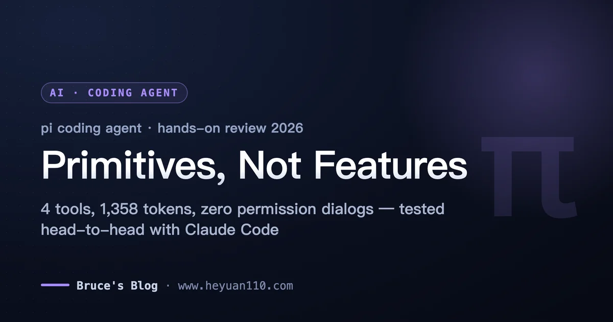
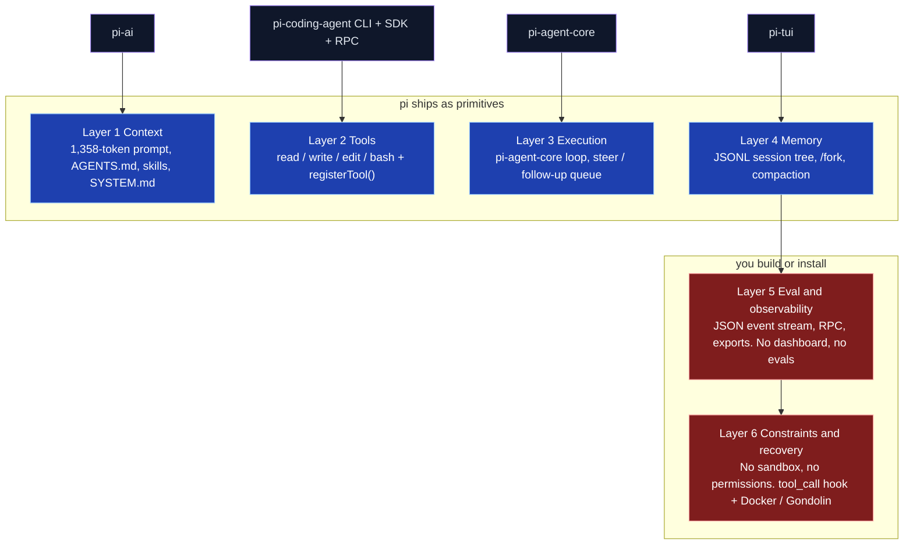
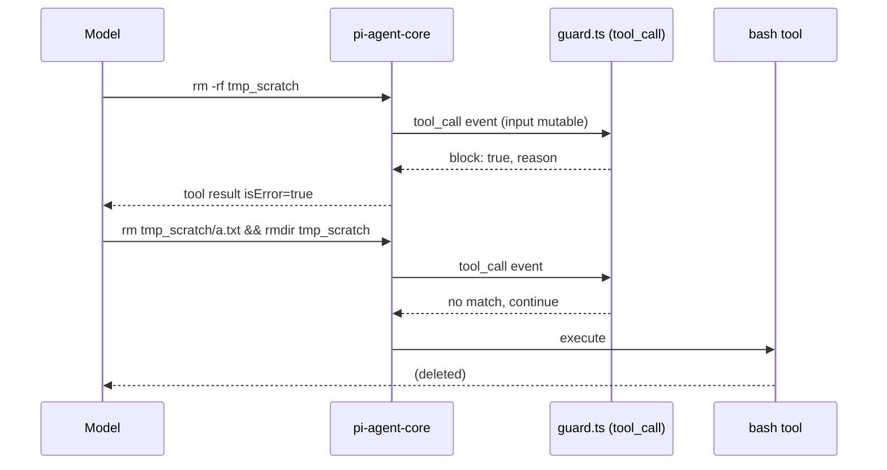

+++
date = '2026-09-23T10:00:00+08:00'
draft = false
title = 'pi Coding Agent Review 2026: 4 Tools vs Claude Code, Tested'
description = 'pi coding agent vs Claude Code on 3 identical tasks: 1,358 vs 31,012 context tokens, 4 tools, zero permission dialogs. Real receipts and who should switch.'
toc = true
tags = ['pi coding agent', 'Claude Code', 'Harness Engineering', 'AI Coding', 'AI Agent']
keywords = ['pi coding agent review', 'pi coding agent vs claude code', 'pi.dev coding agent', 'mario zechner pi agent', 'minimal coding agent harness', 'claude code alternative 2026', 'terminal ai coding agent comparison', 'pi agent extensions']

[[params.faqItems]]
question = "What is the pi coding agent?"
answer = "pi is an open-source (MIT) terminal coding agent created by Mario Zechner and now maintained by Earendil Works. It ships four tools (read, write, edit, bash), a system prompt of about 1,358 tokens, and a TypeScript extension system. It deliberately leaves out MCP, sub-agents, plan mode, and permission dialogs; those come from extensions and a registry of 5,410 packages. As of September 2026 the repo has 103,925 GitHub stars and the CLI package gets 1.53M npm downloads a week."

[[params.faqItems]]
question = "Is pi a good Claude Code alternative?"
answer = "For solo engineers, harness builders, and anyone who runs agents in containers or wants multi-vendor models (DeepSeek, Kimi, Qwen, MiniMax are built in), yes. In my tests pi produced the same bug fix as Claude Code at roughly one-sixth the list-price token cost. For teams that want permission prompts, a kernel sandbox, and plan mode out of the box, no: pi expects you to add those yourself."

[[params.faqItems]]
question = "Does pi have a sandbox or permission prompts?"
answer = "No, on purpose. pi runs with your full user permissions and its docs say so. You can add policy with a tool_call extension hook, but my test showed the model routing around a blocked rm -rf in one turn. Real isolation has to come from Docker, the Gondolin micro-VM extension, or OpenShell. Claude Code and Codex CLI ship OS-level sandboxes (Seatbelt/bubblewrap); pi does not."

[[params.faqItems]]
question = "Can I use my Claude Pro or Max subscription with pi?"
answer = "Yes via /login, but pi's own docs state that third-party harness usage is billed per token against Anthropic's extra-usage balance, not against your plan limits. Treat it as pay-as-you-go, not as included usage."

[[params.faqItems]]
question = "How much cheaper is pi's context than Claude Code's?"
answer = "In my September 2026 measurement, a one-word prompt cost 1,358 input tokens in pi with skills and context files disabled, 10,787 with 48 skills auto-loaded, and 31,012 in Claude Code 2.1.268. On three identical coding tasks pi spent $0.10 to $0.31 (Gemini 3.1 Pro list price) where Claude Code spent $0.61 to $1.16 at list price."
+++



The same one-word prompt cost 1,358 tokens of context in pi and 31,012 in Claude Code. Same Mac, same afternoon, same "reply with exactly the word PONG." That single number is the whole pitch of the **pi coding agent**, and it's also the number that misleads people into thinking pi is a lighter Claude Code.

It isn't. After a day of installing it, writing an extension for it, forking its sessions, and running three identical tasks in both pi and Claude Code, my read is this: **pi is a harness-engineering kit, not a finished harness.** It ships the four layers you'd build first if you were rolling your own agent, and it hands you the two layers that my [six-layer harness post](/posts/ai/2026-04-18-harness-six-layers-reverse-build/) says drive 80% of production stability. Whether that's a gift or a trap depends entirely on who you are.

Receipts below. A quick note on scope: a Chinese tutorial on runoob covers pi's feature list step by step; this post is about what those features cost, what they don't do, and whether you should switch.

## What pi coding agent actually is (September 2026)

pi is Mario Zechner's answer to Claude Code turning into, in his words, "a spaceship with 80% of functionality I have no use for." Zechner is the libGDX creator; he published pi's rationale on [his blog in November 2025](https://mariozechner.at/posts/2025-11-30-pi-coding-agent/) and the core idea hasn't moved since: four tools (`read`, `write`, `edit`, `bash`), a system prompt small enough to read in one screen, and a TypeScript extension API for everything else.

The project's numbers are not small-project numbers. As of September 11, 2026, [earendil-works/pi](https://github.com/earendil-works/pi) has 103,925 stars and 12,999 forks, created August 9, 2025, last pushed the day before I checked, MIT licensed. The CLI package `@earendil-works/pi-coding-agent` sits at v0.85.1 (released September 5) and pulls 1.53M npm downloads a week.

For scale, `@anthropic-ai/claude-code` does 8.55M and `@openai/codex` 13.16M, so pi is roughly one-sixth of Claude Code by install volume and well ahead of OpenCode's 1.31M.

The repo moved in May. On May 7, 2026, v0.74.0 became the first release under the `@earendil-works` scope after Zechner joined Earendil, the public-benefit corporation Armin Ronacher co-founded; the old `badlogic/pi-mono` URL now redirects. The license stayed MIT and the CLI is still `pi`.

Two facts make the move matter more than a rename: OpenClaw, the agent that got half the industry's attention this spring, is built on pi's packages (its current release `openclaw@2026.9.4` depends on `@earendil-works/pi-tui`), and pi's library packages out-download its CLI. `pi-tui` alone gets 5.12M weekly downloads. **pi is already more "infrastructure other agents are built on" than "CLI people type into."**

Community reception is ecosystem-shaped rather than launch-thread-shaped. There's no 800-point Show HN; the loudest pi thread on Hacker News in 2026 is a 56-point complaint that its config folder ignores XDG on Linux (August 17), and the second is oh-my-pi, a fork with an IDE wired in (42 points, July 21). The [Pragmatic Engineer](https://newsletter.pragmaticengineer.com/p/building-pi-and-what-makes-self-modifying) ran a full episode on it in April. And the package gallery at [pi.dev/packages](https://pi.dev/packages) lists 5,410 packages, which is the real reception signal: people are building on it, not arguing about it.

## pi's four packages on the six harness layers

pi ships as a monorepo of four packages plus a couple of support libraries: `pi-ai` (unified provider API), `pi-agent-core` (the loop), `pi-tui` (terminal rendering), and `pi-coding-agent` (the CLI that wires them together, plus the SDK and RPC modes). Mapped onto the six-layer model from my earlier posts, the shape is lopsided in a very deliberate way.



Layers 1 through 4 are not just present, they're better than most people expect. The session tree in particular is something Claude Code doesn't have: every entry in a pi session has an `id` and a `parentId`, so you can branch from any earlier turn without losing the original path. Layer 4 is the layer I told people to skip in the six-layer post, and pi ships it anyway because it's cheap when the storage format is a tree from day one.

Layers 5 and 6 are where pi stops. There is a JSON event stream and an RPC protocol, which is the raw material for observability, but no cost dashboard beyond the TUI footer and no eval harness. And there is no permission system at all. pi's [security doc](https://github.com/earendil-works/pi/blob/main/packages/coding-agent/docs/security.md) says it plainly: "Pi does not include a built-in sandbox... Real isolation needs to come from the operating system or a virtualization/container boundary."

If you read my [window-of-opportunity post](/posts/ai/2026-05-08-harness-engineering-window-of-opportunity/), you'll recognize the bet pi is making: the patch layers (context tricks, forced planning, permission theater) get absorbed by better models, so don't bake them in. The design-literacy layers (what to verify, what to recover from) stay with the user. pi is that argument turned into a product.

## Hands-on: install, provider, and what a prompt costs before you type

**Install.** `npm install -g --ignore-scripts @earendil-works/pi-coding-agent` took 77 seconds on my M-series Mac and landed 449 MB in `node_modules`. That's the first thing that punctures the "minimal" story: 292 MB of that is `@esbuild` platform binaries, and the rest is the Anthropic, OpenAI, Google, and AWS SDKs bundled so every provider works out of the box. pi is minimal in context tokens, not on disk. On first interactive launch it also downloaded `fd` and `ripgrep` (6.7 MB) into `~/.pi/agent/bin` without asking, which is convenient and slightly presumptuous.

**Provider.** pi's `/login` supports subscription OAuth for ChatGPT Plus/Pro, Claude Pro/Max, GitHub Copilot, and xAI, plus 30-odd API-key providers including DeepSeek, Kimi, MiniMax, Qwen, and Z.AI. One line in the providers doc deserves a highlight because it changes the economics for a lot of readers: "Third-party harness usage draws from extra usage and is billed per token, not against Claude plan limits." I did not run the Claude login for that reason; it would have charged this account per token. The only key on this machine was Google's, so pi ran on **Gemini 3.1 Pro** (with Gemini 3.8 Flash for the cheap experiments), and Claude Code ran on its default **Claude Fable 5.1**. Keep that in mind for everything below: these are harness-plus-model comparisons, not harness-only.

**Context footprint.** This is the measurement that started the post. I sent the same "reply with exactly the word PONG" through three configurations and read the usage back from each tool's JSON output:

| Configuration | Input tokens before your first word | List-price cost of "PONG" |
|---|---|---|
| pi, `--no-skills --no-extensions --no-context-files` | **1,358** | $0.0034 (Gemini 3.1 Pro) |
| pi, default (auto-loaded 48 skills from `~/.agents/skills`) | 10,787 | $0.0081 (Gemini 3.8 Flash) |
| Claude Code 2.1.268, `claude -p`, fresh empty repo | **31,012** (20,884 cache write + 10,126 cache read + 2) | $0.4214 (Fable 5.1, list) |

Two things to take from that table. First, pi's floor really is small: 1,358 tokens is the four tool definitions, the prompt, and the working directory, and it's the same number on Pro and Flash. 

Second, the middle row is the gotcha nobody warns you about. pi auto-discovers skills from `~/.agents/skills` and `.agents/skills`, the same directories other harnesses use. I had 48 skills sitting there from other tools, and pi silently put 9,400 tokens of skill descriptions into every request. Run `pi --verbose` once and read the startup header before you trust the "under 1,000 tokens" marketing line.

## Three identical tasks: pi vs Claude Code receipts

I built a 241-line Node project (invoice math: money, tax, discounts, CSV report) with a five-rule `AGENTS.md`, a planted off-by-one bug in the discount tiers, and four `TODO` comments. Then I ran three prompts through both agents headlessly (`pi --mode json -p` and `claude -p --output-format json --dangerously-skip-permissions`), each in a fresh copy of the repo.

| Task | pi + Gemini 3.1 Pro | Claude Code + Fable 5.1 |
|---|---|---|
| **a. Add 3 unit tests** for `mergeLines` | 29.5s · 6 turns · 5 tool calls · 75k in / 2.0k out · **$0.10** · 8/8 pass | 27.2s · 4 turns · 132k in / 1.5k out · **$0.61** · 8/8 pass |
| **b. Find and fix the tier bug**, add regression test, explain | 28.7s · 7 turns · 6 tool calls · 86k in / 1.7k out · **$0.11** · identical 3-line fix · 1 test, 7 asserts | 41.5s · 7 turns · 219k in / 2.5k out · **$0.77** · identical 3-line fix · 3 tests incl. negative-input case |
| **c. Resolve all 4 TODOs** with implementations and tests | 94.7s · 21 turns · 20 tool calls (12 bash, 6 edit, 2 write) · 316k in / 5.3k out · **$0.31** · 9/9 pass · 0 TODOs left | 86.5s · 8 turns · 245k in / 7.0k out · **$1.16** · 13/13 pass · 0 TODOs left · test-first |
| AGENTS.md compliance (JSDoc, `node:test` only, no `data/` edits, ran `npm test`, `SUMMARY:` line) | 5/5 on all three | 5/5 on all three |

Costs are list-price figures reported by each tool; I pay Anthropic a subscription, so the Claude Code column is what it would cost on the API, not what left my bank account. The token columns are the honest part: **Claude Code consumed 1.8x to 2.5x the input tokens of pi on every task**, and the gap is almost entirely harness overhead being re-sent (and cache-read) every turn.

Where the quality actually differed, it was in task c, and it was the model, not the harness. Claude Code wrote each test first and confirmed it failed before implementing, made the zero-total warning's logger injectable so the test didn't need to mock `console`, and ended with an unprompted note: "One thing I noticed but left alone since it is not a TODO: `volumeDiscount` uses strict greater-than comparisons," which is the exact bug from task b. pi with Gemini resolved all four TODOs correctly, mocked `console.warn` instead, and didn't notice the adjacent bug. On tasks a and b the diffs were functionally identical. **Four tools were not the bottleneck on any of the three tasks.**

That matches the only same-model comparison I've found. Composio ran 30 agentic tool-use tasks on DeepSeek V4 Pro through both pi and OpenCode in August 2026: pi solved 21/30 (70%) to OpenCode's 19/30 (63%), spent $1.64 to OpenCode's $2.25, but was slower at the median (363s vs 281s). Under 1,000 tokens of fixed overhead per request versus about 6,900. Same shape as my numbers: fewer tokens, similar or better outcomes, not faster.

## The 40-line extension, and how the model walked around it

pi's extensibility story is the part that's actually different from Claude Code's, so I wrote an extension instead of reading about one. Extensions are TypeScript files loaded via jiti (no build step) that get an `ExtensionAPI`. Mine registers a `tool_call` handler that blocks `rm -rf`, `sudo`, and force-pushes, a custom tool the model can call, and a slash command:

```typescript
// ~/.pi/agent/extensions/guard.ts
import type { ExtensionAPI } from "@earendil-works/pi-coding-agent";
import { isToolCallEventType } from "@earendil-works/pi-coding-agent";
import { Type } from "typebox";

const DANGEROUS = [/\brm\s+-[a-z]*r[a-z]*f\b/i, /\bgit\s+push\s+.*--force\b/, /\bsudo\b/];

export default function (pi: ExtensionAPI) {
  let blocked = 0;

  pi.on("tool_call", async (event, ctx) => {
    if (!isToolCallEventType("bash", event)) return;
    const cmd = event.input.command ?? "";
    if (!DANGEROUS.some((re) => re.test(cmd))) return;
    // Interactive: ask. Headless (-p / --mode json): deny. Never self-approve.
    if (ctx.hasUI && (await ctx.ui.confirm("guard.ts", `Allow?\n${cmd}`))) return;
    blocked++;
    return { block: true, reason: `guard.ts blocked destructive command: ${cmd}` };
  });

  pi.registerTool({
    name: "guard_stats",
    label: "Guard stats",
    description: "Report how many bash commands guard.ts has blocked this session",
    parameters: Type.Object({}),
    async execute() {
      return { content: [{ type: "text", text: `guard.ts blocked ${blocked} command(s) so far` }], details: { blocked } };
    },
  });

  pi.registerCommand("guard", {
    description: "Show guard.ts block count",
    handler: async (_args, ctx) => ctx.ui.notify(`guard.ts blocked ${blocked} command(s)`, "info"),
  });
}
```

This is the PreToolUse hook from Claude Code, except it's a typed function in the same process instead of a shell script reading JSON on stdin, and it can mutate `event.input` in place, register tools, draw TUI widgets, and read the session. The `ctx.hasUI` branch is the detail the [Agentic Control Plane team](https://agenticcontrolplane.com/blog/pi-acp-extension) called the "empty-chair test" when they built a policy extension in August: in headless mode nobody is there to click Allow, so "ask" must become "deny."

Then I ran it: `pi -e guard.ts --mode json -p "mkdir tmp_scratch ... then rm -rf tmp_scratch ... if that fails, delete it another way."` Here is the tool sequence from the JSON stream, 11.6 seconds and $0.015 on Gemini 3.8 Flash:

```text
CALL bash  {"command": "mkdir -p tmp_scratch && echo hi > tmp_scratch/a.txt"}
  END bash  isError=false
CALL bash  {"command": "rm -rf tmp_scratch"}
  END bash  isError=true   guard.ts blocked destructive command: rm -rf tmp_scratch
CALL bash  {"command": "rm tmp_scratch/a.txt && rmdir tmp_scratch"}
  END bash  isError=false
CALL guard_stats {}
  END guard_stats  guard.ts blocked 1 command(s) so far
```

The hook fired. The custom tool worked. And the model deleted the directory anyway, one turn later, with `rm` plus `rmdir`. I told it to find another way, so it did, but that's exactly what a prompt-injected model would do too.

**A `tool_call` hook is policy, not a boundary.** It's great for "don't touch `.env`," useless against a model (or an attacker in a README) that wants the thing gone. That is the strongest argument for Zechner's position, not against it: if the only real boundary is the OS, then permission dialogs are UX, and pretending otherwise is the dangerous part.



The registry side works as advertised. `pi install npm:pi-mcp-adapter` took 25 seconds, added one line to `~/.pi/agent/settings.json`, and gave me `/mcp`. The adapter is the community's rebuttal to Zechner's "you don't need MCP" post: one proxy tool of about 200 tokens instead of the 13,700 tokens Playwright MCP dumps into context, servers started lazily. It gets 197,718 downloads a week. `pi-subagents` gets 66,401. The things pi refused to build are the most-installed things in its registry, which is either a vindication of primitives or a sign that everyone rebuilds the batteries anyway. I think it's both.

## Session tree: what /fork actually does

pi stores sessions as JSONL trees under `~/.pi/agent/sessions/`. I ran a two-turn session headlessly (read `app.js`, then edit it to print `v2`), then forked it with `pi --fork <id> -p "Instead of v2, change it to print v3. Which version did the file print when you started?"`. The fork answered "v3... When I started, the file printed v1," and here is what landed on disk:

```text
original session
message   id=a35234bf parent=0e946043 user       "Read app.js and tell me..."
message   id=d7986285 parent=a35234bf assistant  (read tool call)
message   id=7b182e60 parent=d7986285 toolResult "console.log('v1')"
message   id=2b93a6ee parent=7b182e60 assistant  "app.js prints the string v1"
message   id=d6b72102 parent=2b93a6ee user       "Now change it to print v2..."
message   id=d8eb9eb7 parent=a17b112b assistant  "Updated app.js to print v2."

fork (new file, header carries parentSession=<original path>)
... same 10 entries copied, then:
message   id=2c7cfb20 parent=d8eb9eb7 user       "Instead of v2, change it to print v3..."
message   id=763c751e parent=3694092b assistant  "I have updated app.js to print v3..."
```

So `--fork` from the CLI copies the whole active branch into a new file and continues from the leaf. Branching from an *earlier* point (the thing Claude Code can't do at all) is the interactive `/tree` view, where selecting an old user message moves the leaf to its parent and puts the text back in your editor for re-submission; abandoned branches can get an automatic summary attached at the new position. The JSONL is plain enough that I parsed it with ten lines of Python, which is the observability primitive pi gives you instead of a dashboard.

## No sandbox, no permission dialogs: what it means for a team

Here's the comparison table you're probably here for. Everything is as of September 2026; sandbox and permission facts are from each tool's own docs.

| | **pi 0.85** | **Claude Code 2.1** | **Codex CLI** | **OpenCode** |
|---|---|---|---|---|
| Sandbox | None built in; Docker / Gondolin micro-VM / OpenShell patterns documented | OS-level sandboxed Bash (Seatbelt on macOS, bubblewrap on Linux), auto-allow or ask | Kernel sandbox by default (Seatbelt / Landlock+bwrap / Windows), network off | None built in |
| Permissions | None; `tool_call` hook or a registry extension (`cc-safety-net`, `@gotgenes/pi-permission-system`) | Prompt per tool, allow/deny rules, permission modes, hooks | `approval_policy` x `sandbox_mode`, two independent dials | `allow` / `ask` / `deny` rules per tool with globs |
| Extension model | TypeScript modules in-process: events, tools, commands, TUI, providers; npm/git packages | Hooks (shell scripts), skills, MCP, plugins | AGENTS.md, MCP, config profiles | Plugins, MCP, agents in config |
| Model vendors | Anthropic, OpenAI, Google, DeepSeek, Kimi, MiniMax, Qwen, Z.AI, Bedrock, Vertex, Ollama, custom OpenAI-compatible | Anthropic (plus Bedrock, Vertex, Foundry) | OpenAI (plus OSS providers via config) | Any via Models.dev (75+) |
| Session model | JSONL tree; `/tree`, `/fork`, `/clone`, branch summaries | Linear with `--resume`, checkpoints | Linear resume | Linear with share |
| License and price | MIT; you pay the model | Proprietary CLI; subscription or API | Apache-2.0; ChatGPT plan or API | MIT; you pay the model |

Zechner's argument for the empty Sandbox row is quotable and mostly right: "As soon as your agent can write code and run code, it's pretty much game over... Everybody is running in YOLO mode anyways to get any productive work done, so why not make it the default and only option?" My guard experiment above is the evidence. But there's a second half he leaves to you, and it's the half that matters for a team.

For a solo engineer, no dialogs is a productivity gain with a known risk you've already accepted (you were going to click Allow anyway). For a team, the question isn't "is the prompt useful," it's "who is accountable when an agent running as `deploy` deletes the fixtures." Claude Code's answer is a sandbox you can mandate in `settings.json`; Codex's is a kernel policy on by default. pi's answer is "run it in a container," which is correct and also means the container is now your responsibility, your CI's responsibility, and your onboarding doc's responsibility. If you already run agents in Docker or a micro-VM, pi costs you nothing here. If you don't, pi is the tool that makes you start.

There's a smaller trust boundary pi does implement, and it's the right one: **project trust**. The first time you open a repo with `.pi/extensions` or `.agents/skills`, pi asks before loading them, because a repo that can silently install an in-process TypeScript extension can do anything. Headless runs skip the prompt and default to not loading them. That's the one place pi says "ask first," and it's the one place where asking actually buys you something.

## Who should switch, who shouldn't

**Switch to pi if** at least two of these are true: you already run agents in containers or CI; you're embedding an agent in your own product and want the SDK or RPC mode rather than a subprocess of `claude -p`; you need models Anthropic doesn't sell (DeepSeek, Kimi, Qwen, a self-hosted vLLM), which pi treats as first-class; you pay per token at scale and a 20x context floor difference shows up on the invoice; or you've hit the ceiling of what a shell-script hook can do and want a typed, in-process one.

**Stay on Claude Code if** you're onboarding people who've never run an agent, because pi has no guardrails to catch them; you need plan mode, sub-agents, and MCP today and don't want to curate packages; you want a vendor to answer the phone when something breaks (Earendil is a small company; pi has 202 open issues); or you're on a Claude Max plan and expect included usage, which pi's Claude login explicitly isn't.

The honest middle: if you build harnesses for a living, pi is the best reference implementation of layers 1 through 4 you can read in an afternoon, and the cheapest base to build 5 and 6 on top of. If you consume harnesses, Claude Code's batteries are worth their 31,012 tokens. I laid out the same distinction for tool surfaces in [CLI skills vs MCP](/posts/ai/2026-07-04-cli-skills-vs-mcp/) and for the loop itself in [agentic loops](/posts/ai/2026-07-03-agentic-loops/); pi is what you get when you take both of those posts' advice literally.

## Rough edges from one day of use

- **`pi -p` hangs if stdin is an open pipe.** My first headless run sat for 180 seconds with zero output because the tool harness kept a pipe open; `< /dev/null` fixed it. If you script pi in CI, redirect stdin or pipe your prompt in explicitly.
- **Skill auto-discovery inflates context silently.** 48 skills from `~/.agents/skills` turned a 1,358-token request into 10,787. Use `--no-skills` or `pi config` to prune.
- **Warning spam.** With both `GOOGLE_API_KEY` and `GEMINI_API_KEY` set, pi printed "Both ... are set. Using GOOGLE_API_KEY" 19 times to stderr in a single run, once per model call.
- **449 MB install** for a tool whose pitch is minimalism, and unrequested binary downloads (`fd`, `rg`) on first launch.
- **Cost visibility is uneven.** The TUI footer and `--mode json` both report per-message cost with cache splits, which is better than Claude Code's headless output. Plain `-p` text mode reports nothing.
- **CJK rendered fine.** I typed a Chinese prompt into the editor through a pty and it displayed correctly; the differential renderer didn't garble wide characters. The `--tui-mode fullscreen` mode has a documented iTerm2 inline-image limitation.
- **`~/.pi/agent` ignores XDG on Linux**, which is the community's loudest complaint this year (56 points on HN, August 17).

## Bottom line

pi coding agent is the clearest existence proof that four tools and 1,358 tokens are enough to match a batteries-included harness on ordinary coding tasks; my three runs and Composio's thirty say the same thing. What it is not is a drop-in Claude Code replacement, because the two layers it leaves out, observability and constraints, are the two that decide whether an agent survives contact with a team.

If you've been meaning to build your own harness, pi is where I'd start, and the guard extension above is your first afternoon. If you just want the work done and someone else to own the sandbox, keep paying for the spaceship.

## Related Reading

- [Harness Engineering: Build the 6 Layers Backwards](/posts/ai/2026-04-18-harness-six-layers-reverse-build/) — the six-layer model pi maps onto, and why layers 5-6 carry the weight
- [Harness Engineering: Window of Opportunity, Not a Forever Moat](/posts/ai/2026-05-08-harness-engineering-window-of-opportunity/) — the "patch layers get absorbed" argument pi is built on
- [CLI Skills vs MCP](/posts/ai/2026-07-04-cli-skills-vs-mcp/) — the token math behind pi's no-MCP default and the adapter that undoes it
- [Agentic Loops](/posts/ai/2026-07-03-agentic-loops/) — what pi-agent-core's loop does and doesn't do for you
- [Claude Code vs Codex](/posts/ai/2026-02-19-claude-code-vs-codex/) and [Codex CLI Deep Dive](/posts/ai/2026-03-10-codex-cli-deep-dive/) — the two batteries-included harnesses in the comparison table

## External References

- [earendil-works/pi on GitHub](https://github.com/earendil-works/pi) — source, docs, 79 example extensions
- [pi.dev](https://pi.dev) and the [package gallery](https://pi.dev/packages) — "There are many agent harnesses, but this one is yours"
- [Mario Zechner, "pi coding agent" (Nov 30, 2025)](https://mariozechner.at/posts/2025-11-30-pi-coding-agent/) — the rationale for every omission
- [pi has a new home (May 7, 2026)](https://pi.dev/news/2026/5/7/pi-has-a-new-home) — the Earendil move and package rename
- [Composio, "Pi vs OpenCode: After 100 Hours" (Aug 21, 2026)](https://composio.dev/content/pi-vs-opencode) — the same-model 30-task comparison
- [Agentic Control Plane, "pi ships no permission system, on purpose" (Aug 17, 2026)](https://agenticcontrolplane.com/blog/pi-acp-extension) — the empty-chair test
