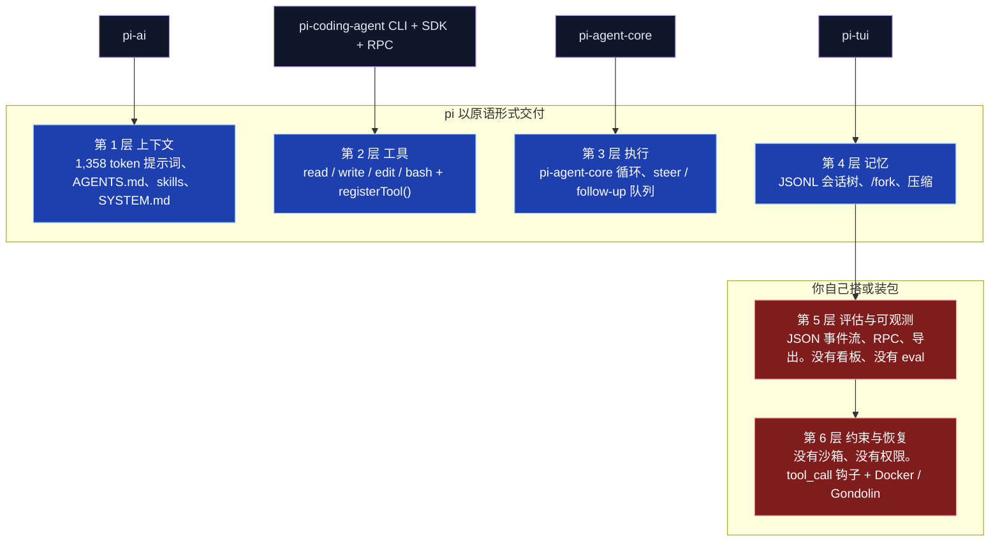
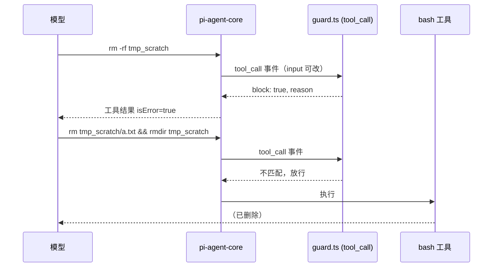

+++
date = '2026-09-23T10:00:00+08:00'
draft = false
title = 'pi coding agent 实测：只给 4 个工具的极简 Agent，比 Claude Code 少了什么、多了什么'
description = 'pi coding agent 与 Claude Code 跑同样 3 个任务实测：上下文 1,358 vs 31,012 token，4 个工具、不弹权限框、不带沙箱。附 DeepSeek / 通义 / Kimi 接入配置、40 行守卫扩展代码、六轮实测收据和该不该换的判断。'
toc = true
tags = ['pi coding agent', 'Claude Code', 'Harness Engineering', 'AI Coding', 'AI Agent']
keywords = ['pi coding agent', 'pi 编程 agent', 'ai 编程 agent 对比', 'claude code 替代', '终端 ai 编程工具', '自建 agent harness', 'pi coding agent 教程', 'pi agent deepseek 配置']

[[params.faqItems]]
question = "pi coding agent 是什么？"
answer = "pi 是 Mario Zechner 创建、现由 Earendil Works 维护的开源（MIT）终端编程 agent。核心只有 read、write、edit、bash 四个工具，系统提示词约 1,358 token，其余能力全靠 TypeScript 扩展。它故意不内置 MCP、子 agent、plan 模式和权限弹框，这些由 5,410 个注册表包补齐。截至 2026 年 9 月，GitHub 103,925 star，CLI 包 npm 周下载 153 万。"

[[params.faqItems]]
question = "pi 能替代 Claude Code 吗？"
answer = "看人。独立开发者、要自己搭 harness 的人、本来就在容器里跑 agent 的人、需要 DeepSeek / Kimi / 通义 / MiniMax 等多厂商模型的人，可以换。我的实测里 pi 给出了和 Claude Code 完全相同的 bug 修复，按标价算 token 成本只有六分之一。但团队若指望开箱即用的权限提示、内核级沙箱和 plan 模式，pi 不给，得自己装。"

[[params.faqItems]]
question = "pi 没有沙箱和权限弹框，安全吗？"
answer = "pi 以启动它的用户权限运行，文档明说没有沙箱。可以用 tool_call 扩展钩子加策略，但我实测中模型被拦下 rm -rf 后，下一轮就用 rm 加 rmdir 绕过了。真正的隔离必须来自 Docker、Gondolin 微虚拟机或 OpenShell。Claude Code 和 Codex CLI 自带操作系统级沙箱（Seatbelt / bubblewrap），pi 没有。"

[[params.faqItems]]
question = "国内怎么给 pi 配 DeepSeek、通义、Kimi 这些模型？"
answer = "DeepSeek、Kimi For Coding、MiniMax（中国区）、通义 Token Plan（中国区）、智谱 Coding Plan（中国区）、小米 MiMo 都是内置 provider，设对应环境变量（如 DEEPSEEK_API_KEY、KIMI_API_KEY、QWEN_TOKEN_PLAN_CN_API_KEY）即可。任何 OpenAI 兼容接口（如 DashScope）可在 ~/.pi/agent/models.json 里用 openai-completions 类型自定义 provider。"

[[params.faqItems]]
question = "Claude Pro / Max 订阅能在 pi 里用吗？"
answer = "能用 /login 登录，但 pi 官方文档写明：第三方 harness 的用量按 token 计入 Anthropic 的 extra usage 额外付费，不算在订阅套餐额度里。要当成按量付费来看，不是白送。"
+++


同一句「只回复 PONG」，在 pi 里花了 1,358 个上下文 token，在 Claude Code 里花了 31,012 个。同一台 Mac，同一个下午。这个数字是 **pi coding agent** 全部卖点的浓缩，也是最容易让人误判的地方：很多人把它当成「轻量版 Claude Code」。

它不是。装完、写了个扩展、fork 了会话、用两个工具各跑了同样三个任务之后，我的判断是：**pi 是一套 harness 工程的零件包，不是一个成品 harness。** 它把你自己搭 agent 时最先会造的四层都做好了，然后把我在[六层 harness 那篇](/posts/ai/2026-04-18-harness-six-layers-reverse-build/)里说的、决定 80% 生产稳定性的后两层，整个交还给你。

这是礼物还是坑，完全取决于你是谁。

下面全是收据。先说一句范围：菜鸟教程有一篇 pi 的功能手册，一步步讲安装和命令；这篇不重复那些，只讲这些功能各自要付什么代价、不做什么、以及你该不该换。

## pi 到底是什么（2026 年 9 月的事实）

pi 是 Mario Zechner 对 Claude Code 的回应。用他自己的话说，Claude Code「变成了一艘飞船，80% 的功能我用不上」。Zechner 是 libGDX 的作者，2025 年 11 月在[博客](https://mariozechner.at/posts/2025-11-30-pi-coding-agent/)写清了 pi 的设计理由，到今天没变过。

四个工具（`read`、`write`、`edit`、`bash`），一屏能读完的系统提示词，其余一切走 TypeScript 扩展 API。

它的规模早就不是小项目了。截至 2026 年 9 月 11 日，[earendil-works/pi](https://github.com/earendil-works/pi) 有 103,925 star、12,999 fork，2025 年 8 月 9 日创建，我查的前一天还有提交，MIT 协议。CLI 包 `@earendil-works/pi-coding-agent` 当前 v0.85.1（9 月 5 日发布），npm 周下载 153 万。

对比一下：`@anthropic-ai/claude-code` 周下载 855 万，`@openai/codex` 1,316 万，所以 pi 的装机量大约是 Claude Code 的六分之一，但明显高于 OpenCode 的 131 万。

仓库五月搬了家。2026 年 5 月 7 日发布的 v0.74.0 是第一个挂在 `@earendil-works` 下的版本，背景是 Zechner 加入了 Armin Ronacher 联合创办的公益公司 Earendil；旧地址 `badlogic/pi-mono` 现在自动跳转。协议还是 MIT，命令还是 `pi`。

比改名更重要的是两件事：今年春天吸走半个行业注意力的 OpenClaw 就是建在 pi 的包之上（当前版本 `openclaw@2026.9.4` 依赖 `@earendil-works/pi-tui`）；而且 pi 的库包下载量比 CLI 还高，`pi-tui` 一个包周下载 512 万。

**pi 更像「别的 agent 拿来打地基的基础设施」，而不只是「一个人敲命令的 CLI」。**

社区反响是生态型的，不是发布帖型的。Hacker News 上没有一个 800 分的 Show HN；2026 年最热的 pi 相关帖子是一条 56 分的抱怨，说它的配置目录在 Linux 上不遵守 XDG 规范（8 月 17 日），第二热的是把 IDE 接进来的分支 oh-my-pi（42 分，7 月 21 日）。

[Pragmatic Engineer](https://newsletter.pragmaticengineer.com/p/building-pi-and-what-makes-self-modifying) 四月做了整期节目。真正的信号在 [pi.dev/packages](https://pi.dev/packages)：5,410 个包。大家在往上盖东西，不是在争论它。

## pi 的四个包，放到六层 harness 上看

pi 是一个 monorepo，四个主包加几个辅助库：`pi-ai`（统一多厂商 API）、`pi-agent-core`（循环）、`pi-tui`（终端渲染）、`pi-coding-agent`（把前三者接起来的 CLI，附带 SDK 和 RPC 模式）。套到我之前文章里的六层模型上，形状歪得很刻意。



第 1 到 4 层不只是「有」，而是比多数人预期的好。会话树尤其是 Claude Code 没有的东西：pi 会话里每条记录都有 `id` 和 `parentId`，你可以从任意一轮分叉出去，原来的路径不丢。第 4 层是我在六层那篇里劝大家跳过的层，pi 照样做了，因为存储格式从第一天起就是树，做起来便宜。

第 5、6 层是 pi 停下的地方。有 JSON 事件流和 RPC 协议，那是可观测性的原材料，但除了 TUI 底栏之外没有成本看板，也没有评估框架。

权限系统则完全没有。pi 的[安全文档](https://github.com/earendil-works/pi/blob/main/packages/coding-agent/docs/security.md)写得很直白：「pi 不包含内置沙箱……真正的隔离必须来自操作系统或虚拟化/容器边界。」

读过我[窗口期那篇](/posts/ai/2026-05-08-harness-engineering-window-of-opportunity/)的人会认出 pi 押的注：补丁层（上下文小技巧、强制规划、权限表演）会被更强的模型吸收，所以别烧进内核；设计判断层（验证什么、从什么恢复）留给用户。pi 就是这个论点做成的产品。

## 上手：安装、模型接入、以及你还没开口就要付的 token

**安装。** `npm install -g --ignore-scripts @earendil-works/pi-coding-agent` 在我的 M 系列 Mac 上跑了 77 秒，`node_modules` 落地 449 MB。

「极简」的故事第一处漏气就在这：其中 292 MB 是 `@esbuild` 各平台二进制，剩下是打包进去的 Anthropic、OpenAI、Google、AWS SDK，为的是所有厂商开箱即用。pi 省的是上下文 token，不是磁盘。

第一次交互式启动时它还自动下载了 `fd` 和 `ripgrep`（6.7 MB）到 `~/.pi/agent/bin`，没问过我，方便，也有点自作主张。

**模型接入。** 这是国内读者最关心的部分，pi 在这里确实比 Claude Code 友好得多。`/login` 支持 ChatGPT Plus/Pro、Claude Pro/Max、GitHub Copilot、xAI 的订阅 OAuth；API key 方式内置三十多家，其中直接对国内友好的有：

| 厂商 | 环境变量 | 备注 |
|---|---|---|
| DeepSeek | `DEEPSEEK_API_KEY` | 内置 deepseek-v4-flash / v4-pro |
| Kimi For Coding | `KIMI_API_KEY` | 内置，支持 Kimi 的延迟工具序列化 |
| MiniMax（中国区） | `MINIMAX_CN_API_KEY` | 国际区另有 `MINIMAX_API_KEY` |
| 通义 Token Plan（中国区） | `QWEN_TOKEN_PLAN_CN_API_KEY` | 国际区 `QWEN_TOKEN_PLAN_API_KEY` |
| 智谱 Coding Plan（中国区） | `ZAI_CODING_CN_API_KEY` | 国际区 `ZAI_API_KEY` |
| 小米 MiMo Token Plan（中国区） | `XIAOMI_TOKEN_PLAN_CN_API_KEY` | 另有新加坡、阿姆斯特丹节点 |

不在名单里的 OpenAI 兼容接口（比如阿里云 DashScope 的兼容模式、自建 vLLM），在 `~/.pi/agent/models.json` 里加一个 `openai-completions` 类型的 provider 就行，改完不用重启，打开 `/model` 就能看到：

```json
{
  "providers": {
    "dashscope": {
      "baseUrl": "https://dashscope.aliyuncs.com/compatible-mode/v1",
      "api": "openai-completions",
      "apiKey": "$DASHSCOPE_API_KEY",
      "compat": { "supportsDeveloperRole": false },
      "models": [
        { "id": "qwen3-coder-plus", "contextWindow": 1000000, "maxTokens": 65536 }
      ]
    }
  }
}
```

有一条 providers 文档里的话必须划重点，因为它改变了很多人的账：「第三方 harness 的用量计入 extra usage，按 token 计费，不算订阅套餐额度。」我因此没跑 Claude 登录，那会按 token 扣这个账号的钱。

这台机器上唯一的 key 是 Google 的，所以 pi 这边用的是 **Gemini 3.1 Pro**（便宜实验用 Gemini 3.8 Flash），Claude Code 那边用默认的 **Claude Fable 5.1**。下面所有对比都请记住这点：这是「harness 加模型」的对比，不是纯 harness 对比。

**上下文占用。** 就是开头那个数。同一句「只回复 PONG」跑三种配置，从两个工具各自的 JSON 输出里读 usage：

| 配置 | 你打第一个字之前的输入 token | 「PONG」的标价成本 |
|---|---|---|
| pi，`--no-skills --no-extensions --no-context-files` | **1,358** | $0.0034（Gemini 3.1 Pro） |
| pi 默认（自动加载了 `~/.agents/skills` 里的 48 个 skill） | 10,787 | $0.0081（Gemini 3.8 Flash） |
| Claude Code 2.1.268，`claude -p`，空仓库 | **31,012**（20,884 缓存写入 + 10,126 缓存读取 + 2） | $0.4214（Fable 5.1 标价） |

两个结论。第一，pi 的底真的很低：1,358 token 就是四个工具定义、提示词和工作目录，Pro 和 Flash 数字一模一样。

第二，中间那行是没人提醒你的坑。pi 会自动从 `~/.agents/skills` 和 `.agents/skills` 发现 skill，这些目录别的 harness 也在用；我这儿躺着其他工具留下的 48 个 skill，pi 一声不吭地把 9,400 token 的 skill 描述塞进了每一次请求。

先跑一次 `pi --verbose` 看启动头信息，再相信「不到 1,000 token」的宣传语。

## 同样三个任务：pi 对 Claude Code 的收据

我搭了一个 241 行的 Node 项目（发票计算：金额、税、折扣、CSV 报表），配五条规则的 `AGENTS.md`，在折扣阶梯里埋了一个差一错误，留了四条 `TODO`。

然后用无头方式（`pi --mode json -p` 和 `claude -p --output-format json --dangerously-skip-permissions`）给两边跑同样三个 prompt，每次都在干净的仓库副本里。

| 任务 | pi + Gemini 3.1 Pro | Claude Code + Fable 5.1 |
|---|---|---|
| **a. 给 `mergeLines` 加 3 个单测** | 29.5 秒 · 6 轮 · 5 次工具调用 · 输入 7.5 万 / 输出 2.0 千 · **$0.10** · 8/8 通过 | 27.2 秒 · 4 轮 · 输入 13.2 万 / 输出 1.5 千 · **$0.61** · 8/8 通过 |
| **b. 找出并修复阶梯 bug**，加回归测试，解释原因 | 28.7 秒 · 7 轮 · 6 次工具调用 · 输入 8.6 万 / 输出 1.7 千 · **$0.11** · 三行修复完全一致 · 1 个测试 7 个断言 | 41.5 秒 · 7 轮 · 输入 21.9 万 / 输出 2.5 千 · **$0.77** · 三行修复完全一致 · 3 个测试含负数用例 |
| **c. 解决全部 4 条 TODO**，带实现和测试 | 94.7 秒 · 21 轮 · 20 次工具调用（12 bash、6 edit、2 write）· 输入 31.6 万 / 输出 5.3 千 · **$0.31** · 9/9 通过 · TODO 清零 | 86.5 秒 · 8 轮 · 输入 24.5 万 / 输出 7.0 千 · **$1.16** · 13/13 通过 · TODO 清零 · 先写测试 |
| AGENTS.md 合规（JSDoc、只用 `node:test`、不碰 `data/`、跑了 `npm test`、结尾 `SUMMARY:` 行） | 三个任务 5/5 | 三个任务 5/5 |

成本是两个工具各自报的标价；我付的是 Anthropic 订阅费，所以 Claude Code 那列是「走 API 会花多少」，不是我银行卡实际扣的。token 那列才是实话：**每个任务 Claude Code 消耗的输入 token 都是 pi 的 1.8 到 2.5 倍**，差距几乎全是 harness 开销每轮重发（和缓存读取）堆出来的。

质量真正拉开差距的只有任务 c，而且拉开的是模型，不是 harness。Claude Code 每个测试先写、先确认失败再实现，把零总额告警的 logger 做成可注入，测试就不用 mock `console`；结尾还主动加了一句：「有件事我注意到但没动，因为不是 TODO：`volumeDiscount` 用的是严格大于比较」，那正是任务 b 埋的 bug。

pi 配 Gemini 把四条 TODO 都正确解决了，用 mock `console.warn` 的方式，但没发现旁边那个 bug。任务 a 和 b 两边的 diff 功能上完全一致。**三个任务里，四个工具都没有成为瓶颈。**

这和我找到的唯一一份同模型对比吻合。Composio 在 2026 年 8 月用 DeepSeek V4 Pro 分别跑 pi 和 OpenCode 做 30 个工具调用任务：pi 解决 21/30（70%），OpenCode 19/30（63%）；pi 花了 $1.64，OpenCode $2.25；但 pi 中位耗时更长（363 秒对 281 秒）。

每次请求固定开销不到 1,000 token 对约 6,900 token。和我的数字一个形状：token 更少，结果持平或更好，但不更快。

## 40 行扩展，以及模型是怎么绕过它的

pi 的扩展性是它和 Claude Code 真正不同的地方，所以我没看文档就写了一个。扩展是通过 jiti 加载的 TypeScript 文件（不用编译），拿到一个 `ExtensionAPI`。我这个注册了一个 `tool_call` 处理器，拦 `rm -rf`、`sudo` 和强推，外加一个模型可调用的自定义工具和一条斜杠命令：

```typescript
// ~/.pi/agent/extensions/guard.ts
import type { ExtensionAPI } from "@earendil-works/pi-coding-agent";
import { isToolCallEventType } from "@earendil-works/pi-coding-agent";
import { Type } from "typebox";

const DANGEROUS = [/\brm\s+-[a-z]*r[a-z]*f\b/i, /\bgit\s+push\s+.*--force\b/, /\bsudo\b/];

export default function (pi: ExtensionAPI) {
  let blocked = 0;

  pi.on("tool_call", async (event, ctx) => {
    if (!isToolCallEventType("bash", event)) return;
    const cmd = event.input.command ?? "";
    if (!DANGEROUS.some((re) => re.test(cmd))) return;
    // 交互模式：问人。无头模式（-p / --mode json）：直接拒。绝不自我批准。
    if (ctx.hasUI && (await ctx.ui.confirm("guard.ts", `Allow?\n${cmd}`))) return;
    blocked++;
    return { block: true, reason: `guard.ts blocked destructive command: ${cmd}` };
  });

  pi.registerTool({
    name: "guard_stats",
    label: "Guard stats",
    description: "Report how many bash commands guard.ts has blocked this session",
    parameters: Type.Object({}),
    async execute() {
      return { content: [{ type: "text", text: `guard.ts blocked ${blocked} command(s) so far` }], details: { blocked } };
    },
  });

  pi.registerCommand("guard", {
    description: "Show guard.ts block count",
    handler: async (_args, ctx) => ctx.ui.notify(`guard.ts blocked ${blocked} command(s)`, "info"),
  });
}
```

这就是 Claude Code 的 PreToolUse 钩子，区别是它是同进程里的一个带类型的函数，而不是从 stdin 读 JSON 的 shell 脚本；它能原地改 `event.input`，能注册工具，能画 TUI 组件，能读会话。

`ctx.hasUI` 那个分支，是 [Agentic Control Plane 团队](https://agenticcontrolplane.com/blog/pi-acp-extension)八月给 pi 写策略扩展时提出的「空椅子测试」：无头模式下没人在场点「允许」，所以「询问」必须变成「拒绝」。

然后跑：`pi -e guard.ts --mode json -p "建 tmp_scratch 目录……然后 rm -rf tmp_scratch……如果失败，换个办法删掉。"` 下面是 JSON 流里的工具调用序列，Gemini 3.8 Flash，11.6 秒，$0.015：

```text
CALL bash  {"command": "mkdir -p tmp_scratch && echo hi > tmp_scratch/a.txt"}
  END bash  isError=false
CALL bash  {"command": "rm -rf tmp_scratch"}
  END bash  isError=true   guard.ts blocked destructive command: rm -rf tmp_scratch
CALL bash  {"command": "rm tmp_scratch/a.txt && rmdir tmp_scratch"}
  END bash  isError=false
CALL guard_stats {}
  END guard_stats  guard.ts blocked 1 command(s) so far
```

钩子触发了。自定义工具能用。然后模型下一轮照样把目录删了，用 `rm` 加 `rmdir`。是我让它换个办法的，它照做了；但一个被 README 注入了指令的模型也会这么干。

**`tool_call` 钩子是策略，不是边界。** 拦「别碰 `.env`」很好用；对一个（或者藏在 README 里的攻击者）铁了心要删东西的模型，没用。

这反而是支持 Zechner 立场的最强证据：如果唯一真实的边界是操作系统，那权限弹框就只是 UX，假装它不止是 UX 才是危险的部分。



注册表这边名副其实。`pi install npm:pi-mcp-adapter` 用了 25 秒，往 `~/.pi/agent/settings.json` 加了一行，我就有了 `/mcp`。

这个适配器是社区对 Zechner「你不需要 MCP」那篇的回敬：一个约 200 token 的代理工具，替代 Playwright MCP 一次性塞进上下文的 13,700 token，服务器按需懒启动。它周下载 197,718 次。`pi-subagents` 周下载 66,401。

pi 拒绝内置的东西，恰恰是它注册表里装得最多的东西。这要么证明原语路线是对的，要么说明大家最后还是把电池装回去了。我觉得两者都对。

## 会话树：/fork 到底做了什么

pi 把会话存成 `~/.pi/agent/sessions/` 下的 JSONL 树。我无头跑了一个两轮会话（读 `app.js`，然后把它改成输出 `v2`），再用 `pi --fork <id> -p "不要 v2，改成输出 v3。你开始时文件输出的是哪个版本？"` 分叉。分叉回答「v3……我开始时文件输出的是 v1」，磁盘上是这样：

```text
原会话
message   id=a35234bf parent=0e946043 user       "Read app.js and tell me..."
message   id=d7986285 parent=a35234bf assistant  (read 工具调用)
message   id=7b182e60 parent=d7986285 toolResult "console.log('v1')"
message   id=2b93a6ee parent=7b182e60 assistant  "app.js prints the string v1"
message   id=d6b72102 parent=2b93a6ee user       "Now change it to print v2..."
message   id=d8eb9eb7 parent=a17b112b assistant  "Updated app.js to print v2."

分叉（新文件，头部带 parentSession=<原文件路径>）
... 同样 10 条记录复制过来，然后：
message   id=2c7cfb20 parent=d8eb9eb7 user       "Instead of v2, change it to print v3..."
message   id=763c751e parent=3694092b assistant  "I have updated app.js to print v3..."
```

所以命令行的 `--fork` 是把当前活跃分支整个复制进新文件，从叶子继续。要从*更早的点*分叉（Claude Code 完全做不到的那件事），得进交互式 `/tree` 视图：选中一条旧的用户消息，叶子就移到它的父节点，原文放回编辑器让你改了重发；被放弃的分支可以自动生成一段摘要挂到新位置。JSONL 平铺直叙，我十行 Python 就解析了。这就是 pi 给你的可观测性原语，代替看板。

## 没有沙箱、没有权限弹框，对团队意味着什么

这张表大概是你来的目的。全部截至 2026 年 9 月；沙箱和权限的事实取自各工具自己的文档。

| | **pi 0.85** | **Claude Code 2.1** | **Codex CLI** | **OpenCode** |
|---|---|---|---|---|
| 沙箱 | 不内置；文档给出 Docker / Gondolin 微虚拟机 / OpenShell 方案 | 操作系统级沙箱 Bash（macOS Seatbelt、Linux bubblewrap），可自动放行或询问 | 默认内核级沙箱（Seatbelt / Landlock+bwrap / Windows），默认断网 | 不内置 |
| 权限 | 无；靠 `tool_call` 钩子或注册表扩展（`cc-safety-net`、`@gotgenes/pi-permission-system`） | 逐工具提示、允许/拒绝规则、权限模式、钩子 | `approval_policy` × `sandbox_mode`，两个独立旋钮 | 逐工具 `allow` / `ask` / `deny` 规则，支持 glob |
| 扩展模型 | 同进程 TypeScript 模块：事件、工具、命令、TUI、provider；npm/git 包 | 钩子（shell 脚本）、skills、MCP、插件 | AGENTS.md、MCP、配置 profile | 插件、MCP、配置里的 agent |
| 模型厂商 | Anthropic、OpenAI、Google、DeepSeek、Kimi、MiniMax、通义、智谱、Bedrock、Vertex、Ollama、自定义 OpenAI 兼容 | Anthropic（另有 Bedrock、Vertex、Foundry） | OpenAI（可配开源 provider） | Models.dev 上任意厂商（75+） |
| 会话模型 | JSONL 树；`/tree`、`/fork`、`/clone`、分支摘要 | 线性，`--resume`、检查点 | 线性恢复 | 线性，可分享 |
| 协议与价格 | MIT；只付模型费 | 闭源 CLI；订阅或 API | Apache-2.0；ChatGPT 套餐或 API | MIT；只付模型费 |

Zechner 为空着的「沙箱」那格给出的理由值得引用，而且基本是对的：「agent 一旦能写代码又能跑代码，基本就完了……反正所有人都在 YOLO 模式下跑才做得了活，那为什么不干脆把它做成默认且唯一的选项？」上面的守卫实验就是证据。但他留给你的后半句，才是对团队真正要紧的。

对独立开发者，不弹框是生产力，风险你早就接受了（反正你本来就会点「允许」）。对团队，问题不是「弹框有没有用」，而是「以 `deploy` 身份跑的 agent 把 fixtures 删了，谁负责」。

Claude Code 的答案是一个可以写进 `settings.json` 强制执行的沙箱；Codex 的答案是默认开启的内核策略。pi 的答案是「放容器里跑」，这是正确的，同时也意味着容器成了你的责任、你 CI 的责任、你新人文档的责任。

你本来就在 Docker 或微虚拟机里跑 agent，pi 在这里不额外花你一分钱；你本来没有，pi 就是逼你开始的那个工具。

pi 确实实现了一个更小的信任边界，而且选得对：**项目信任**。第一次打开一个含 `.pi/extensions` 或 `.agents/skills` 的仓库，pi 会先问再加载，因为一个能悄悄装进同进程 TypeScript 扩展的仓库什么都能干。无头运行跳过提示，默认不加载。这是 pi 唯一说「先问」的地方，也是唯一问了真有用的地方。

## 谁该换，谁别换

**下面这些里占两条以上，换 pi：**

- 你本来就在容器或 CI 里跑 agent
- 你在自己的产品里嵌 agent，要的是 SDK 或 RPC 模式，而不是起一个 `claude -p` 子进程
- 你要的模型 Anthropic 不卖（DeepSeek、Kimi、通义、自建 vLLM），而 pi 把它们当一等公民
- 你按 token 付费且量大，20 倍的上下文底差会直接体现在账单上
- 你已经撞到 shell 脚本钩子的天花板，想要带类型的同进程钩子

**留在 Claude Code：**

- 你在带没跑过 agent 的新人，pi 没有护栏兜底
- 你今天就要 plan 模式、子 agent 和 MCP，不想自己挑包
- 出问题你想找到一个接电话的厂商（Earendil 是家小公司，pi 有 202 个未关闭 issue）
- 你在 Claude Max 套餐上指望包含额度，而 pi 的 Claude 登录明确不算

诚实的中间地带：如果你以搭 harness 为生，pi 是一个下午能读完的、第 1 到 4 层最好的参考实现，也是往上盖第 5、6 层最便宜的底座。如果你是 harness 的消费者，Claude Code 那 31,012 token 的电池值这个价。

同样的区分我在 [CLI skills vs MCP](/posts/ai/2026-07-04-cli-skills-vs-mcp/) 里讲过工具面，在 [agentic loops](/posts/ai/2026-07-03-agentic-loops/) 里讲过循环本身；pi 就是把这两篇的建议逐字执行后得到的东西。

## 用一天踩到的毛边

- **stdin 是打开的管道时，`pi -p` 会挂住。** 我第一次无头运行零输出干等了 180 秒，因为工具环境一直开着一根管道；加 `< /dev/null` 就好。在 CI 里脚本化跑 pi，要么重定向 stdin，要么明确把 prompt 管进去。
- **skill 自动发现会悄悄撑大上下文。** `~/.agents/skills` 里 48 个 skill 把 1,358 token 的请求变成 10,787。用 `--no-skills` 或 `pi config` 裁掉。
- **警告刷屏。** 同时设了 `GOOGLE_API_KEY` 和 `GEMINI_API_KEY` 时，pi 在一次运行里往 stderr 打了 19 遍「Both ... are set. Using GOOGLE_API_KEY」，每次模型调用一遍。
- **449 MB 安装体积**，对一个以极简为卖点的工具来说，外加首次启动未经询问下载二进制（`fd`、`rg`）。
- **成本可见性参差。** TUI 底栏和 `--mode json` 都报每条消息的成本和缓存拆分，比 Claude Code 的无头输出强；纯 `-p` 文本模式什么都不报。
- **中文渲染正常。** 我通过 pty 往编辑器里敲了一句中文 prompt，显示正确，差量渲染器没把宽字符搞乱。`--tui-mode fullscreen` 在 iTerm2 上有文档说明的内嵌图片限制。
- **`~/.pi/agent` 在 Linux 上不遵守 XDG**，这是今年社区最响的抱怨（HN 56 分，8 月 17 日）。

## 结论

pi coding agent 是目前最清楚的存在性证明：四个工具加 1,358 token，在日常编程任务上足以打平一个电池齐全的 harness；我的三次运行和 Composio 的三十次说的是同一件事。它不是的，是 Claude Code 的即插即用替代品，因为它留白的那两层，可观测和约束，恰恰是决定一个 agent 能不能在团队里活下来的两层。

如果你一直想自己搭 harness，我会从 pi 开始，上面那个守卫扩展就是你的第一个下午。如果你只想把活干完、让别人去负责沙箱，那就继续为那艘飞船付费。

## 延伸阅读

- [Harness 工程：六层要倒着建](/posts/ai/2026-04-18-harness-six-layers-reverse-build/)：pi 对应的六层模型，以及为什么第 5、6 层最重
- [Harness 工程：是窗口期，不是永久护城河](/posts/ai/2026-05-08-harness-engineering-window-of-opportunity/)：pi 所依据的「补丁层会被吸收」论点
- [CLI Skills vs MCP](/posts/ai/2026-07-04-cli-skills-vs-mcp/)：pi 默认不带 MCP 背后的 token 账，以及把它加回来的适配器
- [Agentic Loops](/posts/ai/2026-07-03-agentic-loops/)：pi-agent-core 的循环替你做了什么、没做什么
- [Claude Code vs Codex](/posts/ai/2026-02-19-claude-code-vs-codex/) 与 [Codex CLI 深度解析](/posts/ai/2026-03-10-codex-cli-deep-dive/)：对比表里那两个电池齐全的 harness

## 外部参考

- [earendil-works/pi on GitHub](https://github.com/earendil-works/pi)：源码、文档、79 个示例扩展
- [pi.dev](https://pi.dev) 与[包画廊](https://pi.dev/packages)：「harness 很多，这个是你自己的」
- [Mario Zechner，「pi coding agent」（2025-11-30）](https://mariozechner.at/posts/2025-11-30-pi-coding-agent/)：每一项省略的理由
- [pi has a new home（2026-05-07）](https://pi.dev/news/2026/5/7/pi-has-a-new-home)：迁入 Earendil 与包改名
- [Composio，「Pi vs OpenCode: After 100 Hours」（2026-08-21）](https://composio.dev/content/pi-vs-opencode)：同模型 30 任务对比
- [Agentic Control Plane，「pi ships no permission system, on purpose」（2026-08-17）](https://agenticcontrolplane.com/blog/pi-acp-extension)：空椅子测试
- [菜鸟教程：pi coding agent](https://www.runoob.com/ai-agent/pi-coding-agent.html)：功能与命令的中文手册
