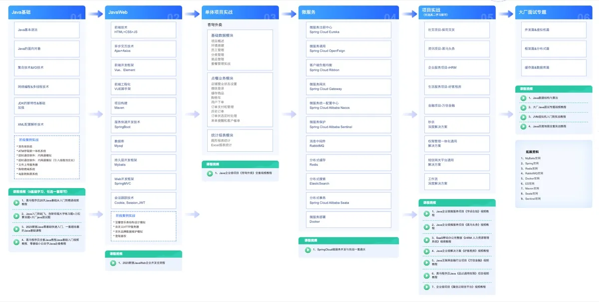
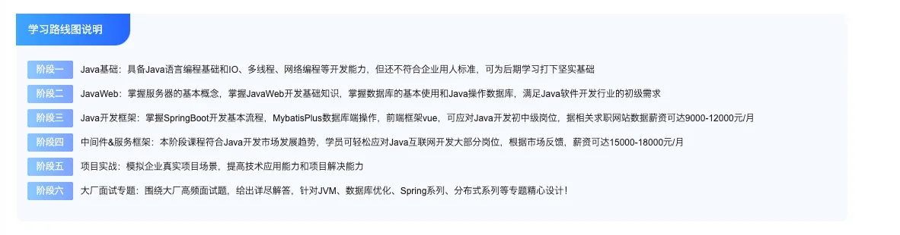
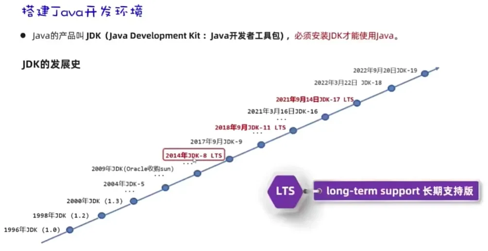
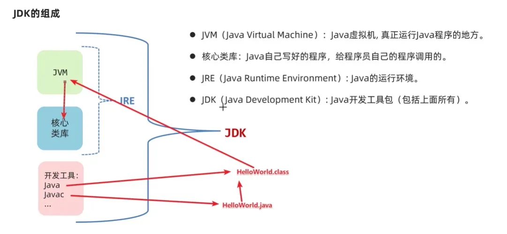
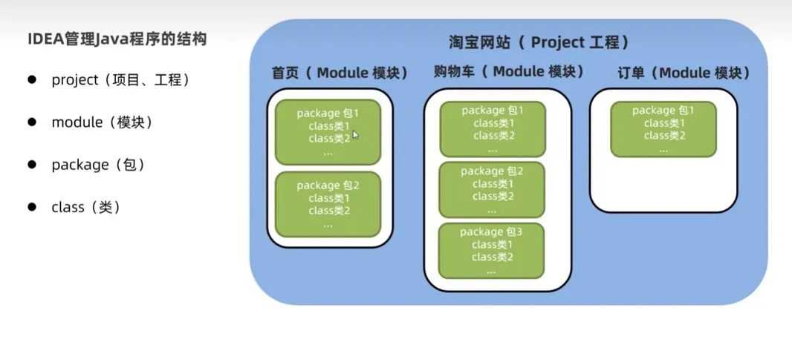

+++
date = '2024-05-04T21:00:00+08:00'
title = 'Java Beginner Tutorial Part 1: JDK, JRE, JVM Explained and IntelliJ IDEA Setup'
description = 'A comprehensive Java beginner guide covering the Java ecosystem (SE/EE/ME), the differences between JDK, JRE, and JVM, IntelliJ IDEA setup, core syntax, OOP fundamentals, and essential APIs.'
toc = true
tags = ['Java', 'JDK', 'JVM', 'IDEA']
categories = ['Java']
keywords = ['Java beginner tutorial', 'JDK vs JRE vs JVM', 'IntelliJ IDEA setup', 'Java basic syntax', 'Java OOP']
+++


## 1. A Brief History of Java

Java was introduced by Sun Microsystems in 1995. Originally named Oak (after an oak tree outside creator James Gosling's office), it was later renamed Java. Sun Microsystems was acquired by Oracle in 2009, and Oracle has maintained the language ever since.

## 2. The Java Learning Roadmap




The Java technology ecosystem is divided into three editions: **Java SE** (Standard Edition), **Java EE** (Enterprise Edition), and **Java ME** (Micro Edition). While Java can handle almost anything, its primary strength lies in building large-scale internet systems and enterprise applications.

## 3. Understanding JDK, JRE, and JVM




These three acronyms confuse many beginners, but the relationship is actually straightforward:

- **JVM (Java Virtual Machine)** — The runtime engine that actually executes Java programs. It interprets compiled bytecode and runs it on your operating system.
- **JRE (Java Runtime Environment)** — Includes the JVM plus the core class libraries that Java programs need at runtime.
- **JDK (Java Development Kit)** — The full development toolkit. It contains the JRE, plus development tools like `javac` (the compiler) and `java` (the launcher).

In short: **JDK = JRE + development tools**, and **JRE = JVM + core libraries**.

## 4. Setting Up IntelliJ IDEA



IntelliJ IDEA is the most popular Java IDE. Here are some essential keyboard shortcuts to boost your productivity:

| Shortcut | Action |
| --- | --- |
| `main`/`psvm`, `sout`, ... | Live templates for common code snippets |
| Ctrl + D | Duplicate the current line |
| Ctrl + Y | Delete the current line (Ctrl + X also works) |
| Ctrl + Alt + L | Reformat code |
| Alt + Shift + Up/Down | Move the current line up or down |
| Ctrl + / , Ctrl + Shift + / | Toggle line/block comments |

## 5. Core Syntax

### 5.1 Literals

Literals are fixed values written directly in your code. They tell the compiler exactly what data you intend to use.


### 5.2 Variables

**Definition:** A variable is a named storage location in memory. Think of it as a labeled box that holds a piece of data.

**Syntax:** `dataType variableName = initialValue;`

**Purpose:** Variables make data management flexible — you can read, update, and pass data around your program easily.

### 5.3 Reserved Keywords

Keywords are words that Java reserves for its own use. You cannot use them as variable names, class names, or method names.

| **abstract**   | **assert**       | **boolean**   | **break**      | **byte**   |
| -------------- | ---------------- | ------------- | -------------- | ---------- |
| **case**       | **catch**        | **char**      | **class**      | **const**  |
| **continue**   | **default**      | **do**        | **double**     | **else**   |
| **enum**       | **extends**      | **final**     | **finally**    | **float**  |
| **for**        | **goto**         | **if**        | **implements** | **import** |
| **instanceof** | **int**          | **interface** | **long**       | **native** |
| **new**        | **package**      | **private**   | **protected**  | **public** |
| **return**     | **strictfp**     | **short**     | **static**     | **super**  |
| **switch**     | **synchronized** | **this**      | **throw**      | **throws** |
| **transient**  | **try**          | **void**      | **volatile**   | **while**  |

### 5.4 Identifiers

Identifiers are names you choose for your classes, variables, methods, and other elements. They must follow these rules: start with a letter, underscore, or dollar sign; they are case-sensitive; and they cannot be a reserved keyword.

### 5.5 Binary Representation

**How data is stored in a computer:** All data is ultimately represented in **binary** (base-2). Integers are converted to binary before being stored in memory.

**Characters:** Each character is mapped to an integer through an encoding table (e.g., ASCII for English, GBK for Chinese, or Unicode/UTF-8 for universal support), and that integer is stored in binary.

**Images:** When you zoom into any image, you see individual pixels. Each pixel is a color, and any color can be described using three values — Red, Green, and Blue (RGB). Each channel uses one byte (values 0-255), which is then stored in binary.

**Audio:** Sound travels as a wave. By sampling the wave at regular intervals and recording the amplitude values, we convert the waveform into a series of numbers that can be stored in binary.


**Video:** A video is simply a sequence of images (frames) combined with an audio track, stored using the same principles.

**Decimal-to-binary conversion** can be done easily using the **8421 method** (BCD coding):


**Octal and hexadecimal** are compact ways to represent binary numbers:


The smallest unit of data in a computer is the **bit** (b). Eight bits make one **byte** (B): 1B = 8b. Larger units build on bytes: KB, MB, GB, TB.


### 5.6 Data Types

Java data types fall into two broad categories: **primitive types** and **reference types**.


**Automatic type promotion** (widening conversion): A variable with a smaller data range can be directly assigned to a variable with a larger range.


### 5.7 Operators

Java provides several categories of operators:

- **Arithmetic operators**

  

  The `+` operator doubles as a string concatenation operator when one operand is a String.

- **Increment and decrement operators**

  `++` increments by 1; `--` decrements by 1.

  

```
1. Standalone usage: No difference whether ++ or -- is placed before or after the variable.
       int a = 10;
       a++;  // a is now 11
       --a;  // a is now 10
       System.out.println(a); // 10

2. Mixed usage: Position matters when combined with other expressions.
       // Postfix: use current value first, then increment
       int a = 10;
       int b = a++; // b = 10, then a becomes 11

       // Prefix: increment first, then use new value
       int x = 10;
       int y = --x; // x becomes 9, then y = 9
```

- **Assignment operators**


- **Relational (comparison) operators**


- **Logical operators**


- **Ternary operator**

  Format: `condition ? valueIfTrue : valueIfFalse;`

### 5.8 Control Flow

Program flow generally falls into three categories: **sequential**, **branching**, and **looping**.

- **Sequential:** Code runs top-to-bottom from the `main` method with no branching or repetition.
- **Branching:** Code selectively executes based on a condition (`true` or `false`). Java offers two branching constructs: `if` and `switch`.

A rule of thumb for choosing between them:
```
- Use if when checking ranges or complex conditions.
- Use switch when comparing against discrete, fixed values.
```

- **Looping:** Code repeats a block until a condition is met. Java provides three loop constructs: `for`, `while`, and `do-while`.

### 5.9 Arrays

An array is a fixed-size container that holds multiple values of the same type. Java supports two initialization styles:

**Static initialization** (standard form): `dataType[] name = new dataType[]{element1, element2, element3};`

```java
int[] ages = new int[]{12, 24, 36};
double[] scores = new double[]{89.9, 99.5, 59.5, 88.0};
```

**Static initialization** (shorthand): `dataType[] name = {element1, element2, element3};`

```java
int[] ages = {12, 24, 36};
double[] scores = {89.9, 99.5, 59.5, 88.0};
```

**Note:** Both `int[] ages` and `int ages[]` are valid, but the first form is preferred by convention.

```java
int[] ages = {12, 24, 36};  // preferred
int ages[] = {12, 24, 36};  // also valid
```

**Dynamic initialization**: `dataType[] name = new dataType[length];`, e.g., `int[] arr = new int[3];`

When using dynamic initialization, elements receive default values based on their type:


**How arrays work in memory**

Java programs run inside the JVM, which loads compiled bytecode into memory.


```java
public class ArrayDemo1 {
    public static void main(String[] args) {
        int a = 10;
        System.out.println(a);

        int[] arr = new int[]{11, 22, 33};
        System.out.println(arr);       // prints the memory address

        System.out.println(arr[1]);    // 22

        arr[0] = 44;
        arr[1] = 55;
        arr[2] = 66;

        System.out.println(arr[0]);    // 44
        System.out.println(arr[1]);    // 55
        System.out.println(arr[2]);    // 66
    }
}
```

The JVM divides memory into five regions: **Method Area**, **Stack**, **Heap**, Native Method Stack, and Registers. The three most important are:

- **Method Area** — Where bytecode is loaded.
- **Stack** — Where methods execute and local variables live.
- **Heap** — Where objects created with `new` are stored and assigned addresses. Arrays live here.


**Key difference between `int a = 10` and `int[] arr = new int[]{11,22,33}`:**

- `a` is a primitive variable on the stack; it directly holds the value `10`.
- `arr` is a reference variable on the stack; it holds the **memory address** of the array object on the heap.

```java
// Primitive variable: stores a value directly
int a = 10;
// Reference variable: stores an address pointing to the heap
int[] arr = new int[]{44, 55, 66};
```

### 5.10 Methods

A method is a reusable block of code that performs a specific task.


Example:

```java
public class MethodDemo1 {
    public static void main(String[] args) {
        int rs = sum(10, 20);
        System.out.println("Sum: " + rs);

        int rs2 = sum(30, 20);
        System.out.println("Sum: " + rs2);
    }

    public static int sum(int a, int b) {
        int c = a + b;
        return c;
    }
}
```

Benefits of methods:

- **Code reuse** — Write once, call many times.
- **Clarity** — Break complex logic into understandable pieces.

**How methods execute in memory**

Methods run on the stack. Each method call creates a new **stack frame**; when the method returns, the frame is popped off. This is a **Last In, First Out (LIFO)** process.


**Java always uses pass-by-value.** What gets passed is a copy of the value stored in the argument variable.

- For **primitive types**, the actual value is copied.
- For **reference types** (String, arrays, objects), the memory address is copied — so both the caller and the method point to the same object.

**Method Overloading**

Overloading means defining multiple methods in the same class with the same name but different parameter lists.

```java
public class MethodOverLoadDemo1 {
    public static void main(String[] args) {
        test();
        test(100);
    }

    public static void test() {
        System.out.println("===test1===");
    }

    public static void test(int a) {
        System.out.println("===test2===" + a);
    }

    void test(double a) { }

    void test(double a, int b) { }

    void test(int b, double a) { }

    int test(int a, int b) {
        return a + b;
    }
}
```

Overloading rules:

- Methods must share the same name but differ in their parameter lists (number, type, or order of parameters).
- Return type and access modifiers do not matter for overloading.
- Parameter names alone do not count as a difference.

## 6. Object-Oriented Programming

Object-Oriented Programming (OOP) means organizing your code around **objects** — bundles of data and the methods that operate on that data.

James Gosling, Java's creator, held the philosophy that **everything is an object**. Each object encapsulates its own data and is responsible for processing it. You can think of an object as a data record, and the **class** as the blueprint that defines what data it can hold.

OOP aligns with how humans naturally think about the world, making programs more intuitive and easier to maintain.

### 6.1 How Objects Work in Memory


Objects follow the same memory model as arrays:

- `Student s1` declares a reference variable on the **stack**.
- `new Student()` allocates an object on the **heap**, containing the student's fields with default values. The system assigns this object a memory address (e.g., `0x4f3f5b24`).
- The address is stored in `s1`, so you can reach the object through `s1`.
- When you write `s1.name = "Alice"`, the JVM follows the address in `s1` to find the object, locates its `name` field, and updates the value.

### 6.2 Classes and Objects — Key Points


A single `.java` file can contain multiple classes, but only one can be `public`, and its name must match the filename:

```java
// The public class Demo1 matches the filename Demo1.java
public class Demo1 {

}

class Student {

}
```

### 6.3 The `this` Keyword

**What is `this`?** It is a reference variable available inside any instance method that points to the **current object** — the one on which the method was called.


**Why use it?** `this` lets you access the current object's fields, especially when a parameter name shadows a field name.

### 6.4 Constructors

**What is a constructor?** A constructor is a special method with no return type whose name matches the class name. It is called automatically when you create an object with `new`.


**Key behavior:**

Creating an object with `new` is the same as invoking a constructor.


Constructors are used to create objects and optionally initialize their fields.

Important notes:

```
1. If you don't write any constructor, Java provides a default no-arg constructor.
2. Once you define a parameterized constructor, the default no-arg constructor is no longer
   provided. It's good practice to explicitly add one yourself.
```

### 6.5 Encapsulation

**What is encapsulation?** It means bundling the data (fields) and the methods that operate on that data into a single class, while controlling access to the internals.

For example, a `Student` class might encapsulate `name`, `chineseScore`, and `mathScore` as fields, along with methods like `getTotalScore()` and `getAverageScore()`.

The design principle can be summarized as: **hide what should be hidden, expose what should be exposed**. Think of a car: the engine and transmission are hidden; the start button and brake pedal are exposed.

**How is encapsulation achieved in code?**

Fields are typically declared `private` (accessible only within the class), and public getter/setter methods are provided for controlled external access.


### 6.6 JavaBeans (Entity Classes)

A JavaBean (entity class) is a class that follows specific conventions:

- All fields are `private`, with public `getXxx()` and `setXxx()` methods for each.
- It must have a public no-arg constructor.


JavaBeans serve purely as data containers. In real applications, data processing logic is handled by separate classes, achieving a clean separation between data and business logic.

### 6.7 Instance Variables vs. Local Variables


### 6.8 Common Java APIs

#### Packages

Before diving into APIs, you need to understand **packages**. Java organizes its classes into packages — similar to folders on a file system.


Package declaration syntax:

```java
// First line of the file
package com.example.model;

public class ClassName {

}
```

Rules for importing classes:

- Classes in the **same package** can reference each other directly.
- Classes in **different packages** require an `import` statement: `import packageName.ClassName;`
- Classes in `java.lang` (like `String`, `Math`, `System`) are auto-imported.
- If two classes in different packages share the same name, you can import one and must use the fully qualified name for the other.

#### String

The `String` class represents an immutable sequence of characters. You can create strings in two ways:

1. **String literal:** `"Hello"`
2. **Constructor:** `new String("Hello")`


```java
// Method 1: String literal
String name = "Hello World";
System.out.println(name);

// Method 2: Using constructors
String rs1 = new String();
System.out.println(rs1); // ""

String rs2 = new String("itheima");
System.out.println(rs2);

char[] chars = {'a', 'b', 'c'};
String rs3 = new String(chars);
System.out.println(rs3);

byte[] bytes = {97, 98, 99};
String rs4 = new String(bytes);
System.out.println(rs4); // "abc"
```

Common String methods:


```java
public class StringDemo2 {
    public static void main(String[] args) {
        String s = "Hello Java";
        // 1. Get string length
        System.out.println(s.length());

        // 2. Get character at a specific index
        char c = s.charAt(1);
        System.out.println(c);

        // 3. Iterate over characters
        for (int i = 0; i < s.length(); i++) {
            char ch = s.charAt(i);
            System.out.println(ch);
        }

        // 4. Convert to char array
        char[] chars = s.toCharArray();
        for (int i = 0; i < chars.length; i++) {
            System.out.println(chars[i]);
        }

        // 5. Compare string content (not reference)
        String s1 = new String("Hello");
        String s2 = new String("Hello");
        System.out.println(s1 == s2);       // false (different objects)
        System.out.println(s1.equals(s2));   // true  (same content)

        // 6. Case-insensitive comparison
        String c1 = "34AeFG";
        String c2 = "34aEfg";
        System.out.println(c1.equals(c2));            // false
        System.out.println(c1.equalsIgnoreCase(c2));   // true

        // 7. Substring (start inclusive, end exclusive)
        String s3 = "Java is one of the best languages";
        String rs = s3.substring(0, 4);
        System.out.println(rs);  // "Java"

        // 8. Substring from index to end
        String rs2 = s3.substring(5);
        System.out.println(rs2);

        // 9. Replace content
        String info = "This movie is terrible, terrible movie!!";
        String rs3 = info.replace("terrible", "**");
        System.out.println(rs3);

        // 10. Check if string contains a substring
        String info2 = "Java is great, I love Java!";
        System.out.println(info2.contains("Java"));   // true
        System.out.println(info2.contains("java"));   // false

        // 11. Check prefix
        String rs4 = "JavaScript";
        System.out.println(rs4.startsWith("Java"));   // true

        // 12. Split string
        String rs5 = "Alice,Bob,Charlie,Dave";
        String[] names = rs5.split(",");
        for (int i = 0; i < names.length; i++) {
            System.out.println(names[i]);
        }
    }
}
```

Two important things to understand about String internals:

- **Strings are immutable.** Once a String object is created, its content cannot be changed.


This might seem contradictory when you reassign a variable, but what actually happens is that a new String object is created — the variable simply points to the new object.

String literals created with `"..."` are stored in the **String Constant Pool** within the heap.


- String literals with the same content share a single object in the pool. However, each `new String(...)` call creates a separate object on the heap.


#### ArrayList

`ArrayList` is the most commonly used collection class. Unlike arrays, an ArrayList can grow and shrink dynamically.

**Why use ArrayList instead of arrays?** Arrays have a fixed length set at creation time. ArrayList adjusts its size automatically as you add or remove elements.


Common ArrayList methods:


```java
public class ArrayListDemo1 {
    public static void main(String[] args) {
        // Create an ArrayList (diamond syntax, JDK 7+)
        ArrayList<String> list = new ArrayList<>();

        list.add("Apple");
        list.add("Apple");
        list.add("Java");
        System.out.println(list);

        // Insert at index
        list.add(1, "MySQL");
        System.out.println(list);

        // Get by index
        String rs = list.get(1);
        System.out.println(rs);

        // Size
        System.out.println(list.size());

        // Remove by index (returns removed element)
        System.out.println(list.remove(1));
        System.out.println(list);

        // Remove by value (returns true/false)
        System.out.println(list.remove("Java"));
        System.out.println(list);

        list.add(1, "html");
        System.out.println(list);

        // Removes first occurrence
        System.out.println(list.remove("Apple"));
        System.out.println(list);

        // Set (replace) at index, returns old value
        System.out.println(list.set(1, "Spring"));
        System.out.println(list);
    }
}
```

### 6.9 The `static` Modifier

The `static` keyword can modify both fields and methods.

#### Static Fields (Class Variables)

Java fields fall into two categories based on whether they have `static`:

- **Class variables** (static) — Belong to the class; only one copy exists in memory. Access via `ClassName.variable`.
- **Instance variables** (non-static) — Belong to each object; every object gets its own copy. Access via `objectName.variable`.


#### Static Methods (Class Methods)

- **Class methods** (`static`) — Loaded with the class, callable via `ClassName.method()`.
- **Instance methods** (non-static) — Require an object to call, because they may access instance variables.


#### Utility Classes

A class where **all methods are static** is called a utility class. Since every method can be called directly via the class name, it acts like a toolkit.


#### Static Blocks

Code blocks are categorized by `static`:

> **Static initializer blocks** run once when the class is first loaded.


> **Instance initializer blocks** run every time a new object is created, before the constructor body.


#### Singleton Design Pattern

The Singleton pattern ensures a class has only one instance throughout the application.


**Eager initialization (thread-safe):**


**Lazy initialization:**


### 6.10 Inheritance

Inheritance is one of the three pillars of OOP (along with encapsulation and polymorphism).


A child-class object is constructed using blueprints from both the parent and the child class.


**Inheritance promotes code reuse.**

#### Access Modifiers

Access modifiers control the visibility of class members (fields, methods, constructors).

Java has four levels: `public`, `protected`, default (no modifier), and `private`.


```java
public class Fu {
    // 1. private: accessible only within this class
    private void privateMethod() {
        System.out.println("==private==");
    }

    // 2. default: this class + same package
    void method() {
        System.out.println("==default==");
    }

    // 3. protected: this class + same package + subclasses in any package
    protected void protectedMethod() {
        System.out.println("==protected==");
    }

    // 4. public: accessible everywhere
    public void publicMethod() {
        System.out.println("==public==");
    }

    public void test() {
        // Within the same class, all access levels work
        privateMethod();
        method();
        protectedMethod();
        publicMethod();
    }
}
```

From a class in the **same package**:

```java
public class Demo {
    public static void main(String[] args) {
        Fu f = new Fu();
        // f.privateMethod();   // compile error
        f.method();             // OK
        f.protectedMethod();    // OK
        f.publicMethod();       // OK
    }
}
```

From a **subclass in a different package**:

```java
public class Zi extends Fu {
    public void test() {
        // privateMethod();  // compile error
        // method();         // compile error
        protectedMethod();   // OK
        publicMethod();      // OK
    }
}
```

From an **unrelated class in a different package**:

```java
public class Demo2 {
    public static void main(String[] args) {
        Fu f = new Fu();
        // f.privateMethod();    // compile error
        // f.method();           // compile error
        // f.protectedMethod();  // compile error
        f.publicMethod();        // OK
    }
}
```

#### Single Inheritance and Object

Java supports **single inheritance** only — a class can extend at most one parent class. However, inheritance can be **multi-level** (A extends B extends C). All classes ultimately inherit from `Object`.

#### Method Overriding

When a subclass needs different behavior from an inherited method, it can **override** that method by defining a new implementation with the same signature.

**Note:** After overriding, method calls follow the nearest-match principle.

```java
public class A {
    public void print1() {
        System.out.println("111");
    }

    public void print2(int a, int b) {
        System.out.println("111111");
    }
}
```

```java
public class B extends A {
    @Override
    public void print1() {
        System.out.println("666");
    }

    @Override
    public void print2(int a, int b) {
        System.out.println("666666");
    }
}
```

Override rules:

1. Use the `@Override` annotation for safety and readability.
2. The child method's access level must be **equal to or broader** than the parent's (`public > protected > default`).
3. The return type must be the same or a more specific subtype.
4. `private` and `static` methods cannot be overridden.

#### Member Access in Subclasses

When accessing fields or methods from a subclass, Java follows the **nearest-match (proximity) principle**: it checks the subclass first, then walks up the hierarchy.

#### Constructor Chaining

- Every subclass constructor **implicitly calls the parent's no-arg constructor** (`super()`) as its first statement.
- You can explicitly call a parent constructor with `super(args)`.

  

```
Accessing members of the current class:
    this.field         // access this class's field
    this.method()      // call this class's method
    this()             // call this class's no-arg constructor
    this(args)         // call this class's parameterized constructor

Accessing members of the parent class:
    super.field        // access parent's field
    super.method()     // call parent's method
    super()            // call parent's no-arg constructor
    super(args)        // call parent's parameterized constructor

Note: this() and super() must be the first statement in a constructor.
```

### 6.11 Polymorphism

Polymorphism means that a single variable can refer to objects of different types at runtime. It manifests as **object polymorphism** and **behavior polymorphism**.

For example, if `Teacher` and `Student` both extend `People`:


Polymorphism makes code **loosely coupled** and easy to extend.

```java
public class Test2 {
    public static void main(String[] args) {
        Teacher t = new Teacher();
        go(t);

        Student s = new Student();
        go(s);
    }

    // Accepts any People subclass
    public static void go(People p) {
        System.out.println("Start ------------------------");
        p.run();
        System.out.println("End   ------------------------");
    }
}
```

You cannot call child-specific methods through a parent-type reference. To do so, you need to **downcast**:

```java
if (p instanceof Student) {
    Student student = (Student) p;
    // Now you can call Student-specific methods
}
```


If you cast to the wrong type, Java throws a `ClassCastException`.

### 6.12 The `final` Keyword

`final` means "unchangeable." It can modify classes, methods, and variables:

- **final class:** Cannot be extended (subclassed).


- **final method:** Cannot be overridden.


- **final variable:** Can only be assigned once.


#### Constants

A field declared `static final` is a **constant** — typically used for configuration values.

```java
public class Constant {
    // Convention: UPPER_SNAKE_CASE
    public static final String SCHOOL_NAME = "test";
}
```

```java
public class FinalDemo2 {
    public static void main(String[] args) {
        System.out.println(Constant.SCHOOL_NAME);
    }
}
```

At compile time, constants are **inlined** (macro-replaced). The compiled bytecode replaces every reference to the constant with its literal value.

### 6.13 Abstract Classes and Methods

The `abstract` keyword marks a class or method as incomplete:

```java
// Abstract class
public abstract class A {
    // Abstract method (no body)
    public abstract void test();
}
```

- You **cannot instantiate** an abstract class.
- A subclass **must override all abstract methods** — unless it is also declared abstract.

```java
public class B extends A {
    @Override
    public void test() {
        // implementation
    }
}
```

```java
// If B doesn't implement test(), B must also be abstract
public abstract class B extends A {

}
```

Abstract classes are useful for:

1. **Extracting common code** into a parent class while still supporting polymorphism.
2. **Defining a contract** when you don't yet know the specific implementation — subclasses will fill in the details later.

### 6.14 Template Method Pattern

The Template Method pattern solves the problem of **duplicate code across subclasses**.

If classes A and B both have a `sing()` method where the beginning and end are identical but the middle differs, you can extract the common parts into an abstract parent class:


```java
public class Test {
    public static void main(String[] args) {
        B b = new B();
        b.sing();
    }
}
```

Implementation steps:

1. Define an abstract class with a **template method** containing the shared code.
2. Define abstract methods for the parts that vary, and call them from the template method.
3. Subclasses extend the abstract class and implement only the abstract methods.

### 6.15 Interfaces

Java provides the `interface` keyword for defining a contract:

```java
public interface InterfaceName {
    // Constants (implicitly public static final)
    // Abstract methods (implicitly public abstract)
}
```


Key points:

- A class **implements** an interface. One class can implement **multiple interfaces** (compensating for Java's single-inheritance limitation).
- The implementing class must override all abstract methods, or it must be declared abstract.

Benefits:

- **Multiple inheritance of behavior** — A class can implement many interfaces.
- **Programming to an interface** — Enables flexible swapping of implementations.


Interfaces can also extend other interfaces, and a single interface can extend multiple interfaces.

### 6.16 Inner Classes

An inner class is a class defined inside another class. Java supports four kinds: member inner class, static inner class, local inner class, and **anonymous inner class**.

Anonymous inner classes are the most commonly used. They create a nameless subclass or interface implementation on the fly:

```java
new ParentClassOrInterface(args) {
    @Override
    // override methods
};
```


Anonymous inner classes shine when a method parameter expects an interface or abstract class — you can pass the implementation inline without creating a separate class file:


### 6.17 Enums

An enum is a special class that represents a fixed set of constants:

```java
public enum Season {
    SPRING, SUMMER, AUTUMN, WINTER;
}
```

Each enum constant is an instance of the enum class, pre-defined at compile time.


Enums are ideal for representing a closed set of values and passing them as type-safe parameters.

### 6.18 Generics

Generics let you parameterize types — declare one or more type variables (like `<E>`) when defining a class, interface, or method.

`ArrayList` is a generic class:


- **Benefit:** Catches type errors at compile time rather than runtime.
- **Essence:** Passes a concrete data type to a type variable.

#### Custom Generic Classes

```java
// T and W are type parameters
public class ClassName<T, W> {

}
```


#### Custom Generic Interfaces

```java
public interface InterfaceName<E> {

}
```

#### Generic Methods

```java
public <T, W> ReturnType methodName(parameters) {

}
```


#### Bounded Type Parameters (Wildcards)

You can restrict which types a generic accepts:

- `<?>` — Any type (unbounded wildcard)
- `<? extends Type>` — Type or any of its subclasses (upper bound)
- `<? super Type>` — Type or any of its superclasses (lower bound)


#### Type Erasure

Generics exist only at **compile time**. After compilation, the bytecode contains no generic type information — this is called **type erasure**.

Generics only support **reference types**, not primitives (use wrapper classes like `Integer` instead of `int`).


### 6.19 Wrapper Classes

Java's philosophy is "everything is an object," but the 8 primitive types are not objects. **Wrapper classes** bridge this gap by wrapping primitives in objects, enabling them to be used with collections and APIs that require objects.


#### Autoboxing and Unboxing (using Integer as an example)

```java
// 1. Constructor (deprecated in newer JDK versions)
Integer a = new Integer(10);

// 2. Static factory method
Integer b = Integer.valueOf(10);

// 3. Autoboxing: primitive -> wrapper automatically
Integer c = 10;

// 4. Unboxing: wrapper -> primitive automatically
int d = c;

// 5. Autoboxing/unboxing with collections
ArrayList<Integer> list = new ArrayList<>();
list.add(100);         // autoboxing: int -> Integer
int e = list.get(0);   // unboxing: Integer -> int
```

#### Type Conversion with Wrapper Classes

- **String to number:** `Integer.parseInt("123")`, `Double.parseDouble("3.14")`
- **Number to String:** `String.valueOf(123)`


### 6.20 Common API Classes

#### 1. Object

`Object` is the root of all Java classes. Every class inherits its methods:

- `clone()` — Creates a copy of the object.
- `equals(Object obj)` — Checks equality (by default, checks reference equality).
- `toString()` — Returns a string representation.

#### 2. Objects (Utility Class)

`Objects` is a utility class with null-safe methods:


The key difference: `Object.equals()` throws a `NullPointerException` if the caller is null, while `Objects.equals()` handles null safely.


#### 3. StringBuilder

`StringBuilder` represents a **mutable** character sequence — ideal for building strings through repeated modification.


**Why is StringBuilder faster than String for concatenation?**


Concatenating a million strings with `+` can take over a minute, while `StringBuilder` finishes in under a second.

The reason: `String` is immutable, so each `+` creates a new object. Even with JDK optimizations, a new `StringBuilder` is created per loop iteration. Using a single `StringBuilder` from the start avoids this overhead.


Internally, `StringBuilder` maintains a `char[]` (or `byte[]` in newer JDK versions). `append()` copies characters into this array, expanding it as needed.


#### 4. StringJoiner

`StringJoiner` (Java 8+) is purpose-built for joining strings with delimiters, prefixes, and suffixes — combining efficiency with clean code.


#### 5. Math

The `Math` class provides static methods for common mathematical operations:

```java
public class MathTest {
    public static void main(String[] args) {
        // Absolute value
        System.out.println(Math.abs(-12));    // 12
        System.out.println(Math.abs(-3.14));  // 3.14

        // Ceiling (round up)
        System.out.println(Math.ceil(4.0000001)); // 5.0
        System.out.println(Math.ceil(4.0));        // 4.0

        // Floor (round down)
        System.out.println(Math.floor(4.999999));  // 4.0

        // Round (half-up)
        System.out.println(Math.round(3.4999));    // 3
        System.out.println(Math.round(3.50001));   // 4

        // Max and min
        System.out.println(Math.max(10, 20)); // 20
        System.out.println(Math.min(10, 20)); // 10

        // Power
        System.out.println(Math.pow(2, 3));   // 8.0

        // Random number in [0.0, 1.0)
        System.out.println(Math.random());
    }
}
```

#### 6. System

The `System` class provides access to system-level resources:

```java
public class SystemTest {
    public static void main(String[] args) {
        // 1. Exit the JVM (don't use in production)
        // System.exit(0);

        // 2. Current time in milliseconds since Unix epoch (1970-01-01 00:00:00 UTC)
        long time = System.currentTimeMillis();
        System.out.println(time);

        for (int i = 0; i < 1000000; i++) {
            System.out.println("Output: " + i);
        }

        long time2 = System.currentTimeMillis();
        System.out.println((time2 - time) / 1000.0 + "s");
    }
}
```

#### 7. Runtime

The `Runtime` class provides information about the JVM environment and can execute external programs.


#### 8. BigDecimal


`BigDecimal` solves **floating-point precision loss**. It supports the four arithmetic operations without losing precision and allows you to specify decimal places and rounding modes.

```java
public class Test2 {
    public static void main(String[] args) {
        double a = 0.1;
        double b = 0.2;

        // Best practice: use BigDecimal.valueOf()
        BigDecimal a1 = BigDecimal.valueOf(a);
        BigDecimal b1 = BigDecimal.valueOf(b);

        // Addition
        BigDecimal c1 = a1.add(b1);
        System.out.println(c1); // 0.3

        // Subtraction
        BigDecimal c2 = a1.subtract(b1);
        System.out.println(c2); // -0.1

        // Multiplication
        BigDecimal c3 = a1.multiply(b1);
        System.out.println(c3); // 0.02

        // Division
        BigDecimal c4 = a1.divide(b1);
        System.out.println(c4); // 0.5

        // Division with scale and rounding
        BigDecimal d1 = BigDecimal.valueOf(0.1);
        BigDecimal d2 = BigDecimal.valueOf(0.3);
        BigDecimal d3 = d1.divide(d2, 2, RoundingMode.HALF_UP); // 0.33
        System.out.println(d3);

        // Convert back to double
        double db1 = d3.doubleValue();
        System.out.println(db1);
    }
}
```

### 6.21 Date and Time

#### 1. Date (Legacy)

The `Date` class represents a point in time, stored internally as milliseconds since the **Unix epoch** (January 1, 1970, 00:00:00 UTC).


#### 2. SimpleDateFormat (Legacy)

- **Formatting:** Converting a `Date` object to a formatted string.
- **Parsing:** Converting a formatted string back to a `Date` object.


Common date/time pattern letters:

```
Letter  Meaning
yyyy    Year
MM      Month
dd      Day
HH      Hour (24-hour)
mm      Minute
ss      Second
SSS     Millisecond

Examples:
"2022-12-12 12:12:12" -> "yyyy-MM-dd HH:mm:ss"
```


#### 3. Calendar (Legacy)

`Calendar` offers richer date manipulation than `Date`, such as adding days, extracting individual fields, etc.


#### 4. JDK 8+ Date/Time API

Why introduce new date classes when `Date` already existed?


The JDK 8 date/time API provides much finer-grained classes: `LocalDate` (date only), `LocalTime` (time only), `LocalDateTime` (both), plus classes for time zones, durations, and more. All are **immutable** and **thread-safe**.


- **LocalDate**

  

- **LocalTime**

- **LocalDateTime**

  

#### 5. Time Zones (ZonedDateTime)

Different regions use different time zones based on their longitude.


#### 6. Instant

`Instant` represents a precise moment on the timeline, composed of seconds since epoch plus nanoseconds.


Use cases: measuring code execution time, recording timestamps for user actions.


#### 7. DateTimeFormatter


```java
public class Test6_DateTimeFormatter {
    public static void main(String[] args) {
        // Create a formatter
        DateTimeFormatter formatter = DateTimeFormatter.ofPattern("yyyy-MM-dd HH:mm:ss");

        // Format current time
        LocalDateTime now = LocalDateTime.now();
        String rs = formatter.format(now);
        System.out.println(rs);

        // Alternative: call format on the datetime object
        String rs2 = now.format(formatter);
        System.out.println(rs2);

        // Parse a date string
        String dateStr = "2029-12-12 12:12:11";
        LocalDateTime ldt = LocalDateTime.parse(dateStr, formatter);
        System.out.println(ldt);
    }
}
```

#### 8. Period


`Period` calculates the difference between two `LocalDate` objects in years, months, and days.


#### 9. Duration

`Duration` calculates the difference between two time objects in days, hours, minutes, seconds, and nanoseconds. It works with `LocalTime`, `LocalDateTime`, and `Instant`.


---

[Next: Java Learning Notes Part 2](../2024-05-13-learn-java2)

## References

- [Java Developer Learning Roadmap](https://yun.itheima.com/subject/javamap/index.html)
- [Java Basics Video Tutorial (Bilibili)](https://www.bilibili.com/video/BV1Cv411372m/?spm_id_from=333.999.0.0)
- [Java Basics Tutorial (YouTube)](https://www.youtube.com/watch?v=VqfGCmjQt10)
- [JavaWeb Development Tutorial (Bilibili)](https://www.bilibili.com/video/BV1m84y1w7Tb/?vd_source=4d819443886ce5506c7c6b65b4a7ad93)
