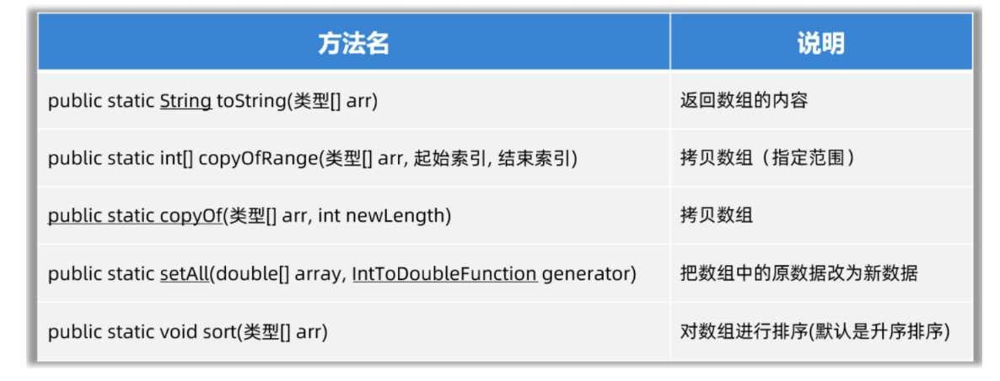
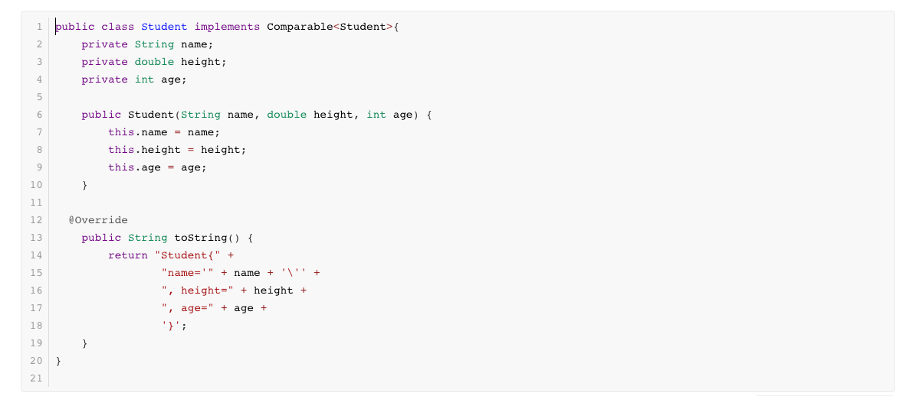
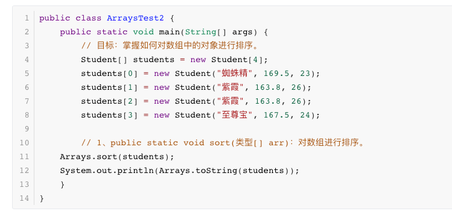
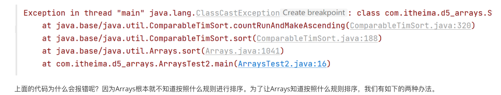
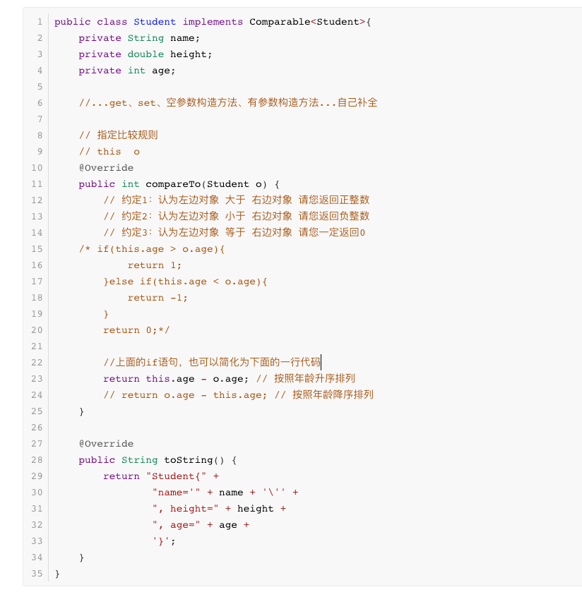
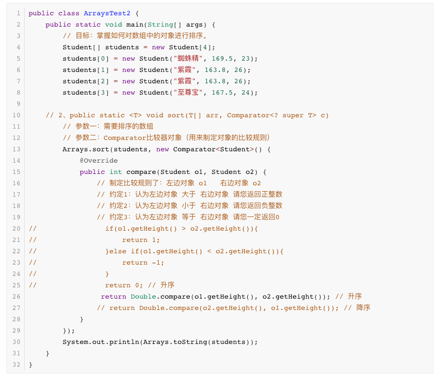

[接上一篇《Java学习笔记（一）》](../2024-05-05-learn-java)


## 七、 集合技术 & I/O 技术

### 1. Arrays 类

Arrays是干什么用的，Arrays是操作数组的工具类，它可以很方便的对数组中的元素进行遍历、拷贝、排序等操作。



```java
/**
 * 目标：掌握Arrays类的常用方法。
 */
public class ArraysTest1 {
    public static void main(String[] args) {
        // 1、public static String toString(类型[] arr): 返回数组的内容
        int[] arr = {10, 20, 30, 40, 50, 60};
        System.out.println(Arrays.toString(arr));

        // 2、public static 类型[] copyOfRange(类型[] arr, 起始索引, 结束索引) ：拷贝数组（指定范围，包前不包后）
        int[] arr2 = Arrays.copyOfRange(arr, 1, 4);
        System.out.println(Arrays.toString(arr2));

        // 3、public static copyOf(类型[] arr, int newLength)：拷贝数组，可以指定新数组的长度。
        int[] arr3 = Arrays.copyOf(arr, 10);
        System.out.println(Arrays.toString(arr3));

        // 4、public static setAll(double[] array, IntToDoubleFunction generator)：把数组中的原数据改为新数据又存进去。
        double[] prices = {99.8, 128, 100};
        //                  0     1    2
        // 把所有的价格都打八折，然后又存进去。
        Arrays.setAll(prices, new IntToDoubleFunction() {
            @Override
            public double applyAsDouble(int value) {
                // value = 0  1  2
                return prices[value] * 0.8;
            }
        });
        System.out.println(Arrays.toString(prices));

        // 5、public static void sort(类型[] arr)：对数组进行排序(默认是升序排序)
        Arrays.sort(prices);
        System.out.println(Arrays.toString(prices));
    }
}
```

如果数组中存储的元素类型是自定义的对象，如何排序呢?

准备一个 Student 类



写一个测试类





**排序方式1：**让Student类实现Comparable接口，同时重写compareTo方法。Arrays的sort方法底层会根据compareTo方法的返回值是正数、负数、还是0来确定谁大、谁小、谁相等。代码如下：



**排序方式2：**在调用`Arrays.sort(数组,Comparator比较器);`时，除了传递数组之外，传递一个Comparator比较器对象。Arrays的sort方法底层会根据Comparator比较器对象的compare方法方法的返回值是正数、负数、还是0来确定谁大、谁小、谁相等。代码如下



### 2. Lambda 表达式

lambda 表达式作用：用于简化匿名内部类代码的书写。


## 八、 网络编程 & 多线程技术


## 九、 JDK特性 & 基础加强


## 十、JAVA WEB


---
## *参考*

[Java程序员学习路线图](https://yun.itheima.com/subject/javamap/index.html)

[Java入门基础视频教程(B站)](https://www.bilibili.com/video/BV1Cv411372m/?spm_id_from=333.999.0.0) 

[Java基础教程(YouTube)](https://www.youtube.com/watch?v=VqfGCmjQt10)

[JavaWeb开发教程(B站)](https://www.bilibili.com/video/BV1m84y1w7Tb/?vd_source=4d819443886ce5506c7c6b65b4a7ad93)