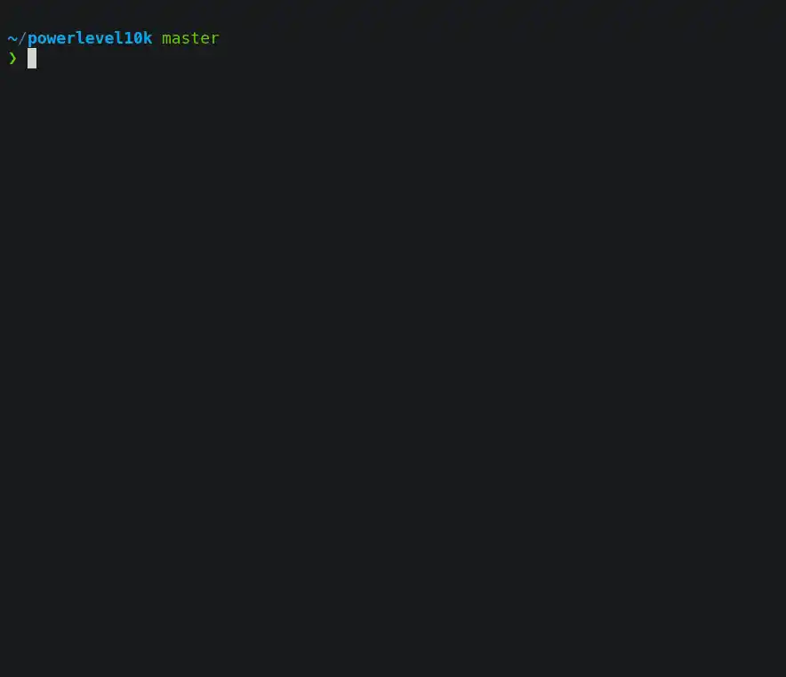

+++
title = 'Oh My Zsh Setup Guide: Build a Productive Terminal Environment'
date = '2015-06-17'
draft = false
description = 'Complete Oh My Zsh installation and configuration guide covering Zsh setup, Powerlevel10k theme, zsh-autosuggestions, zsh-syntax-highlighting plugins, custom aliases, and performance tuning for macOS and Linux.'
tags = ['zsh', 'oh-my-zsh', 'shell', 'linux', 'macos', 'powerlevel10k']
categories = ['Linux']
toc = true
keywords = ['Oh My Zsh', 'Zsh configuration', 'Powerlevel10k', 'terminal customization', 'shell setup', 'zsh-autosuggestions']
+++

If you spend any time in a terminal on Linux or macOS, you owe it to yourself to move beyond the default Bash experience. **Zsh** paired with **Oh My Zsh** transforms your shell into something far more capable and enjoyable to use. This guide walks you through the entire setup — from installing Zsh to fine-tuning performance — so you can get more done on the [command line](/posts/linux/2020-03-19-linux-mac-commands/) with less effort.

<!--more-->

## Why Zsh + Oh My Zsh?

Here is how Zsh with Oh My Zsh stacks up against a stock Bash setup:

| Feature | Bash | Zsh + Oh My Zsh |
|---------|------|-----------------|
| Tab completion | Basic | Context-aware, completes flags and arguments |
| Themes | None | 150+ built-in themes |
| Plugins | Manual setup | 300+ ready to use |
| Syntax highlighting | None | Real-time highlighting with error feedback |
| History search | Basic | Fuzzy search across sessions |

> **Oh My Zsh** is an open-source, community-driven framework for managing your Zsh configuration. As the project puts it: "It won't make you a 10x developer... but you might feel like one."

## Step 1: Install Zsh

### macOS

macOS Catalina and later ship with Zsh as the default shell. Verify with:

```bash
echo $SHELL
# Should output /bin/zsh
```

If you are still on Bash, install Zsh via Homebrew:

```bash
brew install zsh
chsh -s $(which zsh)
```

### Ubuntu / Debian

```bash
sudo apt update
sudo apt install zsh -y

# Set Zsh as default shell
chsh -s $(which zsh)
```

### CentOS / RHEL

```bash
sudo yum install zsh -y
# Or with dnf
sudo dnf install zsh -y

chsh -s $(which zsh)
```

> **Log out and back in** for the shell change to take effect.

## Step 2: Install Oh My Zsh

Oh My Zsh provides a one-liner installer:

```bash
# Using curl (recommended)
sh -c "$(curl -fsSL https://raw.githubusercontent.com/ohmyzsh/ohmyzsh/master/tools/install.sh)"

# Or using wget
sh -c "$(wget -O- https://raw.githubusercontent.com/ohmyzsh/ohmyzsh/master/tools/install.sh)"
```

If you have trouble reaching GitHub, try the mirror:

```bash
sh -c "$(curl -fsSL https://install.ohmyz.sh/)"
```

After installation you will see the Oh My Zsh welcome screen. Your existing `.zshrc` is automatically backed up as `.zshrc.pre-oh-my-zsh`.

## Step 3: Pick a Theme

Oh My Zsh ships with over 150 themes. The default is `robbyrussell`. To switch, edit your config:

```bash
vi ~/.zshrc
```

Find the `ZSH_THEME` line and change it:

```bash
ZSH_THEME="agnoster"  # Classic theme, requires a Powerline font
```

### Recommended: Powerlevel10k

[Powerlevel10k](https://github.com/romkatv/powerlevel10k) is the most popular Zsh theme today, known for **instant rendering** and **deep customization**.


#### Install Powerlevel10k

```bash
git clone --depth=1 https://github.com/romkatv/powerlevel10k.git \
  ${ZSH_CUSTOM:-$HOME/.oh-my-zsh/custom}/themes/powerlevel10k
```

Update `~/.zshrc`:

```bash
ZSH_THEME="powerlevel10k/powerlevel10k"
```

Reload your config:

```bash
source ~/.zshrc
```

The first time you load it, a configuration wizard will launch automatically. Follow the prompts to choose your preferred prompt style:



To re-run the wizard later:

```bash
p10k configure
```

#### Powerlevel10k Style Preview


#### Install the Recommended Font

Powerlevel10k needs a Nerd Font to render icons correctly. **MesloLGS NF** is the recommended choice:

- **macOS**: `brew tap homebrew/cask-fonts && brew install font-meslo-lg-nerd-font`
- **Manual download**: [MesloLGS NF font](https://github.com/romkatv/powerlevel10k#meslo-nerd-font-patched-for-powerlevel10k)

After installing the font, set your terminal emulator to use `MesloLGS NF`.

## Step 4: Install Essential Plugins

The plugin ecosystem is where Oh My Zsh really shines. Here are the must-haves:

### 1. zsh-autosuggestions

Suggests commands as you type based on your history. Press `→` to accept a suggestion.

```bash
git clone https://github.com/zsh-users/zsh-autosuggestions \
  ${ZSH_CUSTOM:-~/.oh-my-zsh/custom}/plugins/zsh-autosuggestions
```

### 2. zsh-syntax-highlighting

Highlights valid commands in green and invalid ones in red as you type — catching mistakes before you hit Enter.

```bash
git clone https://github.com/zsh-users/zsh-syntax-highlighting \
  ${ZSH_CUSTOM:-~/.oh-my-zsh/custom}/plugins/zsh-syntax-highlighting
```

### 3. Enable the Plugins

Edit `~/.zshrc` and update the `plugins` array:

```bash
plugins=(
  git                      # Git aliases and completions
  zsh-autosuggestions      # History-based suggestions
  zsh-syntax-highlighting  # Real-time syntax highlighting
  z                        # Frecency-based directory jumping
  extract                  # Universal archive extraction
  sudo                     # Press ESC twice to prepend sudo
)
```

Apply the changes:

```bash
source ~/.zshrc
```

### More Built-in Plugins Worth Enabling

| Plugin | What It Does |
|--------|-------------|
| `git` | Git aliases like `gst` for `git status` |
| `z` | Jump to frequently used directories, e.g. `z project` |
| `extract` | Extract tar, zip, rar, 7z, and more with one command |
| `sudo` | Double-tap ESC to add `sudo` to the current command |
| `docker` | Docker command completions |
| `kubectl` | Kubernetes command completions |
| `macos` | macOS utilities like `ofd` to open Finder |

## Step 5: Set Up Custom Aliases

Shell aliases save keystrokes on commands you run dozens of times a day. Create a separate file to keep things organized:

```bash
vi ~/.zshrc.local
```

Add your aliases:

```bash
# Git shortcuts
alias gs='git status'
alias ga='git add'
alias gc='git commit -m'
alias gp='git push'
alias gl='git pull'
alias gd='git diff'
alias gco='git checkout'
alias gb='git branch'

# Directory navigation
alias ..='cd ..'
alias ...='cd ../..'
alias ll='ls -alh'
alias la='ls -A'

# Quick directories
alias proj='cd ~/Projects'
alias desk='cd ~/Desktop'

# System
alias cls='clear'
alias h='history'
alias grep='grep --color=auto'

# Network
alias myip='curl -s ifconfig.me'
alias ports='netstat -tulanp'
```

Then source it from `~/.zshrc` by adding this line at the end:

```bash
# Load local overrides
[[ -f ~/.zshrc.local ]] && source ~/.zshrc.local
```

Apply everything:

```bash
source ~/.zshrc
```

## Step 6: Optimize Startup Performance

If your terminal feels sluggish on launch, try these fixes:

### 1. Trim Your Plugin List

Every plugin adds to startup time. Only enable what you actually use.

### 2. Enable Powerlevel10k Instant Prompt

Add this at the **very top** of `~/.zshrc`, before anything else:

```bash
# Enable Powerlevel10k instant prompt
if [[ -r "${XDG_CACHE_HOME:-$HOME/.cache}/p10k-instant-prompt-${(%):-%n}.zsh" ]]; then
  source "${XDG_CACHE_HOME:-$HOME/.cache}/p10k-instant-prompt-${(%):-%n}.zsh"
fi
```

### 3. Measure Startup Time

```bash
# Quick benchmark
time zsh -i -c exit

# Detailed profiling with zprof
zmodload zsh/zprof
# Add `zprof` at the end of .zshrc, then open a new shell
```

## FAQ

### Theme icons show as squares or garbled characters

Install a Nerd Font and select it in your terminal preferences. MesloLGS NF and Hack Nerd Font both work well.

### How do I update Oh My Zsh?

```bash
omz update
# Or the legacy command
upgrade_oh_my_zsh
```

### How do I uninstall Oh My Zsh?

```bash
uninstall_oh_my_zsh
```

### I broke my .zshrc — how do I recover?

Restore the backup that Oh My Zsh created during installation:

```bash
cp ~/.zshrc.pre-oh-my-zsh ~/.zshrc
source ~/.zshrc
```

## Wrapping Up

With this setup you now have a terminal that is both powerful and pleasant to use:

1. **Zsh** as a modern shell foundation
2. **Oh My Zsh** for effortless configuration management
3. **Powerlevel10k** for a fast, beautiful prompt
4. **Autosuggestions + syntax highlighting** for smarter typing
5. **Custom aliases** to speed up your daily workflow

Your terminal is one of the most important tools you use every day — investing time in getting it right pays off quickly. If you are also looking for the right terminal emulator, check out our [2025 terminal tools roundup](/posts/macos/2025-01-22-terminal-tools-guide/).

## Further Reading

- [Linux/macOS Command Cheat Sheet](/posts/linux/2020-03-19-linux-mac-commands/) — Essential commands for daily use
- [Shell Script Special Variables Explained](/posts/linux/2019-05-13-linux-shell-vars/) — Must-know variables for shell scripting
- [2025 Terminal Tools Compared: 23 Options Reviewed](/posts/macos/2025-01-22-terminal-tools-guide/) — Find the right terminal emulator

## References

- [Oh My Zsh on GitHub](https://github.com/ohmyzsh/ohmyzsh)
- [Powerlevel10k on GitHub](https://github.com/romkatv/powerlevel10k)
- [zsh-autosuggestions](https://github.com/zsh-users/zsh-autosuggestions)
- [zsh-syntax-highlighting](https://github.com/zsh-users/zsh-syntax-highlighting)
