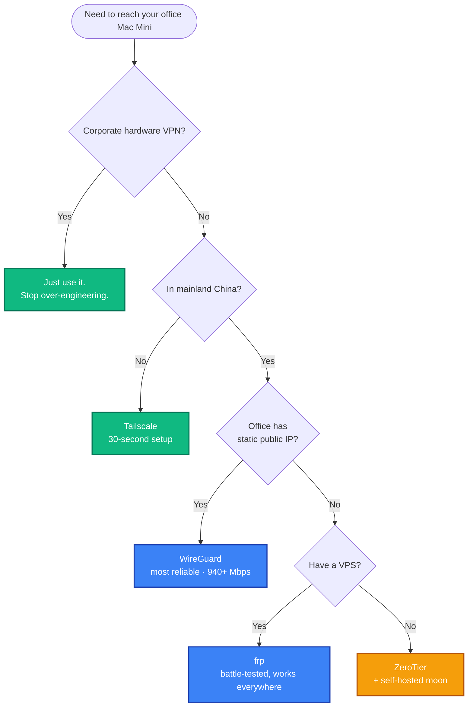

+++
date = '2026-04-11T10:00:00+08:00'
draft = false
title = 'Turn Your Office Mac Mini into a Personal VPN: 5 Approaches Compared'
description = 'Five practical ways to remotely access your office Mac Mini from anywhere — Tailscale, WireGuard, ZeroTier, Cloudflare Tunnel, and frp. Full setup guides, real-world gotchas, and an honest comparison for developers in China.'
toc = true
tags = ['VPN', 'WireGuard', 'Tailscale', 'Networking', 'macOS', 'Remote Access']
keywords = ['Mac Mini VPN', 'remote access Mac', 'Tailscale setup', 'WireGuard macOS', 'office VPN', 'NAT traversal', 'work from home VPN']

[[params.faqItems]]
question = "Can Tailscale work in China without a separate VPN?"
answer = "Not reliably. Tailscale's control plane (login.tailscale.com) is blocked in mainland China. The data plane may work through DERP relays, but initial authentication and key exchange require access to Tailscale's coordination servers. You need an existing VPN or proxy to complete the initial setup, and reconnections after network changes may fail."

[[params.faqItems]]
question = "Which remote access tool is best for a Mac Mini in a Chinese office?"
answer = "If your office has a static public IP, WireGuard is the most reliable choice — it's a kernel-level protocol with no dependency on third-party control planes. If you don't have a public IP, frp with a VPS in your region gives you the most control. Hardware VPN appliances remain the most hassle-free option if your company already has one."

[[params.faqItems]]
question = "What is the performance difference between WireGuard and OpenVPN?"
answer = "WireGuard achieves 940-960 Mbps on a 1 Gbps connection with 8-15% CPU usage, while OpenVPN manages 480-620 Mbps with 45-60% CPU usage. WireGuard's latency averages around 40ms compared to OpenVPN's 113ms in TCP mode. WireGuard's entire codebase is roughly 4,000 lines versus OpenVPN's 100,000+."
+++


## 1. The Problem: Your Mac Mini Is Stranded Behind a Firewall

You have a Mac Mini sitting in the office, always on, always connected. You want to reach it from home — SSH into it, use it as a proxy, or route your traffic through the office network. The problem: it's behind a corporate NAT firewall, has no public IP of its own, and IT isn't going to punch holes in the firewall for your personal convenience.

I ran into this exact situation last week. What followed was a journey through five different remote access tools, each with its own trade-offs around ease of setup, reliability, and whether it actually works from mainland China. This article documents everything I learned, including the gotchas that no README will tell you.

---

## 2. The Landscape: 5 Tools at a Glance

Before diving in, here's the quick comparison:


| Tool | GitHub Stars | Needs Public IP | Works in China | Setup Difficulty |
|------|-------------|----------------|----------------|-----------------|
| **Tailscale** | 30,400+ ([source](https://github.com/tailscale/tailscale), Apr 2026) | No | Unreliable | Very Easy |
| **WireGuard** | Kernel-level, 4,100+ (wireguard-go) ([source](https://github.com/WireGuard/wireguard-go)) | Yes | Yes | Medium |
| **ZeroTier** | 16,600+ ([source](https://github.com/zerotier/ZeroTierOne), Apr 2026) | No | Partial | Easy |
| **Cloudflare Tunnel** | 13,700+ ([source](https://github.com/cloudflare/cloudflared), Apr 2026) | No | Unreliable | Medium |
| **frp** | 105,700+ ([source](https://github.com/fatedier/frp), Apr 2026) | Yes (relay server) | Yes | Medium |

> **What is NAT traversal?** When your Mac Mini sits behind a router, it has a private IP (like `192.168.x.x`) that the outside world can't reach. NAT traversal is the set of techniques these tools use to establish connections despite this barrier — either by punching through the NAT (Tailscale, ZeroTier) or by relaying through a public server (frp, Cloudflare Tunnel, WireGuard).

---

## 3. Approach 1: Tailscale — 30 Seconds to Connect (When It Works)

> **Tailscale** is a mesh VPN built on WireGuard that handles all the key exchange, NAT traversal, and peer discovery automatically. You install it on both machines, log in with the same account, and they find each other. It has 30,400+ GitHub stars and 5,000+ paying teams ([source](https://tailscale.com/blog/5000-customers)).

### 3.1 Installation on macOS (Homebrew)

```bash
# Install
brew install tailscale

# Start the daemon (must run as root for system-level service)
sudo brew services start tailscale

# Authenticate
sudo tailscale up
```

The last command prints a URL. Open it in your browser, log in, and the machine joins your Tailscale network.

### 3.2 Common Gotcha: "failed to connect to local Tailscale service"

This is the most common issue on macOS with the Homebrew installation. The `brew services start tailscale` command runs the daemon under your user account, but the Tailscale CLI expects it to run as root.

**Fix**: Use `sudo brew services start tailscale` instead of `brew services start tailscale`. This registers the service as a system-level daemon under root.

Another common cause: if you previously installed the Mac App Store version of Tailscale, it leaves a wrapper script at `/usr/local/bin/tailscale` that points to the now-deleted app:

```bash
# Check if the old wrapper exists
cat /usr/local/bin/tailscale
# If it shows: /Applications/Tailscale.app/Contents/MacOS/tailscale

# Remove it
sudo rm /usr/local/bin/tailscale

# Verify the Homebrew version takes over
which tailscale
# Should show: /opt/homebrew/bin/tailscale
```

### 3.3 Using Your Mac Mini as an Exit Node

Once both machines are connected, you can turn the office Mac Mini into a full VPN exit node — all your home traffic routes through the office network:

```bash
# On the office Mac Mini
sudo tailscale up --advertise-exit-node

# Then go to https://login.tailscale.com/admin/machines
# Find the Mac Mini → Edit route settings → Enable "Use as exit node"

# On your home machine
sudo tailscale up --exit-node=<office-mac-tailscale-ip>

# To stop routing through the office
sudo tailscale up --exit-node=
```

### 3.4 The China Problem

Here's where the story takes a turn. **Tailscale's control plane (`login.tailscale.com`) is blocked in mainland China.** This means:

- Initial authentication requires a VPN or proxy to reach Tailscale's servers
- After connecting, data flows through DERP relay servers (the nearest one might be Hong Kong or Tokyo)
- If your existing VPN drops, Tailscale can't re-authenticate, and the connection dies

I verified this firsthand: after disconnecting my corporate VPN, the Tailscale connection immediately went offline. The `tailscale netcheck` output showed all DERP relays were reachable, but the control plane was not. The data path works; the auth path doesn't.

**Verdict**: Tailscale is the best experience when it works. If you're outside China, stop reading and just use Tailscale. If you're in China, keep reading.

---

## 4. Approach 2: WireGuard — Raw Performance, Full Control

> **WireGuard** is a kernel-level VPN protocol that achieves 940-960 Mbps throughput on a 1 Gbps connection with only 8-15% CPU usage. For comparison, OpenVPN manages 480-620 Mbps with 45-60% CPU usage ([source](https://cyberinsider.com/vpn/wireguard/wireguard-vs-openvpn/)). Its entire codebase is roughly 4,000 lines. It has been in the Linux kernel since version 5.6 (March 2020).

WireGuard is what Tailscale is built on, but without the automatic peer discovery. You configure everything manually — which means no dependency on any third-party service.

### 4.1 Requirements

- **Your office must have a static public IP** (or at least a predictable one)
- **UDP port 51820** must be forwarded from your office router to the Mac Mini's internal IP

### 4.2 Server Setup (Office Mac Mini)

```bash
# Install
brew install wireguard-tools

# Create config directory
sudo mkdir -p /opt/homebrew/etc/wireguard

# Generate server key pair
wg genkey | tee /opt/homebrew/etc/wireguard/server_private.key | \
  wg pubkey > /opt/homebrew/etc/wireguard/server_public.key

# View the keys (you'll need them for config)
cat /opt/homebrew/etc/wireguard/server_private.key
cat /opt/homebrew/etc/wireguard/server_public.key
```

Create the server config at `/opt/homebrew/etc/wireguard/wg0.conf`:

```ini
[Interface]
PrivateKey = <contents of server_private.key>
Address = 10.0.0.1/24
ListenPort = 51820

[Peer]
PublicKey = <client's public key — generated in the next step>
AllowedIPs = 10.0.0.2/32
```

### 4.3 Client Setup (Home Machine)

```bash
brew install wireguard-tools
sudo mkdir -p /opt/homebrew/etc/wireguard

# Generate client key pair
wg genkey | tee /opt/homebrew/etc/wireguard/client_private.key | \
  wg pubkey > /opt/homebrew/etc/wireguard/client_public.key
```

Create the client config at `/opt/homebrew/etc/wireguard/wg0.conf`:

```ini
[Interface]
PrivateKey = <contents of client_private.key>
Address = 10.0.0.2/24

[Peer]
PublicKey = <server's public key>
Endpoint = <office-public-ip>:51820
AllowedIPs = 0.0.0.0/0
PersistentKeepalive = 25
```

The `AllowedIPs = 0.0.0.0/0` routes **all traffic** through the office. Change it to `10.0.0.0/24` if you only want to reach the office network without routing all internet traffic.

### 4.4 Connect

```bash
# On the server (office)
sudo wg-quick up wg0

# On the client (home)
sudo wg-quick up wg0

# Verify
sudo wg show
ping 10.0.0.1
```

### 4.5 Port Forwarding on the Office Router

This is the step most tutorials gloss over. You need to log into your office router (typically `192.168.1.1` or `192.168.0.1`) and create a port forwarding rule:

- **External port**: UDP 51820
- **Internal IP**: Your Mac Mini's LAN IP (e.g., `192.168.1.100`)
- **Internal port**: UDP 51820

**Verdict**: WireGuard is the most reliable option if your office has a static public IP. No third-party dependencies, no control plane that can be blocked, kernel-level performance. The trade-off is manual configuration and the port forwarding requirement.

---

## 5. Approach 3: ZeroTier — Tailscale's Alternative with Better China Support

> **ZeroTier** is a peer-to-peer virtual network platform with 16,600+ GitHub stars ([source](https://github.com/zerotier/ZeroTierOne)). It creates a virtual Ethernet network that your devices join, similar to Tailscale but with its own protocol instead of WireGuard.

### 5.1 Why ZeroTier Over Tailscale in China

ZeroTier's control plane has historically been more accessible from China than Tailscale's. It also supports self-hosted controllers (called "moons") that you can deploy on a server within China, eliminating the dependency on ZeroTier's public infrastructure entirely.

### 5.2 Quick Setup

```bash
# Install on both machines
brew install zerotier-one

# Start the service
sudo brew services start zerotier-one

# Create a network at https://my.zerotier.com (free for up to 25 nodes)
# Then join the same network from both machines
sudo zerotier-cli join <network-id>

# Approve both devices in the ZeroTier web console
```

### 5.3 Self-Hosted Moon (For China Reliability)

If ZeroTier's public roots are unreliable from your location, you can set up a "moon" — a custom root server on a VPS you control:

```bash
# On your VPS
zerotier-idtool initmoon identity.public > moon.json
# Edit moon.json to add your VPS's public IP
zerotier-idtool genmoon moon.json
# Distribute the generated .moon file to your devices
```

**Verdict**: A solid middle ground between Tailscale's ease and WireGuard's independence. The self-hosted moon option makes it viable in China.

---

## 6. Approach 4: Cloudflare Tunnel — No Ports, No Public IP

> **Cloudflare Tunnel** (formerly Argo Tunnel) uses Cloudflare's global network as a relay. The `cloudflared` daemon has 13,700+ GitHub stars ([source](https://github.com/cloudflare/cloudflared)). It requires no public IP and no open ports — your machine initiates an outbound connection to Cloudflare.

I covered Cloudflare Tunnel in depth in a [previous article](/posts/ai/2026-03-28-cloudflare-tunnel-guide/), including architecture diagrams and full setup steps. The short version for remote access:

```bash
brew install cloudflare/cloudflare/cloudflared
cloudflared tunnel login
cloudflared tunnel create mac-mini
cloudflared tunnel route dns mac-mini your-subdomain.yourdomain.com
```

**The China catch**: Like Tailscale, Cloudflare's infrastructure can be unreliable from mainland China. The tunnels use Cloudflare's edge network, which may be slow or intermittently blocked.

**Verdict**: Excellent if you have a domain on Cloudflare and are outside China. For the China use case, not recommended as a primary solution.

---

## 7. Approach 5: frp — The Self-Hosted Swiss Army Knife

> **frp** (Fast Reverse Proxy) is a self-hosted tunneling tool with a staggering 105,700+ GitHub stars ([source](https://github.com/fatedier/frp)) — more than Tailscale, ZeroTier, and Cloudflare Tunnel combined. It supports TCP, UDP, HTTP, and HTTPS tunneling with a simple TOML configuration.

frp requires a relay server with a public IP (a VPS works), but gives you complete control over the infrastructure.

### 7.1 Architecture


The office Mac Mini runs `frpc` (client), which maintains a persistent connection to your VPS running `frps` (server). Your home machine connects to the VPS, which forwards traffic to the Mac Mini. Two persistent TCP legs — one dialed out from the Mac Mini (NAT-friendly), one from your laptop — meet at the VPS.

### 7.2 Server (VPS)

```toml
# frps.toml
bindPort = 7000

[auth]
method = "token"
token = "your-secret-token"
```

```bash
frps -c frps.toml
```

### 7.3 Client (Office Mac Mini)

```toml
# frpc.toml
serverAddr = "your-vps-ip"
serverPort = 7000

[auth]
method = "token"
token = "your-secret-token"

[[proxies]]
name = "ssh"
type = "tcp"
localIP = "127.0.0.1"
localPort = 22
remotePort = 6000
```

```bash
frpc -c frpc.toml
```

Now SSH from home: `ssh -p 6000 user@your-vps-ip`

**Verdict**: The most flexible option and the one that works everywhere, including China. The trade-off is that you need a VPS and manage the relay yourself. Its 105k+ stars reflect a massive community, especially in China where it's the de facto standard for NAT traversal.

---

## 8. The Decision Tree

After trying all five approaches, here's the decision framework I landed on:



---

## 9. Performance Comparison

| Metric | WireGuard | OpenVPN | Tailscale | frp (TCP) |
|--------|-----------|---------|-----------|-----------|
| Throughput (1 Gbps line) | 940-960 Mbps | 480-620 Mbps | ~900 Mbps (WireGuard underneath) | Limited by VPS bandwidth |
| CPU Usage | 8-15% | 45-60% | 10-20% | 5-10% (relay overhead) |
| Latency | ~40 ms | ~113 ms (TCP) | ~50-80 ms (via DERP) | Depends on VPS location |
| Codebase | ~4,000 lines | ~100,000+ lines | ~200,000+ lines | ~30,000 lines |

Sources: [CyberInsider](https://cyberinsider.com/vpn/wireguard/wireguard-vs-openvpn/), [ExpressVPN Research](https://www.expressvpn.com/blog/wireguard-vs-openvpn/), Apr 2026.

---

## 10. What I Actually Ended Up Using

After all this exploration, I went with the corporate hardware VPN. It was already there, IT manages it, and it just works with zero maintenance on my end.

The lesson: **the best tool is the one you already have.** I spent an evening configuring Tailscale, debugging `brew services` on macOS, discovering it doesn't work behind the Great Firewall, considering WireGuard, and then realizing I was solving a problem that was already solved.

But if I didn't have a hardware VPN, here's what I'd actually deploy:

1. **WireGuard** for the direct office connection (the office has a static public IP)
2. **Tailscale** as a backup for when I'm traveling outside China
3. Both configured to start on boot with `brew services` or `wg-quick`

---

## 11. Useful Commands Reference

### Tailscale

```bash
tailscale status                    # List all devices and their IPs
tailscale ip                        # Show this machine's Tailscale IP
tailscale ping <device-name>        # Test connectivity to a peer
tailscale netcheck                  # Diagnose network connectivity
sudo tailscale up --exit-node=<ip>  # Route all traffic through a peer
sudo tailscale up --exit-node=      # Stop routing through exit node
```

### WireGuard

```bash
sudo wg-quick up wg0     # Connect
sudo wg-quick down wg0   # Disconnect
sudo wg show             # Show connection status and stats
```

### ZeroTier

```bash
sudo zerotier-cli status           # Show node status
sudo zerotier-cli listnetworks     # List joined networks
sudo zerotier-cli join <id>        # Join a network
sudo zerotier-cli leave <id>       # Leave a network
```

---

## 12. Common Questions

### 12.1 Can I use Tailscale and WireGuard at the same time?

**Answer**: Yes, but with caveats. Tailscale uses WireGuard internally, but it manages its own network interface (`tailscale0`). A standalone WireGuard tunnel (`wg0`) runs independently. Routing conflicts can occur if both try to be the default gateway — only use one as an exit node at a time.

### 12.2 Will my company's IT department notice?

**Answer**: Probably. WireGuard and Tailscale create virtual network interfaces and generate traffic patterns that network monitoring tools can detect. If your company has strict policies, get approval first. Tools like frp are harder to distinguish from normal HTTPS traffic, especially if you configure TLS.

### 12.3 What about SSH tunneling as a simple alternative?

**Answer**: SSH reverse tunneling (`ssh -R`) is the simplest approach for accessing a single service. It requires a VPS with a public IP and works everywhere. The downside is reliability — SSH connections drop, and you need a process manager like `autossh` to keep them alive. For a deep dive, see my [tunneling guide](/posts/ai/2026-03-28-cloudflare-tunnel-guide/).

---

## 13. Related Links

- [Tailscale](https://tailscale.com/) — Official site
- [Tailscale GitHub](https://github.com/tailscale/tailscale) (30,400+ Stars)
- [WireGuard](https://www.wireguard.com/) — Official site
- [ZeroTier](https://www.zerotier.com/) — Official site
- [ZeroTier GitHub](https://github.com/zerotier/ZeroTierOne) (16,600+ Stars)
- [Cloudflare Tunnel Docs](https://developers.cloudflare.com/cloudflare-one/connections/connect-apps/)
- [frp GitHub](https://github.com/fatedier/frp) (105,700+ Stars)

---

## 14. Further Reading

- [Expose Localhost to the Internet: SSH Tunnels, frp, and Cloudflare Tunnel](/posts/ai/2026-03-28-cloudflare-tunnel-guide/) - Deep dive into reverse tunneling with architecture diagrams and full setup guides
- [Linux and macOS Command Reference](/posts/linux/2020-03-19-linux-mac-commands/) - Essential terminal commands for server management
- [Docker Compose Complete Guide](/posts/docker/2026-01-19-docker-compose-complete-guide/) - Useful for containerizing frp or WireGuard services

---

If this article saved you from an evening of debugging Tailscale on macOS, drop a comment below. I'd especially like to hear from anyone who's gotten Tailscale working reliably from mainland China — my experience says it can't be done without a proxy, but I'd love to be wrong.

---

> **This article was updated in April 2026** | Based on Tailscale v1.96.4, WireGuard wireguard-tools (latest), ZeroTier v1.16.0, cloudflared 2026.3.0, frp v0.68.0
