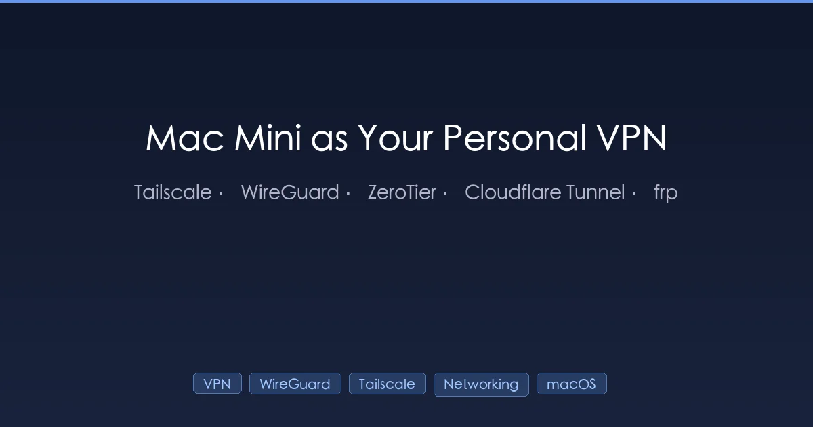
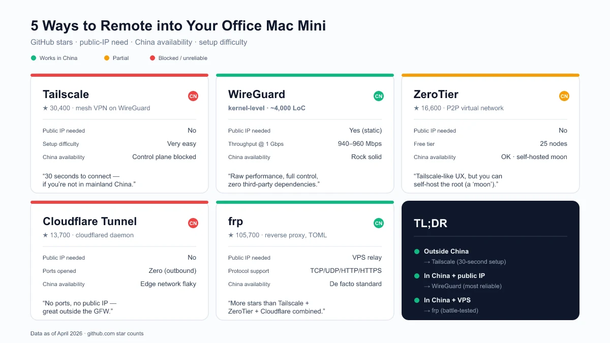
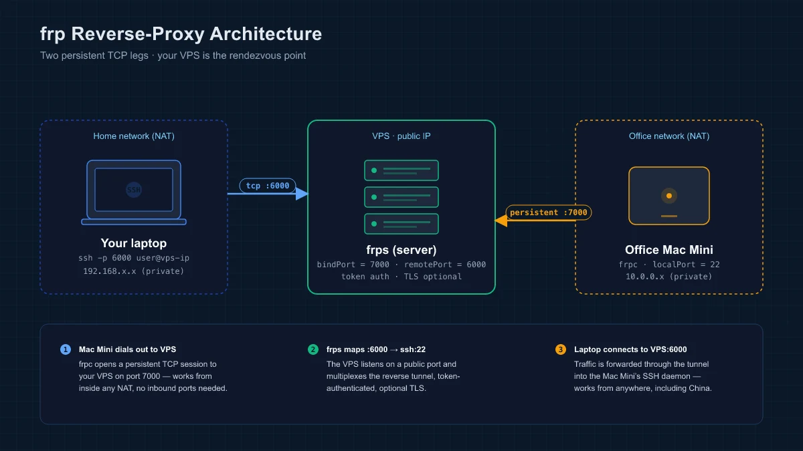
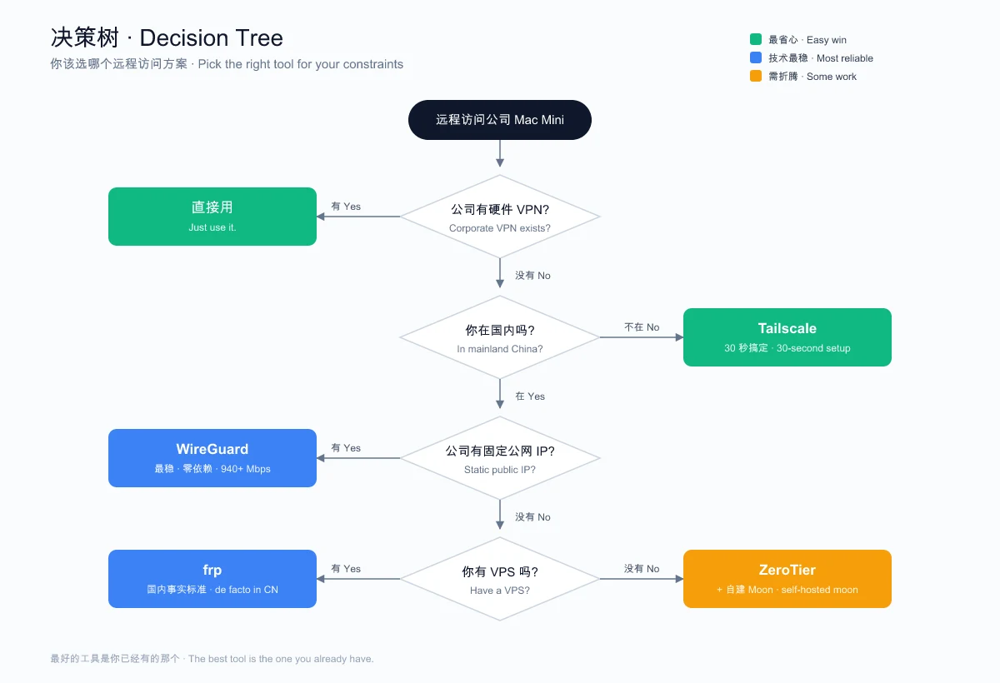

+++
date = '2026-04-11T10:00:00+08:00'
draft = false
title = '把公司 Mac Mini 变成你的私人 VPN：5 种方案实测对比'
description = '亲测 5 种远程访问公司 Mac Mini 的方案 —— Tailscale、WireGuard、ZeroTier、Cloudflare Tunnel、frp，含完整搭建教程、国内可用性实测和踩坑记录。'
toc = true
tags = ['VPN', 'WireGuard', 'Tailscale', 'Networking', 'macOS', 'Remote Access']
keywords = ['Mac Mini VPN', '远程访问 Mac', 'Tailscale 教程', 'WireGuard macOS', '公司内网穿透', 'NAT 穿透', '居家办公 VPN', '内网穿透方案']

[[params.faqItems]]
question = "Tailscale 在国内能不能直接用？"
answer = "不太行。Tailscale 的控制面（login.tailscale.com）在国内被墙了。数据通道可以通过 DERP 中继走通，但首次认证和密钥交换必须访问 Tailscale 的协调服务器。实测断开 VPN 后 Tailscale 立刻掉线。"

[[params.faqItems]]
question = "公司 Mac Mini 在国内，用哪个方案最稳？"
answer = "如果公司有固定公网 IP，WireGuard 最稳——内核级协议，不依赖任何第三方控制面。没有公网 IP 的话，frp + 一台 VPS 是国内最成熟的方案。如果公司本身就有硬件 VPN，直接用就行，别折腾了。"

[[params.faqItems]]
question = "WireGuard 和 OpenVPN 性能差多少？"
answer = "差距很大。WireGuard 在 1Gbps 带宽下能跑到 940-960 Mbps，CPU 占用 8-15%；OpenVPN 只能跑 480-620 Mbps，CPU 占用 45-60%。延迟方面 WireGuard 约 40ms，OpenVPN TCP 模式约 113ms。WireGuard 代码量约 4000 行，OpenVPN 超过 10 万行。"
+++



## 一、一台 Mac Mini，两个地方，连不上

公司有台 Mac Mini，24 小时开着，连着公司内网。你想在家远程连上去——SSH 进去干活、把流量从公司网络走、访问公司内部的服务。问题是：它藏在公司的 NAT 防火墙后面，没有公网 IP，IT 也不会为你单独开端口。

上周我碰到了这个问题。折腾了一个晚上，把 Tailscale、WireGuard、ZeroTier、Cloudflare Tunnel、frp 全试了一遍。有的 30 秒搞定但在国内用不了，有的配置复杂但稳如磐石。这篇文章记录了完整的实测过程，包括那些文档里不会告诉你的坑。

---

## 二、5 种方案一览

先上结论，再讲细节：



| 工具 | GitHub Star | 需要公网 IP | 国内可用 | 搭建难度 |
|------|-----------|-----------|---------|---------|
| **Tailscale** | 3 万+（[来源](https://github.com/tailscale/tailscale)，2026 年 4 月） | 不需要 | 不稳定 | 极简 |
| **WireGuard** | 内核级协议，wireguard-go 4,100+（[来源](https://github.com/WireGuard/wireguard-go)） | 需要 | 稳定 | 中等 |
| **ZeroTier** | 1.6 万+（[来源](https://github.com/zerotier/ZeroTierOne)，2026 年 4 月） | 不需要 | 部分可用 | 简单 |
| **Cloudflare Tunnel** | 1.3 万+（[来源](https://github.com/cloudflare/cloudflared)，2026 年 4 月） | 不需要 | 不稳定 | 中等 |
| **frp** | 10.5 万+（[来源](https://github.com/fatedier/frp)，2026 年 4 月） | 需要（中继服务器） | 稳定 | 中等 |

> **什么是 NAT 穿透？** 你的 Mac Mini 在路由器后面，分到的是 `192.168.x.x` 这样的内网 IP，外面的设备无法直接访问它。NAT 穿透就是绕过这个限制的技术统称——要么在 NAT 上打洞（Tailscale、ZeroTier 的做法），要么通过一台公网服务器做中继（frp、Cloudflare Tunnel、WireGuard 的做法）。

---

## 三、方案 1：Tailscale —— 30 秒组网（前提是你能上外网）

> **Tailscale 是什么？** Tailscale 是基于 WireGuard 的组网工具，自动处理密钥交换、NAT 穿透和节点发现。两台设备装上它、用同一个账号登录，就能互相访问。截至 2026 年 4 月有 3 万+ GitHub Star，5,000+ 付费团队（[来源](https://tailscale.com/blog/5000-customers)）。

### 3.1 macOS 上用 Homebrew 安装

```bash
# 安装
brew install tailscale

# 启动后台服务（必须用 sudo，否则权限不够）
sudo brew services start tailscale

# 登录
sudo tailscale up
```

最后一条命令会打印一个 URL，浏览器打开、登录，这台设备就加入你的 Tailscale 网络了。

### 3.2 最常见的坑："failed to connect to local Tailscale service"

macOS 上 Homebrew 安装 Tailscale，十个人九个会碰到这个报错。原因是 `brew services start tailscale`（不带 sudo）把服务跑在了当前用户下，权限不够。

**解法**：用 `sudo brew services start tailscale`，把服务注册为系统级进程。

另一个常见原因：之前装过 Mac App Store 版的 Tailscale，卸载后留了个脚本在 `/usr/local/bin/tailscale`，指向已经不存在的 App：

```bash
# 检查是不是旧版残留
cat /usr/local/bin/tailscale
# 如果输出包含 /Applications/Tailscale.app/...

# 删掉它
sudo rm /usr/local/bin/tailscale

# 确认现在用的是 Homebrew 版
which tailscale
# 应该输出：/opt/homebrew/bin/tailscale
```

### 3.3 把 Mac Mini 当 Exit Node（全局 VPN）

两台设备都连上后，可以把公司的 Mac Mini 设成出口节点——家里所有的流量都走公司网络出去：

```bash
# 在公司 Mac Mini 上
sudo tailscale up --advertise-exit-node

# 去 https://login.tailscale.com/admin/machines
# 找到 Mac Mini → Edit route settings → 勾选 "Use as exit node"

# 在家里的电脑上
sudo tailscale up --exit-node=<公司Mac的Tailscale IP>

# 不用了就关掉
sudo tailscale up --exit-node=
```

### 3.4 国内实测：控制面被墙

体验到这里急转直下。**Tailscale 的控制面 `login.tailscale.com` 在国内被墙了。**

- 首次认证需要挂梯子才能访问 Tailscale 的服务器
- 连上之后数据走 DERP 中继（最近的节点可能是香港或东京）
- 一旦你的梯子断了，Tailscale 无法重新认证，连接立刻断开

我实测的表现：断开公司 VPN 后，`tailscale status` 立刻显示 offline。`tailscale netcheck` 显示所有 DERP 中继都能 ping 通，但控制面连不上。数据通道没问题，认证通道被墙了。

**结论**：如果你在海外，Tailscale 是最佳选择，不用再往下看了。如果你在国内，Tailscale 不能作为主力方案。

---

## 四、方案 2：WireGuard —— 性能最强，完全自主

> **WireGuard 是什么？** WireGuard 是内核级 VPN 协议，在 1Gbps 带宽下能跑到 940-960 Mbps，CPU 占用仅 8-15%。对比 OpenVPN 的 480-620 Mbps 和 45-60% CPU 占用（[来源](https://cyberinsider.com/vpn/wireguard/wireguard-vs-openvpn/)）。代码量约 4,000 行，2020 年 3 月进入 Linux 内核（5.6 版本）。

WireGuard 就是 Tailscale 的底层协议，但不带自动发现功能——所有配置手动来，好处是不依赖任何第三方服务。

### 4.1 前提条件

- **公司必须有固定公网 IP**（或者至少知道公网 IP 是什么）
- **办公室路由器上要做端口映射**：UDP 51820 转发到 Mac Mini 的内网 IP

### 4.2 服务端配置（公司 Mac Mini）

```bash
# 安装
brew install wireguard-tools

# 创建配置目录
sudo mkdir -p /opt/homebrew/etc/wireguard

# 生成服务端密钥对
wg genkey | tee /opt/homebrew/etc/wireguard/server_private.key | \
  wg pubkey > /opt/homebrew/etc/wireguard/server_public.key

# 查看密钥（配置时需要）
cat /opt/homebrew/etc/wireguard/server_private.key
cat /opt/homebrew/etc/wireguard/server_public.key
```

创建服务端配置文件 `/opt/homebrew/etc/wireguard/wg0.conf`：

```ini
[Interface]
PrivateKey = <server_private.key 的内容>
Address = 10.0.0.1/24
ListenPort = 51820

[Peer]
PublicKey = <客户端的公钥，下一步生成>
AllowedIPs = 10.0.0.2/32
```

### 4.3 客户端配置（家里的电脑）

```bash
brew install wireguard-tools
sudo mkdir -p /opt/homebrew/etc/wireguard

# 生成客户端密钥对
wg genkey | tee /opt/homebrew/etc/wireguard/client_private.key | \
  wg pubkey > /opt/homebrew/etc/wireguard/client_public.key
```

创建客户端配置文件 `/opt/homebrew/etc/wireguard/wg0.conf`：

```ini
[Interface]
PrivateKey = <client_private.key 的内容>
Address = 10.0.0.2/24

[Peer]
PublicKey = <服务端的公钥>
Endpoint = <公司公网IP>:51820
AllowedIPs = 0.0.0.0/0
PersistentKeepalive = 25
```

`AllowedIPs = 0.0.0.0/0` 表示**所有流量**都走公司出去（完整 VPN 效果）。如果只想访问公司内网，改成 `10.0.0.0/24`。

### 4.4 启动连接

```bash
# 服务端（公司）
sudo wg-quick up wg0

# 客户端（家里）
sudo wg-quick up wg0

# 验证
sudo wg show
ping 10.0.0.1
```

### 4.5 路由器端口映射

登录公司路由器（通常是 `192.168.1.1`），添加端口转发规则：

- **外部端口**：UDP 51820
- **内部 IP**：Mac Mini 的内网 IP（比如 `192.168.1.100`）
- **内部端口**：UDP 51820

**结论**：公司有固定公网 IP 的情况下，WireGuard 是最稳的选择。不依赖任何第三方，不怕墙，内核级性能。代价是手动配置和需要做端口映射。

---

## 五、方案 3：ZeroTier —— Tailscale 的替代，国内友好一些

> **ZeroTier 是什么？** ZeroTier 是点对点虚拟网络平台，有 1.6 万+ GitHub Star（[来源](https://github.com/zerotier/ZeroTierOne)）。和 Tailscale 类似，创建一个虚拟网络让设备加入，但用的是自己的协议而非 WireGuard。

### 5.1 为什么在国内比 Tailscale 好用

ZeroTier 的控制面在国内的可访问性比 Tailscale 好。更关键的是，它支持自建 "Moon"（自定义根服务器），部署在国内的服务器上，完全绕开对公网基础设施的依赖。

### 5.2 快速搭建

```bash
# 两台机器都装
brew install zerotier-one

# 启动服务
sudo brew services start zerotier-one

# 去 https://my.zerotier.com 创建网络（免费支持 25 个节点）
# 两台机器加入同一个网络
sudo zerotier-cli join <network-id>

# 在 ZeroTier 网页控制台里授权两台设备
```

### 5.3 自建 Moon（保障国内连通性）

如果 ZeroTier 的公共根节点不稳定，可以在自己的 VPS 上搭建 Moon：

```bash
# 在 VPS 上
zerotier-idtool initmoon identity.public > moon.json
# 编辑 moon.json，填入 VPS 的公网 IP
zerotier-idtool genmoon moon.json
# 把生成的 .moon 文件分发到你的设备上
```

**结论**：在 Tailscale 的易用性和 WireGuard 的独立性之间取了折中。自建 Moon 让它在国内也能稳定运行。

---

## 六、方案 4：Cloudflare Tunnel —— 不开端口、不需公网 IP

> **Cloudflare Tunnel**（原 Argo Tunnel）利用 Cloudflare 的全球网络做中继。`cloudflared` 有 1.3 万+ GitHub Star（[来源](https://github.com/cloudflare/cloudflared)）。不需要公网 IP，不需要开端口——你的设备主动向 Cloudflare 发起连接。

Cloudflare Tunnel 的详细搭建教程我在[另一篇文章](/posts/linux/2026-03-28-cloudflare-tunnel-guide/)里写过，包括架构图和完整步骤。简要版：

```bash
brew install cloudflare/cloudflare/cloudflared
cloudflared tunnel login
cloudflared tunnel create mac-mini
cloudflared tunnel route dns mac-mini your-subdomain.yourdomain.com
```

**国内的问题**：和 Tailscale 一样，Cloudflare 的基础设施在国内不够稳定。隧道走的是 Cloudflare 的边缘网络，可能延迟高或间歇性不通。

**结论**：有域名在 Cloudflare 且人在海外的话很好用。国内场景不推荐作为主力。

---

## 七、方案 5：frp —— 国内内网穿透的事实标准

> **frp**（Fast Reverse Proxy）是自建内网穿透工具，GitHub Star 高达 10.5 万+（[来源](https://github.com/fatedier/frp)）——比 Tailscale、ZeroTier、Cloudflare Tunnel 加起来还多。支持 TCP、UDP、HTTP、HTTPS 隧道，TOML 配置。

frp 需要一台有公网 IP 的中继服务器（VPS 即可），但所有基础设施完全在你手里。

### 7.1 架构



公司的 Mac Mini 运行 `frpc`（客户端），保持和 VPS 上 `frps`（服务端）的长连接。家里的电脑连接 VPS，VPS 把流量转发到 Mac Mini。两条 TCP 长连接——一条由 Mac Mini 主动拨出（绕过 NAT），一条由你的笔记本主动接入，它们在 VPS 汇合。

### 7.2 服务端（VPS）

```toml
# frps.toml
bindPort = 7000

[auth]
method = "token"
token = "your-secret-token"
```

```bash
frps -c frps.toml
```

### 7.3 客户端（公司 Mac Mini）

```toml
# frpc.toml
serverAddr = "your-vps-ip"
serverPort = 7000

[auth]
method = "token"
token = "your-secret-token"

[[proxies]]
name = "ssh"
type = "tcp"
localIP = "127.0.0.1"
localPort = 22
remotePort = 6000
```

```bash
frpc -c frpc.toml
```

从家里 SSH 到公司：`ssh -p 6000 user@your-vps-ip`

**结论**：最灵活的方案，国内完全可用。代价是你得有一台 VPS 并自己维护。10.5 万+ Star 说明了一切——frp 是国内内网穿透的事实标准。

---

## 八、决策树：你该选哪个

试完五种方案后，我总结出这个决策路径：



---

## 九、性能对比

| 指标 | WireGuard | OpenVPN | Tailscale | frp (TCP) |
|------|-----------|---------|-----------|-----------|
| 吞吐量（1Gbps 带宽） | 940-960 Mbps | 480-620 Mbps | ~900 Mbps（底层是 WireGuard） | 受限于 VPS 带宽 |
| CPU 占用 | 8-15% | 45-60% | 10-20% | 5-10%（中继开销） |
| 延迟 | ~40 ms | ~113 ms (TCP) | ~50-80 ms (经 DERP) | 取决于 VPS 位置 |
| 代码量 | ~4,000 行 | ~100,000+ 行 | ~200,000+ 行 | ~30,000 行 |

数据来源：[CyberInsider](https://cyberinsider.com/vpn/wireguard/wireguard-vs-openvpn/)、[ExpressVPN Research](https://www.expressvpn.com/blog/wireguard-vs-openvpn/)，2026 年 4 月。

---

## 十、我最后用了什么

折腾了一圈，我最后用了公司的硬件 VPN。它本来就在那里，IT 帮你维护，连上就能用，零维护成本。

教训是：**最好的工具是你已经有的那个。** 我花了一个晚上配 Tailscale、调 `brew services` 的 macOS 权限问题、发现国内连不上、考虑换 WireGuard——然后突然想起来，这个问题公司早就解决了。

但如果我没有硬件 VPN，我会这么部署：

1. **WireGuard** 做主力（公司有固定公网 IP）
2. **Tailscale** 做备用（出国时用）
3. 两个都配成开机自启

---

## 十一、常用命令速查

### Tailscale

```bash
tailscale status                    # 查看所有设备和 IP
tailscale ip                        # 查看本机 Tailscale IP
tailscale ping <设备名>              # 测试到某个节点的连通性
tailscale netcheck                  # 网络诊断
sudo tailscale up --exit-node=<ip>  # 全局流量走某个节点
sudo tailscale up --exit-node=      # 关闭 exit node
```

### WireGuard

```bash
sudo wg-quick up wg0     # 连接
sudo wg-quick down wg0   # 断开
sudo wg show             # 查看连接状态和统计
```

### ZeroTier

```bash
sudo zerotier-cli status           # 查看节点状态
sudo zerotier-cli listnetworks     # 列出已加入的网络
sudo zerotier-cli join <id>        # 加入网络
sudo zerotier-cli leave <id>       # 离开网络
```

---

## 十二、常见问题

### 12.1 Tailscale 和 WireGuard 能同时用吗？

**可以，但有条件。** Tailscale 底层用的就是 WireGuard，但它管理自己的网络接口（`tailscale0`）。独立的 WireGuard 隧道（`wg0`）互不干扰。但如果两个都设成默认网关会有路由冲突——同一时间只用一个做 exit node。

### 12.2 公司 IT 会发现吗？

**大概率会。** WireGuard 和 Tailscale 会创建虚拟网卡，产生特征流量。如果公司有严格的网络管控策略，建议先打招呼。frp 的流量更难区分，尤其是配了 TLS 的情况下。

### 12.3 SSH 隧道能不能作为简单替代？

**可以。** SSH 反向隧道（`ssh -R`）是最简单的单服务暴露方案，需要一台有公网 IP 的 VPS。缺点是稳定性差——SSH 连接会断，需要 `autossh` 这样的工具来保活。详细教程见我的[内网穿透指南](/posts/linux/2026-03-28-cloudflare-tunnel-guide/)。

---

## 十三、相关链接

- [Tailscale 官网](https://tailscale.com/)
- [Tailscale GitHub](https://github.com/tailscale/tailscale)（3 万+ Star）
- [WireGuard 官网](https://www.wireguard.com/)
- [ZeroTier 官网](https://www.zerotier.com/)
- [ZeroTier GitHub](https://github.com/zerotier/ZeroTierOne)（1.6 万+ Star）
- [Cloudflare Tunnel 文档](https://developers.cloudflare.com/cloudflare-one/connections/connect-apps/)
- [frp GitHub](https://github.com/fatedier/frp)（10.5 万+ Star）

---

## 十四、延伸阅读

- [内网穿透完全指南：SSH 隧道、frp、Cloudflare Tunnel](/posts/linux/2026-03-28-cloudflare-tunnel-guide/) - 反向隧道的架构图解和完整搭建教程
- [Linux 和 macOS 常用命令速查](/posts/linux/2020-03-19-linux-mac-commands/) - 服务器管理必备终端命令
- [Docker Compose 完全指南](/posts/docker/2026-01-19-docker-compose-complete-guide/) - 用容器跑 frp 或 WireGuard 服务

---

如果这篇文章帮你省了一个晚上的调试时间，欢迎在评论区留言。特别想听有没有人在国内不挂梯子把 Tailscale 跑稳了的——我的结论是不行，但很希望被打脸。

---

> **本文更新于 2026 年 4 月** | 基于 Tailscale v1.96.4、WireGuard wireguard-tools (latest)、ZeroTier v1.16.0、cloudflared 2026.3.0、frp v0.68.0 撰写
