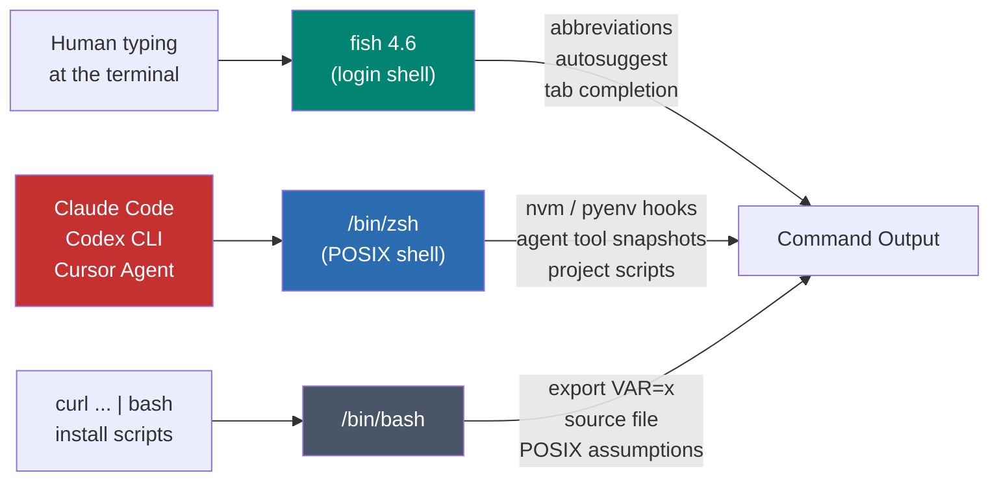
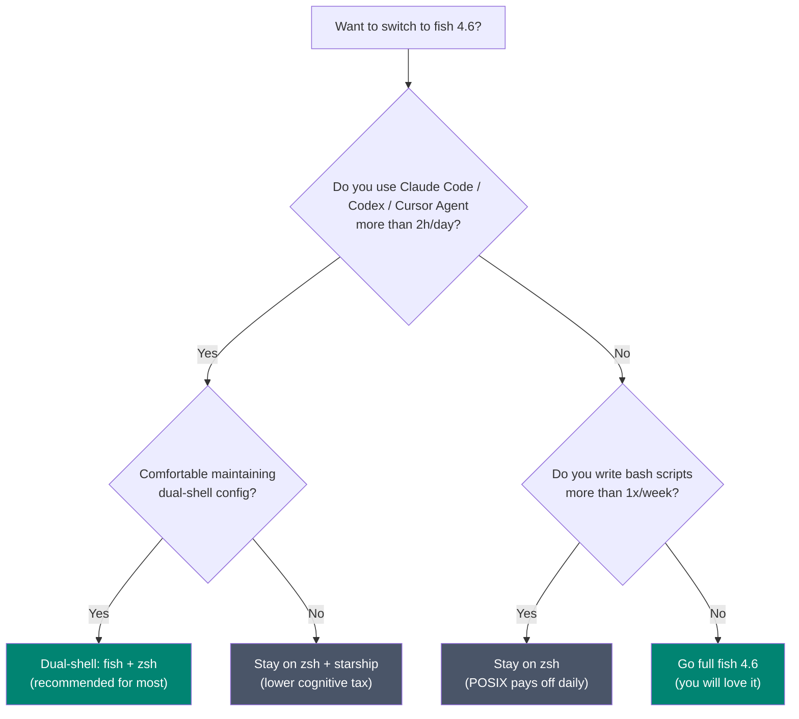

+++
date = '2026-04-18T10:00:00+08:00'
draft = false
title = 'Fish Shell 4.6 Review: Best Interactive Shell, Wrong Default'
description = 'Fish shell 4.6 is the most polished interactive shell in 2026, but the Rust rewrite did not fix POSIX. Here is why I run fish as a front-end and keep zsh for AI agents.'
toc = true
tags = ['Fish Shell', 'Shell', 'Developer Tools', 'Claude Code', 'Rust']
keywords = ['fish shell 4.6 review', 'fish shell rust rewrite', 'fish shell vs zsh 2026', 'fish shell claude code', 'fish shell posix', 'default shell 2026']

[[params.faqItems]]
question = "Is fish shell 4.6 worth switching to in 2026?"
answer = "As an interactive shell, yes — the autosuggestions, abbreviations and tab completion beat zsh out of the box. As the default login shell that AI agents like Claude Code or Codex CLI run commands in, no — POSIX incompatibility and shell-snapshot bugs cost you more than the ergonomics save."

[[params.faqItems]]
question = "Did the fish 4.0 Rust rewrite make it faster?"
answer = "Barely. The fish maintainers themselves describe execution time as 'usually slightly better' with a higher idle memory floor (8MB vs 7MB). The rewrite was about maintainability, multithreading and contributor growth — not raw speed."

[[params.faqItems]]
question = "Does Claude Code work with fish shell?"
answer = "Partially. Interactive use inside fish is fine, but the Bash tool in Claude Code invokes the system default shell (usually zsh/bash) and sources zsh-format snapshots that break under fish. CLAUDE_CODE_SHELL_PREFIX is effectively unusable on fish today. Keep a POSIX shell installed for agent execution."

[[params.faqItems]]
question = "What is the dual-shell setup for fish users?"
answer = "Make fish your interactive login shell via chsh, but keep /bin/zsh or /bin/bash on PATH and set SHELL=/bin/zsh inside AI agent configs. This lets you enjoy fish abbreviations while Claude Code, Codex CLI, and Docker entrypoints run in the POSIX world they expect."

[[params.faqItems]]
question = "Why is fish shell not POSIX compatible?"
answer = "Fish deliberately breaks from POSIX to make syntax safer and more consistent — no $VAR quoting traps, no test/[[ ]] duality, cleaner functions. The cost is that install scripts, nvm/rbenv/asdf hooks, and most shell snippets on GitHub assume bash/zsh semantics and fail under fish without a translation layer."
+++


Let me open with the contrarian line. **Fish shell 4.6, released March 28, 2026, is the most polished interactive shell I have ever used. It is also the wrong choice for your default shell in the AI agent era.**

Those two claims are not in conflict. They are the whole point of this review.

I have been running fish as a front-end for the last nine months, since the 4.0 Rust rewrite landed in February 2025. I read the release notes for every point release, I moved my zsh configuration over, I watched the Claude Code bug tracker fill up with `fish` in the title, and I eventually settled into a dual-shell setup that I think most AI-heavy developers should copy. This article is that conclusion, backed by numbers.

## What actually changed in fish 4.0 through 4.6

The reason anyone is talking about fish in 2026 is the Rust port. Fish 4.0 shipped on February 27, 2025 after **two years of work, 2,600+ commits, and more than 200 contributors** — effectively a full rewrite. The headline numbers from the fish team's own post-mortem:

- C++ lines: ~57,000 → Rust lines: ~75,000
- Binary size: 2.4 MB → 4.3 MB (about 25% larger on disk)
- Idle memory floor: 7 MB → 8 MB
- Execution time: "usually slightly better"

Since then the cadence has stayed tight. Fish 4.1 added nearly 1,400 commits of polish. Fish 4.6, the current release, added `|&` bash-compatible error redirection, systemd environment variable support (`SHELL_PROMPT_PREFIX`, `SHELL_WELCOME`), and — my favourite feature of the whole 4.x line — **command-scoped abbreviations**:

```fish
abbr --add --command git back 'reset --hard HEAD^'
```

That expansion only fires when the current command is `git`, so you can finally stop polluting the global namespace with aliases that collide across tools. For anyone who types git commands a few hundred times a day, this alone justifies running 4.6.

If you are still on fish 3.x, the upgrade is worth it — not because the shell is faster, but because the maintenance story is now sustainable. The old C++ codebase had **17 contributors with 10+ commits in eleven years**. Since the Rust port, PR volume has jumped sharply. That is what you are actually buying with the rewrite.

## Myth 1: "Rust rewrite = performance boost"

Every Rust port blog post collects comments like "fish is so much faster now." It is not, and the fish team has been refreshingly honest about that.

Quoting the official rust-port write-up: the new binary produces *"execution time usually slightly better"* but with a **higher memory floor at rest** (8 MB vs 7 MB), with the Rust version winning only on the ceiling during intensive operations like directory globbing. On a cold start of an empty prompt, there is no human-perceivable difference.

The reason is obvious once you read the commit history. The team used `autocxx` to port components one file at a time while keeping the full test suite green. They were not rewriting for speed; they were translating semantics. Most hot paths kept their existing algorithms — they just got Rust ownership annotations wrapped around them.

Where Rust actually paid off is three places I only learned to care about after a year of daily use:

1. **Static binaries.** The new fish ships as a self-contained file you can `scp` to a server and run. No more "the ncurses version on this CentOS box is too old" dance. For SSH-heavy workflows this is a real quality-of-life upgrade.
2. **Fearless concurrency.** The C++ team tried a background-execution prototype and abandoned it because "objects were being shared across threads by accident." Rust's `Send`/`Sync` now makes that tractable, and you will see multithreaded features land in 4.7+ that were simply impossible before.
3. **Contributor ergonomics.** This one matters most for your long-term bet. The project went from "impossible to get ten new contributors per year" to a healthy flow of Rust-literate newcomers. Shells are forever; pick one whose bus factor is improving.

If you read "Rust rewrite" and expected a 3× speedup on your prompt, recalibrate. What you actually got is a shell that will still be maintained in 2030.

## Myth 2: "POSIX compatibility does not matter in 2026"

This is the argument fish evangelists make most often, and it is where I think they are most wrong.

Yes, fish's syntax is cleaner. No, you do not have to quote every variable. No, you never get bitten by `[ "$x" = "$y" ]` vs `[[ $x == $y ]]`. But POSIX compatibility is not about what *you* type — it is about what the rest of the ecosystem assumes. Specifically:

- **Install scripts.** The standard one-liner for almost every dev tool on the internet is `curl ... | sh` or `curl ... | bash`. Nine times out of ten it works. The tenth time — typically when it sets environment variables or sources another script — it explodes under fish because it assumed POSIX variable assignment semantics.
- **Version managers.** `nvm`, `rbenv`, `pyenv`, `asdf`, `sdkman` all ship bash/zsh hook scripts. Fish users rely on community-maintained wrappers (`bass`, `fenv`, `fish-nvm`) that lag the upstream versions by weeks and occasionally break on new releases.
- **Project scripts.** Every repo with a `Makefile`, a `scripts/bootstrap.sh`, or a `.envrc` assumes bash-flavored semantics. Running them under fish requires either a subshell hop or a translation step.

Here is the concrete test I use. When I evaluate a shell, I grep the install instructions for my last ten tools (Claude Code, uv, mise, bun, pnpm, rustup, nix, starship, atuin, direnv) and count how many have a "fish notes" section. For 2026, it is **6 out of 10**. The remaining four work eventually, but require you to copy-paste a community gist and hope it is current.

The fish team is clearly aware of this tension — fish 4.6 added `|&` specifically "consistent with Bash." That is the second major syntax borrow from bash in the 4.x line. Read that as quiet acknowledgment that pure syntactic purity costs more than it earns.

## The AI agent hole: where fish 4.6 quietly falls apart

This is the section that did not exist three years ago, and it is now the most important one.

If you use Claude Code, Codex CLI, Cursor Agent, or any of the other code-writing agents that shell out to your system for half their work, the shell those agents spawn matters. And the state of the art in April 2026 is **"agents run bash or zsh even if you launched them from fish."** Two documented issues make this concrete:

- **GitHub issue anthropics/claude-code#7490** — the Bash tool uses the system default shell (usually bash on Linux, zsh on macOS) rather than inheriting the shell that invoked `claude`. Your fish functions, abbreviations, and PATH tweaks silently disappear inside the agent.
- **GitHub issue anthropics/claude-code#13425** — `CLAUDE_CODE_SHELL_PREFIX`, the hook users rely on to customize every command, sources zsh-format shell snapshots. Under fish, every command emits a syntax error preamble before running the real command. Effectively unusable.

Codex CLI and Gemini CLI have near-identical stories. An empirical study of **3,800+ publicly reported bugs across Claude Code, Codex, and Gemini CLI** flags "shell-specific behaviors related to path parsing" as a recurring failure mode.

The blunt read: the AI coding stack standardized on POSIX shells roughly two years ago, and nobody is planning to rewrite it to be fish-native. So if your daily loop involves an agent running ten, fifty, or a hundred shell commands on your behalf, fish being your login shell actively costs you time — you get mysterious failures, lost environment, and prompts that look different inside and outside the agent.

This is the datum that flipped my opinion. A year ago I would have recommended fish to any developer who could tolerate a one-week transition. Today I would not.

## The dual-shell setup: fish on top, POSIX underneath

You do not have to choose. The setup I have been running on an M4 MacBook Pro for seven months:

```fish
# ~/.config/fish/config.fish
# fish is my interactive login shell via `chsh -s (which fish)`
# but agents and scripts get a real POSIX shell.

set -Ux SHELL /bin/zsh            # what agents inherit
set -gx EDITOR nvim

# Keep a one-liner for "drop me into zsh when I need it"
function z
    command zsh $argv
end
```

Then in my Claude Code config (`~/.claude/settings.json`):

```json
{
  "env": {
    "SHELL": "/bin/zsh",
    "CLAUDE_CODE_SHELL_PREFIX": "source ~/.zshrc &>/dev/null;"
  }
}
```

What this buys me:

1. **Interactive typing is fish.** Autosuggestions, command-scoped abbreviations, tab completions, the lot.
2. **Every AI agent invocation is zsh.** Claude Code, Codex CLI, any `sh -c` from a tool — they all land in a POSIX shell that behaves the way their prompts were trained on.
3. **Install scripts just work.** When a tool's docs say `curl ... | bash`, I pipe it to bash. When it says `source ./setup.sh`, I do it from `zsh`. Fish only handles what I personally type.

Visually, the split looks like this:



The rule of thumb: *one human, one shell* (fish). *Every program you did not write, its own shell* (zsh or bash). Once you internalise that split, 90% of the compatibility friction disappears.

Here is the decision tree I walk through when someone asks me "should I switch to fish in 2026?":



If you fall into the "full fish" bucket — mostly frontend engineers, data scientists who live in Python, or anyone whose "scripting" is actually Python/Go/TypeScript — fish is a straight upgrade. If you fall anywhere else, either go dual-shell or stay on zsh.

## When fish 4.6 genuinely wins

To be clear, I am not negative on fish the project. It is the best version of its idea, and for the right user it is the right answer. Places where I think fish dominates in 2026:

- **Zero-config ergonomics.** A fresh fish install has autosuggestions, syntax highlighting, directory history, and tab completion with descriptions. Matching that in zsh requires Oh My Zsh plus three plugins plus a week of tuning.
- **Startup time.** A loaded `.zshrc` with Oh My Zsh and lazy-loaded plugins can still take 700–1200 ms on a modern Mac. Fish 4.6 cold-starts in under 100 ms even with a full config. If you open terminals constantly, that compounds.
- **Command-scoped abbreviations.** Nothing in zsh, bash, or nushell matches fish 4.6's `abbr --command` for building muscle memory without globally colliding aliases.
- **Interactive discoverability.** Tab completion in fish shows a full description for every command flag, pulled from man pages. This is how you learn unfamiliar tools in the flow of using them.

## When fish 4.6 will cost you time

And honestly, the places it will still hurt in 2026:

- **AI agent workflows.** Every agent today speaks bash/zsh. Your fish-only PATH/env will silently not apply.
- **`curl | sh` install scripts.** Any unmaintained one assumes bash; fish will choke on `export`, `source`, and array syntax differences.
- **Docker ENTRYPOINT and CI.** `alpine:latest` ships ash; every CI image ships bash. Your local fish muscle memory does not transfer.
- **Bash one-liners in README files.** You will find yourself running `bash -c '...'` a few times a week. That friction compounds.
- **nvm, rbenv, asdf.** Fish wrappers exist but lag upstream. If you are on bleeding-edge Node or Ruby versions, expect occasional breakage.

## My recommendation, in one line

**Run fish 4.6 as the shell you type in, run zsh as the shell your agents type in, and stop pretending you have to pick one.** The fish Rust rewrite made the project sustainable enough to bet on for the next decade. It did not, and was never going to, fix the fact that every tool upstream speaks POSIX.

If you want a single takeaway to screenshot: copy the dual-shell config above, and you get fish's ergonomics with zsh's compatibility surface. That is the best answer in 2026.

## Related reading

- [Terminal Tools Guide for Developers](/posts/macos/2025-01-22-terminal-tools-guide/) — my earlier survey of iTerm2, Warp, tmux, starship, and the rest of the terminal stack.
- [Claude Code Best Practices](/posts/ai/2026-01-06-claudecode-best-practices/) — how I configure environment and shell for agent-heavy workflows.
- [Claude Code Skill and Sub-Agent Guide](/posts/ai/2025-12-26-claudecode-skillsubagent/) — context on why the agent's shell environment matters.
- [AI Dev Workflow: A Real Guide](/posts/ai/2026-01-19-ai-dev-workflow/) — where fish / zsh sits inside my day-to-day AI engineering loop.

## External sources

- [Fish 4.0: The Fish of Theseus (official rust-port write-up)](https://fishshell.com/blog/rustport/)
- [Fish Shell 4.6 release notes](https://fishshell.com/docs/current/relnotes.html)
- [fish-shell on GitHub](https://github.com/fish-shell/fish-shell)
- [Claude Code issue #7490 — shell inheritance](https://github.com/anthropics/claude-code/issues/7490)
- [Claude Code issue #13425 — fish shell integration](https://github.com/anthropics/claude-code/issues/13425)
