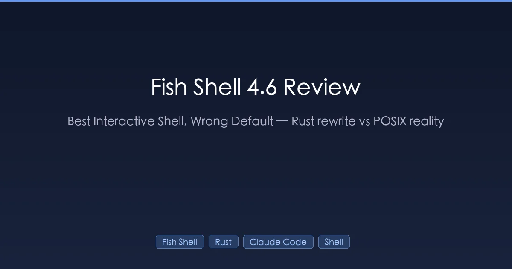
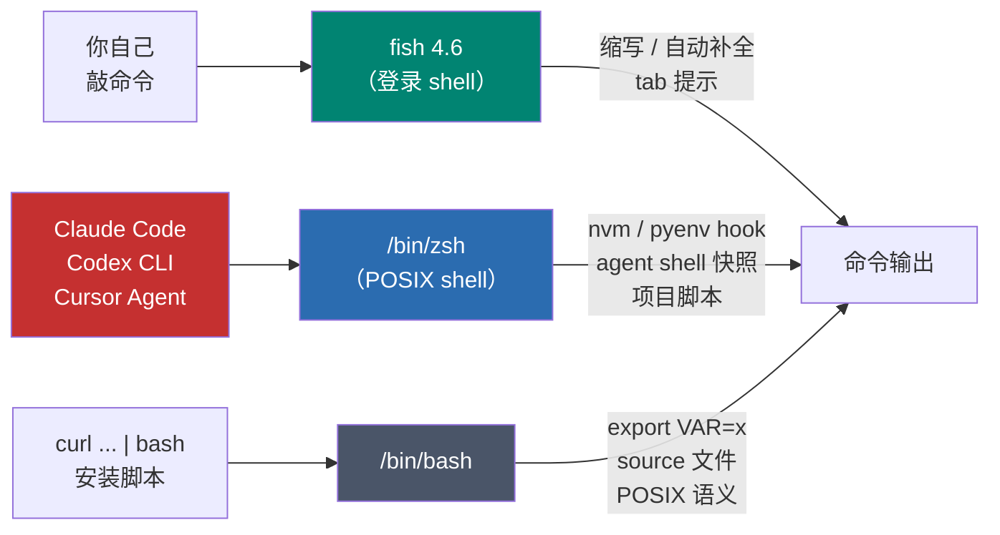
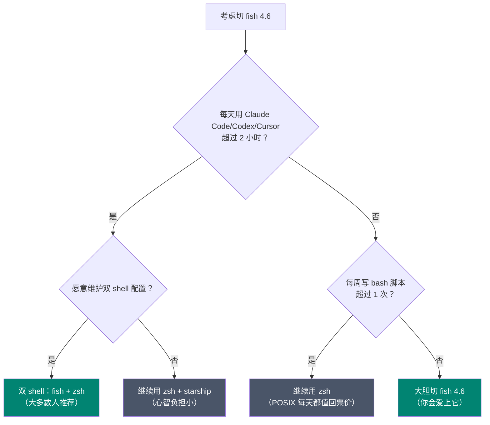

+++
date = '2026-04-18T10:00:00+08:00'
draft = false
title = 'fish shell 4.6 实测：最舒服的交互 shell，但别当默认'
description = 'fish shell 4.6（2026 年 3 月发布）实测九个月结论：Rust 重写 2600+ commits 却没让 shell 变快，POSIX 不兼容还会坑 Claude Code 等 AI agent。推荐双 shell 架构——fish 管交互、zsh 给 agent 跑命令，附完整配置。'
toc = true
tags = ['Fish Shell', 'Shell', 'Developer Tools', 'Claude Code', 'Rust']
keywords = ['fish shell 4.6', 'fish shell 值得用吗', 'fish shell 和 zsh 对比', 'fish shell rust 重写', 'fish shell claude code', '默认 shell 推荐', 'fish shell 不兼容 posix']

[[params.faqItems]]
question = "fish shell 4.6 在 2026 年值得从 zsh 切过来吗？"
answer = "作为交互 shell，值得——自动补全、命令级缩写、tab 提示原生比 zsh 强一档，而且零配置。但作为 AI agent 默认跑命令的 shell，不值得——POSIX 不兼容 + Claude Code/Codex CLI 的 shell 快照 bug 会天天咬你。推荐双 shell 方案：fish 交互，zsh 给 agent。"

[[params.faqItems]]
question = "fish 4.0 的 Rust 重写让 shell 变快了吗？"
answer = "基本没变。fish 官方原话是'执行时间通常略好'，但闲置内存从 7 MB 涨到 8 MB。Rust 化是为了可维护性、多线程能力和吸引新贡献者，不是性能优化——指望 3 倍加速的可以省心了。"

[[params.faqItems]]
question = "Claude Code 能在 fish shell 下用吗？"
answer = "能用但有坑。在 fish 里交互运行 claude 命令没问题，但 Claude Code 的 Bash 工具会调用系统默认 shell（一般是 zsh 或 bash），不继承 fish 的 PATH 和环境变量；CLAUDE_CODE_SHELL_PREFIX 加载的是 zsh 格式快照，在 fish 下每条命令前都会报语法错误。AI 重度用户建议保留 zsh 作为 agent shell。"

[[params.faqItems]]
question = "fish 为什么不兼容 POSIX？"
answer = "fish 主动放弃 POSIX 是为了让语法更干净——没有变量加引号的坑、没有 [ ] 和 [[ ]] 两套对比、函数更清爽。代价是 GitHub 上的 install 脚本、nvm/pyenv/asdf 的 hook 脚本、Docker ENTRYPOINT、CI 脚本都假设 bash/zsh 语义，在 fish 下经常炸——需要社区包装器 bass/fenv 才能跑通。"

[[params.faqItems]]
question = "推荐的双 shell 配置长什么样？"
answer = "chsh 把 fish 设为交互登录 shell，但保留 /bin/zsh 并在 Claude Code/Codex 的 env 配置里显式设 SHELL=/bin/zsh。curl | bash 类的安装脚本手动用 bash 执行；fish 只管你亲手敲的命令。文章里有完整配置片段可以直接抄。"
+++



先把结论写在最前面。**fish shell 4.6（2026 年 3 月 28 日发布）是我用过最舒服的交互 shell，但 2026 年它不应该当你的默认 shell。**

这两句话不矛盾。整篇文章就是在说为什么——以及那个能同时吃到两边好处的"双 shell 架构"长什么样。

我从 2025 年 2 月 fish 4.0 Rust 重写发布起，把 zsh + Oh My Zsh 换成 fish 跑了九个月。每个点发布都升级到最新版，把 Claude Code 的每一个 fish 相关 GitHub issue 都翻过一遍。最后我回到了一个混合方案：fish 管交互，zsh 管 agent。这篇是那个过程的浓缩总结，附上我踩过的每一个坑的复现方法。

## fish 从 4.0 到 4.6 到底变了什么

2026 年还在讨论 fish，根本原因是 Rust 重写。fish 4.0 在 2025 年 2 月 27 日发布，背后是**两年工期、2600+ commits、200+ 贡献者**——接近全量重写。fish 官方复盘里的几个硬数字：

- C++ 代码：约 5.7 万行 → Rust 代码：约 7.5 万行
- 二进制大小：2.4 MB → 4.3 MB（磁盘占用大了约 25%）
- 闲置内存：7 MB → 8 MB（反而略涨）
- 执行时间："usually slightly better"（通常略好——官方原话）

之后的节奏一直没停。fish 4.1 一口气合并了近 1400 个 commits，主要是打磨；fish 4.6 加了 `|&`（和 bash 一致的错误重定向）、systemd 环境变量支持（`SHELL_PROMPT_PREFIX`、`SHELL_WELCOME`），还有我觉得整个 4.x 最香的一个功能——**命令级缩写（command-scoped abbreviations）**：

```fish
abbr --add --command git back 'reset --hard HEAD^'
```

这条缩写只在 `git` 命令下展开，不会污染全局别名。如果你一天要敲几百次 git 命令，光这一个特性就值得升级到 4.6。

还在 fish 3.x 的人，升级版本确实值——但不是因为 shell 变快了，而是因为"这个项目还能不能长期维护"这件事的答案变了。C++ 时代的 fish 在 11 年里**只有 17 个贡献者达到 10+ commits**；Rust 化之后，PR 活跃度大幅提升。你买的其实是"这个 shell 在 2030 年还活着"的保险。

## 误区一："Rust 重写 = 性能飞跃"

每次 Rust 重写项目发完博客，评论区必然有人说"感觉快了好多"。fish 的真相是：没有明显变快，fish 团队自己也很诚实地承认了。

官方 rust-port 复盘里的原话——新二进制"**执行时间通常略好**"，但**闲置内存底线反而更高**（8 MB vs 7 MB），Rust 版只在高强度操作（比如目录 glob）时跑得更快。冷启动一个空 prompt，人是感觉不出差别的。

原因翻一下 commit history 就明白了。团队用 `autocxx` 一个文件一个文件地移植，同时保持测试套件全绿——他们不是在"用 Rust 重写以追求性能"，而是在翻译语义。绝大多数热路径的算法都没变，只是套上了 Rust 的所有权注解。

那 Rust 到底换来了什么？有三件事我是用了一年之后才开始在乎的：

1. **静态二进制**。新版 fish 是自包含的一个文件，`scp` 到服务器就能跑——再也不用和 CentOS 上老掉牙的 ncurses 版本搏斗。对重度 SSH 运维的同学这是实打实的质变。
2. **安全的并发**。C++ 时代团队试过一个后台执行原型，最后放弃了，原因是"对象被跨线程共享——但是意外的"。Rust 的 `Send`/`Sync` 让这件事可能了，4.7+ 会出一批之前做不到的多线程特性。
3. **贡献者生态**。这条对长期下注最重要。以前一年吸引不到十个新贡献者，现在 Rust 社区里熟悉 Rust 的人一抓一把。Shell 是要用很多年的东西，选一个 bus factor 在涨的，不是在跌的。

如果你以为 Rust 重写等于 prompt 快 3 倍，请调整预期。你实际拿到的是"这个 shell 2030 年还在维护"——这是更值钱的承诺，但也更不刺激。

## 误区二："POSIX 不兼容在 2026 年无所谓"

这是 fish 支持者最常说的话，也是我觉得他们错得最严重的地方。

语法干净当然好。不用给变量加引号、不用纠结 `[` 和 `[[` 的区别、函数写起来更清爽——这些都是真实的收益。但 POSIX 兼容性的关键**不是"你敲什么"**，而是"**别人假设你跑什么**"。具体是这三处：

- **安装脚本**。2026 年几乎每个开发工具的一行安装命令都是 `curl ... | sh` 或 `curl ... | bash`。九成情况下能跑。剩下那一成——典型是设环境变量或 source 另一个脚本——在 fish 下会直接报错，因为它假设了 POSIX 的变量赋值语义。国内开发者如果还要把这类脚本改 aliyun/腾讯云镜像，二次改动更容易出问题。
- **版本管理器**。`nvm`、`rbenv`、`pyenv`、`asdf`、`sdkman`，全部只提供 bash/zsh 的 hook 脚本。fish 用户靠的是社区包装器（`bass`、`fenv`、`fish-nvm`），这些包装器通常比上游滞后几周，偶尔新版本会炸。
- **项目脚本**。每一个带 `Makefile`、`scripts/bootstrap.sh`、`.envrc` 的仓库都假设 bash 风格语义。在 fish 下跑要么开子 shell，要么手动翻译。

我有一个具体的判断方法。评估一个 shell 值不值得切的时候，我会 grep 最近用的十个工具（Claude Code、uv、mise、bun、pnpm、rustup、nix、starship、atuin、direnv）的安装文档，数一下有几个提供了 "fish notes" 小节。2026 年的结果是 **10 个里有 6 个**。剩下四个最终能用，但要去找一份社区 gist 复制粘贴，还得祈祷它是最新的。

顺便说一句 fish 团队自己也明白这个紧张关系——fish 4.6 加的 `|&` 官方描述直接写着 "consistent with Bash"（和 Bash 一致）。这是 4.x 里第二次从 bash 借语法了。翻译过来就是：纯语法洁癖付出的代价比得到的多。

## AI agent 黑洞：fish 4.6 在这里悄悄崩掉

这一节三年前还不存在，今天是全篇最重要的一节。

如果你用 Claude Code、Codex CLI、Cursor Agent，或者任何会替你跑一半 shell 命令的 AI agent，**那个 agent spawn 出来的 shell 是什么，直接决定你一天有多少时间在修玄学 bug**。2026 年 4 月的实际状态是：**agent 跑的是 bash 或 zsh，不管你是从 fish 里启动它的**。两个已知 issue 坐实了这件事：

- **anthropics/claude-code#7490** —— Claude Code 的 Bash 工具用系统默认 shell（Linux 一般是 bash，macOS 是 zsh），不继承启动它的 shell。你在 fish 里配的函数、缩写、PATH 修改，在 agent 里面全都悄悄消失。
- **anthropics/claude-code#13425** —— `CLAUDE_CODE_SHELL_PREFIX` 这个所有人都靠它定制每条命令的 hook，加载的是 zsh 格式的 shell 快照。在 fish 下每条命令前都会先打印一串语法错误再执行。基本不能用。

Codex CLI 和 Gemini CLI 的故事几乎一样。一项对 **Claude Code、Codex、Gemini CLI 共 3800+ 公开 bug** 的实证研究把"shell 相关的路径解析行为"列为高频失败模式之一。

说得直白一点：AI 编码工具链在两年前左右就事实上标准化在 POSIX shell 上了，没有任何一家有计划把它重写成 fish 原生。所以如果你每天要让 agent 跑几十上百条命令，fish 当默认 shell 不是零代价的——是每天都在让你多花时间查莫名其妙的环境不一致、PATH 丢失、prompt 里面外面不一样。

就是这个数据点让我从"强推 fish"变成"保留意见"。一年前我会毫不犹豫地向任何能忍受一周迁移阵痛的开发者推荐 fish。今天我不会了。

## 双 shell 配置：fish 在前，POSIX 在后

好消息是你不用二选一。我在 M4 MacBook Pro 上跑了七个月的配置，直接贴上来：

```fish
# ~/.config/fish/config.fish
# 用 `chsh -s (which fish)` 把 fish 设成交互登录 shell
# 但 agent 和脚本都继承 zsh

set -Ux SHELL /bin/zsh            # agent 看到的是这个
set -gx EDITOR nvim

# 需要临时进 zsh 的时候用
function z
    command zsh $argv
end
```

Claude Code 的配置（`~/.claude/settings.json`）里显式锁定 shell：

```json
{
  "env": {
    "SHELL": "/bin/zsh",
    "CLAUDE_CODE_SHELL_PREFIX": "source ~/.zshrc &>/dev/null;"
  }
}
```

这套方案我自己跑下来的好处：

1. **手敲命令用 fish**。自动补全、命令级缩写、tab 提示全保留。
2. **每次 AI agent 调用进 zsh**。Claude Code、Codex CLI、任何 `sh -c` 都落在 POSIX 世界——它们训练时看的就是这个世界。
3. **安装脚本直接能跑**。文档写 `curl ... | bash` 就 pipe 给 bash；写 `source ./setup.sh` 就切 zsh 执行一次。fish 只管我自己亲手敲的东西。

把这个拆分画出来大概是这样：



记忆口诀：**一个人，一个 shell（fish）；不是你写的程序，让它跑自己的 shell（zsh/bash）**。把这个拆分内化到肌肉记忆里，90% 的兼容性摩擦会自己消失。

有人来问"我要不要在 2026 年切 fish"，我给的决策树是这样：



如果你落在"大胆切 fish"这一桶——主要是前端工程师、活在 Python 里的数据工程师、或者任何实际上用 Python/Go/TypeScript 而不是 bash 写脚本的人——fish 对你是纯粹的升级。其他分支，建议双 shell 或者干脆不动。

## fish 4.6 真正碾压的场景

说到这里先澄清一下：我对 fish 这个项目没有任何负面情绪。它是"开箱即用的交互 shell"这个品类的最好答案，对合适的人就是对的选择。2026 年 fish 还在碾压的几件事：

- **零配置人体工程学**。干净安装完 fish，自动补全、语法高亮、目录历史、带描述的 tab 提示全部自动有。zsh 要追上这个体验，需要 Oh My Zsh + 三个插件 + 一周调优。
- **启动速度**。一个塞满 Oh My Zsh 和懒加载插件的 `.zshrc`，在现代 Mac 上冷启动 700–1200 ms 是常态。fish 4.6 即使完整配置也能在 100 ms 以内冷启动——如果你一天开几十个终端窗口，这个差距在复利累积。
- **命令级缩写**。zsh、bash、nushell 都做不到 fish 4.6 的 `abbr --command` 这种"只在特定命令下展开"的能力。建肌肉记忆但不污染全局，这是我换过三个 shell 之后最难回头的功能。
- **交互式可发现性**。fish 的 tab 提示会从 man page 里抓每个命令参数的说明直接展示出来——遇到新工具，你是在使用中学会的，不是先去翻文档。

## fish 4.6 在 2026 年还在坑你的场景

反过来，下面这些场景 fish 仍然会让你多花时间：

- **AI agent 工作流**。每一个 agent 现在都讲 bash/zsh。你 fish-only 的 PATH/env 会悄悄失效。
- **`curl | sh` 类安装脚本**。没人维护的那种多半假设 bash；fish 在 `export`、`source`、数组语法上会卡壳。
- **Docker ENTRYPOINT 和 CI**。`alpine:latest` 默认 ash；CI 镜像默认 bash。本地 fish 的肌肉记忆带不进去。
- **README 里的 bash 一行命令**。你一周得 `bash -c '...'` 好几次。这种小摩擦会累积。
- **nvm、rbenv、asdf**。fish 包装器有，但滞后于上游。如果你在追 Node 或 Ruby 的前沿版本，偶尔炸是必然的。

## 一句话建议

**把 fish 4.6 当成你自己敲命令的 shell，把 zsh 留给 agent 敲命令的 shell，不要再假装必须二选一。** fish 的 Rust 重写让这个项目活得更稳了，足够下注下一个十年；但它修不了、也本来就不打算修的那件事是：上游所有工具都说 POSIX。

想要一个能直接截图保存的结论：照抄上面那个双 shell 配置，你就同时拿到 fish 的工程学和 zsh 的兼容面。这就是 2026 年的最优解。

## 延伸阅读

- [终端工具指南 for 开发者](/zh/posts/macos/2025-01-22-terminal-tools-guide/) —— 我之前写的 iTerm2、Warp、tmux、starship 等终端栈综述。
- [Claude Code 最佳实践](/zh/posts/ai/2026-01-06-claudecode-best-practices/) —— agent 密集场景下的环境和 shell 配置方法。
- [Claude Code Skill 与 Sub-Agent 指南](/posts/ai/2025-12-26-claudecode-skillsubagent/) —— 理解 agent 的 shell 环境为什么重要。
- [AI 开发工作流真实指南](/zh/posts/ai/2026-01-19-ai-dev-workflow/) —— fish / zsh 在我 AI 工程日常里的位置。

## 外部参考

- [Fish 4.0: The Fish of Theseus（官方 Rust 移植复盘）](https://fishshell.com/blog/rustport/)
- [Fish Shell 4.6 发布说明](https://fishshell.com/docs/current/relnotes.html)
- [fish-shell GitHub 仓库](https://github.com/fish-shell/fish-shell)
- [Claude Code issue #7490 —— shell 继承问题](https://github.com/anthropics/claude-code/issues/7490)
- [Claude Code issue #13425 —— fish shell 集成](https://github.com/anthropics/claude-code/issues/13425)
