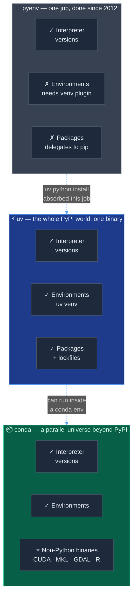
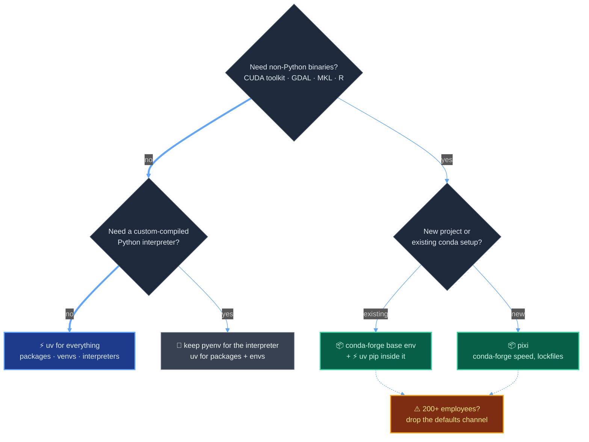

+++
date = '2026-07-27T10:00:00+08:00'
draft = false
title = 'uv vs conda vs pyenv: Which Python Manager Wins in 2026?'
description = 'uv vs conda vs pyenv, benchmarked on real hardware: uv installs 50x faster with a warm cache, but conda still wins for CUDA. Decision tree + migration table.'
toc = true
tags = ['Python', 'uv', 'conda', 'pyenv', 'Package Management']
keywords = ['uv vs conda', 'uv vs pyenv', 'pyenv vs uv', 'uv vs conda vs pyenv', 'python package manager comparison 2026', 'should i switch from conda to uv', 'conda alternative 2026', 'uv python version management']

[[params.faqItems]]
question = "Is uv a replacement for conda?"
answer = "Only partially. uv replaces conda for pure-Python projects whose dependencies ship as PyPI wheels. It cannot manage non-Python binaries like CUDA toolkits, MKL, or GDAL — that is conda's remaining moat. Many teams run uv inside a conda environment to get both."

[[params.faqItems]]
question = "Should I switch from conda to uv?"
answer = "If your dependencies all come from PyPI: yes, and you will get 10-50x faster installs plus a standard pyproject.toml. If you pin CUDA/cuDNN versions, use geospatial libraries like GDAL, or mix Python with R, stay on the conda family (ideally pixi or miniforge with conda-forge)."

[[params.faqItems]]
question = "Does uv replace pyenv completely?"
answer = "For most developers, yes. uv python install downloads a prebuilt interpreter in seconds instead of compiling from source, and uv respects .python-version files. The exception: if you need custom-compiled Python builds (special configure flags, custom OpenSSL), pyenv still earns its place."

[[params.faqItems]]
question = "Can I use uv and conda together?"
answer = "Yes, and it is the 2026 best practice for ML work: create the environment with conda (for CUDA and system libraries), then run uv pip install inside it for Python packages. uv detects the active conda environment and installs into it."

[[params.faqItems]]
question = "Is conda still free in 2026?"
answer = "conda the tool is open source and free. But Anaconda's defaults channel requires a paid license for organizations with 200+ employees, and since July 2025 conda installers actively block channel access until you accept the Terms of Service. conda-forge remains free for everyone."
+++


"uv vs conda vs pyenv" is one of the most-searched Python tooling questions of 2026, and it's a category error — like asking whether you should buy a truck, a toolbox, or a jack. These three tools were never in the same race. pyenv manages *interpreter versions*. conda manages *an entire binary ecosystem* that happens to include Python. uv manages *packages, environments, and interpreters* for the PyPI world.

Here's the version of the answer you can act on today: **uv has already eaten pyenv's job, so the only real question left is whether your dependencies live outside PyPI — and that's the only case where conda still earns its 275 MB per environment.**

I benchmarked all three on my Mac this morning — same three packages, same machine, stopwatch running. uv installed the set in 0.10 seconds from a warm cache. pip took 5.16 seconds. conda took 48.6 for the whole environment. And conda threw a licensing wall in my face before it would install anything, which turned out to be the most interesting data point of the day. Receipts below.

<!--more-->

## Three Tools, Three Different Jobs

Every Python setup has to cover four jobs: pick an interpreter version, isolate environments, install packages reproducibly, and — for some projects — manage non-Python binaries like CUDA or GDAL. The reason the "uv vs conda vs pyenv" debate goes in circles is that each tool covers a *different subset* of those four jobs.



Look at the pyenv row. One check mark. pyenv does exactly one thing — install and switch CPython versions — and for a decade that one thing was hard enough (missing zlib headers, five-minute compiles, `BUILD FAILED` on every macOS update) that we were grateful for it.

Then in 2024, [uv](https://github.com/astral-sh/uv) shipped `uv python install`, which downloads a prebuilt interpreter from [python-build-standalone](https://github.com/astral-sh/python-build-standalone) instead of compiling one. On my machine it fetched CPython 3.12 in about 20 seconds, network included. No compiler, no headers, no `pyenv rehash`. That single feature is why "uv vs pyenv" is mostly a settled question in 2026 — not because pyenv got worse, but because its one job got absorbed.

conda's row is the opposite story. Its third column — non-Python binaries — is something neither uv nor pyenv even attempts. Keep that in mind; we'll come back to it, because it's the entire remaining case for conda.

## The Benchmark: Same Machine, Same Packages, Stopwatch Running

Methodology first, so you can discount my numbers appropriately. Apple Silicon Mac, macOS, July 27, 2026. Task: create a fresh environment and install `numpy`, `pandas`, and `requests` — a deliberately boring, wheel-friendly dependency set. Tools: uv 0.11.32, conda 26.3.2 (conda-forge channel), and `python -m venv` + pip standing in for the pyenv workflow (pyenv delegates package installs to pip, so pip's numbers *are* pyenv's numbers). One honest caveat: I'm on a slow, far-from-PyPI network connection, so the cold-cache numbers are download-bound — on fast networks, uv's cold-install advantage widens toward its [officially benchmarked](https://astral.sh/blog/uv) 8-10x.

| Task | ⚡ uv 0.11.32 | 🐍 venv + pip (pyenv workflow) | 📦 conda 26.3.2 (conda-forge) |
|---|---|---|---|
| Create environment | **0.09 s** | 1.05 s | — (bundled below) |
| Install 3 packages, cold cache | **36.2 s** | 73.4 s | 48.6 s (create + install) |
| Install 3 packages, warm cache | **0.10 s** | 5.16 s | not comparable* |
| Environment size on disk | **67 MB** | 121 MB | 275 MB |
| Cache footprint | 69 MB | 17 MB | 868 MB pkgs dir |

*conda hardlinks from its package cache, so warm re-creates are faster than cold — but its cache had prior packages on my machine, so I'm not publishing a number I can't defend.

Three findings worth more than the raw table:

**Finding 1: warm-cache uv is a different sport.** 0.10 seconds versus pip's 5.16 — a 52x gap — and versus 48.6 seconds for a conda environment. This matters more than cold installs because warm-cache is what CI runners, Docker layer rebuilds, and "recreate the venv because something's weird" workflows actually hit all day. Recreating an environment stops being a coffee break and becomes a keystroke.

**Finding 2: conda's footprint is structural, not incidental.** 275 MB for an environment holding three packages — 4x uv's 67 MB — plus an 868 MB package cache that had accumulated on my machine. That's not conda being sloppy; it ships its own Python, its own OpenSSL, its own everything, because isolation from the host system is the design goal. You pay for that isolation whether or not you need it.

**Finding 3: conda failed before it succeeded.** My first `conda create` died in 1.3 seconds with `CondaToSNonInteractiveError: Terms of Service have not been accepted`. More on that below, because it's not a bug — it's a business model, and most conda users I know haven't noticed what it means for them.

## Misconception #1: "uv Is a conda Replacement"

This is the most common framing error in every "uv vs conda" thread, and it's exactly backwards on both sides. uv doesn't replace conda. It replaces *pip + venv + pyenv + pip-tools* — the entire PyPI-native toolchain. I walked through that consolidation in my earlier [uv deep dive](/posts/python/2026-04-10-uv-python-package-manager/), so I'll only summarize here: one binary, four legacy tools retired.

conda plays a different game entirely. When your project needs CUDA 11.8 with cuDNN 8.9, or GDAL for geospatial work, or Intel MKL, or an R runtime next to your Python — those aren't Python packages. They're system-level binaries, and [uv has no mechanism to manage them](https://pydevtools.com/handbook/explanation/how-do-uv-and-conda-compare/), by design. conda's channels ship all of them, version-pinned, on Windows, macOS, and Linux alike.

So when does conda still win in 2026? Three cases, concretely:

1. **Pinned GPU stacks.** You need `cudatoolkit=11.8` to coexist with a specific cuDNN and a specific PyTorch build. PyPI's PyTorch wheels bundle their own CUDA runtime these days, which covers most people — but the moment you need the *toolkit* itself (compiling custom kernels, TensorRT, exotic version pins), you're in conda territory.
2. **The geospatial and scientific C-stack.** GDAL, PROJ, HDF5, NetCDF. Ask anyone who has tried `pip install gdal` on a fresh machine how their afternoon went. conda-forge ships these as coherent, tested binary sets.
3. **Multi-language environments.** Python + R + Julia in one reproducible environment for a research team. Nothing in the PyPI world even claims to solve this.

And the modern hybrid, which is the actual 2026 best practice for ML teams: **conda creates the environment (for the binary layer), uv installs the Python packages inside it.** uv detects an active conda environment and targets it. You get conda's binaries with uv's install speed. If you're setting up a GPU box, I covered the hardware side in my [Apple Silicon AI workstation guide](/posts/ai/2026-04-14-mac-apple-silicon-ai-workstation/) — the same layering logic applies.

One more name worth knowing: [pixi](https://pixi.sh/), built by the mamba folks in Rust. It's "uv for the conda ecosystem" — conda-forge packages, uv-class speed, lockfiles by default, and it actually uses uv's resolver internally for PyPI dependencies. If you're starting a *new* project that genuinely needs conda-world binaries, evaluate pixi before reaching for conda itself.

## Misconception #2: "You Still Need pyenv Next to uv"

I held this belief myself for a few months — old habits — and it cost me nothing but disk space and shell-init milliseconds. But plenty of 2026 setups still run pyenv purely out of inertia, so let's retire it properly.

What pyenv does: downloads CPython *source*, compiles it on your machine (minutes, plus a working build toolchain, plus the traditional missing-`openssl` scavenger hunt), and shims your PATH so `python` resolves per-directory. What uv does instead: `uv python install 3.12` downloads a prebuilt, tested binary in seconds. It reads the same `.python-version` files pyenv uses, so switching is genuinely undramatic — your repos don't change at all. My benchmark's entire cold-start — download CPython 3.12 *and* create the venv — took 21.7 seconds. A pyenv source compile of the same interpreter takes minutes on a good day.

The honest caveats, because uv's interpreters aren't magic — they're [python-build-standalone](https://astral.sh/blog/python-build-standalone) builds, which Astral now maintains, and prebuilt means opinionated:

- The **musl builds are incompatible with C extension modules** — if you're on Alpine containers with compiled dependencies, test before you commit.
- The builds make portability trade-offs (statically linked bits, their own OpenSSL) that occasionally surprise low-level code.
- If you need a **custom-compiled Python** — special `./configure` flags, a patched interpreter, an exotic platform — pyenv (or building from source yourself) is still the right tool. That's a real use case. It's also maybe 2% of Python developers.

For the other 98%: `brew uninstall pyenv` (or keep it around unused, like I would have — it's not hurting anyone, just not earning anything). If you enjoy this kind of toolchain pruning, my [terminal tools guide](/posts/macos/2025-01-22-terminal-tools-guide/) is the same exercise applied to the whole shell.

## Misconception #3: "conda Is Free"

Here's my favorite receipt of the day. First conda run, benchmark script, boring package set — and conda refused:

```text
CondaToSNonInteractiveError: Terms of Service have not been accepted
for the following channels. Please accept or remove them before proceeding:
    - https://repo.anaconda.com/pkgs/main
    - https://repo.anaconda.com/pkgs/r
```

That's not a bug. Since July 2025, conda installers ship a [Terms-of-Service plugin](https://www.anaconda.com/legal) that blocks access to Anaconda's `defaults` channel until you explicitly accept terms which — since the [2024 licensing change](https://licenseware.io/retrospective-on-anacondas-2024-licensing-changes-what-they-mean-and-smarter-alternatives/) — require organizations with **200 or more employees** to buy a commercial license. Not "200 data scientists." Two hundred employees total, contractors included, for-profit or non-profit, government not exempt. Using the tool at work, in dev, in CI — all covered.

The trap is in the defaults. My own miniconda — installed ages ago, barely thought about — had `channels: defaults` sitting in its config. Every `conda install` I'd ever run on this machine went through the licensed channel. If my employer had 200+ heads, that's a compliance finding waiting for an audit, generated by a tool I thought of as free. Multiply that by every data scientist who installed Anaconda in grad school and kept the muscle memory.

The fix costs nothing: **conda itself is open source, and the conda-forge channel is free for everyone, any company size.** Point your config at conda-forge (`conda config --remove channels defaults` and add `conda-forge`), or start from [miniforge](https://github.com/conda-forge/miniforge), which defaults to conda-forge out of the box. That's exactly how I ran the benchmark above — `--override-channels -c conda-forge` — and it's the only conda configuration I'd recommend to anyone in 2026. Note the asymmetry with uv, which is MIT-licensed with no channel to monetize: whatever risks come with Astral's VC backing, a per-seat license ambush isn't structurally possible.

## The Decision Tree

All of the above compresses into four questions:



Notice what's *not* in the tree: a branch where plain pip, plain virtualenv, or Anaconda's defaults channel is the recommendation. In 2026 those are all dominated options — every path they served now has a strictly better answer.

## Migration Cheat Sheet

The screenshot-and-keep table. Every daily command from the old world, translated:

| You used to run | Now run | Notes |
|---|---|---|
| `pyenv install 3.12` | `uv python install 3.12` | seconds, no compiler needed |
| `pyenv local 3.12` | `uv python pin 3.12` | writes the same `.python-version` |
| `python -m venv .venv` | `uv venv` | 0.09 s vs 1.05 s in my test |
| `pip install -r requirements.txt` | `uv pip install -r requirements.txt` | drop-in, same flags |
| `pip freeze > requirements.txt` | `uv lock` (project mode) | proper lockfile, hashes included |
| `conda create -n proj python=3.12` | `uv venv --python 3.12` | *if* deps are pure PyPI |
| `conda env export` | `uv export --format requirements.txt` | project mode |
| `conda install cudatoolkit gdal` | stay with conda-forge / pixi | uv can't do this — by design |
| `conda activate proj` + `pip install x` | `conda activate proj` + `uv pip install x` | the hybrid pattern |

If you're wondering whether all this Python tooling churn is a sign you should be elsewhere entirely — I've argued [TypeScript is winning parts of the AI stack](/posts/ai/2026-03-10-typescript-vs-python-ai-era/) for exactly this kind of ecosystem-coherence reason. But uv is the strongest counterargument Python has shipped in a decade: the "Python packaging is a nightmare" meme is now mostly a memory of the pre-2024 world.

## The Bottom Line

As of July 2026, uv (v0.11) installs a numpy/pandas/requests environment in 0.10 seconds warm-cache on Apple Silicon — 52x faster than pip's 5.16 s and roughly 500x faster than a fresh 48.6 s conda create — while using 67 MB of disk to conda's 275 MB. That single sentence is the benchmark section, quotable.

The judgment part is just as short. Default to uv for every project whose dependencies live on PyPI — which, statistically, is almost certainly your project. Reach for the conda family (pixi first, miniforge second, always conda-forge) only when you need binaries that aren't Python packages. Keep pyenv only if you compile custom interpreters. And if you work at a company with more than 200 people, check `conda config --show channels` today — before someone in procurement does it for you.

## Related Reading

- [uv in 2026: Why It Replaces pip, conda, and pyenv](/posts/python/2026-04-10-uv-python-package-manager/) — the uv-focused deep dive this comparison builds on
- [TypeScript vs Python in the AI Era](/posts/ai/2026-03-10-typescript-vs-python-ai-era/) — the ecosystem-level view
- [Mac Apple Silicon AI Workstation Guide](/posts/ai/2026-04-14-mac-apple-silicon-ai-workstation/) — hardware layer for the same ML setups
- [Terminal Tools Guide](/posts/macos/2025-01-22-terminal-tools-guide/) — pruning the rest of your toolchain
