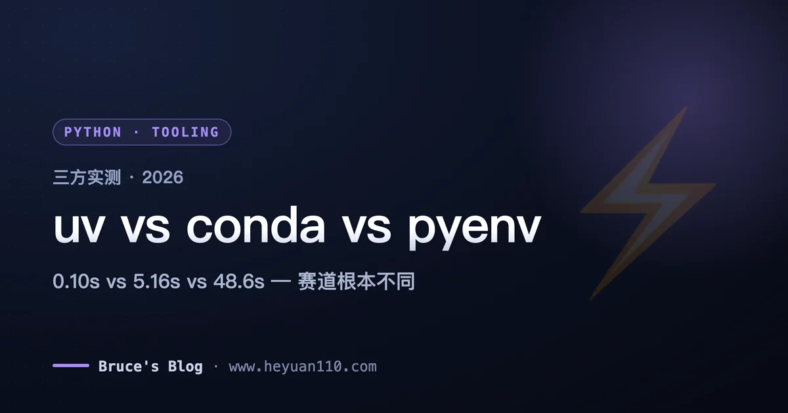
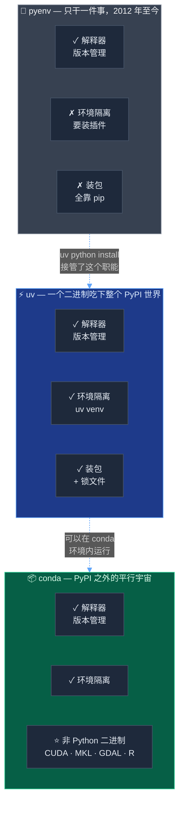
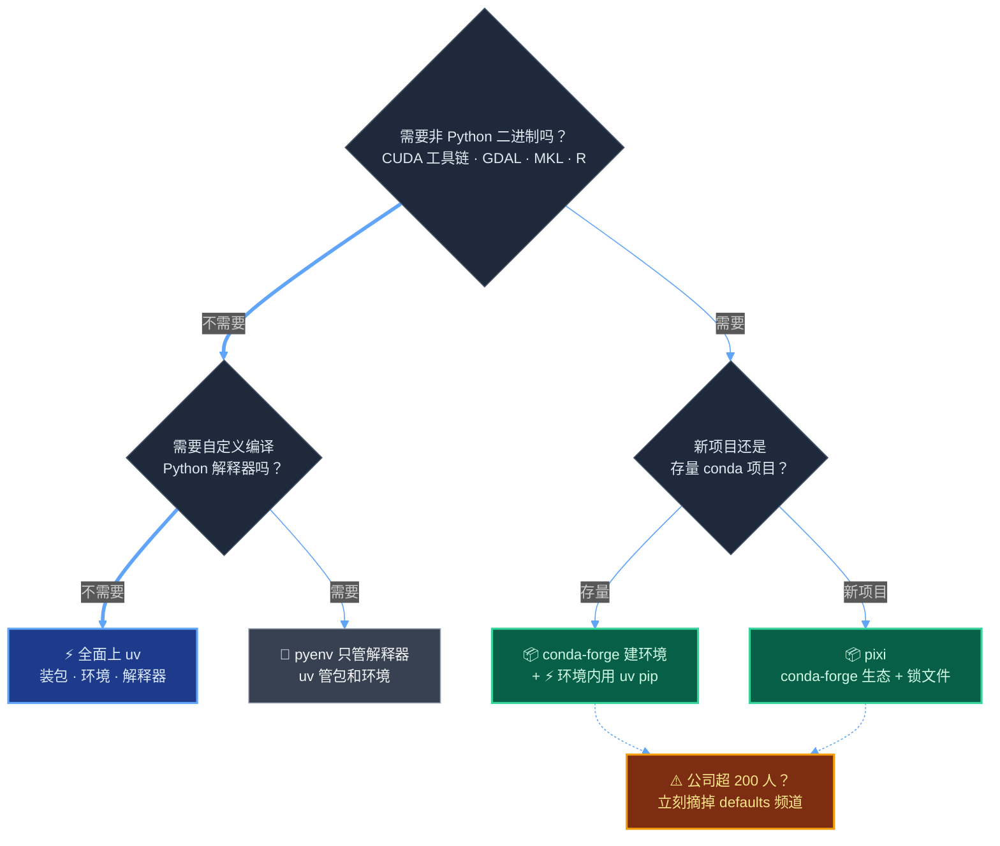

+++
date = '2026-07-27T10:00:00+08:00'
draft = false
title = 'uv、conda、pyenv 到底怎么选？2026 实测对比与迁移指南'
description = '同一台 Mac 实测三者：uv 热缓存 0.10 秒装完三件套，比 pip 快 52 倍；conda 环境占 275MB 还弹出付费条款。附清华镜像配置、conda/pyenv 迁移路径与命令对照速查表。'
toc = true
tags = ['Python', 'uv', 'conda', 'pyenv', 'Package Management']
keywords = ['uv conda 对比', 'conda 迁移 uv', 'python 包管理器选哪个', 'uv pyenv 区别', 'uv 清华镜像', 'uv 国内加速', 'conda 收费', 'anaconda 商业授权']

[[params.faqItems]]
question = "uv 能完全替代 conda 吗？"
answer = "不能完全替代。依赖全在 PyPI 上的项目可以整体迁到 uv，速度快 10-50 倍；但 CUDA 工具链、MKL、GDAL 这类非 Python 二进制依赖 uv 管不了，这是 conda 仅存的护城河。ML 团队常见做法是 conda 建环境、内部用 uv 装包。"

[[params.faqItems]]
question = "conda 老项目怎么迁移到 uv？"
answer = "先用 pip list --format=freeze 从 conda 环境导出纯 Python 依赖，再用 uv venv 建环境、uv pip install -r 装回去。environment.yml 里如果有 cudatoolkit、gdal 等非 Python 包，说明这个项目不该迁，保留 conda 或换 pixi。"

[[params.faqItems]]
question = "用了 uv 还需要 pyenv 吗？"
answer = "绝大多数人不需要了。uv python install 3.12 几十秒下载预编译解释器，不用本机编译，也兼容 pyenv 的 .python-version 文件。只有需要自定义编译参数（如打补丁的解释器）时 pyenv 才有保留价值。"

[[params.faqItems]]
question = "uv 国内下载慢怎么办？"
answer = "两个环境变量解决：UV_DEFAULT_INDEX 指向清华 PyPI 镜像加速装包；UV_PYTHON_INSTALL_MIRROR 指向 python-build-standalone 的镜像地址加速解释器下载。注意旧的 UV_INDEX_URL 已废弃。"

[[params.faqItems]]
question = "公司用 conda 要付费吗？"
answer = "conda 工具本身开源免费，但 200 人以上的组织使用 Anaconda 的 defaults 频道需要购买商业授权，2025 年 7 月起安装时会强制弹出条款确认。把频道切到免费的 conda-forge（或直接用 miniforge）即可规避。"
+++



「uv、conda、pyenv 选哪个」是 2026 年 Python 圈搜索量最高的选型问题之一，但这个问题本身问错了——三个工具压根不在一条赛道上。pyenv 只管解释器版本，conda 管的是一整套超出 Python 的二进制生态，uv 管的是 PyPI 世界里的包、虚拟环境和解释器。

先把能直接行动的结论放在最前面：**pyenv 的活已经被 `uv python install` 整个吃掉了，真正需要你回答的只剩一个问题——你的依赖是否在 PyPI 之外。只有答案是"是"的时候，conda 那 275MB 一个环境的体积才花得值。**

今天上午我在自己的 Mac 上把三个工具拉出来实测了一轮：同一台机器、同样三个包、掐表计时。uv 热缓存 0.10 秒装完，pip 要 5.16 秒，conda 建整个环境用了 48.6 秒——而且 conda 在装任何东西之前，先给我弹了一面付费条款墙。这面墙反而成了今天最有价值的数据点，下面细说。

<!--more-->

## 实测数据：同一台机器，掐表计时

先交代测试条件，方便你自行打折：Apple Silicon Mac，2026 年 7 月 27 日。任务是新建环境并安装 `numpy`、`pandas`、`requests` 三件套——故意选的全是有预编译 wheel 的常规包。参赛选手：uv 0.11.32、conda 26.3.2（conda-forge 频道）、`python -m venv` + pip（代表 pyenv 工作流——pyenv 自己不装包，装包就是 pip，所以 pip 的成绩就是 pyenv 的成绩）。

一个诚实的前提：我的网络访问 PyPI 较慢，冷缓存数字主要卡在下载带宽上。网络好的环境里，uv 冷装的优势会向[官方 benchmark](https://astral.sh/blog/uv) 的 8-10 倍靠拢。

| 任务 | ⚡ uv 0.11.32 | 🐍 venv + pip（pyenv 工作流） | 📦 conda 26.3.2（conda-forge） |
|---|---|---|---|
| 创建环境 | **0.09 秒** | 1.05 秒 | —（下行合并计） |
| 冷缓存装三件套 | **36.2 秒** | 73.4 秒 | 48.6 秒（建环境 + 安装） |
| 热缓存装三件套 | **0.10 秒** | 5.16 秒 | 不可比* |
| 环境磁盘占用 | **67 MB** | 121 MB | 275 MB |
| 缓存占用 | 69 MB | 17 MB | pkgs 目录 868 MB |

*conda 会从包缓存硬链接，重建环境比首次快，但我机器上的缓存里有历史包，测不出干净数字，就不硬编一个了。

比表格本身更值钱的是三个发现。

**发现一：热缓存下的 uv 是另一个物种。** 0.10 秒对 pip 的 5.16 秒，52 倍；对 conda 建环境的 48.6 秒，约 500 倍。热缓存才是日常的主战场——CI 重跑、Docker 层重建、"环境好像坏了删了重来"，全是热缓存场景。重建环境从此不再是摸鱼间隙，是一次击键。

**发现二：conda 的体积是结构性的。** 三个包的环境占 275MB，是 uv 的 4 倍，外加我机器上积累出的 868MB 包缓存。这不是 conda 写得烂——它自带 Python、自带 OpenSSL、什么都自带，因为它的设计目标就是和宿主系统彻底隔离。问题在于：不管你需不需要这份隔离，钱都照付。

**发现三：conda 在成功之前先失败了一次。** 第一次 `conda create` 跑了 1.3 秒就报错退出，错误信息是 `CondaToSNonInteractiveError`——服务条款未接受。这不是 bug，是商业模式，后面"公司环境的坑"一节专门讲。

## 三个工具各管什么：先把赛道分清楚

每套 Python 开发环境都要解决四件事：选解释器版本、隔离环境、可复现地装包，以及——部分项目才有的——管理 CUDA、GDAL 这类非 Python 二进制。「三选一」的争论之所以吵不出结果，就是因为三个工具各自覆盖的是这四件事的不同子集。



看 pyenv 那一行，只有一个对勾。它十几年只干一件事——装和切换 CPython 版本。过去这一件事够难（缺 zlib 头文件、编译五分钟、每次 macOS 升级必挂），所以大家都感激它。但 2024 年 [uv](https://github.com/astral-sh/uv) 推出 `uv python install`，直接下载 [python-build-standalone](https://github.com/astral-sh/python-build-standalone) 的预编译解释器——我实测下载 CPython 3.12 连网络耗时在内约 20 秒，不需要编译器、不需要头文件、不需要 `pyenv rehash`。「uv 和 pyenv 怎么选」在 2026 年基本是个已解决的问题：不是 pyenv 退步了，是它唯一的工作被接管了。

conda 那一行是反方向的故事：第三格「非 Python 二进制」是 uv 和 pyenv 碰都不碰的领域，也是 conda 全部剩余价值所在。我在 [2020 年那篇 conda 入门](/zh/posts/python/2020-01-11-python-conda/)里推荐过它做默认选择——六年过去，这个推荐只在一种场景下还成立，往下看。

## conda 老用户：迁移 uv 的实操路径

如果你的项目依赖全部来自 PyPI（用 `conda list` 扫一眼，没有 cudatoolkit、gdal、mkl 这类包就是），迁移成本比想象低得多。四步走完：

第一步，从 conda 环境导出纯 Python 依赖：

```bash
conda activate 你的环境
pip list --format=freeze > requirements.txt
# 注意用 pip list 而不是 conda env export——
# 后者导出的 yml 里混着 conda 包名，uv 读不了
```

第二步，装 uv 并建新环境（此处顺手把国内镜像配上，下一节细讲）：

```bash
curl -LsSf https://astral.sh/uv/install.sh | sh
uv venv --python 3.12       # 解释器没有会自动下载
uv pip install -r requirements.txt
```

第三步，验证跑通后，把项目正式升级成 uv 项目模式——`uv init` 生成 `pyproject.toml`，`uv add` 逐个把核心依赖加进去，得到跨平台锁文件 `uv.lock`。这一步可选但强烈建议：requirements.txt 是快照，锁文件才是可复现保障。uv 项目模式的完整用法我在 [uv 深度指南](/zh/posts/python/2026-04-10-uv-python-package-manager/)里写过，不重复。

第四步，处理 shell 初始化。把 `.zshrc` 里 conda 那段 `conda init` 注入的初始化块删掉或注释——它每次开 shell 都要吃几百毫秒。留着 miniconda 本体没关系，需要二进制依赖的老项目还能用。

**什么样的 environment.yml 不该迁**：里面有 `cudatoolkit`、`cudnn`、`gdal`、`proj`、`hdf5`、`r-base` 任意一个的，说明项目吃的就是 conda 的二进制生态，硬迁等于给自己挖坑。这类项目的正确姿势是下面的混合用法或 pixi，见「什么时候别迁」一节。

## pyenv 老用户：几乎无感切换

pyenv 用户的迁移是三者里最顺滑的，因为 uv 直接兼容你现有的 `.python-version` 文件——仓库里一行都不用改。

```bash
uv python install 3.11 3.12    # 一次装多个版本，秒级
uv python pin 3.12             # 写 .python-version，和 pyenv 同一个文件
uv python list                 # 查看已装解释器，含系统里已有的
```

实测我这台机器上 `uv python list` 连 Homebrew 装的 3.14 和 miniconda 自带的 3.13 都识别出来了——uv 不强迫你用它下载的解释器，能复用就复用。

两个诚实的边界，别等踩了才知道。其一，uv 下载的是 python-build-standalone 预编译产物，其中 **musl 版本（Alpine 容器）和 C 扩展模块不兼容**，Alpine 上跑编译依赖的先测再上。其二，预编译意味着别人替你做了编译决策（静态链接、自带 OpenSSL），如果你需要自定义 `./configure` 参数或打补丁的解释器，pyenv 仍是正确工具——但这大概只覆盖 2% 的开发者。剩下 98%，`brew uninstall pyenv` 或者放着落灰都行。顺带一提，如果你喜欢这种给工具链瘦身的活，我的[终端工具指南](/zh/posts/macos/2025-01-22-terminal-tools-guide/)是同款乐趣。

## 国内镜像配置：uv 提速的最后一块拼图

uv 再快，卡在跨境网络上也白搭——我实测冷缓存 36 秒有九成时间在等下载。两个环境变量配齐，国内体验直接换档：

```bash
# ~/.zshrc

# 1. 包下载走清华 PyPI 镜像
export UV_DEFAULT_INDEX="https://pypi.tuna.tsinghua.edu.cn/simple"

# 2. 解释器下载走镜像（默认从 GitHub Releases 拉，国内极慢）
#    值填任意一个 python-build-standalone 的镜像前缀，
#    公司内网源或自建代理均可
export UV_PYTHON_INSTALL_MIRROR="<你的镜像>/astral-sh/python-build-standalone/releases/download"
```

一个新旧版本的坑：老教程里写的 `UV_INDEX_URL` [已被官方标记废弃](https://docs.astral.sh/uv/reference/environment/)，新变量是 `UV_DEFAULT_INDEX`，旧变量目前还能用但别再往新配置里写。项目级配置也可以写进 `pyproject.toml` 的 `[[tool.uv.index]]`，团队协作时比环境变量更可控。

conda 这边如果保留，`.condarc` 切到清华镜像的 conda-forge 频道，顺手把 defaults 摘掉——既提速又规避下一节的授权问题：

```yaml
# ~/.condarc
channels:
  - conda-forge
default_channels: []
custom_channels:
  conda-forge: https://mirrors.tuna.tsinghua.edu.cn/anaconda/cloud
```

## 公司环境的三个坑

**坑一：Anaconda 的 200 人授权线。** 我今天 benchmark 的第一次 `conda create` 直接被这行报错拦下：

```text
CondaToSNonInteractiveError: Terms of Service have not been accepted
for the following channels:
    - https://repo.anaconda.com/pkgs/main
    - https://repo.anaconda.com/pkgs/r
```

背景是 [Anaconda 2024 年的条款变更](https://licenseware.io/retrospective-on-anacondas-2024-licensing-changes-what-they-mean-and-smarter-alternatives/)：**员工数 200 人以上的组织**（含外包，营利非营利都算，政府机构不豁免）使用 `defaults` 频道需要购买商业授权，开发、CI、生产环境全部在覆盖范围内。2025 年 7 月起，conda 安装器内置了[条款确认插件](https://www.anaconda.com/legal)，不点接受就不让你访问 defaults 频道——就是我撞上的这面墙。

最阴险的地方在于默认值。我自己这台机器的 miniconda 装了很久没管过，`conda config --show channels` 一查，赫然是 `defaults`——也就是说这些年每一次 `conda install` 走的都是需要授权的频道。国内大厂随便一个部门就超 200 人，如果法务或对方审计较真，这是现成的合规瑕疵。今天就花十秒查一下你的频道配置，比等采购部门来查体面。解法免费：conda 工具本身开源，conda-forge 频道对任何规模公司免费，切频道或直接换 [miniforge](https://github.com/conda-forge/miniforge) 即可。也注意 uv 的结构性区别——MIT 协议、没有可以收费的"频道"，Astral 拿了 VC 的钱有它自己的风险，但按人头收授权费这条路在结构上不存在。

**坑二：内网私有源。** 很多公司 PyPI 走 Artifactory 或 Nexus 代理。uv 对私有源的支持是完整的——`UV_DEFAULT_INDEX` 指向内网源地址，认证走 `UV_INDEX_<NAME>_USERNAME/PASSWORD` 或 keyring。先在自己机器上验证一遍再推给团队，别在周五下午动 CI 配置。

**坑三：CI 缓存没配等于白迁。** uv 的 52 倍优势建立在热缓存上，CI 里如果每次都冷启动，只能吃到 2 倍。GitHub Actions 用官方 `astral-sh/setup-uv` 并开 `enable-cache: true`，自建 CI 把 `~/.cache/uv` 挂进缓存卷——这一步做完，依赖安装那一段在 CI 日志里基本消失。

## 什么时候别迁：conda 仍然赢的三种场景

把话说全了这篇才算诚实。以下三种情况，2026 年的 conda 家族依然是正确答案：

1. **锁定版本的 GPU 工具链。** PyTorch 的 PyPI wheel 现在自带 CUDA 运行时，多数人够用；但你需要 CUDA toolkit 本体（编译自定义算子、TensorRT、特定 cudnn 版本组合）时，`uv` 无能为力，conda 频道里全是版本对齐好的成品。
2. **地理空间与科学计算 C 栈。** GDAL、PROJ、HDF5、NetCDF——试过在裸机上 `pip install gdal` 的人都懂那个下午是怎么没的。conda-forge 把这一整套当作经过联测的二进制集合发布。
3. **多语言混合环境。** Python + R + Julia 一个环境复现，PyPI 世界没有任何工具宣称能解决这个问题。

这三种场景下的 2026 最佳实践是**混合用法**：conda（conda-forge 频道）建环境铺二进制底座，激活后用 `uv pip install` 装 Python 包——uv 会自动识别激活的 conda 环境并装进去，二进制归 conda、速度归 uv。配 GPU 工作站的硬件选型我在 [Apple Silicon AI 工作站指南](/zh/posts/ai/2026-04-14-mac-apple-silicon-ai-workstation/)里写过，逻辑同款。

另外记住 [pixi](https://pixi.sh/) 这个名字：mamba 团队用 Rust 写的"conda 生态的 uv"，用 conda-forge 的包、uv 级别的速度、默认锁文件，PyPI 依赖解析内部直接用的 uv。新开的科学计算项目，先看 pixi 再考虑 conda 本体。

## 决策树 + 命令对照速查表

全文压缩成一张图：



注意树里没有的分支：裸 pip、裸 virtualenv、Anaconda defaults 频道——2026 年这三个选项在任何路径上都存在严格更优解。

日常命令对照，建议截图存着：

| 以前的命令 | 现在的命令 | 备注 |
|---|---|---|
| `pyenv install 3.12` | `uv python install 3.12` | 秒级，不需要编译器 |
| `pyenv local 3.12` | `uv python pin 3.12` | 写的是同一个 `.python-version` |
| `python -m venv .venv` | `uv venv` | 实测 0.09 秒 vs 1.05 秒 |
| `pip install -r requirements.txt` | `uv pip install -r requirements.txt` | 参数原样兼容 |
| `pip freeze > requirements.txt` | `uv lock`（项目模式） | 真锁文件，带哈希 |
| `conda create -n proj python=3.12` | `uv venv --python 3.12` | 前提：依赖全在 PyPI |
| `conda env export` | `uv export --format requirements.txt` | 项目模式 |
| `conda install cudatoolkit gdal` | 留在 conda-forge / pixi | uv 设计上就不管这个 |
| `conda activate proj` 后 `pip install x` | `conda activate proj` 后 `uv pip install x` | 混合用法 |

最后回答那个更大的问题：Python 工具链折腾了十年才折腾出 uv，值不值得留在这个生态——我在 [TypeScript vs Python](/zh/posts/ai/2026-03-10-typescript-vs-python-ai-era/) 里论证过 TypeScript 正在拿走 AI 技术栈的一部分，而 uv 恰恰是 Python 十年来给出的最有力反驳：「Python 包管理是噩梦」这个梗，现在基本只属于 2024 年以前的世界了。

## 延伸阅读

- [uv 深度指南：为什么它取代 pip、conda 和 pyenv](/zh/posts/python/2026-04-10-uv-python-package-manager/) — 本文对比结论的 uv 单侧深挖
- [conda 入门（2020）](/zh/posts/python/2020-01-11-python-conda/) — 六年前的推荐，对照本文看时代变化
- [TypeScript vs Python：AI 时代的选择](/zh/posts/ai/2026-03-10-typescript-vs-python-ai-era/) — 生态层面的更大视角
- [Mac Apple Silicon AI 工作站指南](/zh/posts/ai/2026-04-14-mac-apple-silicon-ai-workstation/) — 同一套环境的硬件层
- [macOS 终端工具指南](/zh/posts/macos/2025-01-22-terminal-tools-guide/) — 工具链瘦身的姊妹篇
